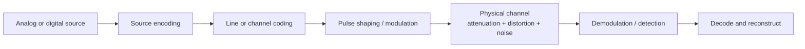
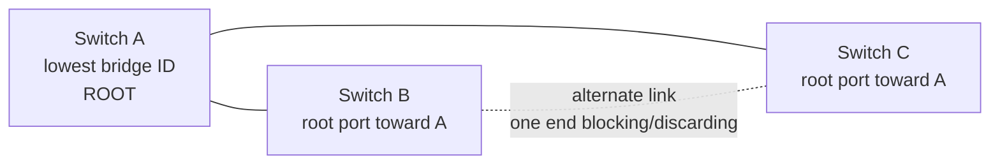
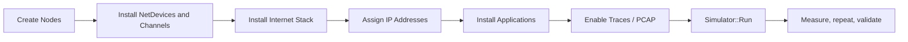

# Bismillah.

# Computer Networks — Slide-Complete Viva Recall

This volume was re-audited against the current Networking and Data Communication folders. The two CSE 321 merged decks remain the main protocol sequence, while CSE 311 supplies the signal/encoding mathematics that must not disappear from a networking viva.

| Current source | Pages | How it is used |
|---|---:|---|
| `CSE321_AAI_Merged.pdf` | 268 | foundations, physical transmission, data link, MAC, Ethernet/WLAN, switching and VLANs |
| `CSE321_MSH_Merged.pdf` | 453 | IP/subnetting/NAT, routing, congestion/QoS, sockets, TCP/UDP, DNS, DHCP, HTTP, email and IPv6 |
| `CSE 321(AAI) Notebook_Kowshik.pdf` | 39 | handwritten reinforcement of the main networking sequence |
| `Networking CHEATSHEET.pdf` | 4 | last-pass protocol and header recall |
| `ns-3-tutorial.pdf` | 157 | simulation architecture and minimal experiment workflow |
| `CSE311_Monir_Merged.pdf` | 1122 | signals, systems, sampling, quantization, line coding, modulation, noise, multiplexing and digital communication |
| `CSE311_Sahil_ClassNotes.pdf` | 34 | handwritten Data Communication problem/diagram reinforcement |
| **Total routed to this volume** | **2077** | **921 Networking pages + 1156 Data Communication pages** |

Diagram-heavy handwritten pages were visually sampled as images in addition to text extraction. Anything explicitly marked **Core supplement** is standard viva material not taught in comparable depth in the selected slides; TLS is the main example.

## The 30-second map of the course

When asked what a computer network does, say:

> A computer network lets autonomous end systems exchange data through communication links and intermediary devices. Layering decomposes that task: the application layer defines user-facing protocols; transport gives process-to-process delivery; the network layer routes packets host-to-host across networks; the data-link layer moves frames across one link; and the physical layer transmits bits as signals.

Keep these names straight:

| Layer | Main job | PDU | Address/identifier | Typical examples/devices |
|---|---|---|---|---|
| Application | Network service for an application | Message/data | Names, URLs, application fields | HTTP, DNS, DHCP, SMTP |
| Transport | Process-to-process delivery, multiplexing | TCP segment / UDP datagram | Port number | TCP, UDP |
| Network | Host-to-host forwarding across networks | Packet | IP address | IPv4, IPv6, ICMP; router |
| Data link | Node-to-node delivery over one link | Frame | MAC address | Ethernet, 802.11; bridge/switch |
| Physical | Carry raw bits as signals | Bits | None | Copper, fiber, radio; repeater/hub |

The OSI model has seven layers: Physical, Data Link, Network, Transport, Session, Presentation, Application. The TCP/IP model normally groups Session and Presentation into Application and groups OSI Physical/Data Link into network access/link. A **model** explains responsibilities; a **protocol** defines peer-to-peer rules; an **interface** is the boundary through which one layer uses another layer's service.

## High-frequency one-line answers

- **TCP:** Transmission Control Protocol.
- **UDP:** User Datagram Protocol.
- **IP:** Internet Protocol.
- **SYN:** synchronize sequence numbers; it requests/participates in TCP connection establishment.
- **ACK:** acknowledgment; when the ACK flag is set, the acknowledgment-number field is valid. That number is normally the next byte expected.
- **Flow control:** protects the receiver from a sender that is too fast.
- **Congestion control:** protects the network from too much aggregate traffic.
- **DHCP:** Dynamic Host Configuration Protocol; commonly uses DORA: Discover, Offer, Request, Acknowledgment.
- **ARP:** Address Resolution Protocol; resolves a same-link IPv4 address to a MAC address.
- **NAT:** Network Address Translation; rewrites addresses, usually private-to-public at a border router.
- **TLS:** Transport Layer Security; authenticates peers (usually the server), establishes keys, then protects application bytes for confidentiality and integrity. It normally runs above TCP and below an application such as HTTP.

# Part I — Network Foundations and Layering

## Why networks exist

The slides group uses into business, home, mobile, and social settings. Technical motivations include resource sharing, remote information access, communication, entertainment, electronic commerce, availability, and distributed computation.

### Client-server versus peer-to-peer

- In **client-server**, a usually long-running server listens for requests; clients initiate requests and receive replies. It centralizes management but can create a bottleneck or failure target unless replicated.
- In **peer-to-peer**, peers can both request and provide service. It can scale through contributed resources, but discovery, churn, trust, and consistency are harder.

Do not confuse an application architecture with a transport protocol. A client-server application may use TCP or UDP; P2P peers may also use either.

## Network types and components

- **LAN:** limited geographic area, high local speed, normally one organization.
- **MAN:** city/metropolitan scope.
- **WAN:** joins LANs over large areas, often through service providers.
- **PAN:** very short range around a person, for example Bluetooth.
- **Internetwork:** multiple networks connected through routers; the Internet is the global example.
- **End devices/hosts:** origins or destinations of messages.
- **Intermediary devices:** switches, routers, access points, firewalls, and related devices that connect or control paths.
- **Media:** copper, fiber, and wireless radio paths.

**Broadcast link** means one transmission can be heard by multiple stations on a shared medium. **Point-to-point link** joins two endpoints. Modern switched Ethernet is logically a collection of point-to-point links even though classic Ethernet was a shared broadcast medium.

## Protocols, services, encapsulation

A protocol specifies message format and meaning, order of messages, actions on transmission/reception, timing, and error behavior. Important per-layer design issues from the slides are addressing, error control, flow control, multiplexing, and routing.

### Service versus protocol

- A **service** says what a lower layer offers upward.
- A **protocol** says how peer entities at the same layer cooperate to provide it.
- An **interface** says how an upper layer invokes the service.

Changing the protocol need not change the service interface. This separation is one reason layering is useful.

### Encapsulation path

```text
application message
  + TCP/UDP header             -> segment/datagram
  + IP header                  -> packet
  + link header and trailer    -> frame
  encoded as signals           -> bits on medium
```

At the receiver, decapsulation removes the headers in reverse order. A router normally removes the incoming link header, examines the IP packet, decrements TTL/Hop Limit, selects an outgoing interface, then places the packet in a new link-layer frame. Therefore, end-to-end IP addresses normally stay constant while hop-by-hop MAC addresses change.

## Connection-oriented versus connectionless service

| Property | Connection-oriented | Connectionless |
|---|---|---|
| Setup | Establish state first | No connection setup required |
| Unit handling | Related stream/session | Independent messages/datagrams |
| Ordering/reliability | May be provided | Usually not inherently provided |
| Analogy | Telephone call | Postal letters |
| Examples | TCP, virtual circuit | UDP, IP datagram |

The word **connection-oriented** does not by itself guarantee reliability; the actual protocol decides which services it supplies. TCP is both connection-oriented and reliable. ATM virtual circuits are connection-oriented at the network/link technology level. IP is connectionless and best effort.

## Circuit, message, and packet switching

### Circuit switching

A path and capacity are established before data transfer, used during the session, then released. It gives predictable resources after setup but wastes reserved capacity during silence and may block a new call.

### Message switching

Each entire message is stored and forwarded. Large messages require large buffers and can create long delays.

### Packet switching

A message is split into packets. Each switching node briefly stores a packet and forwards it. Statistical sharing improves link utilization and supports bursty traffic, but queueing delay, loss, and reordering are possible.

For an $L$-bit packet sent over a link of rate $R$ bits/s:

$$d_{transmission}=\frac{L}{R}$$

For distance $d$ and propagation speed $s$:

$$d_{propagation}=\frac{d}{s}$$

The common nodal-delay decomposition is:

$$d_{nodal}=d_{processing}+d_{queueing}+d_{transmission}+d_{propagation}$$

Do not say bandwidth alone determines latency. A small packet on a long satellite path can have small transmission delay but large propagation delay.

### Datagram versus virtual-circuit subnet

- **Datagram:** each packet carries a destination and may take a different route. Setup is unnecessary; packets may be lost or reordered. A failure can be routed around after tables converge.
- **Virtual circuit:** a route is selected during setup, and later packets carry a short VC identifier. Per-packet forwarding is simpler, but network nodes retain state and a failed path disrupts its circuits.

## Historical networks, ATM, and standardization

The slides trace packet networking from ARPANET, through NSFNET, to the Internet's network-of-networks architecture. The viva-worthy point is not memorizing every date: packet switching and open internetwork protocols let heterogeneous networks interconnect and grow without one central switching fabric.

**ATM (Asynchronous Transfer Mode)** is a connection-oriented, virtual-circuit technology using fixed 53-byte cells: 5-byte header plus 48-byte payload. Fixed cells simplify predictable switching and delay control but add overhead, especially for small/partly filled payloads. ATM distinguishes virtual paths/channels and has Physical, ATM, and ATM Adaptation Layer functions; the AAL maps higher-layer data to/from cells.

Standards prevent vendor islands:

- ITU handles international telecommunications recommendations and spectrum-related coordination through its sectors.
- IEEE 802 working groups define LAN/MAN technologies such as 802.3 Ethernet, 802.11 WLAN, 802.1 bridging/VLAN control, and 802.15 personal-area networking.
- Internet standards are developed through the IETF and published in RFCs; an RFC is not automatically an Internet Standard merely because it exists.

Unit trap: lowercase `b` means bit, uppercase `B` byte; 1 byte = 8 bits. Network-rate prefixes such as Mbps are normally decimal powers, while memory/storage contexts may use binary prefixes such as MiB. Always convert units before a delay calculation.

# Part II — Physical Layer and Transmission

## Signals, bandwidth, and channel capacity

The physical layer converts bits to electromagnetic/optical signals. A time-domain waveform can be expressed as frequency components through Fourier analysis. A real channel limits the frequencies that pass; removing high harmonics distorts sharp digital transitions.

### Nyquist and Shannon recall

These formulas are the standard quantitative recall behind the slides' bandwidth-limited-signal discussion.

For a noiseless channel of bandwidth $B$ Hz and $M$ distinct signal levels:

$$C=2B\log_2 M\quad \text{bits/s}. $$

For a noisy channel with signal-to-noise power ratio $S/N$:

$$C=B\log_2(1+S/N)\quad \text{bits/s}. $$

If SNR is given in decibels:

$$SNR_{dB}=10\log_{10}(S/N),\qquad S/N=10^{SNR_{dB}/10}$$

**Worked example.** If $B=3\text{ kHz}$ and $SNR=30\text{ dB}$, then $S/N=1000$ and Shannon gives

$$C=3000\log_2(1001)\approx 29.9\text{ kb/s}$$

Nyquist limits rate by bandwidth and number of symbols; Shannon gives the theoretical noise ceiling. A practical system must satisfy both constraints.

## Data Communication signal chain

The CSE 311 slides repeatedly connect the stages below. Draw this first when a question mixes sampling, coding and modulation:



### Sinusoid, spectrum, and bandwidth

A sinusoid is

$$x(t)=A\cos(2\pi ft+\phi),\qquad T=\frac1f,$$

where amplitude controls signal strength, frequency controls repetition rate, and phase specifies horizontal displacement. A general signal is represented by frequency components:

$$X(f)=\int_{-\infty}^{\infty}x(t)e^{-j2\pi ft}\,dt,\qquad
x(t)=\int_{-\infty}^{\infty}X(f)e^{j2\pi ft}\,df.$$

For a periodic signal with fundamental angular frequency $\omega_0=2\pi/T_0$,

$$x(t)=\sum_{k=-\infty}^{\infty}C_ke^{jk\omega_0t},\qquad
C_k=\frac1{T_0}\int_{t_0}^{t_0+T_0}x(t)e^{-jk\omega_0t}\,dt.$$

The coefficient integral is taken over **any one complete period**; choosing $t_0=0$ gives the equivalent limits $0$ to $T_0$.

The spectrum tells which frequencies are present; **bandwidth** is the occupied/passed frequency range under the definition being used. A sharp rectangular pulse needs many harmonics, so a bandwidth-limited channel rounds its edges.

For a linear time-invariant channel with impulse response $h(t)$,

$$y(t)=x(t)*h(t)=\int_{-\infty}^{\infty}x(\tau)h(t-\tau)\,d\tau,$$

and in frequency,

$$Y(f)=X(f)H(f).$$

That is why filtering is multiplication in frequency and convolution in time.

### Attenuation, distortion, noise, and decibels

- **Attenuation:** signal power decreases with distance.
- **Delay/frequency distortion:** different frequency components receive different gain or delay, changing waveform shape.
- **Noise:** unwanted energy is added; thermal noise is commonly modeled as additive white Gaussian noise (AWGN).
- **Interference/crosstalk:** another transmitter or adjacent conductor contributes unwanted signal.

For a power ratio:

$$G_{\mathrm{dB}}=10\log_{10}\frac{P_{out}}{P_{in}}.$$

For equal impedances and an amplitude/voltage ratio:

$$G_{\mathrm{dB}}=20\log_{10}\frac{V_{out}}{V_{in}}.$$

Decibel gains and losses add along a cascade. A loss of $3$ dB is roughly half power; $+3$ dB roughly doubles it; $10$ dB is a factor of ten.

## Sampling, quantization, and PCM

### Sampling theorem and aliasing

If a continuous signal contains no frequency above $B$ Hz, perfect ideal reconstruction requires

$$f_s>2B,\qquad T_s=\frac1{f_s}<\frac1{2B}.$$

$2B$ is the Nyquist sampling rate. Sampling replicates the spectrum every $f_s$; if replicas overlap, high-frequency content folds into lower frequencies—**aliasing**. Therefore an analog anti-alias low-pass filter precedes the sampler, and a reconstruction low-pass filter follows decoding.

Do not confuse this with the earlier Nyquist **data-rate** formula. One concerns sampling a band-limited waveform; the other concerns symbol transmission over a noiseless band-limited channel.

### Uniform quantization

With range $V_{\max}-V_{\min}$ and $L=2^n$ levels,

$$\Delta=\frac{V_{\max}-V_{\min}}{L},\qquad
-\frac{\Delta}{2}\le e_q<\frac{\Delta}{2}.$$

Under the common uniform-error model,

$$P_q=E[e_q^2]=\frac{\Delta^2}{12}.$$

For a full-scale sinusoid and an ideal $n$-bit uniform quantizer,

$$SQNR_{\mathrm{dB}}\approx 6.02n+1.76.$$

Each additional bit improves ideal quantization SNR by about 6 dB, but increases bit rate.

### PCM rate and stages

Pulse Code Modulation performs:

1. anti-alias filtering;
2. sampling;
3. quantization;
4. binary encoding;
5. transmission and regeneration;
6. decoding and low-pass reconstruction.

If each sample has $n=\lceil\log_2L\rceil$ bits,

$$R_b=n f_s\quad\text{bits/s per signal}.$$

Example: a $4$ kHz voice band sampled at $8$ ksample/s with 8 bits/sample produces $64$ kb/s before framing/error-control overhead. TDM can interleave one sample/codeword from many PCM channels into recurring frames.

**Companding** uses finer effective quantization near zero and coarser at large amplitudes (for example, $\mu$-law/A-law) to improve perceived/SQNR behavior over a wide dynamic range.

### DPCM and delta modulation

DPCM predicts the next sample and quantizes the smaller prediction error:

$$d[k]=m[k]-\hat m[k].$$

If the predictor is good, the difference needs fewer bits for comparable quality. **Delta modulation** is one-bit DPCM: transmit whether the estimate should step up or down.

- step too small for a fast-changing input $\rightarrow$ slope-overload distortion;
- step too large for a slowly changing input $\rightarrow$ granular noise.

Adaptive delta modulation varies step size to balance the two.

## Baseband line coding, block coding, and scrambling

Line coding maps bits to physical signal levels/pulses. Judge a scheme by required bandwidth, DC content, baseline wandering, clock recovery/self-synchronization, noise immunity, error-detection opportunity, and implementation cost.

| Scheme | Encoding idea | Main strength | Main weakness |
|---|---|---|---|
| Unipolar NRZ | `1=A`, `0=0` | simplest | DC component, poor synchronization |
| Polar NRZ-L | bit value chooses `+A/-A` | simple, less DC than unipolar | long equal runs lose clock |
| Polar NRZ-I | `1` causes transition; `0` does not | differential/polarity robust | long zero run loses clock |
| RZ | returns to zero inside bit | more transitions | larger bandwidth |
| Manchester | mid-bit transition encodes bit | self-clocking, no DC | about twice NRZ signal rate |
| Differential Manchester | always mid-bit transition; boundary behavior encodes bit | self-clocking and polarity robust | bandwidth cost |
| AMI | `0=0`; successive `1`s alternate `+A/-A` | no DC; bipolar violation can reveal error | long zero run loses clock |
| Pseudoternary | `1=0`; successive `0`s alternate | AMI-like properties | long one run loses clock |

For **block coding**, map $m$ data bits to $n>m$ code bits. The redundancy lets the code avoid long transition-free patterns and sometimes detect invalid words. `4B/5B` has efficiency $4/5=80\%$ and is commonly combined with NRZ-I.

**Scrambling** replaces troublesome all-zero runs while preserving the original bit rate:

- **B8ZS:** in AMI, replace eight zeros with a pattern containing deliberate bipolar violations; the receiver recognizes and restores the zeros.
- **HDB3:** replace each four-zero run by `000V` when the count of nonzero pulses since the last substitution is odd, or `B00V` when even. `B` is a normal balancing pulse and `V` a violation.

## Pulse transmission and intersymbol interference

A digital baseband waveform may be written

$$s(t)=\sum_k a_kp(t-kT).$$

A bandwidth-limited channel spreads pulses. Neighboring symbols then contaminate the sampling instant—**intersymbol interference (ISI)**. The zero-ISI Nyquist condition for the combined pulse/channel response is

$$p(0)=1,\qquad p(nT)=0\quad\text{for every nonzero integer }n.$$

Raised-cosine pulse shaping satisfies the condition while trading excess bandwidth for easier timing/implementation:

$$B=\frac{1+\alpha}{2T},\qquad 0\le\alpha\le1,$$

where $\alpha$ is roll-off. A matched filter maximizes sample-time SNR in AWGN for a known pulse; an equalizer compensates channel distortion. An eye diagram summarizes timing margin, noise margin and ISI: a more open eye is better.

## Guided media

### Twisted pair

Two insulated copper wires are twisted to reduce electromagnetic interference and crosstalk. UTP is cheap and common in Ethernet; STP adds shielding but costs more and needs correct grounding. Categories differ in supported bandwidth/data rate and construction.

### Coaxial cable

A central conductor, dielectric, shield, and jacket provide better noise resistance than ordinary twisted pair. It appears in cable television/broadband and older Ethernet.

### Fiber optic cable

Light is guided through a core by total internal reflection at the core-cladding boundary. Benefits: high bandwidth, long distance, low attenuation, immunity to electromagnetic interference, and difficult passive tapping. Costs include transceivers, termination skill, and physical fragility. Single-mode fiber carries one propagation mode over long distances; multimode is simpler/cheaper for shorter links.

## Wireless transmission

- Lower-frequency radio can propagate broadly and penetrate buildings.
- Microwave is more directional and often line-of-sight.
- Infrared is short-range and does not penetrate walls well.
- Lightwave/laser links require alignment and can be affected by weather/turbulence.
- Spectrum regulation allocates licensed and unlicensed bands; ISM bands support many unlicensed technologies.

Satellite orbits trade coverage and delay. Geostationary satellites appear fixed and cover large areas but have high propagation delay. Low-earth-orbit systems reduce delay but require many moving satellites and handoff.

## Modulation

- **ASK:** amplitude represents symbols.
- **FSK:** frequency represents symbols.
- **PSK:** phase represents symbols.
- **QPSK:** four phase states, so two bits/symbol.
- **QAM:** combines amplitude and phase; QAM-16 carries $\log_2 16=4$ bits/symbol, QAM-64 carries 6, but denser constellations need better SNR.

Baud is symbols per second; bit rate is symbols/s multiplied by bits/symbol. They are not always equal.

## Analog carrier modulation

Modulation moves a low-frequency/baseband message to a passband around carrier frequency $f_c$. It enables practical antennas, frequency allocation/multiplexing and propagation through bandpass channels.

### Conventional AM

Let normalized message $m_n(t)$ satisfy $|m_n(t)|\le1$ and modulation index $\mu$:

$$s_{AM}(t)=A_c[1+\mu m_n(t)]\cos(2\pi f_ct).$$

For undistorted envelope detection, normally $0\le\mu\le1$:

- $\mu<1$: under-modulated;
- $\mu=1$: 100% modulation;
- $\mu>1$: over-modulated; envelope crosses/inverts and an ordinary envelope detector distorts.

For single-tone $m_n(t)=\cos(2\pi f_mt)$:

$$
s_{AM}(t)=A_c\cos(2\pi f_ct)
+\frac{\mu A_c}{2}\cos2\pi(f_c+f_m)t
+\frac{\mu A_c}{2}\cos2\pi(f_c-f_m)t.
$$

There is a carrier plus upper/lower sidebands. If the message bandwidth is $B_m$:

$$B_{AM}=2B_m.$$

With load normalized consistently and carrier power $P_c$, single-tone total power and sideband efficiency are:

$$P_T=P_c\left(1+\frac{\mu^2}{2}\right),\qquad
\eta=\frac{P_{\text{sidebands}}}{P_T}
=\frac{\mu^2}{2+\mu^2}.$$

At $\mu=1$, maximum conventional-AM information-bearing efficiency is $1/3$; most power remains in the carrier.

### DSB-SC and SSB

Double-sideband suppressed-carrier:

$$s_{DSB}(t)=A_cm(t)\cos(2\pi f_ct).$$

Multiplication shifts the message spectrum to $\pm f_c$; bandwidth is $2B_m$. No large carrier power is transmitted, but the receiver needs coherent carrier phase/frequency recovery.

Single-sideband transmits only upper or lower sideband:

$$B_{SSB}=B_m.$$

It saves bandwidth and power but requires sharper filtering or phase/Hilbert-transform methods and coherent demodulation. Conventional AM, DSB-SC and SSB trade receiver simplicity against power/bandwidth efficiency.

### Angle modulation: PM and FM

General constant-envelope angle-modulated carrier:

$$s(t)=A_c\cos\!\left(2\pi f_ct+\phi(t)\right).$$

Instantaneous frequency is

$$f_i(t)=f_c+\frac{1}{2\pi}\frac{d\phi(t)}{dt}.$$

For phase modulation:

$$\phi(t)=k_pm(t),\qquad
f_i(t)=f_c+\frac{k_p}{2\pi}\frac{dm(t)}{dt}.$$

For frequency modulation:

$$f_i(t)=f_c+k_fm(t),\qquad
\phi(t)=2\pi k_f\int_{-\infty}^{t}m(\tau)\,d\tau.$$

Thus FM can be produced by integrating the message then phase-modulating; PM can be produced by differentiating then frequency-modulating.

For a single tone, peak frequency deviation $\Delta f$ and modulation frequency $f_m$ give FM index

$$\beta=\frac{\Delta f}{f_m}.$$

FM has infinitely many mathematical sidebands with Bessel-function amplitudes, but Carson's practical bandwidth rule is

$$B_{FM}\approx2(\Delta f+B_m).$$

Angle modulation has constant amplitude and strong amplitude-noise immunity with limiting, but usually consumes more bandwidth and needs more complex synchronization/demodulation than AM.

## FDM, WDM, TDM, and CDMA

### Frequency Division Multiplexing (FDM)

Users transmit simultaneously in disjoint frequency bands. Guard bands reduce adjacent-channel interference. Radio broadcasting and cable systems are intuitive examples.

### Wavelength Division Multiplexing (WDM)

The optical version of FDM: several light wavelengths share one fiber.

### Time Division Multiplexing (TDM)

Users share the full channel in different time slots. Synchronous TDM reserves recurring slots even if a source is idle; statistical TDM assigns slots according to demand but needs more addressing/control information. Synchronization overhead matters.

### “Which is better: FDM or TDM?”

There is no universal winner:

- FDM is natural for continuous analog/radio channels and gives simultaneous access, but requires frequency separation and guard bands.
- TDM is natural for digital streams and can use the whole bandwidth per slot, but requires timing synchronization; fixed slots waste capacity for idle sources.
- Choose from traffic pattern, channel technology, latency, synchronization, and implementation cost.

### CDMA

Code Division Multiple Access lets users occupy the same time and frequency while using different chip sequences. With ideally orthogonal codes, a receiver correlates the combined signal with one user's code to recover that user's data. Its capacity is interference-limited and power control matters.

## Telephone, DSL, cable, and mobile systems

- A telephone system includes local loops from subscribers, trunks between exchanges, and switching offices.
- A modem maps digital data to an analog-compatible signal and demodulates it.
- ADSL divides the local-loop spectrum into voice, upstream, and larger downstream bands using multiple subchannels; rate falls with distance/line quality.
- Cable broadband shares neighborhood coax capacity, so users may contend for a common upstream/downstream system.
- Cellular networks reuse frequencies in nonadjacent cells. Smaller cells increase reuse/capacity but add base stations and handoff.
- GSM combines frequency channels with time slots; the slides contrast AMPS, D-AMPS, GSM, CDMA, and later mobile data generations.

# Part III — Data-Link Layer

## Responsibilities and services

The data-link layer turns a raw physical link into a service for the network layer. Its central responsibilities are:

1. framing a bit stream;
2. detecting/correcting transmission errors;
3. retransmitting when reliability is required;
4. regulating a fast sender so it does not overwhelm a slow receiver;
5. controlling access to a shared medium;
6. exposing a defined service interface to the network layer.

Common service styles are:

- **Unacknowledged connectionless:** independent frames, no ACK; useful when errors are rare or upper layers recover.
- **Acknowledged connectionless:** every frame is individually acknowledged; useful on unreliable links.
- **Acknowledged connection-oriented:** establish a logical connection, deliver numbered frames reliably/in order, then release.

## Framing

A receiver must know where a frame starts and ends.

### Character/byte count

A header field gives frame length. If the count is corrupted, synchronization can be lost, so this alone is fragile.

### Flag bytes and byte stuffing

A special flag byte delimits frames. If a flag or escape byte appears in payload, the sender inserts an escape byte; the receiver removes it. This gives data transparency.

```text
payload before stuffing:  A FLAG B ESC C
on wire:                  A ESC FLAG B ESC ESC C
```

### Flag bits and bit stuffing

HDLC-style framing can use `01111110` as a flag. The sender inserts a `0` after every run of five consecutive `1` bits in data; the receiver removes that stuffed `0`. Thus payload cannot accidentally create the delimiter.

### Physical-layer coding violations

If the line code has unused signal patterns, one can mark boundaries with a pattern that valid data never produces.

## Error model and Hamming distance

A codeword contains data plus redundancy. The **Hamming distance** between two bit strings is the number of differing positions. The minimum distance $d_{min}$ of a code determines capability:

- detect up to $d_{min}-1$ bit errors;
- correct up to $\left\lfloor(d_{min}-1)/2\right\rfloor$ bit errors.

To correct one error, valid codewords need minimum distance at least 3. To detect two errors, distance at least 3 also suffices; SECDED normally adds an overall parity bit to a single-error-correcting Hamming code to reach distance 4.

## Parity and Hamming code

A parity bit detects every odd number of flipped bits but misses an even number. Two-dimensional parity can locate some single-bit errors and detect broader patterns.

For $m$ data bits and $r$ Hamming check bits, enough syndromes are needed for every bit position plus the no-error case:

$$2^r \ge m+r+1$$

Check bits occupy positions $1,2,4,8,\ldots$. Check bit $2^k$ covers positions whose binary index has bit $k$ set. At the receiver, failed parity checks form a binary **syndrome**; syndrome 0 means no detected single-bit error, and a nonzero value identifies the bit position to flip.

**Example.** For 4 data bits, $r=3$ works because $2^3=8\ge4+3+1$. A `(7,4)` Hamming code has parity positions 1, 2, 4 and data positions 3, 5, 6, 7.

## Internet checksum versus CRC

### One's-complement checksum

Split data into fixed-width words, add using one's-complement arithmetic (end-around carry), then complement the sum. The receiver adds all words including checksum; an all-ones result indicates no detected error. It is inexpensive in software but weaker than a good CRC for structured burst errors.

### Cyclic Redundancy Check (CRC)

Interpret bits as a polynomial over GF(2), where addition/subtraction are XOR. If generator $G$ has degree $r$:

1. append $r$ zero bits to data $D$;
2. divide $D x^r$ by $G$ using XOR long division;
3. put the $r$-bit remainder $R$ in the frame;
4. receiver divides the received codeword by $G$; nonzero remainder means detected corruption.

**Worked example.** Let `D = 1101011011` and `G = 10011` (degree 4). Dividing `11010110110000` by `10011` gives remainder `1110`. Transmit:

```text
data       1101011011
remainder        1110
codeword   11010110111110
```

The receiver's division has remainder zero when the codeword is unchanged. A suitable generator detects all single-bit errors, many multi-bit errors, and every burst shorter than its degree. CRC detects; it does not by itself repair.

Pseudocode:

```text
CRC(data[0..n-1], generator[0..r]):
    work = data followed by r zeros
    for i = 0 to n-1:
        if work[i] == 1:
            for j = 0 to r:
                work[i+j] = work[i+j] XOR generator[j]
    return last r bits of work
```

Bitwise time is $O(nr)$; hardware shift-register implementations process a stream efficiently.

## Flow control and ARQ

**ARQ** means Automatic Repeat reQuest: use sequence numbers, ACK/NAK, timers, and retransmission to recover losses/corruption.

### Unrestricted simplex

The idealized sender continually takes a packet, builds a frame, and transmits; the receiver continually accepts a frame and delivers its packet. It assumes an error-free link and an infinitely fast receiver, so it is a teaching baseline, not a robust protocol.

### Stop-and-wait flow control

Sender transmits one frame and waits until the receiver permits the next. This prevents receiver overrun but, without sequence numbers/timers, does not solve loss.

### Stop-and-wait ARQ for a noisy channel

Use a one-bit sequence number 0/1. Sender keeps a copy, starts a timer, and retransmits after timeout. Receiver accepts only the expected sequence number, delivers it once, and ACKs it. A duplicate caused by a lost ACK is recognized and not delivered twice.

```text
sender(packet):
    frame.seq = next_seq
    frame.data = packet
    repeat:
        send(frame)
        start_timer()
        wait for ACK or timeout
    until valid ACK acknowledges next_seq
    next_seq = 1 - next_seq

receiver(frame):
    if frame is valid and frame.seq == expected:
        deliver(frame.data)
        expected = 1 - expected
    send ACK for last correctly accepted frame
```

Let $a=d_{propagation}/d_{transmission}$ and ignore ACK transmission time. Stop-and-wait utilization is approximately

$$U\approx\frac{1}{1+2a}$$

It performs badly on a large bandwidth-delay product because the link sits idle while the sender waits.

### Sliding window and piggybacking

The sender may have several unacknowledged frames in flight. The sender window tracks frames allowed to be sent; the receiver window tracks acceptable sequence numbers. In full-duplex traffic, an ACK can be placed in the reverse-direction data frame (**piggybacking**), but it must not be delayed indefinitely.

Ignoring ACK transmission time, approximate utilization is

$$U\approx\min\left(1,\frac{W}{1+2a}\right)$$

where $W$ is the number of frames in the sender window.

### Go-Back-N (GBN)

- Sender window can include multiple outstanding frames.
- Receiver window is 1: only the next in-order frame is accepted.
- ACKs are cumulative.
- If frame $k$ is lost/damaged, receiver discards later out-of-order frames; on timeout sender retransmits $k$ and every later unacknowledged frame.
- With an $m$-bit sequence field, safe maximum sender-window size is $2^m-1$.

```text
base = first unacknowledged sequence number
next = next sequence number to allocate

on data from network layer, if next is inside send window:
    buffer packet; send frame(next); if base == next start timer
    next = next + 1 modulo 2^m

on cumulative ACK k:
    slide base past all frames through k
    restart timer if outstanding frames remain

on timeout:
    retransmit every frame from base through next-1
```

### Selective Repeat (SR)

- Receiver accepts and buffers valid out-of-order frames inside its window.
- Frames are acknowledged individually or with selective information.
- Sender retransmits only missing/timed-out frames.
- It uses bandwidth better on noisy/high-delay links but requires more buffers, timers, and logic.
- To prevent an old frame from being mistaken for a new one after sequence wraparound, sender and receiver windows must be at most half the sequence space: $W\le2^{m-1}$.

**Example.** Frames 0,1,2,3 are sent and frame 1 is lost. GBN receiver discards 2 and 3; sender later retransmits 1,2,3. SR receiver buffers 2 and 3; sender retransmits only 1, after which receiver can deliver 1,2,3 in order.

### Protocol verification

The slides model protocols with finite-state machines and Petri nets. Verification asks safety questions such as “can a packet be delivered twice?” and liveness questions such as “can both sides wait forever?” A state should include sequence numbers, outstanding frames, timers, and channel events—not only application states.

## HDLC and PPP

### HDLC

High-Level Data Link Control is a bit-oriented protocol using flag framing and bit stuffing. Its frame conceptually contains flag, address, control, information, FCS, flag. Control fields distinguish:

- **I-frames:** numbered information/data;
- **S-frames:** supervisory flow/error control;
- **U-frames:** unnumbered control/management.

### PPP

Point-to-Point Protocol frames data over a point-to-point link. PPP provides framing, a Link Control Protocol (LCP) to establish/configure/test/terminate the link, authentication options, and Network Control Protocols (NCPs) to configure network-layer protocols. It detects errors with FCS but does not itself provide general retransmission reliability.

# Part IV — Shared Media, Ethernet, Wireless LANs, and Switching

## Static versus dynamic channel allocation

Static FDM/TDM divides a channel permanently, which is simple but inefficient when bursty stations are idle. Dynamic allocation lets active stations contend or coordinate. The slides state modeling assumptions such as independent stations, a single shared channel, collisions, continuous/slotted time, and carrier-sense/no-carrier-sense operation.

## ALOHA

### Pure ALOHA

A station sends whenever it has a frame; after a collision it waits a random time and retries. If a frame lasts $T$, another frame beginning anywhere in a vulnerable interval of length $2T$ collides. With offered load $G$ frames/frame-time:

$$S=Ge^{-2G}$$

The maximum occurs at $G=1/2$:

$$S_{max}=\frac{1}{2e}\approx0.184$$

### Slotted ALOHA

Transmission may start only at slot boundaries, reducing the vulnerable interval to $T$:

$$S=Ge^{-G},\qquad S_{max}=\frac1e\approx0.368\text{ at }G=1$$

It roughly doubles maximum throughput but requires synchronization.

## CSMA variants

Carrier Sense Multiple Access listens before sending, but propagation delay means two stations can still transmit before hearing each other.

- **1-persistent:** if idle, send immediately; if busy, keep sensing. Low delay but simultaneous waiting stations collide.
- **Nonpersistent:** if busy, wait a random interval before sensing again. Fewer collisions, greater delay.
- **$p$-persistent (slotted):** if idle, transmit with probability $p$; defer one slot with probability $1-p$.

### CSMA/CD

Classic half-duplex Ethernet senses, transmits, detects a collision while transmitting, sends a jam signal, stops, then applies binary exponential backoff. To guarantee a transmitter is still sending when a worst-case collision returns:

$$T_{frame}\ge2\tau,\qquad L_{min}\ge2\tau R$$

where $\tau$ is maximum one-way propagation delay and $R$ is link rate.

After the $i$th collision, choose random $K$ from a growing range (conceptually $0$ to $2^i-1$, capped), wait $K$ slot times, then retry. This adapts contention to load. Full-duplex switched Ethernet has no collisions and does not use CSMA/CD.

Classic Ethernet's precise recall: after collision number $n$, use $k=\min(n,10)$ and choose $K\in[0,2^k-1]$; the slot time is 512 bit times. After 16 unsuccessful attempts the frame is abandoned and failure is reported upward. The minimum 64-byte frame is tied to that slot-time/collision-detection design.

## Collision-free and limited-contention protocols

- **Bit-map/reservation:** each station has a reservation bit; successful reservations transmit in known order. Collision-free but reservation overhead is significant at low load.
- **Binary countdown:** stations transmit address bits while monitoring the channel; dominant bits resolve a winner, often favoring higher binary addresses unless fairness is added.
- **Adaptive tree walk:** recursively split a contending group. It behaves like contention at light load and reservation at heavy load.

## Ethernet framing

The Ethernet frame fields are:

| Field | Size | Purpose |
|---|---:|---|
| Preamble | 7 bytes | Clock synchronization |
| Start Frame Delimiter | 1 byte | Frame start |
| Destination MAC | 6 bytes | Receiver/group |
| Source MAC | 6 bytes | Sender |
| Type/Length | 2 bytes | Upper protocol or payload length |
| Data + padding | 46–1500 bytes | Payload; padding enforces minimum |
| FCS | 4 bytes | CRC-32 error detection |

From destination through FCS, normal frame size is 64–1518 bytes without an 802.1Q tag. MAC addresses are normally 48 bits. `FF:FF:FF:FF:FF:FF` is the Ethernet broadcast address.

Ethernet naming recall: `10BASE5` and `10BASE2` are older coax forms; `10BASE-T` uses twisted pair in a physical star; Fast Ethernet raises nominal rate to 100 Mb/s; Gigabit Ethernet to 1 Gb/s. Switched full-duplex Ethernet removes collision contention while retaining the Ethernet frame/address model.

IEEE 802 conceptually separates the **MAC** sublayer, which controls medium access/addressed frames, from **LLC (802.2)** above it, which exposes a common interface and protocol identification across different 802 MAC technologies. Modern Ethernet usually identifies the upper protocol through EtherType/SNAP conventions, but the MAC/LLC distinction is the exam concept.

Manchester encoding has a transition in every bit period for clock recovery; differential Manchester uses transition behavior rather than absolute voltage, making polarity reversal less troublesome. The tradeoff is greater signaling bandwidth than simple NRZ.

## Repeaters, hubs, bridges, switches, routers, gateways

| Device | Main layer | What it examines/does | Collision/broadcast effect |
|---|---|---|---|
| Repeater | Physical | Regenerates signals | Does not separate either domain |
| Hub | Physical | Repeats bits to other ports | One collision, one broadcast domain |
| Bridge/switch | Data link | Learns/forwards by MAC | One collision domain per port; same broadcast domain unless VLANs |
| Router | Network | Forwards by IP/routing table | Separates broadcast domains |
| Gateway | Varies | Protocol/application translation | Depends on implementation |

### Self-learning switch

On receiving a frame at port $p$:

1. learn/update `source MAC -> p` with a timestamp;
2. if destination is known on a different port, forward only there;
3. if destination is known on the same port, filter it;
4. if destination is unknown, broadcast, or multicast requiring flooding, send on all relevant ports except the incoming one.

Loops are dangerous because Ethernet has no general hop count: flooded frames can circulate and multiply. Spanning Tree Protocol elects a root bridge and disables selected redundant links to form a loop-free spanning tree while retaining physical backup paths.

Board-ready example:



Election logic: choose the lowest bridge ID as root; every non-root switch chooses its lowest-cost path as its **root port**; each LAN segment chooses one **designated port**; remaining redundant ports block/discard. If the active path fails, STP reconverges and may activate a former alternate path. The blocked link is still a physical backup—it is removed only from the active forwarding tree.

## VLAN and IEEE 802.1Q

A VLAN creates a logical Layer-2 broadcast domain independent of physical location. Hosts in different VLANs need Layer-3 routing to communicate. Access ports carry one VLAN to end devices; trunk ports carry several VLANs between switches/routers.

802.1Q inserts a 4-byte tag containing a tag protocol identifier and tag control information, including a 12-bit VLAN ID (plus priority and drop-eligible information). Tagging changes the frame format and the FCS is recomputed.

## IEEE 802.11 wireless LAN

Wireless creates problems not present in a shared wire:

- **Hidden station:** A and C cannot hear each other but both reach B, so they collide at B.
- **Exposed station:** a station hears a nearby transmission and defers even though its own receiver could have received safely.
- A transmitter cannot reliably detect a weak incoming collision while its own radio signal is strong, so Wi-Fi uses **CSMA/CA**, not CSMA/CD.

### RTS/CTS and virtual carrier sensing

Sender may send Request To Send; receiver replies Clear To Send. Stations hearing RTS or CTS set a Network Allocation Vector for the announced duration. This can reduce hidden-terminal collisions, though RTS/CTS overhead is not worthwhile for every small frame.

802.11 uses ACKs because wireless loss is common, interframe spaces prioritize response/control traffic, and fragmentation can reduce the cost of retransmitting a long frame. Distribution services include association, reassociation, disassociation, distribution, and integration; station services include authentication, deauthentication, privacy, and data delivery.

An 802.11 data frame includes Frame Control, Duration, up to four address fields depending on To-DS/From-DS direction, Sequence Control, payload, and FCS. Multiple addresses are needed because transmitter/receiver on the wireless hop can differ from original source/final destination through an access point and distribution system. Frame Control also conveys type/subtype and control bits such as retry, protected, more fragments, and power management.

The slides also compare 802.16 broadband wireless and Bluetooth. 802.16 distinguishes constant-bit-rate, real-time variable-rate, non-real-time variable-rate, and best-effort service classes, so scheduling can reflect traffic needs. Bluetooth organizes devices into a piconet; interconnected piconets form a scatternet. Its protocol stack and profiles define radio/link behavior and application interoperability.

# Part V — Network Layer: IP, Addressing, and Forwarding

## What the network layer provides

The network layer enables packets to cross multiple links and networks. Its four slide-listed processes are addressing, encapsulation, routing/forwarding, and decapsulation. IP is:

- **connectionless:** no IP session setup before a datagram;
- **best effort:** no guarantee of delivery, order, delay, or duplicate suppression;
- **media independent:** the same IP packet can cross Ethernet, Wi-Fi, fiber, and other links, subject to MTU and link encapsulation.

**Forwarding** is the local data-plane action of selecting an outgoing interface for one packet. **Routing** is the control-plane process that learns/computes paths and builds the forwarding table.

## Same subnet versus remote subnet

For destination IP $D$, host IP $H$, and subnet mask $M$, compare:

$$D\ \&\ M\quad\text{with}\quad H\ \&\ M$$

- Equal: destination is on-link; ARP for the destination's MAC and send directly.
- Different: destination is remote; ARP for the default gateway's MAC and put the gateway MAC in the Ethernet frame. The IP destination remains the remote host.

**Classic trap:** the default gateway is a router interface on the host's own subnet. A switch is not automatically the default gateway.

## ARP

Address Resolution Protocol maps an on-link IPv4 address to a MAC address.

1. Sender checks its ARP cache.
2. If absent, it broadcasts an ARP request: “Who has IP X?”
3. The device owning X replies, normally unicast, with its MAC.
4. Sender caches the mapping for a limited time and can build the Ethernet frame.

For a remote destination, resolve the **next-hop router**, not the remote host. ARP is confined to a broadcast domain; routers do not ordinarily forward ARP broadcasts. IPv6 uses Neighbor Discovery through ICMPv6 rather than ARP.

Security recall: unauthenticated ARP permits spoofing/poisoning; defenses include static entries in narrow cases, switch protections such as Dynamic ARP Inspection, segmentation, and end-to-end cryptography.

## IPv4 header

The base IPv4 header is normally 20 bytes; options can extend it to 60. Important fields:

| Field | Meaning |
|---|---|
| Version | 4 for IPv4 |
| IHL | Header length in 32-bit words |
| DSCP/ECN | QoS marking and explicit congestion notification |
| Total Length | Entire packet, header + payload, up to 65,535 bytes |
| Identification | Associates fragments of one original datagram |
| Flags | Reserved, DF (Don't Fragment), MF (More Fragments) |
| Fragment Offset | Payload position in units of 8 bytes |
| TTL | Decremented by each router; zero causes discard/ICMP Time Exceeded |
| Protocol | Encapsulated payload: e.g., ICMP 1, TCP 6, UDP 17 |
| Header Checksum | IPv4 header only; recomputed because TTL changes |
| Source/Destination | 32-bit IP addresses |

Do not say the IPv4 checksum protects TCP/UDP data; it covers only the IPv4 header.

## IPv4 addressing and CIDR

An IPv4 address has 32 bits. CIDR prefix `/p` means the first $p$ bits are the network prefix and the remaining $32-p$ bits are the host portion. The dotted mask for `/24` is `255.255.255.0`.

For a normal subnet with $h=32-p$ host bits:

$$\text{total addresses}=2^h,\qquad \text{ordinary usable hosts}=2^h-2$$

The subtraction excludes all-host-bits-zero network address and all-host-bits-one directed broadcast. `/31` point-to-point and `/32` host routes are special cases, so do not apply `-2` blindly.

### AND method

For `192.168.10.77/26`, `/26` mask is `255.255.255.192`. Last-octet block size is $256-192=64$; blocks begin 0, 64, 128, 192. Since 77 is in 64–127:

- network: `192.168.10.64`;
- broadcast: `192.168.10.127`;
- usable: `192.168.10.65`–`192.168.10.126`;
- usable host count: $2^6-2=62$.

### The slide's `/24` example

For `192.168.10.0/24`, 8 host bits give network `192.168.10.0`, broadcast `192.168.10.255`, and ordinary usable range `.1` through `.254`.

## Subnetting worked example

**Problem:** Divide `192.168.1.0/24` into at least six equal subnets.

1. Borrow $s$ bits such that $2^s\ge6$; $s=3$.
2. New prefix is `/27`; mask `255.255.255.224`.
3. Block size is $256-224=32$.
4. Eight subnets begin at `.0, .32, .64, .96, .128, .160, .192, .224`.
5. Five host bits remain, so each has $2^5-2=30$ ordinary usable addresses.

| Subnet | Network | Usable range | Broadcast |
|---:|---|---|---|
| 0 | 192.168.1.0/27 | .1–.30 | .31 |
| 1 | 192.168.1.32/27 | .33–.62 | .63 |
| 2 | 192.168.1.64/27 | .65–.94 | .95 |
| 3 | 192.168.1.96/27 | .97–.126 | .127 |
| 4 | 192.168.1.128/27 | .129–.158 | .159 |
| 5 | 192.168.1.160/27 | .161–.190 | .191 |
| 6 | 192.168.1.192/27 | .193–.222 | .223 |
| 7 | 192.168.1.224/27 | .225–.254 | .255 |

## VLSM worked allocation

Variable-Length Subnet Masks allocate unequal subnet sizes. Allocate largest requirements first to preserve aligned blocks.

**Problem:** From `10.0.0.0/24`, allocate LANs needing 50, 25, and 10 hosts plus a two-address point-to-point link.

| Need | Smallest ordinary subnet | Allocation | Usable range |
|---:|---|---|---|
| 50 | `/26` (62 usable) | `10.0.0.0/26` | `.1–.62` |
| 25 | `/27` (30 usable) | `10.0.0.64/27` | `.65–.94` |
| 10 | `/28` (14 usable) | `10.0.0.96/28` | `.97–.110` |
| 2 | `/30` (2 usable) | `10.0.0.112/30` | `.113–.114` |

Allocations begin on boundaries divisible by their block size. Overlap or misalignment is an invalid VLSM plan.

## Classful addressing versus CIDR

Historic Class A/B/C networks fixed prefix boundaries at `/8`, `/16`, `/24`; this wasted space and grew routing tables. CIDR allows arbitrary prefix length, supports aggregation, and is what matters now. If asked the classes, know them historically, but explain that modern forwarding uses prefixes and longest-prefix match.

### Longest-prefix match

If a table contains `10.0.0.0/8`, `10.1.0.0/16`, and `10.1.2.0/24`, destination `10.1.2.77` matches all three; choose `/24` because it is most specific. Default route `0.0.0.0/0` matches everything but loses to any more specific route.

## Public, private, loopback, and link-local IPv4

Private ranges from the slides/RFC 1918 are:

- `10.0.0.0/8`
- `172.16.0.0/12`
- `192.168.0.0/16`

They are not globally routed on the public Internet. Other recall:

- loopback: `127.0.0.0/8`, commonly `127.0.0.1`;
- IPv4 link-local/APIPA: `169.254.0.0/16`;
- limited broadcast: `255.255.255.255`;
- multicast: `224.0.0.0/4` (`224.0.0.0`–`239.255.255.255`).

## NAT and PAT

NAT rewrites network addresses at a border device. Terms often used in Cisco material:

- **inside local:** private address as known internally;
- **inside global:** public address representing that internal host externally.

### Static NAT

Fixed one-to-one mapping. Predictable inbound reachability but consumes one public address per mapping.

### Dynamic NAT

Selects a temporary public address from a pool. Public-address capacity still limits simultaneous translations.

### PAT/NAT overload

Many internal flows share one/few public addresses by translating transport ports too. A translation table distinguishes flows using protocol and address/port tuples.

```text
192.168.1.10:53000 -> 203.0.113.7:40001 -> web server:443
192.168.1.11:53000 -> 203.0.113.7:40002 -> web server:443
```

NAT conserves public IPv4 addresses and obscures internal addressing, but it is not a substitute for a firewall or encryption. It breaks the pure end-to-end addressing model, complicates inbound connections and some protocols, and requires state. IPv6's large space permits end-to-end addressing without routine address-conservation NAT, but security still requires policy controls.

## Fragmentation

If an IPv4 datagram exceeds an outgoing MTU and DF is clear, a router/host may fragment it. Each fragment has its own IPv4 header, same Identification, MF set except on the last, and offset in 8-byte units. Reassembly occurs at the destination; losing one fragment prevents reconstruction of the whole original datagram.

**Worked example.** An IPv4 datagram has total length 4000 bytes, 20-byte header, and crosses MTU 1500. Maximum fragment payload is 1480 bytes, divisible by 8.

| Fragment | Payload | Total Length | Offset | MF |
|---:|---:|---:|---:|---:|
| 1 | 1480 | 1500 | 0 | 1 |
| 2 | 1480 | 1500 | $1480/8=185$ | 1 |
| 3 | 1020 | 1040 | $2960/8=370$ | 0 |

IPv6 routers do not fragment transit packets; a source can use a Fragment extension header after path-MTU discovery. Avoid fragmentation by selecting a suitable packet/MSS size.

## ICMP

Internet Control Message Protocol reports IP processing/control information; it does not make IP reliable.

- Echo Request/Reply supports `ping` reachability tests.
- Destination Unreachable can indicate network, host, protocol, or port unreachable (codes differ by version/context).
- Time Exceeded occurs when TTL/Hop Limit reaches zero and enables traceroute's hop discovery.
- ICMPv6 additionally supports essential Neighbor Discovery and router messages.

A missing ping reply does not prove the host is down; a firewall may filter ICMP or the return path may fail.

# Part VI — Routing Algorithms and Protocols

## Static and dynamic routing

- **Static route:** administrator configures a destination prefix and next hop/exit interface. Predictable and low overhead, suitable for small/stub networks, but does not adapt automatically.
- **Default route:** fallback for destinations with no more-specific match; IPv4 `0.0.0.0/0`.
- **Floating static route:** deliberately higher administrative distance, so it becomes active only if a preferred route disappears.
- **Dynamic protocol:** routers exchange information, discover remote networks, select best paths, and react to topology change. It consumes bandwidth, memory, CPU, and must converge.

Common Cisco syntax shown conceptually in the slides:

```text
ip route <network> <mask> <next-hop-or-exit-interface> [administrative-distance]
ip route 0.0.0.0 0.0.0.0 <next-hop>        ! default

show ip route
show ip route static
ping <destination>
traceroute <destination>
```

Administrative distance ranks trust between route sources on a router; metric ranks alternative routes learned by the same routing protocol. Lower is normally preferred in both contexts, but they answer different questions.

## Shortest path and Dijkstra

Link-state protocols use a graph $G=(V,E)$ with nonnegative link costs. Dijkstra maintains tentative distance $d[v]$ and repeatedly finalizes the unvisited vertex with smallest $d$:

```text
Dijkstra(G, source):
    for each v: dist[v] = infinity; parent[v] = NIL
    dist[source] = 0
    priority queue Q = {(0, source)}
    while Q not empty:
        (du, u) = extract_min(Q)
        if du != dist[u]: continue
        for each edge (u, v, w):
            if dist[u] + w < dist[v]:
                dist[v] = dist[u] + w
                parent[v] = u
                push/decrease_key(Q, (dist[v], v))
```

With adjacency lists and a binary heap it is $O((V+E)\log V)$; a simple array/matrix version is $O(V^2)$. Negative edges invalidate Dijkstra, but routing link metrics are designed nonnegative.

## Flooding, broadcast, and hierarchical routing

- **Flooding:** forward an incoming packet on every outgoing link except the arrival link. Sequence numbers and hop limits prevent endless duplicates. Robust but expensive.
- **Broadcast routing:** deliver to all nodes; methods include individual unicast, flooding, spanning-tree distribution, and reverse-path forwarding.
- **Reverse-path forwarding:** forward a broadcast/multicast packet only if it arrived on the interface the router would use to reach the source; this suppresses many loops/duplicates.
- **Hierarchical routing:** divide a large network into regions/areas/autonomous systems. Aggregation reduces table/state size at the cost of less globally detailed choices.
- **Multicast routing:** build distribution trees only toward networks with group members, rather than broadcasting to everyone.

## Distance-vector routing

Each router shares a vector of destination costs with neighbors. Bellman-Ford recurrence at router $x$ is:

$$D_x(y)=\min_{v\in N(x)}\{c(x,v)+D_v(y)\}$$

```text
repeat when local link or neighbor vector changes:
    for each destination y:
        D_x[y] = min over neighbor v of (cost[x,v] + D_v[y])
        nextHop[y] = argmin neighbor
    if vector changed: advertise to neighbors
```

Good news often propagates quickly. Bad news can create a loop: neighbors incorrectly believe each other has an alternate path and increase the metric step by step—the **count-to-infinity** problem.

Mitigations in the slides:

- define a small infinity (RIP uses 16, so reachable hop count is at most 15);
- **split horizon:** do not advertise a route back on the interface from which it was learned;
- **poison reverse:** advertise it back with infinite metric;
- triggered updates and hold-down concepts can further limit stale information.

These reduce, not universally eliminate, every possible loop.

### RIP

Routing Information Protocol is a distance-vector IGP using hop count. It is simple but has limited scale and slower convergence. RIPv2 supports classless prefixes and related improvements over RIPv1.

## Link-state routing and OSPF

Link-state process:

1. discover neighbors/adjacencies;
2. learn own links and costs;
3. form Link-State Advertisements (LSAs);
4. flood LSAs through the area;
5. every router builds an equivalent Link-State Database (LSDB);
6. run Shortest Path First (Dijkstra) rooted at itself;
7. install best routes in the routing table.

Compared with distance vector, link state has more topology state and SPF computation but normally faster, more deterministic convergence.

### OSPF specifics from the slides

- OSPF means **Open Shortest Path First** and is a link-state Interior Gateway Protocol.
- Cost is related to interface bandwidth rather than hop count.
- Packet types: Hello, Database Description, Link-State Request, Link-State Update, Link-State Acknowledgment.
- Hello discovers neighbors, checks matching parameters, maintains adjacencies, and helps elect a Designated Router (DR) and Backup DR on multiaccess networks.
- Slides cite IPv4 all-OSPF-routers multicast `224.0.0.5` and IPv6 `FF02::5`.
- DR/BDR reduce the adjacency/flooding burden on a multiaccess LAN; there is no DR election on a simple point-to-point link.
- Single-area OSPF is straightforward for small networks. Multiarea OSPF uses backbone **area 0**; other areas connect through it to reduce LSDB size, routing-table detail, and SPF frequency.

Router roles:

- internal router: all OSPF interfaces in one area;
- backbone router: interface in area 0;
- Area Border Router (ABR): joins areas and can summarize inter-area routes;
- Autonomous System Boundary Router (ASBR): redistributes routes from another routing domain/source.

Illustrative Cisco configuration/verification reflected in the slide set:

```text
router ospf <process-id>
 network <network-address> <wildcard-mask> area <area-id>

show ip ospf neighbor
show ip ospf interface brief
show ip ospf database
show ip route ospf
show ip protocols
```

A wildcard mask is the bitwise inverse of a subnet mask in this command context: `255.255.255.0` becomes `0.0.0.255`.

## Interior versus exterior routing

An **Autonomous System (AS)** is a routing domain under common administration. RIP, OSPF, EIGRP, and IS-IS are IGPs used within an AS. BGP is the Internet's inter-AS Exterior Gateway Protocol. BGP is policy/path-vector based; it does not simply choose globally minimum hop count.

## Convergence

A network has converged when routers have consistent, sufficiently current reachability information and selected paths. Convergence time includes detecting a change, propagating it, recomputing routes, and installing forwarding entries. During convergence, transient loops, black holes, or suboptimal paths may occur.

## Mobile IP, ad hoc routing, VANET, and FANET

- **Mobile IP:** a mobile node retains a home identity while a home agent forwards/tunnels packets toward its current location/care-of path. Basic schemes can create triangular/inefficient routing and handover delay.
- **MANET:** mobile ad hoc network without fixed infrastructure; nodes may also route for one another.
- **AODV:** Ad hoc On-demand Distance Vector discovers a route only when needed using route-request propagation and route replies; sequence information helps maintain freshness.
- **VANET:** vehicular ad hoc network; high vehicle mobility, road-constrained movement, V2V and V2I/roadside-unit communication.
- **FANET:** flying ad hoc network of UAVs; very high 3-D mobility, rapid topology change, line-of-sight possibilities, energy/localization constraints.
- **NEMO:** network mobility treats a moving collection (train/ship/aircraft) through a mobile router rather than managing every internal node independently.

# Part VII — Congestion, QoS, Tunneling, and VPN

## Congestion versus mere receiver overload

Congestion occurs when offered network load exceeds available transmission/buffer/processing capacity. Queues grow, delay rises, buffers overflow, packets are dropped, and retransmissions can add more load. At extreme load, useful delivered throughput can fall: congestion collapse.

Network-layer approaches from the slides include:

- packet scheduling and fair isolation;
- early/controlled dropping rather than waiting for every queue to overflow;
- dynamic routing around a hotspot, within limits;
- admission control/traffic policing for supported service models;
- rate feedback such as choke information;
- load shedding when preservation of all traffic is impossible.

**RED (Random Early Detection)** monitors average queue length and probabilistically drops/marks packets before a queue is full, signaling sources and avoiding synchronized overflow. It is congestion avoidance, not a reliability mechanism.

## Leaky bucket versus token bucket

### Leaky bucket

Packets enter a finite queue and leave at a fixed rate. It smooths bursts into a nearly constant output; when the bucket/queue is full, excess packets are discarded. It is strict shaping.

### Token bucket

Tokens accumulate at rate $R$ up to capacity $B$. Sending a byte/packet consumes corresponding tokens. Idle time saves tokens, allowing a later burst, while long-term average is bounded.

Over an interval of length $t$, maximum conforming traffic is approximately:

$$B+Rt$$

The slide's burst derivation assumes output peak $M>R$ and a full bucket. During a burst of duration $S$, available bytes are $B+RS$ while output bytes are $MS$:

$$B+RS=MS\quad\Longrightarrow\quad S=\frac{B}{M-R}$$

Slide example: $B=9600$ KB, $M=125$ MB/s, $R=25$ MB/s gives about 0.094 s (roughly 94 ms, depending on KB/MB convention).

Token bucket permits controlled bursts; leaky bucket removes them. A token bucket feeding a peak-rate shaper can bound both average and peak behavior.

## QoS concepts

Applications differ in required bandwidth, delay, jitter, and loss. Voice/video often tolerate some loss but are sensitive to delay/jitter; file transfer wants correctness and can tolerate variable delay. QoS tools include classification/marking, buffering, scheduling, shaping/policing, admission control, Integrated Services, Differentiated Services, and label switching/MPLS.

**Jitter** is variation in packet delay, not just high delay. A playback buffer can trade added fixed delay for smoother media playout.

## Tunneling and VPN

Tunneling encapsulates a packet of one protocol inside another so it can cross an otherwise incompatible transit network. The outer header guides the tunnel; the endpoint removes it and recovers the inner packet. Tunneling adds overhead and can create MTU/fragmentation issues.

A VPN uses tunneling plus security mechanisms to create protected connectivity over an untrusted/shared network. Remote-access VPN joins one client to a private network; site-to-site VPN joins networks through gateways. “Tunnel” alone does not imply encryption—security depends on the VPN protocol/configuration.

# Part VIII — Transport Layer and Sockets

## Transport responsibilities

The transport layer provides logical process-to-process communication between end hosts. Routers normally operate through the network layer; the transport endpoints run at the hosts. Responsibilities include:

- segmenting application data and reassembling it;
- multiplexing/demultiplexing many application conversations;
- identifying application endpoints with ports;
- optionally establishing/terminating sessions;
- reliability, ordering, receiver flow control, and network congestion control when supplied by the chosen protocol.

The network layer gets a packet to a **host**; the transport layer gets data to the correct **process/socket**.

## Ports, sockets, and the five-tuple

A port number is a 16-bit transport-layer identifier local to a host. The slides group ports as:

- well-known: 0–1023;
- registered: 1024–49151;
- dynamic/private/ephemeral: 49152–65535.

A socket endpoint is commonly identified by `(IP address, port, transport protocol)`. A flow/connection is uniquely identified by a five-tuple:

```text
(source IP, source port, destination IP, destination port, transport protocol)
```

Therefore many clients can connect to server port 443 simultaneously; their source IP/port combinations differ.

Selected slide-listed ports:

| Port | Transport | Application |
|---:|---|---|
| 20/21 | TCP | FTP data/control |
| 22 | TCP | SSH |
| 23 | TCP | Telnet |
| 25 | TCP | SMTP |
| 53 | UDP and TCP | DNS |
| 67/68 | UDP | DHCP server/client |
| 69 | UDP | TFTP |
| 80 | TCP | HTTP |
| 110 | TCP | POP3 |
| 143 | TCP | IMAP |
| 161 | UDP | SNMP |
| 443 | TCP in the slide table | HTTPS (HTTP over TLS; modern HTTP/3 uses QUIC/UDP) |

`netstat` displays local/foreign endpoints and states. An unexpected listening port or established peer is a diagnostic clue, not proof by itself of malware.

## Socket API model

Slides show the socket layer between application code and TCP/UDP/IP. `SOCK_STREAM` selects connection-oriented byte-stream semantics (normally TCP); `SOCK_DGRAM` selects datagrams (normally UDP).

```c
#include <sys/types.h>
#include <sys/socket.h>

int fd = socket(AF_INET, SOCK_STREAM, 0);  /* TCP-style socket */
int ud = socket(AF_INET, SOCK_DGRAM, 0);   /* UDP-style socket */
```

### TCP call sequence

```text
server: socket -> bind -> listen -> accept -> read/write -> close
client: socket -> connect       -> write/read -> close
```

- `socket`: create an endpoint descriptor.
- `bind`: assign a local address/port.
- `listen`: mark passive TCP socket and set pending-connection queue.
- `accept`: remove one completed connection from the queue and return a **new connected socket**; the listening socket remains available.
- `connect`: actively establish a peer association.
- `read/write` or `recv/send`: exchange bytes.
- `close`: release descriptor; TCP close participates in termination.

### Cleaned TCP server skeleton from the slide call sequence

```c
int listen_fd = socket(AF_INET, SOCK_STREAM, 0);
if (listen_fd < 0) fail("socket");

int one = 1;
setsockopt(listen_fd, SOL_SOCKET, SO_REUSEADDR, &one, sizeof one);

struct sockaddr_in server = {0};
server.sin_family = AF_INET;
server.sin_addr.s_addr = htonl(INADDR_ANY);
server.sin_port = htons(12345);

if (bind(listen_fd, (struct sockaddr *)&server, sizeof server) < 0)
    fail("bind");
if (listen(listen_fd, 10) < 0)
    fail("listen");

for (;;) {
    struct sockaddr_in client;
    socklen_t client_len = sizeof client;
    int conn_fd = accept(listen_fd,
                         (struct sockaddr *)&client,
                         &client_len);
    if (conn_fd < 0) continue;

    char buffer[4096];
    ssize_t n;
    while ((n = read(conn_fd, buffer, sizeof buffer)) > 0) {
        /* write may be partial; production code loops until n bytes sent */
        write(conn_fd, buffer, (size_t)n);
    }
    close(conn_fd);
}
```

### Cleaned TCP client skeleton

```c
int fd = socket(AF_INET, SOCK_STREAM, 0);
if (fd < 0) fail("socket");

struct sockaddr_in server = {0};
server.sin_family = AF_INET;
server.sin_port = htons(12345);
inet_pton(AF_INET, "192.0.2.10", &server.sin_addr);

if (connect(fd, (struct sockaddr *)&server, sizeof server) < 0)
    fail("connect");

const char msg[] = "hello";
write(fd, msg, sizeof msg - 1);
ssize_t n = read(fd, buffer, sizeof buffer);
close(fd);
```

Production traps: TCP is a byte stream, so one `write` need not equal one peer `read`; `read`/`write` can be partial; frame application messages with a length, delimiter, or fixed format; validate sizes; handle errors/timeouts; and do not assume one blocking client per server is scalable.

### UDP call sequence

```text
server: socket -> bind -> recvfrom/sendto -> close
client: socket -> sendto/recvfrom         -> close
```

UDP normally has no `listen` or `accept`; each `sendto` supplies a destination and `recvfrom` reports a source.

```c
/* UDP server core */
int fd = socket(AF_INET, SOCK_DGRAM, 0);
bind(fd, (struct sockaddr *)&server, sizeof server);

struct sockaddr_in peer;
socklen_t peer_len = sizeof peer;
ssize_t n = recvfrom(fd, buf, sizeof buf, 0,
                     (struct sockaddr *)&peer, &peer_len);
if (n >= 0)
    sendto(fd, buf, (size_t)n, 0,
           (struct sockaddr *)&peer, peer_len);
```

UDP preserves datagram boundaries: one datagram is one message unit, though it may be lost, duplicated, or reordered relative to other datagrams.

# Part IX — TCP in Detail

## TCP versus UDP

| Property | TCP | UDP |
|---|---|---|
| Full form | Transmission Control Protocol | User Datagram Protocol |
| Connection | Connection-oriented | Connectionless |
| Data abstraction | Ordered byte stream; no message boundaries | Individual datagrams; boundaries preserved |
| Reliability | ACK, sequence numbers, retransmission, duplicate suppression | No delivery/retransmission guarantee |
| Ordering | Delivers bytes in order | No ordering guarantee |
| Flow control | Receiver advertised window | None in UDP itself |
| Congestion control | Yes | None in UDP itself |
| Header | At least 20 bytes | 8 bytes |
| Broadcast/multicast | No native TCP broadcast/multicast connection | Can be used with IP broadcast/multicast |
| Typical choice | Web/HTTPS, SSH, reliable file/mail transfer | DNS/DHCP, live media, simple request-reply, app-controlled transport |

**Which is faster?** UDP has less protocol overhead and no connection setup/retransmission/order enforcement, so it can have lower latency. That does not guarantee an application finishes sooner: if loss recovery is required, the application must implement it. TCP may outperform an improvised unreliable design through mature congestion/reliability algorithms. Say **UDP is lighter**, not “UDP is always faster.”

**What extra does TCP offer?** Connection establishment, reliable and in-order byte delivery, sequence/ACK tracking, retransmission, duplicate handling, receiver flow control, congestion control, and full-duplex streaming.

## TCP header

TCP's base header is 20 bytes, with options extending it. Fields:

| Field | Size | Purpose |
|---|---:|---|
| Source port | 16 | Sending application |
| Destination port | 16 | Receiving application |
| Sequence number | 32 | Byte number of first data byte (or initial sequence during SYN) |
| Acknowledgment number | 32 | Next byte expected when ACK set |
| Data offset | 4 | TCP header length in 32-bit words |
| Flags | control bits | NS/CWR/ECE plus URG, ACK, PSH, RST, SYN, FIN |
| Window | 16 | Receiver's advertised capacity (scalable with option) |
| Checksum | 16 | TCP header/data plus IP pseudo-header |
| Urgent pointer | 16 | Urgent-data indication when URG set |
| Options/padding | variable | MSS, window scale, SACK permission/blocks, timestamps, etc. |

Core flags:

- **SYN:** synchronize sequence numbers/start connection;
- **ACK:** acknowledgment field valid;
- **FIN:** sender has no more bytes; consumes one sequence number;
- **RST:** abort/reset invalid or refused connection;
- **PSH:** request prompt delivery to receiving application;
- **URG:** urgent pointer valid;
- **ECE/CWR:** Explicit Congestion Notification signaling.

## What “SYN-ACK” means

`SYN-ACK` is one TCP segment with both SYN and ACK flags set. It is normally step 2 of the three-way handshake: “I acknowledge your initial sequence number, and here is mine.”

### Three-way handshake with sequence numbers

Assume client initial sequence number $x=1000$ and server $y=5000$.

```text
Client -> Server: SYN,     seq=1000
Server -> Client: SYN+ACK, seq=5000, ack=1001
Client -> Server: ACK,     seq=1001, ack=5001
```

SYN consumes one sequence number even if it carries no ordinary payload. The handshake confirms bidirectional reachability, establishes state and initial sequence spaces, and negotiates options. Two messages are insufficient for both sides to know that their own initial sequence number was received under the normal model.

## Sequence and acknowledgment worked example

Suppose the first data byte has sequence 1001 and sender transmits 500 bytes. Those bytes are numbered 1001–1500; a cumulative ACK of 1501 means every byte through 1500 arrived contiguously and 1501 is next expected.

If the next segment beginning at 1501 is lost but a later segment beginning at 2001 arrives, a traditional receiver repeats ACK 1501. Three duplicate ACKs can trigger fast retransmit of the missing data. With SACK negotiated, the receiver can also identify noncontiguous blocks it already has.

TCP numbers **bytes**, not segments. ACK is normally cumulative. A data segment can acknowledge reverse-direction data at the same time.

## Reliability mechanism

TCP combines:

- checksum to detect corruption;
- byte sequence numbers for ordering/duplicate detection;
- cumulative ACKs and optionally SACK;
- retransmission after timeout;
- fast retransmit after repeated duplicate ACKs;
- receiver buffering/reassembly;
- adaptive timing based on measured round-trip time.

The slides express smoothed RTT as an exponentially weighted moving average:

$$EstimatedRTT\leftarrow(1-x)EstimatedRTT+x\,SampleRTT$$

with an example $x\approx0.1$. A real retransmission timeout also allows for variation and uses backoff; setting it too short creates needless retransmissions, too long delays recovery.

## Flow control versus congestion control

This is a high-risk viva question. Use this exact distinction:

> Flow control stops the sender from overflowing the receiver; congestion control stops senders collectively from overloading the network.

| Question | Flow control | Congestion control |
|---|---|---|
| Protected resource | Receiver buffer/processing | Routers, queues, links, whole path |
| Signal | Advertised receive window `rwnd` | Loss, timeout, duplicate ACKs, ECN, delay signals |
| Main TCP state | `rwnd` | Congestion window `cwnd`, slow-start threshold `ssthresh` |
| If ignored | Receiver drops/cannot consume data | Queueing, loss, collapse/unfairness |

The sender's usable flight size is bounded approximately by:

$$SendWindow=\min(rwnd,cwnd)$$

If the receiver advertises zero, the sender pauses normal data and later uses window-probe behavior so a lost window update does not deadlock forever.

## MSS, MTU, and bandwidth-delay product

- **MTU:** maximum IP packet size carried in one link-layer payload on a path/link; Ethernet commonly 1500 bytes.
- **MSS:** maximum TCP payload advertised by a peer, excluding IP/TCP headers.

With Ethernet MTU 1500, ordinary 20-byte IPv4 plus 20-byte TCP headers give:

$$MSS=1500-20-20=1460\text{ bytes}$$

The source slide contains an OCR/typographic-looking `1500 minus 4060`; the correct arithmetic is **1500 - 40 = 1460**. IPv6's 40-byte base header without extensions commonly gives `1500 - 40 - 20 = 1440`.

The bandwidth-delay product is roughly

$$BDP=\text{bottleneck rate}\times RTT$$

To keep a path full, the effective window must be comparable to BDP. This is why window scaling matters on high-rate/high-RTT paths.

## TCP congestion control in the slides

The slides use an older teaching model with initial congestion window one MSS. State the mechanism, not a claim about every current implementation.

### Slow start

Start with small `cwnd`. For each ACK of new data, increase `cwnd` approximately one MSS, which roughly doubles the window per RTT. Continue until loss or `cwnd` reaches/exceeds `ssthresh`, then use congestion avoidance.

```text
on ACK during slow start:
    cwnd += MSS
```

This is exponential per RTT, not per individual ACK.

### Congestion avoidance (AIMD)

Grow roughly one MSS per RTT—additive increase. On congestion, reduce window—multiplicative decrease.

```text
on each ACK during congestion avoidance:
    cwnd += MSS*MSS/cwnd     # totals about +1 MSS per RTT
```

The congestion-window graph has a sawtooth shape.

### Timeout versus duplicate ACK loss signal

- **Retransmission timeout:** stronger congestion signal; set `ssthresh` near half of prior flight/window, reset `cwnd` small, return to slow start, and retransmit.
- **Three duplicate ACKs:** infer a segment is missing while later traffic still flows; fast retransmit before timeout. TCP Reno reduces its window and uses fast recovery; Tahoe returns to slow start after loss.

The slide's compact contrast is: Tahoe resets `cwnd` to 1 after a loss; Reno can halve/continue after fast-retransmit-type loss, while a coarse timeout still causes a severe reset.

## Closing a TCP connection

TCP is full duplex, so each direction closes independently:

```text
A -> B: FIN
B -> A: ACK       # A-to-B byte stream closed
B -> A: FIN       # perhaps later, when B finishes
A -> B: ACK
```

The active closer normally enters `TIME_WAIT`, allowing delayed duplicate segments to expire and permitting retransmission of the final ACK if the peer repeats FIN. `RST` is an abrupt abort, not the normal graceful close.

Important states to recognize: `LISTEN`, `SYN-SENT`, `SYN-RECEIVED`, `ESTABLISHED`, `FIN-WAIT-1`, `FIN-WAIT-2`, `CLOSE-WAIT`, `LAST-ACK`, `CLOSING`, `TIME-WAIT`, `CLOSED`.

# Part X — UDP in Detail

UDP is a thin datagram service over IP. It adds process multiplexing through ports and an integrity checksum, but no connection setup, ACK/retransmission, ordering, receive-window flow control, or congestion controller.

## UDP header

Exactly four 16-bit fields, total 8 bytes:

| Field | Meaning |
|---|---|
| Source Port | Sending process; may be zero in allowed contexts |
| Destination Port | Receiving process |
| Length | Header plus payload, minimum 8 |
| Checksum | Header/data plus IP pseudo-header |

Correction to slide-era wording: UDP does **not** reconstruct a stream “in received order”; it exposes separate datagrams in whatever order they arrive. A corrupt datagram that fails checksum is discarded by the protocol stack rather than delivered as ordinary good data. UDP checksum can be zero/omitted in IPv4, but it is required for normal UDP over IPv6.

## When UDP is appropriate

- live voice/video where late retransmitted data may be useless;
- DNS and DHCP request/reply;
- multicast/broadcast applications;
- applications that implement their own reliability/timing/congestion behavior;
- small transactions where connection setup overhead matters.

Application responsibility does not disappear. An Internet application over UDP should still consider congestion control, authentication, replay, message size/fragmentation, timeout/retry, deduplication, and amplification abuse.

# Part XI — TLS Core Supplement

> **Source boundary:** The two main CSE 321 decks list HTTPS/port 443 and VPN concepts but do not teach a full TLS handshake. This section is a network-side summary; the complete slide-grounded treatment is in volume 13.

## What TLS is

TLS means **Transport Layer Security**. It protects application data in transit by providing:

- **confidentiality:** symmetric encryption after keys are established;
- **integrity/authenticity:** authenticated encryption detects modification/forgery;
- **peer authentication:** usually the server through an X.509 certificate and digital signature; optional client certificates can authenticate the client.

TLS does not replace TCP reliability, IP routing, application authorization, secure endpoint storage, or input validation. It normally protects bytes **above TCP**. HTTPS is HTTP over TLS, normally TCP port 443. HTTP/3 instead runs over QUIC on UDP; QUIC incorporates the TLS 1.3 handshake model.

## Simplified modern TLS handshake

```text
Client -> Server: ClientHello
    supported TLS versions, cipher suites, random, key share,
    server name (SNI), application protocols (ALPN)

Server -> Client: ServerHello
    selected version/suite and server key share
    Certificate, CertificateVerify, Finished

Client:
    validates certificate chain, hostname, validity and signature
Client -> Server: Finished

Both sides now exchange encrypted/authenticated application records.
```

Ephemeral Diffie-Hellman (commonly ECDHE) lets both sides derive shared secrets without sending the resulting symmetric traffic key. The server signs handshake context to prove possession of the certificate's private key. A Key Derivation Function derives separate traffic keys. AEAD algorithms such as AES-GCM or ChaCha20-Poly1305 combine encryption and integrity.

## TCP handshake versus TLS handshake

For ordinary HTTPS over TCP:

```text
1. TCP three-way handshake       -> reliable byte-stream connection
2. TLS handshake                -> identity/key agreement/security parameters
3. encrypted HTTP messages      -> application request/response
```

TCP SYN/ACK does not encrypt or authenticate the website. TLS does not assign IP addresses or route packets.

## What TLS does not hide

Observers can normally still see endpoint IP addresses, transport ports, timing, sizes, and traffic direction. DNS may also leak a name unless separately protected. Traditional ClientHello SNI can reveal the requested hostname; encrypted-client-hello mechanisms aim to reduce that exposure but should not be casually assumed in every deployment.

## Strong viva answer

> TLS sits between an application protocol and the transport service. The handshake authenticates the server certificate, negotiates algorithms, and uses ephemeral key exchange to derive symmetric session keys. After that, authenticated encryption protects confidentiality and integrity. For HTTPS over TCP, TCP first establishes reliable delivery; TLS then secures it; HTTP then runs inside TLS.

# Part XII — Application-Layer Protocols

## DNS

DNS means **Domain Name System**. It maps human-usable domain names to data such as IP addresses through a distributed, hierarchical database. DNS normally uses UDP port 53 for ordinary queries; TCP is also used, including when needed for larger responses and zone transfers.

### Namespace

DNS names form an inverted tree rooted at `.`. A label is one component, such as `cse`; a domain name is a dot-separated path. An FQDN reaches the root conceptually, for example `teacher.buet.ac.bd.`. A partially qualified name relies on a local search suffix.

The hierarchy includes:

- root servers;
- Top-Level Domain servers, such as for `.com` or `.bd`;
- authoritative servers for delegated zones;
- local/recursive resolvers used by clients.

A **domain** is a subtree of the namespace. A **zone** is the administrative portion for which a DNS server holds authoritative data; delegation can make a zone smaller than the conceptual domain subtree.

### Resolution

**Recursive query:** the contacted server is asked to produce a final answer or error; it performs/follows other lookups on behalf of the client.

**Iterative query:** a server returns the best information/referral it has; the resolver then asks the referred server.

Typical lookup:

```text
host -> local recursive resolver
resolver -> root: where is .com?
root -> referral to .com TLD
resolver -> .com TLD: where is example.com?
TLD -> referral to authoritative server
resolver -> authoritative: address for www.example.com?
authoritative -> record answer
resolver caches answer and replies to host
```

Caching reduces latency/load. Each record has a TTL; after expiry the cache must refresh. A cached answer is not authoritative merely because it was once learned from an authoritative server.

### Resource records

The slide abstraction is `(Name, Value, Type, TTL)`.

- **A:** hostname to IPv4 address.
- **AAAA:** hostname to IPv6 address (core recall extending the slide's A example).
- **NS:** authoritative name server for a domain/zone delegation.
- **CNAME:** alias to canonical name.
- **MX:** mail exchanger for a domain, with preference in the actual record format.
- **PTR:** reverse mapping under reverse-DNS trees.

Primary authoritative server maintains zone data; a secondary obtains it through zone transfer and provides redundancy. “Primary/secondary” is about data source, not one being non-authoritative—both can answer authoritatively.

`nslookup` manually asks DNS and is useful for checking resolver configuration, records, and name-resolution problems.

## DHCP

DHCP means **Dynamic Host Configuration Protocol**. It automatically leases configuration such as IPv4 address, subnet mask, default gateway, DNS server, and lease time. DHCP typically uses UDP server port 67 and client port 68.

### DORA in detail

```text
Client                      DHCP server(s)
  |--- DHCPDISCOVER ------------>|  broadcast: find servers
  |<-- DHCPOFFER ----------------|  proposed IP/lease/options
  |--- DHCPREQUEST ------------->|  choose one offer; inform all
  |<-- DHCPACK ------------------|  finalize lease/configuration
```

The client initially lacks a usable address/server identity, so broadcast is central to discovery. Multiple servers can offer; the request identifies the selected offer. If invalid, a server can return DHCPNAK and discovery restarts.

**Why lease rather than permanently assign?** Addresses return to a pool, mobile/temporary hosts can be configured automatically, and administrators can change options centrally. Infrastructure such as routers/servers/printers often uses stable reservations or static addressing because clients depend on predictable endpoints.

### DHCP relay

Routers normally do not forward broadcasts, so a server on another subnet would not hear a client's Discover. A relay agent receives the local broadcast and unicasts/forwards it to the configured DHCP server while preserving information identifying the client's subnet. The slide's Cisco command is conceptually:

```text
interface <client-facing-interface>
 ip helper-address <DHCP-server-IPv4-address>
```

### Cisco DHCP server concepts from the slides

```text
ip dhcp pool <POOL_NAME>
 network <network> <mask-or-prefix>
 default-router <gateway>
 dns-server <DNS-address>
 domain-name <domain>
 lease <days> <hours> <minutes>

show ip dhcp binding
show ip dhcp server statistics
show running-config | section dhcp
```

Security recall: a rogue DHCP server can supply a malicious gateway/DNS; starvation attacks can exhaust a pool. Switch DHCP snooping and trusted-port design help in managed LANs.

## HTTP

HTTP means **Hypertext Transfer Protocol**. It is a stateless request-response application protocol. In the slides, HTTP uses TCP port 80; HTTPS protects HTTP with TLS, commonly port 443.

### URL components

For `https://www.example.com:443/cse/index.html?x=1`:

- scheme/protocol: `https`;
- host: `www.example.com`;
- port: `443` (optional when default);
- path: `/cse/index.html`;
- query: `x=1`.

### Persistent versus nonpersistent

- **Nonpersistent:** one TCP connection per request/response/object. Repeated setup and slow-start behavior add overhead.
- **Persistent:** reuse a connection for several requests/responses; default in HTTP/1.1. It reduces setup cost, though message ordering/multiplexing details depend on HTTP version.

### Message shape

```text
request:  request-line CRLF
          headers CRLF
          CRLF
          optional body

response: status-line CRLF
          headers CRLF
          CRLF
          optional body
```

Example:

```http
GET /index.html HTTP/1.1
Host: example.com
Connection: keep-alive

```

Common methods:

- `GET`: retrieve a representation;
- `HEAD`: headers as for GET, without response body;
- `POST`: submit data/process a subordinate action;
- `PUT`: create/replace the resource at the target URI with the request representation;
- `OPTIONS`: supported communication options;
- `CONNECT`: establish a tunnel, commonly through a proxy;
- `TRACE`: diagnostic loop-back where enabled.

**Slide correction:** one source line describes PUT as sending a document “from server to client.” PUT actually sends the representation **from client to server** for the target resource.

Status classes: 1xx informational, 2xx success, 3xx redirection, 4xx client-side request issue, 5xx server-side failure. Examples in the slides include 200 OK, 202 Accepted, 204 No Content, 400 Bad Request, 401 Unauthorized, 404 Not Found, and 500 Internal Server Error.

### Cookies

HTTP itself is stateless, but a server can set an identifier in a response; the browser stores it and sends matching cookies in later requests. Server-side state/database can associate that identifier with login session, cart, or preferences. Cookies enable sessions/personalization but create privacy/security risks. Important attributes include Secure, HttpOnly, SameSite, scope, and expiration; a cookie should not contain an unprotected secret merely because it is client-stored.

### Proxy/cache

A web proxy receives client requests. If a valid cached response exists, it returns it; otherwise it fetches from the origin, forwards the response, and may cache it. Benefits include reduced delay/bandwidth and policy enforcement; risks include stale data, privacy exposure, and a trusted interception point.

## Electronic mail

Email uses user agents and mail servers. Sending is store-and-forward: outgoing messages wait in a queue; recipient messages reside in a mailbox.

### SMTP

Simple Mail Transfer Protocol sends/relays mail, traditionally over TCP port 25 between servers. A client/server exchange identifies sender and recipients, transfers the message, and receives status replies. If the next server is unavailable, mail is queued and retried rather than requiring both users online.

### POP3 versus IMAP

| Property | POP3 | IMAP |
|---|---|---|
| Full form | Post Office Protocol version 3 | Internet Message Access Protocol |
| Traditional port in slides | TCP 110 | TCP 143 |
| Model | Download-oriented; may delete server copy | Server-resident synchronized mailboxes |
| Organization | Simpler local retrieval | Folders, flags, partial fetch, multi-device state |

POP3 phases in the slides: authorization, transaction, update. IMAP is better suited to consistent multi-device access because original messages and state remain on the server until deliberately changed.

### MIME

Multipurpose Internet Mail Extensions lets Internet mail carry non-ASCII text and typed/multipart content. Content types include `text/plain`, `text/html`, `image/jpeg`, `multipart/mixed`, and `application/octet-stream`; transfer encodings make binary content safe for mail transport.

# Part XIII — IPv6

## Why IPv6

IPv6 uses 128-bit addresses, addressing IPv4 exhaustion and enabling massive address space. It simplifies the base header, moves optional behavior to extension headers, removes router fragmentation, supports autoconfiguration, and relies heavily on ICMPv6/multicast.

Careful correction: slides say “integrated security.” IPv6 standardized IPsec support, but IPv6 traffic is **not automatically encrypted or authenticated**. Security still depends on actual protocols and policy. IPv6 reduces the address-conservation reason for NAT; it does not eliminate firewalls.

## IPv4 versus IPv6

| Feature | IPv4 | IPv6 |
|---|---|---|
| Address size | 32 bits | 128 bits |
| Notation | dotted decimal | colon-separated hexadecimal |
| Base header | variable 20–60 bytes | fixed 40 bytes |
| Header checksum | yes | none in base header |
| Fragmentation | routers may fragment if DF clear | source only; extension header |
| TTL equivalent | TTL | Hop Limit |
| Options | in IPv4 header | extension-header chain |
| Broadcast | supported | no broadcast; multicast/anycast |
| Address resolution | ARP | ICMPv6 Neighbor Discovery |
| Autoconfiguration | manual/DHCPv4/APIPA | SLAAC and/or DHCPv6 |
| NAT | common due to shortage | normally unnecessary for conservation |

## IPv6 base header

Fields:

- Version (6);
- Traffic Class;
- 20-bit Flow Label;
- Payload Length (bytes after base header);
- Next Header (transport protocol or extension header);
- Hop Limit;
- 128-bit Source Address;
- 128-bit Destination Address.

Removing the header checksum reduces per-router update work. TCP/UDP checksums still protect their data with an IPv6 pseudo-header.

## Text representation and compression

IPv6 is eight 16-bit hextets, for example:

```text
2001:0DB8:0000:1111:0000:0000:0000:0200
```

Rules:

1. omit leading zeroes in each hextet;
2. replace one contiguous run of all-zero hextets with `::`;
3. use `::` at most once, or expansion would be ambiguous.

Thus:

```text
2001:0DB8:0000:1111:0000:0000:0000:0200
-> 2001:DB8:0:1111::200
```

To expand, count written hextets and insert enough zero hextets to make eight.

## Prefix and address types

IPv6 prefix length ranges 0–128; `/64` is the normal LAN prefix size in the slide material. IPv6 has unicast, multicast, and anycast—no broadcast.

- **Global unicast:** Internet-routable; current allocation space is drawn from `2000::/3` in the slides.
- **Link-local:** `FE80::/10`; automatically available on an interface and never routed beyond its link.
- **Unique local:** `FC00::/7` (commonly locally assigned `FD00::/8` practice); not ordinary global Internet addressing.
- **Loopback:** `::1/128`.
- **Unspecified:** `::/128`, used as a source before an address exists, never assigned as a normal destination/interface identity.
- **Multicast:** `FF00::/8`; `FF02::1` is all nodes on link, `FF02::2` all routers on link.
- **Anycast:** same unicast-format address assigned to several interfaces; routing delivers to one, normally topologically nearest by metric.

A common global-unicast structure is global routing prefix + subnet ID + 64-bit interface ID. The slides illustrate a `/48` provider/site prefix plus 16-bit subnet ID, yielding `/64` subnets.

## SLAAC and DHCPv6

### SLAAC

Stateless Address Autoconfiguration uses ICMPv6 Router Advertisements to learn prefix, prefix length, default-router information, and configuration flags. A host forms an interface identifier and performs duplicate-address detection. No DHCPv6 server is required for the address itself.

### DHCPv6

Can supply address and/or other configuration such as DNS depending on RA flags and deployment:

- SLAAC only;
- SLAAC plus stateless DHCPv6 for additional information;
- stateful DHCPv6 for managed addressing.

The default gateway is learned through Router Advertisement, not simply as a DHCPv6 option in the same manner as DHCPv4.

## Modified EUI-64 worked example

The slide process converts a 48-bit MAC to a 64-bit interface ID:

1. split MAC into two 24-bit halves;
2. insert `FFFE` in the middle;
3. invert the universal/local bit (bit 7 of the first byte).

For MAC `00:1A:2B:3C:4D:5E`:

```text
split:             00:1A:2B | 3C:4D:5E
insert FFFE:       00:1A:2B:FF:FE:3C:4D:5E
flip U/L bit:      02:1A:2B:FF:FE:3C:4D:5E
interface ID:      021A:2BFF:FE3C:4D5E
```

Modern systems often use privacy/stable-random interface IDs rather than exposing a MAC-derived identifier, but the EUI-64 derivation remains a common viva calculation.

## IPv4/IPv6 coexistence

- **Dual stack:** device runs both IPv4 and IPv6 and selects according to reachability/policy.
- **Tunneling:** encapsulate IPv6 inside IPv4 across an IPv4-only segment.
- **Translation:** NAT64-style mechanism translates between IPv6-only and IPv4 endpoints, normally with DNS/supporting design.

Migration is gradual because endpoints, applications, networks, monitoring, and security policy all must operate correctly; simply assigning an IPv6 address is not full readiness.

# Part XIV — Algorithms, Assumptions, and Complexity Cards

| Mechanism | Key assumption/state | Work/cost recall | Main failure/trap |
|---|---|---|---|
| CRC long division | generator degree $r$, frame length $n$ | straightforward bit implementation $O(nr)$; hardware streams efficiently | detects, does not correct; both sides need same generator |
| Stop-and-wait ARQ | timer, 1-bit sequence, one outstanding | $O(1)$ state; utilization about $1/(1+2a)$ | poor on high bandwidth-delay paths |
| Go-Back-N | cumulative ACK, receiver window 1 | normal event $O(1)$; a timeout can retransmit $O(W)$ frames | wastes bandwidth after one loss |
| Selective Repeat | buffer and identify out-of-order frames | up to $O(W)$ buffering/timers; retransmits only missing | window must not exceed half sequence space |
| Pure ALOHA | Poisson-like offered-load model | $S=Ge^{-2G}$, max 18.4% | vulnerable interval $2T$ |
| Slotted ALOHA | synchronized frame slots | $S=Ge^{-G}$, max 36.8% | synchronization; still collisions |
| Binary exponential backoff | stations detect collision/receive failure | random range grows exponentially to reduce repeated contention | capture/unfair delay at high contention |
| Learning switch | source MAC visible, aging table | average hash lookup/update near $O(1)$ | loops cause broadcast storms; STP needed |
| Dijkstra/SPF | complete topology, nonnegative costs | heap $O((V+E)\log V)$; matrix $O(V^2)$ | stale/inconsistent LSDB; negative cost invalid |
| Bellman-Ford/DV | neighbors exchange distance estimates | centralized $O(VE)$; distributed convergence depends on message/timing | loops/count-to-infinity after bad news |
| Longest-prefix lookup | CIDR prefixes | conceptual most-specific match; router hardware uses optimized tries/TCAM | never choose first arbitrary match |
| Token bucket | tokens rate $R$, capacity $B$ | max in interval $t$ is $B+Rt$ | permits bursts; not fixed-rate smoothing |
| TCP slow start | ACK clock, congestion window | roughly doubles `cwnd` each RTT until threshold/loss | “exponential” is per RTT, not per ACK |
| TCP congestion avoidance | ACK/loss feedback | roughly +1 MSS/RTT, multiplicative decrease | loss may also be corruption, but classic TCP treats it as congestion |
| DNS hierarchy | referrals and caches | uncached work follows hierarchy; cache often makes lookup local | stale cache until TTL; recursion vs iteration confused |

# Part XV — Slide Corrections and Ambiguity Ledger

The source slides mix several editions and contain overlay/OCR artifacts. These are the corrections to remember in a viva:

| Slide-era/ambiguous wording | Correct recall |
|---|---|
| IPv6 has “integrated security.” | IPsec support is standardized, but IPv6 is not automatically encrypted/authenticated. |
| IPv6 “eliminates NAT.” | IPv6 removes normal address-conservation need; NAT is not a security requirement and translation can still exist. |
| UDP data is “reconstructed in the order received.” | UDP exposes independent datagrams; it does not reorder them or reconstruct a byte stream. |
| UDP checksum error may be passed with an error flag. | Normal protocol handling discards a datagram that fails checksum; IPv4 may omit checksum, IPv6 normally may not. |
| MSS slide OCR says “1500 minus 4060.” | It means $1500-40=1460$ bytes for 20-byte IPv4 + 20-byte TCP headers. |
| PUT sends a document from server to client. | PUT sends a client-provided representation to create/replace the target resource on the server. |
| TCP control field drawn with six flags/reserved layout. | That is the classic view; modern TCP also defines ECN-related flags/options. Core six remain URG, ACK, PSH, RST, SYN, FIN. |
| `listen()` “establishes client connection.” | `listen` marks a passive socket and establishes a pending queue; `accept` returns a connected socket after handshake. |
| UDP is faster. | UDP is lighter/lower-overhead; application completion and fairness depend on network/loss handling. |
| ACK means “the packet arrived.” | In TCP it usually cumulatively identifies the next byte expected; an ACK can itself be lost without losing already accepted data. |
| OSPF Hello is always one fixed interval. | Defaults depend on OSPF network type/configuration; neighbors must agree on relevant parameters. |
| DHCP and DNS are both “IP assignment.” | DHCP supplies host configuration; DNS resolves names and other records. DHCP may tell a client which DNS server to use. |

# Part XVI — Reported Viva Questions: Board-Ready Answers

## “TCP versus UDP; which is faster and what extra does TCP give?”

> TCP is Transmission Control Protocol and UDP is User Datagram Protocol. TCP is connection-oriented and gives a reliable, ordered byte stream using sequence numbers, ACKs, retransmission, receiver flow control, and congestion control. UDP is connectionless and preserves datagram boundaries but does not provide those guarantees. UDP has lower protocol overhead and no handshake, so it can have lower latency; it is not automatically faster for an application that needs recovery. DNS or live voice can use UDP; HTTPS over ordinary TCP uses TCP.

## “What does SYN-ACK mean?”

> SYN synchronizes sequence numbers and ACK says the acknowledgment field is valid. In step two of TCP setup, the server sends both flags: it acknowledges the client's initial sequence number with `ack=x+1` and advertises its own initial sequence number `y`. The client then acknowledges `y+1`.

Draw:

```text
client                     server
  |--- SYN seq=x ----------->|
  |<-- SYN+ACK seq=y ack=x+1-|
  |--- ACK ack=y+1 --------->|
```

## “Flow control and congestion control?”

> Flow control is sender-versus-receiver: TCP limits data by the advertised receive window so the receiver buffer is not overrun. Congestion control is senders-versus-network: TCP limits data with the congestion window based on loss/ACK/ECN signals so router queues and links are not overloaded. Actual flight is bounded by `min(rwnd,cwnd)`.

## “Explain DHCP.”

> DHCP dynamically leases IP configuration. A new client broadcasts Discover; a server returns Offer; the client broadcasts Request selecting one; the server sends ACK. This is DORA. It uses UDP ports 68 at the client and 67 at the server. If the server is on another subnet, a DHCP relay converts/forwards the local broadcast toward it and identifies the client's subnet.

## “NAT?”

> NAT rewrites private/internal addresses into public/external addresses at a border device. PAT also rewrites ports so many private hosts can share one public IP and keeps a translation table. Its main purpose is IPv4 address conservation. It is not encryption and not a firewall; it also complicates inbound and end-to-end connectivity.

## “IPv4 versus IPv6?”

> IPv4 has 32-bit addresses and a variable header with checksum; IPv6 has 128-bit addresses and a fixed 40-byte base header without a header checksum. IPv6 uses extension headers, source-only fragmentation, Neighbor Discovery instead of ARP, multicast instead of broadcast, and SLAAC/DHCPv6. IPv6 makes address-conservation NAT unnecessary, but does not automatically provide encryption.

## “TLS?”

> TLS is Transport Layer Security. Over a normal HTTPS/TCP connection, the TLS handshake authenticates the server certificate, negotiates algorithms, and derives symmetric traffic keys through an ephemeral key exchange. Then authenticated encryption provides confidentiality and integrity to HTTP bytes. TCP reliability and TLS security are separate jobs.

## “FDM versus TDM; which is better?”

> FDM gives users simultaneous nonoverlapping frequency bands and needs guard bands; TDM gives users time slots over the channel and needs synchronization. FDM fits continuous radio/analog use, while TDM fits digital time-slotted streams. Neither is universally better—the traffic pattern, medium, delay, guard-band waste, and synchronization cost decide.

## “What happens when sending to another subnet?”

> The host uses the mask to see that the destination is remote. It keeps the destination host's IP in the packet but uses ARP to find the default gateway's MAC, puts that MAC in the Ethernet frame, and sends to the router. Each router replaces the link-layer frame for the next hop while forwarding the IP packet.

## “Why can TCP be reliable when IP is best effort?”

> IP tries to deliver independent packets but may lose, duplicate, or reorder them. TCP adds end-to-end sequence numbers, checksum, acknowledgments, timers, retransmission, duplicate suppression, buffering, and ordered delivery. Reliability is implemented at the endpoints over the unreliable service.

## “Go-Back-N versus Selective Repeat?”

> Both pipeline numbered frames. GBN accepts only the next frame and cumulatively ACKs; after a loss the sender retransmits the missing frame and all later outstanding frames. SR buffers out-of-order frames and retransmits only missing ones, using more memory/timers. With $m$ sequence bits, GBN sender window can be $2^m-1$, while SR window is at most $2^{m-1}$.

## “Distance vector versus link state?”

> Distance vector sends destination-cost estimates to neighbors and uses the Bellman-Ford recurrence; it is simple but can loop and count to infinity. Link state floods link/cost advertisements, lets every router build a topology database, and runs Dijkstra; it needs more topology state but normally converges faster. RIP is distance vector; OSPF is link state.

## “Switch versus router?”

> A switch forwards frames within a Layer-2 broadcast domain by learned MAC addresses. A router forwards IP packets among different subnets using a routing table and separates broadcast domains. A switch changes the collision-domain structure; a router changes the network/broadcast-domain boundary.

# Part XVII — Last-Pass Calculation Drills

## Delay

A 12,000-bit frame crosses a 6 Mb/s link whose propagation delay is 4 ms. Ignoring processing/queueing:

$$d_{trans}=12000/(6\times10^6)=2\text{ ms};\quad d_{one-way}=2+4=6\text{ ms}$$

Do not multiply propagation delay by packet size.

## Stop-and-wait utilization

If frame transmission is 1 ms and one-way propagation is 9 ms, $a=9$. Ignoring ACK transmission:

$$U\approx1/(1+18)=1/19\approx5.26\%$$

A window of at least 19 frames is needed to approach full utilization under the simplified model.

## Sequence-space limits

With 3-bit frame sequence numbers there are $2^3=8$ values:

- GBN maximum sender window: 7;
- SR maximum window: 4.

The restriction prevents delayed old frames from matching a newly reused sequence number.

## TCP ACK

Segment sequence 700 carries 300 bytes. Its last byte is 999, so the next cumulative acknowledgment is 1000, assuming all prior bytes are present.

## Subnet

For `172.16.35.200/20`, mask is `255.255.240.0`; third-octet block is 16. Value 35 falls in 32–47:

- network `172.16.32.0`;
- broadcast `172.16.47.255`;
- usable `172.16.32.1`–`172.16.47.254`;
- $2^{12}-2=4094$ ordinary usable hosts.

## Token bucket

With capacity 2 MB and token rate 1 MB/s, a continuously backlogged sender can send at most $2+1(3)=5$ MB during any 3-second interval starting with a full bucket. If physical peak is 5 MB/s, maximum full-rate burst duration is

$$S=2/(5-1)=0.5\text{ s}$$

# Part XVIII — ns-3 Network Simulation Recall

**ns-3** is an open-source, discrete-event network simulator. A scenario creates modeled nodes, devices, channels, protocol stacks and applications; the simulator processes time-ordered events without needing to wait in real time. It is primarily a research/education tool, not proof that a real deployment will behave identically.



Minimal point-to-point UDP echo experiment:

```cpp
#include "ns3/core-module.h"
#include "ns3/network-module.h"
#include "ns3/internet-module.h"
#include "ns3/point-to-point-module.h"
#include "ns3/applications-module.h"
using namespace ns3;

int main() {
    NodeContainer nodes;
    nodes.Create(2);

    PointToPointHelper link;
    link.SetDeviceAttribute("DataRate", StringValue("5Mbps"));
    link.SetChannelAttribute("Delay", StringValue("2ms"));
    NetDeviceContainer devices = link.Install(nodes);

    InternetStackHelper stack;
    stack.Install(nodes);
    Ipv4AddressHelper ipv4;
    ipv4.SetBase("10.1.1.0", "255.255.255.0");
    Ipv4InterfaceContainer iface = ipv4.Assign(devices);

    UdpEchoServerHelper server(9);
    auto serverApp = server.Install(nodes.Get(1));
    serverApp.Start(Seconds(1.0));
    serverApp.Stop(Seconds(10.0));

    UdpEchoClientHelper client(iface.GetAddress(1), 9);
    client.SetAttribute("MaxPackets", UintegerValue(3));
    client.SetAttribute("Interval", TimeValue(Seconds(1.0)));
    client.SetAttribute("PacketSize", UintegerValue(512));
    auto clientApp = client.Install(nodes.Get(0));
    clientApp.Start(Seconds(2.0));
    clientApp.Stop(Seconds(10.0));

    link.EnablePcapAll("echo");
    Simulator::Run();
    Simulator::Destroy();
}
```

Core object model:

- a `Node` is a modeled computer/router;
- a `NetDevice` is an interface attached to a `Channel`;
- helpers reduce repetitive configuration but create real model objects;
- **attributes** configure parameters such as rate, delay, queue size or application interval;
- callbacks and **trace sources** expose internal events without editing every model;
- PCAP traces can be inspected with packet-analysis tools.

A credible experiment states topology, traffic, protocol parameters, queue/channel model, warm-up and run duration, random seeds/runs, measured metric and confidence interval. Validate against a simple analytical expectation first. One run, default seed and a pretty graph do not establish a conclusion.

# Current Networking and Data-Communication Coverage Matrix

The detailed tables below preserve the exact non-overlapping routing of the two main CSE 321 decks. The additional current files are then routed by role rather than pretending that a 1122-page signal deck maps one-to-one onto protocol chapter headings.

## `CSE321_AAI_Merged.pdf` — 268 pages

| Pages | Count | Source content audited | Where recalled here |
|---:|---:|---|---|
| 1–56 | 56 | Uses; network types/hardware/software; protocol hierarchy; services/primitives; OSI/TCP-IP; Internet/ARPANET/NSFNET; ATM; Ethernet/WLAN; standards | Parts I, IV; historical/standards section |
| 57–66 | 10 | Visually blank separator pages | Counted; no invented content |
| 67–128 | 62 | Physical layer; Fourier/bandwidth; copper/fiber/wireless; satellites; telephone/modems/DSL; FDM/WDM/TDM; switching; mobile/CDMA; cable | Part II |
| 129–139 | 11 | Visually blank separator pages | Counted; no invented content |
| 140–185 | 46 | Data-link service/framing; error codes/CRC; elementary protocols; stop-and-wait; GBN/SR code diagrams; verification; HDLC; PPP | Part III |
| 186–193 | 8 | Visually blank separator pages | Counted; no invented content |
| 194–257 | 64 | Channel allocation; ALOHA/CSMA; collision-free/limited contention; Ethernet; 802.11/802.16/Bluetooth; bridges/STP; VLAN/802.1Q | Part IV |
| 258–268 | 11 | Visually blank ending pages | Counted; no invented content |
| **Total** | **268** | **Pages 1–268, no overlap/gap** | **Audited 268/268** |

## `CSE321_MSH_Merged.pdf` — 453 pages

| Pages | Count | Source content audited | Where recalled here |
|---:|---:|---|---|
| 1–42 | 42 | Components/media; OSI/TCP-IP; protocol/PDU/encapsulation; MAC/IP/ARP; Ethernet; IP and base IPv4/IPv6 headers | Parts I, IV, V, XIII |
| 43–78 | 36 | Prefix/mask; network/broadcast; classful/CIDR; private addressing; NAT/PAT; subnetting; equal subnets/VLSM examples | Part V |
| 79–100 | 22 | Circuit/packet switching; datagram/VC; network-layer tasks and routing-algorithm survey | Parts I and VI |
| 101–115 | 15 | Remote routes; standard/default/floating static routes; verification | Part VI |
| 116–133 | 18 | Dynamic/IGP/EGP protocols; metrics; RIP exchange/convergence; broadcast effects | Part VI |
| 134–155 | 22 | Full distance-vector worked convergence, good/bad news, routing loop, count-to-infinity, remedies | Part VI |
| 156–188 | 33 | Link-state/OSPF; LSAs/LSDB/SPF; packets/Hello/DR/BDR; single/multiarea; router roles/config/verification | Part VI |
| 189–207 | 19 | Hierarchical/broadcast/RPF/multicast; Mobile IP/NEMO; ad hoc/AODV discovery/maintenance | Part VI |
| 208–216 | 9 | VANET, V2V/V2I/RSU, infrastructureless networking, UAV/FANET comparison | Part VI |
| 217–238 | 22 | Congestion policies; choke/RED; QoS/jitter; leaky/token bucket with derivation; tunneling/VPN | Part VII |
| 239–247 | 9 | Fragmentation example; ICMP types/ping/time exceeded; DHCP operation/relay | Parts V and XII |
| 248–267 | 20 | Transport responsibilities; multiplexing/five-tuple; service primitives; socket architecture/families | Part VIII |
| 268–280 | 13 | Socket creation; TCP/UDP call sequences and function signatures; source C client/server images | Part VIII |
| 281–325 | 45 | TCP features/header/flags/ports; flow; service/handshake/close; reliability; flow/congestion; RTT; slow start/Reno/Tahoe; state machine | Part IX |
| 326–332 | 7 | UDP properties, header, applications, checksum/length | Part X |
| 333–369 | 37 | DNS namespace/tree, servers/zones, recursive/iterative resolution, caching, records | Part XII |
| 370–382 | 13 | DHCP lease/DORA; Cisco pool/config/verification; relay | Part XII |
| 383–400 | 18 | HTTP, URL, persistent connections, message/method/status/header, cookie, proxy | Part XII |
| 401–414 | 14 | Email architecture, SMTP, POP3, IMAP, MIME | Part XII |
| 415–453 | 39 | IPv6 need/coexistence; notation/compression; address types; global/link-local; SLAAC/DHCPv6; EUI-64; multicast | Part XIII |
| **Total** | **453** | **Pages 1–453, no overlap/gap** | **Audited 453/453** |

## Main-deck arithmetic check

```text
AAI: 56+10+62+11+46+8+64+11 = 268
MSH: 42+36+22+15+18+22+33+19+9+22+9+20+13+45+7+37+13+18+14+39 = 453
Grand total: 268 + 453 = 721 pages
```

## Additional current sources

| Source | Pages | Coverage retained here |
|---|---:|---|
| `CSE 321(AAI) Notebook_Kowshik.pdf` | 39 | handwritten reinforcement across Parts I–VII |
| `Networking CHEATSHEET.pdf` | 4 | high-frequency formulas, protocol facts and headers throughout |
| `ns-3-tutorial.pdf` | 157 | Part XVIII: conceptual model, helpers, attributes, first scenario, tracing and experimental discipline |
| `CSE311_Monir_Merged.pdf` | 1122 | expanded Part II: signals/systems, Fourier/convolution, impairment, sampling, quantization, PCM/DPCM/DM, line/block coding, scrambling and ISI |
| `CSE311_Sahil_ClassNotes.pdf` | 34 | visually reviewed handwritten derivations and diagrams reinforcing expanded Part II |
| **Additional** | **1356** | **all additional current files routed** |
| **Combined current total** | **2077** | **721 main-networking + 1356 additional pages** |

# Final One-Minute Checklist

Before the viva, be able to draw without notes:

1. OSI/TCP-IP layers, PDUs, addresses, and devices.
2. Encapsulation and the same-subnet/default-gateway decision.
3. CRC division outline; stop-and-wait, GBN, and SR behavior.
4. Pure/slotted ALOHA formulas; CSMA/CD minimum-frame idea.
5. Ethernet frame, learning switch, STP, VLAN/802.1Q.
6. IPv4 header and one fragmentation table.
7. `/p` subnet calculation, VLSM, longest-prefix match, NAT/PAT.
8. Bellman-Ford/DV count-to-infinity and Dijkstra/OSPF pipeline.
9. Token-bucket equation $B+RS=MS$.
10. Socket server/client call sequences.
11. TCP header, three-way handshake, ACK arithmetic, four-way close.
12. `rwnd` versus `cwnd`; slow start versus congestion avoidance.
13. UDP header and a justified UDP application.
14. DNS resolution/records, DHCP DORA/relay, HTTP request/response, mail protocols.
15. IPv4/IPv6 comparison, IPv6 compression, SLAAC, EUI-64.
16. TCP first, TLS second, encrypted HTTP third for ordinary HTTPS.
17. Sampling/aliasing, PCM bit rate and quantization noise.
18. NRZ/Manchester/AMI, 4B/5B, B8ZS/HDB3, and the reason for each.
19. An ns-3 scenario pipeline and the difference between simulation and reality.
