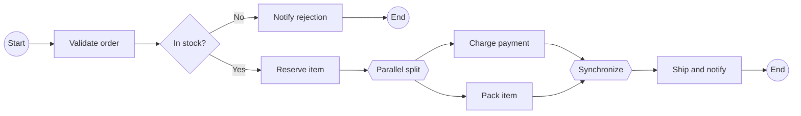
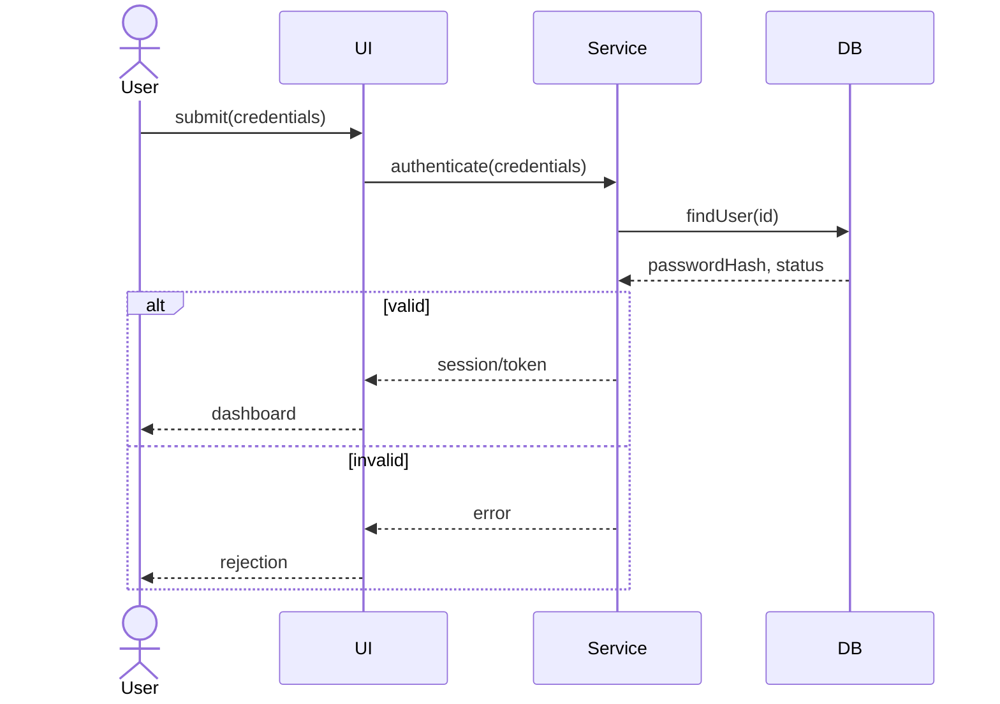
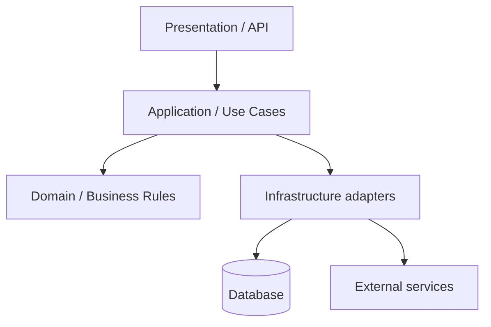
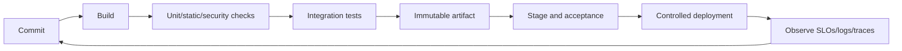

# Bismillah.

# Software Engineering — Slide-Complete Viva Recall

> **Current source basis:** the selected academic folder now contains `CSE307AllMerged.pdf` (603 pages) plus *Dive Into Design Patterns* (410 pages). The Information System Design folder contributes `CSE325_AI_Merged.pdf` (214 pages), `CSE325_JYK_Merged.pdf` (303 pages), and the 3-page formula sheet. All **1530 current pages** were routed: the merged CSE 307 sequence anchors software process, requirements, patterns, testing and project management; CSE 325 adds modeling, architecture, version control, DevOps, metrics, estimation and process maturity. The pattern book is used as a reference for intent/structure, not as a demand to memorize all 410 pages.

---

# 1. Exact current-source coverage

| Current source | Pages | Main content routed here |
|---|---:|---|
| `CSE307AllMerged.pdf` | 603 | SDLC/process/agile; requirements; UML class modeling; design principles/patterns; testing; scheduling/EVM; risk, people, ethics, reviews, documentation and maintenance |
| `Alexander Shvets - Dive Into Design Patterns (2019).pdf` | 410 | pattern vocabulary, intent, structure, applicability, trade-offs and implementations |
| `CSE325_AI_Merged.pdf` | 214 | information-system analysis, feasibility, use cases, BPMN, architecture, MVC/layers/microservices, sequence/collaboration/deployment modeling |
| `CSE325_JYK_Merged.pdf` | 303 | VCS/Git, DevOps/CI/CD/containers, project planning, software metrics, function points, estimation/COCOMO, layered architecture, maintenance and CMMI |
| `Formula_JYK Sir.pdf` | 3 | final formulas for function points, metrics and estimation |
| **Total** | **1530** | **all current SWE + ISD source pages routed** |

---

# 2. What software engineering is

Software engineering is the systematic, disciplined, and measurable application of engineering principles to the development, operation, maintenance, and evolution of software.

Programming produces code; software engineering also manages:

- stakeholder needs and changing requirements;
- architecture, interfaces, data, and quality attributes;
- teamwork, process, estimates, schedule, cost, and risk;
- verification, validation, deployment, operation, maintenance;
- security, privacy, safety, ethics, and retirement.

Software does not physically wear out like hardware, but it degrades structurally when repeated changes accumulate coupling, duplication, obsolete assumptions, and technical debt.

## 2.1 The framework activities from the slides

```text
communication -> planning -> modeling -> construction -> deployment
                         ^                           |
                         +------ feedback ----------+
```

- **Communication:** understand stakeholders and scope.
- **Planning:** estimate, schedule, assign resources, track risk.
- **Modeling:** analyze requirements and design solution.
- **Construction:** code and test.
- **Deployment:** deliver, support, collect feedback, evolve.

Umbrella activities such as quality assurance, configuration management, measurement, review, documentation, and risk management span the lifecycle.

---

# 3. SDLC and process models

## 3.1 Seven-phase SDLC sequence in the Elin slides

1. **Planning:** define problem, feasibility, scope, resources, milestones.
2. **Analysis:** elicit, understand, prioritize, and document requirements.
3. **Design:** architecture, data, interfaces, components, processes.
4. **Development:** build technical environment, database, and program.
5. **Coding/testing:** implement and verify units/integration/system/acceptance.
6. **Implementation:** deploy, document, train, and migrate users/data.
7. **Maintenance:** correct, adapt, perfect, and prevent future problems.

These are activities, not always rigid one-time boxes. Iterative methods revisit them.

## 3.2 Scope creep and feature creep

- **Scope creep:** uncontrolled expansion of agreed project scope.
- **Feature creep/gold plating:** extra features are added without validated need or planned tradeoff.

Control with a baseline, traceable change request, impact analysis, prioritization, stakeholder decision, and updated schedule/budget/test plan. “Never change requirements” is not realistic; unmanaged change is the problem.

## 3.3 Implementation/conversion strategies

| Strategy | Mechanism | Advantage | Risk/cost |
|---|---|---|---|
| Direct/plunge | stop old and start new | fast, low parallel cost | highest failure/recovery risk |
| Parallel | old and new run together | fallback and result comparison | duplicate cost/work, inconsistency |
| Pilot | deploy to limited group/site | limits blast radius | pilot may not represent all users |
| Phased | roll out modules/groups gradually | controlled learning | integration/mixed-version complexity |

## 3.4 Waterfall

Sequential phase gates work best when requirements are stable, technology is understood, and strong documentation/regulation matters. Benefits: clear milestones and artifacts. Weaknesses: late feedback/testing, expensive requirement change, and an apparently complete document can hide misunderstanding.

## 3.5 Incremental and iterative

- **Incremental:** deliver usable slices over time.
- **Iterative:** revisit/refine the solution repeatedly.

Many processes are both. Early value/feedback and reduced one-shot risk are benefits; architecture, integration, and cross-cutting quality need deliberate coordination.

## 3.6 Prototyping

Useful when requirements or interaction are unclear. A throwaway prototype learns and is discarded; an evolutionary prototype becomes the product and therefore must be engineered, not casually promoted from demo code. Users may mistake UI progress for a production-ready backend/security system.

## 3.7 Spiral

Risk-driven cycles:

```text
set objectives/alternatives
 -> identify and resolve risks
 -> develop/verify next level
 -> plan next iteration
```

Strong for large high-risk projects; costly/complex and requires risk expertise.

## 3.8 V-model

Pairs development artifacts with corresponding test levels: requirements ↔ acceptance, system design ↔ system test, architecture ↔ integration, module design/code ↔ unit test. Its value is early test planning and traceability; it remains less flexible when interpreted rigidly.

---

# 4. Agile, XP, and Scrum

## 4.1 Agile is not “no plan or documentation”

Agile values individuals/interactions, working software, customer collaboration, and responding to change, while still valuing the items on the other side. It uses short feedback loops and adaptive plans. The correct amount of documentation is the amount needed for value, safety, compliance, onboarding, maintenance, and coordination.

Core principles in recall form:

- deliver valuable software early/frequently;
- welcome useful change;
- business and developers collaborate;
- support motivated people;
- prefer effective communication;
- working software is primary progress evidence;
- sustain pace;
- maintain technical excellence/simplicity;
- empower self-organizing teams;
- inspect and adapt.

## 4.2 Extreme Programming (XP)

Practices include user stories/planning game, small releases, simple design, test-first/TDD, refactoring, pair programming, continuous integration, collective ownership, coding standards, and sustainable pace.

Pair programming has driver and navigator roles and is a continuous review/knowledge-sharing practice. It does not mean two people independently type the same code.

## 4.3 Scrum accountabilities

- **Product Owner:** maximizes value and orders product backlog.
- **Scrum Master:** helps the team understand/improve Scrum and remove impediments; not merely a command-and-control manager.
- **Developers:** create the usable increment and manage sprint work.

Artifacts/commitments:

- product backlog / product goal;
- sprint backlog / sprint goal;
- increment / definition of done.

Events:

```text
Sprint Planning -> Sprint with Daily Scrums
               -> Sprint Review -> Retrospective -> next Sprint
```

- Review inspects product/outcome with stakeholders.
- Retrospective improves team/process.
- Daily Scrum is for developers to inspect progress/adapt plan, not a status interrogation.

## 4.4 User story and acceptance criteria

```text
As a <role>, I want <capability>, so that <benefit>.
```

Acceptance criteria make behavior testable:

```text
Given an authenticated borrower with no overdue fine,
When they borrow an available book,
Then one active loan is created and inventory becomes unavailable.
```

INVEST heuristic: independent, negotiable, valuable, estimable, small, testable.

---

# 5. Requirements engineering

Requirements engineering includes elicitation, analysis/negotiation, specification, validation, and change management.

## 5.1 Why requirements fail

- stated request differs from underlying need;
- wrong or missing stakeholder;
- ambiguity and conflicting vocabulary;
- unconscious/undreamed needs;
- unstated constraints/business rules;
- rapid domain/policy change;
- solution prematurely mistaken for requirement;
- nonfunctional qualities omitted;
- no validation/traceability.

## 5.2 Customer and developer requirements in the slides

The legacy deck distinguishes customer-oriented requirements/use cases from detailed developer/system requirements. The defensible interpretation:

- user/customer requirements express goals and externally visible behavior in domain language;
- system/developer requirements refine these into precise functional, data, interface, quality, and constraint statements;
- every detailed requirement should trace to stakeholder need, regulation, risk, or architectural necessity.

## 5.3 Functional versus nonfunctional

- **Functional:** service/behavior—what the system shall do.
- **Nonfunctional/quality:** how well or under what constraint—performance, availability, security, usability, reliability, maintainability, portability, legal constraints.

Bad: “The system should be fast and secure.”

Better:

```text
Under 1,000 concurrent authenticated users, the 95th percentile
response time for incident-list requests shall be <= 300 ms,
measured in the production-equivalent load environment.
```

```text
Every incident read shall be authorized against the requesting user's
role and incident relationship; denied attempts shall be audit logged
without recording sensitive incident text.
```

## 5.4 Other categories

- data requirements;
- interface requirements (user, hardware, software, communication);
- business rules/domain constraints;
- regulatory/legal requirements;
- transition/migration requirements;
- operational/support requirements.

## 5.5 Elicitation techniques

- interviews: depth and follow-up, but costly/subjective;
- questionnaires: broad/cheap, limited probing;
- observation/contextual inquiry: exposes real workflow and tacit workarounds;
- workshops/JAD: align stakeholders and resolve conflict;
- document/existing-system analysis;
- prototypes;
- focus groups/brainstorming;
- interface/event/use-case analysis.

Triangulate techniques; one stakeholder rarely knows the whole system.

## 5.6 Requirement quality

A good requirement is necessary, correct, unambiguous, feasible, consistent, complete enough, prioritized, traceable, modifiable, and verifiable. “Complete” is contextual; maintain assumptions and open questions rather than pretending uncertainty vanished.

## 5.7 Prioritization

MoSCoW: must, should, could, won’t-for-now. Alternatives include value/risk/cost scoring, pairwise comparison, Kano, or weighted-shortest-job-first. A “must” consumes finite budget; stakeholders must resolve conflicts.

## 5.8 Verification versus validation

- **Verification:** are we building the product right—does artifact conform to specification?
- **Validation:** are we building the right product—does it satisfy stakeholder need/intended use?

Reviews/static analysis verify without executing; testing can support both depending on oracle and level.

## 5.9 Traceability

```text
stakeholder goal -> requirement -> design component -> code/change
                 -> test case -> result -> release
```

Forward trace finds implementation/tests for each requirement. Backward trace prevents orphan features and explains why code exists. Traceability supports impact analysis, compliance, and change control.

---

# 6. UML class diagrams

UML is a modeling language, not a development process and not executable truth by itself.

## 6.1 Class box

```text
+---------------------------+
| Account                   |
+---------------------------+
| - id: UUID                |
| - balance: Money          |
+---------------------------+
| + deposit(x: Money): void |
| + withdraw(x): boolean    |
+---------------------------+
```

Visibility: `+` public, `-` private, `#` protected, `~` package. Underlining often marks static; italics may mark abstract.

## 6.2 Relationships

- **Dependency:** temporary use; change in supplier may affect client.
- **Association:** structural relationship/reference.
- **Aggregation:** weak whole–part; part can exist independently.
- **Composition:** strong ownership/lifetime; part normally belongs to one whole and dies with it.
- **Generalization:** “is-a” inheritance/subtyping.
- **Realization:** class implements interface/contract.

Do not choose inheritance only for code reuse; require a valid substitutable “is-a” relationship. Composition is often safer for varying behavior.

## 6.3 Multiplicity

- `1`: exactly one;
- `0..1`: optional one;
- `*` or `0..*`: any number;
- `1..*`: at least one;
- `m..n`: bounded range.

Read both ends. If `Student *——1 Department`, many students can associate with one department; the labels describe how many instances at that end correspond to one at the opposite end.

## 6.4 Association class

When a relationship itself has attributes, model it as an association class/entity. Example: `Enrollment(Student, Course)` holds semester, grade, and status. In a database it often becomes a junction table with foreign keys.

## 6.5 Other diagrams to recall

- use-case: actors and externally visible goals;
- sequence: time-ordered interactions/lifelines;
- activity: workflow/control/data flow;
- state machine: states/events/guards/transitions/actions;
- component/deployment: software components and runtime nodes.

Choose the diagram for the question; do not force class diagrams to express temporal behavior.

---

# 7. Design principles and patterns

A design pattern is a named reusable solution structure for a recurring design problem in a context. It is not copy-paste code, framework, library, or algorithm. Essential description: name, problem/context/forces, solution structure/collaboration, and consequences/tradeoffs.

## 7.1 GoF categories

- **Creational:** object creation.
- **Structural:** composition of classes/objects.
- **Behavioral:** communication/responsibility/algorithms.

## 7.2 SOLID recall

- SRP: one cohesive reason to change.
- OCP: extend behavior without repeatedly modifying stable core.
- LSP: subtype preserves base contract and substitutability.
- ISP: clients should not depend on unused methods.
- DIP: high-level policy depends on abstractions, not concrete low-level details.

Patterns are tools for forces, not badges. Overuse creates indirection and accidental complexity.

---

# 8. Creational patterns from the slides

## 8.1 Factory Method

**Problem:** a creator needs a product but subclasses/configuration should decide concrete class.

```java
interface Shape { void draw(); }

abstract class Editor {
    protected abstract Shape createShape();
    public void insertAndDraw() {
        Shape s = createShape();
        s.draw();
    }
}
```

It moves construction variation behind an overridable method. Benefit: decouples client workflow from concrete product. Cost: extra subclasses/indirection.

## 8.2 Simple Factory versus Factory Method

A “simple factory” is typically a method/object with conditional construction; it is useful but not the original GoF Factory Method pattern. Factory Method uses polymorphic creator subclasses/method override.

## 8.3 Abstract Factory

Creates a **family of related products** that must be compatible:

```java
interface UIFactory {
    Button createButton();
    Menu createMenu();
}
```

WindowsFactory returns Windows products; LinuxFactory returns Linux products. Switching family is easy, but adding a new product kind changes every factory interface/implementation.

## 8.4 Singleton

Ensures one controlled instance/access point in a scope:

```java
final class Config {
    private Config() {}
    private static class Holder {
        static final Config INSTANCE = new Config();
    }
    static Config instance() { return Holder.INSTANCE; }
}
```

Risks: global hidden dependency, hard tests, lifecycle/concurrency/serialization/class-loader subtleties. “Only one database connection” is usually a bad requirement; use a managed pool and dependency injection. Use singleton only when uniqueness is a real invariant.

## 8.5 Builder

Constructs a complex object step by step, separating construction from representation:

```java
Request r = new Request.Builder("/incidents")
    .method("POST")
    .timeoutMs(3000)
    .authenticated(true)
    .build();
```

Useful for many optional parameters, validation, immutability, and multiple representations. Cost: extra types/boilerplate.

---

# 9. Structural patterns from the slides

## 9.1 Adapter

Converts one interface into the interface a client expects.

```text
Client -> Target interface <- Adapter -> Adaptee
```

Example: application expects kilometers, legacy service returns miles; adapter converts units and interface. It enables reuse without changing client/adaptee, but can hide impedance mismatch or accumulate translation complexity.

## 9.2 Decorator

Wraps an object with the same interface to add responsibilities dynamically:

```java
Notifier n = new SmsDecorator(new EmailNotifier());
n.send(message);
```

Decorator is flexible alternative to subclass combinations. Ordering may matter, identity/debugging can be harder, and many small wrappers appear.

Do not confuse:

- Adapter changes interface.
- Decorator keeps interface and adds behavior.
- Proxy keeps interface and controls access/lifecycle/location.

## 9.3 Composite

Represents part–whole trees so clients treat leaves and composites uniformly:

```text
Component
  +-- Leaf
  +-- Composite: children<Component>
```

Examples: filesystem tree, GUI hierarchy, organization structure. Benefit: recursive uniform operations. Tradeoff: enforcing restrictions on which children are legal may become harder.

---

# 10. Behavioral patterns from the slides

## 10.1 State

An object delegates behavior to an object representing current state; transitions replace state object.

```text
Context -> State interface
             +-- Locked
             +-- Unlocked
```

Use when large conditionals vary behavior by state and transitions matter. Cost: more classes; transition ownership must be clear.

## 10.2 Strategy

Encapsulates interchangeable algorithms behind one interface:

```java
interface RouteStrategy { Route build(Point a, Point b); }
class Navigator { RouteStrategy strategy; }
```

Choose driving/walking/transit at runtime. It removes algorithm conditionals and supports testing, but client/configuration must select correctly.

State and Strategy look structurally similar. Strategy is usually chosen to vary algorithm; State changes as lifecycle evolves and behavior depends on current state.

## 10.3 Observer

A subject publishes state/events to subscribed observers:

```text
Subject: attach/detach/notify
Observer: update(event)
```

The group-notification CT scenario is Observer: each group is a subject; members subscribe/unsubscribe; new post/comment notifies current members. Tradeoffs: update order, slow/failing observer, memory leaks from forgotten unsubscribe, event storms, consistency. In distributed systems, use durable events/queues and idempotent consumers rather than synchronous in-memory calls alone.

## 10.4 Template Method

Base class fixes algorithm skeleton while subclasses override selected steps:

```java
abstract class Importer {
    final void run() { open(); parse(); validate(); save(); close(); }
    protected abstract void parse();
    protected void validate() {}
}
```

Reuses invariant workflow, but inheritance tightly couples steps. Strategy uses composition and can change at runtime.

## 10.5 Command

Encapsulates a request as an object:

```text
Invoker -> Command.execute()
                |
                -> Receiver action
```

Supports queues, logging, retry, macro commands, undo when inverse/state exists. The stock-trade CT scenario uses Buy/Sell Command objects, an agent as invoker with queue, and StockTrade as receiver. A queued command should capture immutable required data and define failure/idempotency semantics.

---

# 11. Solving the supplied CT pattern scenarios

## 11.1 City distance views

Primary pattern: **Observer**. Graph/domain model is subject; kilometer table and mile table are observers; road changes trigger refresh. The miles view may also use **Adapter/Strategy** for unit conversion, but conversion alone does not solve automatic multi-view synchronization. If following MVC language, Graph is model and views observe it.

## 11.2 Stock exchange orders

**Command**: `BuyOrder`/`SellOrder` implement `execute`; agent/invoker queues them; StockTrade/receiver performs action. Benefits: decouple creator from executor, queue/schedule/log/retry. Define duplicate handling and transaction status.

## 11.3 Social-network groups

**Observer**: group subject maintains subscribers; member joins/leaves; post/comment emits notification. In a real distributed system, supplement with event bus/outbox, durable subscription state, retry/dead-letter queue, preference/privacy checks, and idempotency.

---

# 12. Testing, verification, and validation

Testing executes software to find defects and build evidence. It can reveal presence of bugs, not prove their total absence for nontrivial input spaces.

## 12.1 Static versus dynamic

- static: reviews, inspections, linters, type checking, static analysis, formal methods;
- dynamic: execute unit/component/system under test.

## 12.2 Black-box versus white-box

- black-box derives tests from requirements/interfaces without relying on implementation structure;
- white-box derives tests from code/control/data paths.

They answer different risks and complement one another.

## 12.3 Levels

- unit: smallest testable unit in isolation;
- integration: interactions among units/services/databases;
- system/end-to-end: complete system against requirements;
- acceptance: stakeholder/customer evidence for acceptance;
- regression: rerun tests after change;
- alpha: internal/controlled pre-release users;
- beta: selected external users in realistic conditions.

Nonfunctional tests include performance/load/stress/soak, security, usability, reliability/recovery, compatibility, accessibility, installation, and portability.

## 12.4 Test case anatomy

- unique ID and linked requirement/risk;
- preconditions/environment/data;
- actions;
- exact expected result/oracle;
- actual result/status/evidence;
- cleanup and ownership.

## 12.5 Test plan

Scope, objectives, items/features in/out, approach/levels, environment/tools, data, roles, schedule, entry/exit criteria, risks/contingencies, defect process, metrics/deliverables.

---

# 13. Input-domain testing from the slides

## 13.1 Equivalence partitioning

Partition inputs into classes expected to behave similarly, then choose representatives.

For integer age `18..60`:

- `<18` invalid;
- `18..60` valid;
- `>60` invalid;
- also consider missing, nonnumeric, overflow, whitespace based on interface.

It reduces redundant tests but only works when partitions reflect behavior.

## 13.2 Boundary-value analysis

Faults cluster at boundaries. For `18..60`, test values around each boundary:

```text
17, 18, 19, 59, 60, 61
```

Robust BVA includes just outside valid range. For multiple inputs, decide normal one-at-a-time boundaries versus worst-case combinations; combinatorial explosion may need pairwise/risk-based selection.

## 13.3 Positive and negative testing

- positive: valid data/workflow produces expected success;
- negative: invalid, missing, unauthorized, duplicate, malformed, extreme, out-of-order, or failure conditions are rejected safely.

Negative tests should verify no forbidden state change, correct error semantics, no sensitive leakage, audit/rollback behavior, and recovery—not merely “an error occurred.”

## 13.4 Web session cases

- expiration and renewal;
- logout/revocation;
- fixation/rotation after login;
- concurrent sessions/device policy;
- CSRF/session cookie attributes;
- back button/cache after logout;
- invalid/tampered token;
- authorization checked on every protected object/action.

## 13.5 Structural coverage

- statement coverage;
- branch/decision coverage;
- condition coverage;
- path coverage (usually infeasible in full due to loops/combinations);
- mutation score as strength signal.

100% coverage is not 100% correctness: assertions may be weak and requirements missing.

---

# 14. Project scheduling and PERT/CPM

## 14.1 Dependencies

- Finish-to-Start (FS): B starts after A finishes.
- Start-to-Start (SS): B starts after A starts.
- Finish-to-Finish (FF): B finishes after A finishes.
- Start-to-Finish (SF): uncommon; B finishes after A starts.

Also distinguish task, milestone (zero-duration marker), resource, deliverable, and critical path.

## 14.2 Forward pass

For activity `i` with duration `d_i`:

$$
ES_i=\max_{j\in pred(i)} EF_j,
\qquad EF_i=ES_i+d_i.
$$

Starting activities have `ES=0`. Project duration is maximum finish at sink/end.

## 14.3 Backward pass

At final activity/milestone, set latest finish to project duration. Then:

$$
LF_i=\min_{j\in succ(i)} LS_j,
\qquad LS_i=LF_i-d_i.
$$

Slack/total float:

$$
Slack_i=LS_i-ES_i=LF_i-EF_i.
$$

Zero-slack activities form at least one critical path. It is the longest-duration dependency path, not necessarily the path with most tasks. Delaying a critical activity delays project unless schedule/logic/resources change.

## 14.4 Worked mini example

```text
A(3) -> C(4) -> E(2)
B(2) -> D(3) -/
A also precedes D
```

Forward:

- A: ES0 EF3; B: ES0 EF2;
- C: ES3 EF7;
- D: ES max(3,2)=3 EF6;
- E: ES max(7,6)=7 EF9.

Backward from 9:

- E LS7;
- C LF7 LS3, D LF7 LS4;
- A must finish by `min(3,4)=3`, so LS0;
- B must finish by D’s LS4, so LS2.

Critical path A–C–E length 9. D slack 1; B slack 2.

## 14.5 Resource leveling

Network logic may allow parallel tasks but the same person/equipment cannot do both. Level resources by shifting noncritical work within slack or extending schedule. Adding people to a late project can make it later because onboarding and communication grow—Brooks’s Law is a warning, not a universal mathematical law.

---

# 15. Earned-value management

- `PV`: budgeted value of work scheduled by status date.
- `EV`: budgeted value of work actually completed.
- `AC`: actual cost of completed work.
- `BAC`: total approved budget at completion.

$$
SV=EV-PV,
\quad CV=EV-AC,
\quad SPI=EV/PV,
\quad CPI=EV/AC.
$$

- `SV<0`/`SPI<1`: behind schedule in value terms.
- `CV<0`/`CPI<1`: over budget for earned work.

Simple forecast used in slides when current cost efficiency continues:

$$
EAC=BAC/CPI.
$$

Example from slides: `PV=50, EV=40, AC=45, BAC=88`:

```text
SV = -10
CV = -5
SPI = 0.80
CPI = 0.888... ≈ 0.89
EAC ≈ 88/0.89 ≈ 98.88 (using rounded CPI)
```

EVM needs an honest baseline and objective completion rules. It does not by itself measure customer value, quality, or remaining technical risk. Different EAC formulas apply under different assumptions; state which one is used.

---

# 16. Risk management

A risk is an uncertain event/condition that may affect objectives. An issue has already occurred.

## 16.1 Categories in the slides

- project risk: schedule/resources/cost;
- technical risk: feasibility, quality, technology;
- business risk: viability/market/funding;
- known, predictable, and unpredictable by identifiability/nature.

## 16.2 Process

```text
identify -> analyze probability/impact -> prioritize
-> plan response/owner/trigger -> monitor -> control/communicate
```

Risk exposure often approximated as

$$
RE=P(loss)\times Impact.
$$

Do not pretend ordinal “high/medium” multiplication is exact money without calibrated scales.

Responses:

- avoid: remove cause/approach;
- mitigate: reduce probability/impact;
- transfer/share: contract/insurance/partner;
- accept: monitor with contingency/reserve.

Maintain a risk register: ID, description/cause-event-effect, category, probability, impact, exposure, owner, response, trigger, contingency, status.

Reactive firefighting starts after occurrence; proactive risk management prepares before. Unknown risks still need resilience, reserves, observability, rollback, and incident response.

---

# 17. People, communication, leadership, and ethics

## 17.1 Four Ps

- People;
- Product;
- Process;
- Project.

Stakeholders include client/sponsor, users, project/product manager, analysts, architects, developers, testers/QA, operations/SRE, security/privacy/legal, support, vendors, and affected public. Roles may overlap; accountability still must be explicit.

## 17.2 Communication paths

For `n` people, possible pairwise channels:

$$
n(n-1)/2.
$$

This explains rising coordination cost, not that every pair must constantly communicate. Modular teams, interfaces, documentation, ownership, and ceremonies reduce unnecessary coupling.

## 17.3 Management versus leadership

Management plans, organizes, budgets, tracks, and controls delivery. Leadership aligns purpose, builds trust, motivates, handles change, and enables judgment. A project needs both.

## 17.4 Software engineering ethics principles

The slides organize professional duties around:

1. public interest;
2. client and employer, consistent with public interest;
3. product quality/professional standards;
4. independent professional judgment;
5. ethical management;
6. integrity of profession;
7. fairness/support for colleagues;
8. lifelong learning and ethical practice.

Ethical judgment is not a mechanical algorithm. For a conflict: identify stakeholders/harms, duties/law/policy, evidence/uncertainty, alternatives, proportional action, escalation, documentation, and protection of the public. Confidentiality does not justify concealing imminent serious harm or illegal behavior; follow lawful professional escalation.

---

# 18. Code smells and refactoring

A smell is a symptom suggesting a design problem; it is not proof of a bug. Refactoring changes internal structure while preserving externally observable behavior, supported by tests.

High-yield smells:

- duplicated code;
- long method/large class;
- long parameter list;
- feature envy;
- data clumps/primitive obsession;
- switch/type-code logic that resists extension;
- shotgun surgery/divergent change;
- dead code/speculative generality;
- inappropriate intimacy/message chains;
- comments compensating for unclear code.

Refactorings: extract method/class, rename, move method/field, introduce parameter object/value object, replace condition with polymorphism, encapsulate field, remove dead code. First characterize behavior with tests; small commits and review reduce risk.

Technical debt is the future cost/risk created by expedient design decisions. Debt can be deliberate, but record rationale, interest, owner, and repayment trigger.

---

# 19. Code review

Review aims to improve correctness, security, readability, maintainability, tests, knowledge sharing, and consistency.

Approaches from slides:

- over-the-shoulder;
- email thread;
- pair programming;
- tool-assisted pull/merge request.

Good workflow:

1. author self-reviews and supplies context/test evidence;
2. keep change small/cohesive;
3. automation checks build/test/style/static/security;
4. reviewer checks behavior, edge cases, contracts, security, design, tests, operations;
5. feedback is specific, respectful, and distinguishes blocker/suggestion/question;
6. author responds/updates;
7. unresolved important issues are resolved before merge;
8. merge and monitor.

Automation finds known/mechanical patterns, not domain intent or all architectural/security flaws. Review is not testing’s replacement.

---

# 20. Documentation

Useful layers:

- README/getting started;
- requirements/acceptance criteria;
- architecture diagrams and ADRs;
- API/interface contracts/examples;
- source comments/docstrings for non-obvious intent/invariants;
- runbooks/deployment/rollback/incident procedures;
- user/operations manuals;
- changelog/migration notes.

Comments should explain **why**, assumptions, invariants, units, side effects, and unusual tradeoffs—not paraphrase clear syntax. Incorrect stale documentation is dangerous. Keep docs close to source, review them with changes, automate generated reference where appropriate, and test executable examples.

---

# 21. Maintenance and evolution

- corrective: fix faults;
- adaptive: environment/platform/regulation changes;
- perfective: functionality/performance/usability improvements;
- preventive: refactoring/tests/dependency updates to reduce future risk.

Maintenance dominates long-lived systems because requirements/environment continue changing. Use configuration management, version control, reproducible builds, CI, regression testing, release/change records, backups/migrations, observability, and rollback.

## 21.1 Configuration management

Identify configuration items, version/baseline them, control changes, record status, audit releases, and reproduce builds. Git is a tool within SCM, not the entire discipline.

## 21.2 CI/CD

- CI: integrate frequently with automated build/test/analysis.
- Continuous delivery: every accepted change is deployable; release may be a decision.
- Continuous deployment: accepted changes automatically reach production.

Deployment strategies: rolling, blue–green, canary, feature flags. Each needs health metrics, compatibility/migration plan, and rollback/roll-forward strategy.

---

# 22. Metrics and quality traps

Useful metrics are tied to a decision:

- lead/cycle time and deployment frequency;
- change-failure rate and recovery time;
- escaped defect rate by severity;
- reliability/availability/error budget;
- test flakiness;
- code-review latency/size;
- performance/security SLOs.

Lines of code, commits, story points, and coverage can be gamed. Goodhart’s law: when a measure becomes a target, it can cease to be a good measure. Never use one raw productivity metric to rank developers.

Quality assurance is process-oriented prevention/improvement; quality control evaluates products/artifacts to detect defects. They overlap in practice but are not synonyms.

---

# 23. Rapid comparisons

| Pair | Distinction |
|---|---|
| Verification vs validation | conform to specification vs satisfy real need |
| Functional vs nonfunctional | behavior vs quality/constraint |
| Waterfall vs agile | plan-driven staged flow vs adaptive short feedback loops |
| Iterative vs incremental | refine repeatedly vs deliver slices |
| Prototype vs production | learning artifact vs supported quality product |
| Aggregation vs composition | weak whole–part vs strong ownership/lifetime |
| Factory Method vs Abstract Factory | vary one product creation via creator method vs create compatible families |
| Adapter vs Decorator | change interface vs add behavior preserving interface |
| Strategy vs State | chosen algorithm variation vs lifecycle-driven behavior state |
| Observer vs Command | publish changes to subscribers vs encapsulate request/action |
| Unit vs integration test | isolated unit vs collaboration boundaries |
| Regression vs retest | broad change-impact suite vs confirm a specific fix |
| Severity vs priority | impact of defect vs urgency/order to fix |
| Risk vs issue | uncertain future event vs event already occurred |
| Slack vs critical path | allowed delay vs zero-slack longest dependency chain |
| CI vs delivery vs deployment | integrate/test vs always releasable vs auto-release |

---

# 24. Common wrong answers

- “Agile means no documentation or planning.” It uses adaptive just-enough planning/documentation.
- “Scrum Master is the team boss.” It is a facilitative accountability, not necessarily line management.
- “Every requirement from a client is the real requirement.” Elicit underlying goals/constraints and validate.
- “Nonfunctional means optional.” Security, latency, availability, safety may be decisive acceptance criteria.
- “UML is an SDLC.” UML is a modeling notation.
- “Inheritance is always better reuse.” Prefer substitutability; composition often reduces coupling.
- “Singleton is simply a global variable and always useful.” It enforces scoped uniqueness but brings global-state/testing/lifecycle costs.
- “Observer guarantees reliable notification.” In-memory pattern alone does not guarantee distributed durability/order/exactly-once.
- “100% coverage means bug-free.” Coverage shows execution, not oracle/spec completeness.
- “Testing proves absence of bugs.” It supplies evidence and finds defects over sampled/modelled behaviors.
- “Critical path is the shortest path.” It is the longest duration dependency path controlling completion.
- “SPI/CPI measure product quality.” They measure schedule/cost value performance under a baseline.
- “Adding developers always accelerates a late project.” Onboarding/communication/task partitioning can delay it further.
- “Code smell is automatically a defect.” It is a signal requiring context.
- “More comments mean better documentation.” Accuracy, intent, discoverability, and maintenance matter.

---

# 25. Information-System Analysis and Feasibility

An information system combines people, process, data, software, hardware and communication to support operations or decisions. Before choosing technology, establish:

1. the business problem and stakeholders;
2. the current process and pain points;
3. system boundary, inputs, outputs, data and interfaces;
4. functional and quality requirements;
5. alternatives, constraints, risks and measurable success criteria.

Feasibility is often recalled as **TELOS**:

| Dimension | Main question |
|---|---|
| Technical | Can available technology, skills, integration and performance satisfy it? |
| Economic | Do expected benefits justify acquisition, development, operation and change costs? |
| Legal | Does it comply with law, contract, licensing, privacy and regulation? |
| Operational | Will people/processes adopt and operate it effectively? |
| Schedule | Can a useful, safe scope be delivered by the required time? |

Feasible does not mean guaranteed. State assumptions, uncertainty and the evidence used.

# 26. BPMN and Behavioral UML

## 26.1 BPMN essentials

Business Process Model and Notation represents a process as a graph of:

- **events** (circles): something starts, happens or ends;
- **activities/tasks** (rounded rectangles): work performed;
- **gateways** (diamonds): split/merge control;
- **sequence flows**: order inside one process/pool;
- **message flows**: communication between separate participants/pools;
- **pools and lanes**: participants and responsibility partitions;
- **data objects/stores and annotations**: information and explanation.

Gateway semantics matter:

| Gateway | Split meaning | Join meaning |
|---|---|---|
| Exclusive/XOR | exactly one satisfied branch | pass when one incoming branch arrives |
| Parallel/AND | activate every branch | wait for every active incoming branch |
| Inclusive/OR | activate one or more satisfied branches | synchronize the branches that were activated |
| Event-based | next external event selects branch | selection is by event, not data condition |

Example order-fulfilment recall:



Do not use a sequence flow across pools; use a message flow. Do not draw an XOR join when later work must wait for all parallel branches.

## 26.2 Use case, sequence, and communication diagrams

A **use case** shows externally visible goals and actor–system interactions, not internal class calls. `include` factors mandatory reused behavior; `extend` adds conditional/optional behavior at extension points; actor/use-case generalization expresses specialization.

A **sequence diagram** emphasizes time from top to bottom. It contains actors/objects, lifelines, activation bars, synchronous/asynchronous messages, returns, creation/destruction and combined fragments such as `alt`, `opt`, `loop` and `par`.



A **communication/collaboration diagram** can express the same interaction but emphasizes object links/topology; numbered messages express order. Use a sequence diagram when timing/order is central and a communication diagram when object collaboration structure is central.

State-machine diagrams model state-dependent lifecycle behavior; activity diagrams model workflows/control/data flow; component diagrams show software components and provided/required interfaces; deployment diagrams map artifacts/components to execution nodes.

# 27. Architecture Recall

Architecture identifies major elements, responsibilities, interfaces, dependencies and decisions that determine quality attributes. A good architecture is not a box drawing alone; connect a choice to a scenario such as “under 1000 requests/s, 95% finish within 200 ms” or “one service failure must not corrupt an order.”

## 27.1 Layered architecture



- Benefits: separation of concerns, replaceable boundaries, testability, familiar organization.
- Costs: pass-through boilerplate, hidden cross-layer coupling, extra latency, temptation to bypass layers.
- A **closed** layer may call only the next layer; an **open** layer may be bypassed under stated rules.
- Keep dependency direction deliberate; business rules should not become inseparable from frameworks/storage.

## 27.2 MVC

**Model** represents domain state/logic, **View** presents it, and **Controller** interprets input and coordinates actions. MVC separates presentation concerns, but web frameworks use the names differently; describe actual responsibilities rather than memorizing arrows.

## 27.3 Monolith versus microservices

| Concern | Modular monolith | Microservices |
|---|---|---|
| deployment | one deployable unit | independently deployable services |
| calls | mostly in-process | network calls and partial failure |
| data/transactions | easier local ACID | service-owned data; distributed consistency |
| operations | simpler initial operation | discovery, observability, security, automation needed |
| scaling | scale the application | scale selected services |
| organizational fit | small/medium team, uncertain boundaries | mature teams and stable bounded contexts |

Microservices are not “small classes over HTTP.” A service should own a cohesive business capability and data boundary. Benefits—independent deployment/scale/team autonomy—are bought with latency, retries, versioning, eventual consistency, duplicate messages, monitoring and deployment complexity. Start from need, not fashion.

# 28. Version Control, DevOps, CI/CD, and Containers

## 28.1 Version control and Git mental model

A VCS records versions, authorship and branches so teams can compare, merge, restore and audit work. A centralized VCS relies on a central repository for most history operations; a distributed VCS gives each clone the repository history and supports local commits.

Git's core path is:

```text
working tree -> git add -> staging/index -> git commit -> local repository
local repository <-> git fetch/push <-> remote repository
```

```bash
git status
git switch -c feature/login
git add src tests
git commit -m "Add login validation"
git fetch origin
git rebase origin/main        # or merge, according to team policy
git push -u origin feature/login
```

`fetch` downloads refs/objects without integrating; `pull` fetches then merges/rebases. `revert` creates a new inverse commit and is appropriate for shared history; resetting/rewriting published history requires coordination. A merge preserves both lines with a merge commit when necessary; rebase replays commits onto a new base and rewrites their identities.

## 28.2 DevOps

DevOps is a culture and set of engineering practices joining development and operations around fast, reliable feedback and shared responsibility. The **CALMS** mnemonic is Culture, Automation, Lean, Measurement, Sharing.



- **CI:** integrate small changes frequently; automated checks quickly expose incompatibility.
- **Continuous delivery:** each accepted artifact is deployable; production release may require a decision.
- **Continuous deployment:** every accepted change automatically reaches production.

Track outcomes such as deployment frequency, lead time for changes, change-failure rate and recovery time; do not reward raw commit count.

## 28.3 Deployment strategies

- **Blue–green:** keep old and new environments; switch traffic. Fast rollback, but doubles environment capacity and database compatibility is hard.
- **Canary:** send a small representative fraction to the new version, compare health, then expand. Limits blast radius but needs observability and safe cohorting.
- **Rolling/ramped:** replace instances gradually. Capacity-efficient, but mixed versions coexist.
- **A/B:** route cohorts to variants to test product behavior; it is an experiment goal, not merely a safer rollout.

Use backward/forward-compatible schema changes: expand schema, deploy compatible code, migrate/backfill, then contract later.

## 28.4 Containers versus virtual machines

A VM virtualizes hardware and normally runs its own guest kernel. A container isolates processes/filesystem/network while sharing the host kernel. Containers are usually lighter/faster to start, but are not “kernel-independent miniature VMs.”

```dockerfile
FROM python:3.12-slim
WORKDIR /app
COPY requirements.txt .
RUN pip install --no-cache-dir -r requirements.txt
COPY . .
USER 10001
CMD ["python", "app.py"]
```

Build an immutable image, externalize configuration/secrets, run least-privileged, scan dependencies, set resource limits and preserve state in managed volumes/services. An orchestrator such as Kubernetes schedules containers and supports health checks, service discovery, scaling and rollout; it does not automatically make a poorly designed application reliable.

# 29. Size, Metrics, and Estimation

## 29.1 Goal–Question–Metric

Choose a **goal**, formulate questions whose answers reveal progress, then select metrics that answer them. A metric should be computable, consistently defined, empirically defensible, decision-relevant, hard to game and accompanied by context/uncertainty.

## 29.2 Function points

Count five externally visible function types:

| Function type | Low | Average | High |
|---|---:|---:|---:|
| External Input (EI) | 3 | 4 | 6 |
| External Output (EO) | 4 | 5 | 7 |
| External Inquiry (EQ) | 3 | 4 | 6 |
| Internal Logical File (ILF) | 7 | 10 | 15 |
| External Interface File (EIF) | 5 | 7 | 10 |

Multiply counts by weights and sum to get unadjusted function points `UFP`. In the slide-era adjustment model:

$$FP=UFP\left(0.65+0.01\sum_{i=1}^{14}F_i\right),\qquad 0\le F_i\le5.$$

Function points aim to measure delivered functionality more independently of programming language than LOC, but classification judgment and local productivity calibration still matter.

## 29.3 COCOMO II

For early application composition:

$$PM=\frac{\text{new object points}}{\text{productivity in object points/PM}}.$$

For early-design/post-architecture estimation, the central form is

$$PM=A(\text{Size})^{E}\prod_i EM_i,$$

where Size is normally measured in KSLOC (or converted equivalent), $E$ combines scale factors and each $EM_i$ is an effort multiplier. If $E>1$, effort grows superlinearly. The model is calibrated empirical estimation—not a law; show the assumed size, mode/model, multipliers and uncertainty.

Triangulate at least two methods: analogous projects, decomposition/WBS, expert judgment/Wideband Delphi, LOC/function/use-case/object points, three-point estimates, and an empirical model. Reconcile differences rather than averaging blindly.

For PERT task duration,

$$t_e=\frac{o+4m+p}{6},\qquad
\sigma^2=\left(\frac{p-o}{6}\right)^2.$$

## 29.4 Code and quality metrics

For a connected control-flow graph:

$$M=E-N+2=\text{number of decision outcomes that add independence}+1.$$

More generally, with $P$ connected components:

$$M=E-N+2P.$$

Cyclomatic complexity is the number of linearly independent paths and gives a lower-bound intuition for basis-path tests; it does not alone measure maintainability.

Halstead measures:

$$n=n_1+n_2,\quad N=N_1+N_2,\quad
V=N\log_2n,\quad
D=\frac{n_1}{2}\frac{N_2}{n_2},\quad
E_{\text{Halstead}}=DV,$$

where $n_1,n_2$ are distinct operators/operands and $N_1,N_2$ their total occurrences.

CK OO recall:

- **WMC:** sum of method complexities;
- **DIT:** maximum inheritance depth;
- **NOC:** immediate child count;
- **CBO:** coupling between object classes;
- **RFC:** methods potentially executed in response to a message;
- **LCOM:** lack of cohesion among methods (definitions vary—state the chosen variant).

Defect Removal Efficiency must be written in the correct direction:

$$DRE=\frac{E}{E+D},$$

where $E$ is defects found before delivery and $D$ defects found after delivery. A value near 1 is better. Do not repeat a fraction with numerator and denominator reversed because of slide-layout extraction.

# 30. CMMI Process Maturity

CMMI is a process-improvement framework. In the staged representation:

| Level | Name | Meaning |
|---:|---|---|
| 1 | Initial | work is reactive/ad hoc; success depends heavily on individuals |
| 2 | Managed | projects plan, monitor and control requirements, configuration, quality and suppliers |
| 3 | Defined | organization-wide standard processes are documented, tailored and trained |
| 4 | Quantitatively Managed | statistical/quantitative objectives control process performance |
| 5 | Optimizing | causal analysis and innovation drive continuous improvement |

The difference between levels 2 and 3 is a frequent viva trap: level 2 institutionalizes management **per project**; level 3 uses an organizational standard process tailored by projects. A maturity level indicates process capability, not that every product is defect-free.

---

# 31. Final slide-and-viva self-test

- [ ] Explain the full SDLC and choose a conversion strategy for one system.
- [ ] Compare waterfall, incremental, prototyping, spiral, V-model, XP, and Scrum by assumptions/tradeoffs.
- [ ] Write measurable functional/nonfunctional requirements and acceptance criteria.
- [ ] Elicit/prioritize/validate a requirement and trace it to design/test.
- [ ] Draw a UML class diagram with inheritance, association, composition, multiplicity, and association class.
- [ ] Define a design pattern and justify selection instead of only naming it.
- [ ] Draw/code Factory Method, Abstract Factory, Singleton, Builder.
- [ ] Draw/code Adapter, Decorator, Composite.
- [ ] Draw/code State, Strategy, Observer, Template Method, Command.
- [ ] Solve all three supplied CT scenarios with justification and tradeoffs.
- [ ] Design black-/white-box tests at unit/integration/system/acceptance levels.
- [ ] Derive equivalence partitions and boundary/negative cases.
- [ ] Perform PERT forward/backward passes and identify slack/critical path.
- [ ] Calculate PV, EV, AC, SV, CV, SPI, CPI, and a stated-assumption EAC.
- [ ] Build a risk register and choose avoid/mitigate/transfer/accept.
- [ ] Explain Brooks’s warning, team communication, leadership, and ethics.
- [ ] Identify smells, plan behavior-preserving refactoring, and conduct review.
- [ ] Defend documentation, maintenance, SCM, CI/CD, deployment, and metrics.
- [ ] Draw BPMN gateways and a UML sequence/communication diagram with correct semantics.
- [ ] Compare layered/MVC/modular-monolith/microservice choices by quality attributes.
- [ ] Explain Git working tree/index/commit/remote and merge versus rebase.
- [ ] Draw a CI/CD pipeline; compare blue–green, canary and rolling deployment.
- [ ] Calculate function points, COCOMO effort, cyclomatic complexity and DRE.
- [ ] Recite CMMI levels 1–5 and distinguish project-managed from organization-defined.
- [ ] Account for all 1530 current pages using the source matrix.
