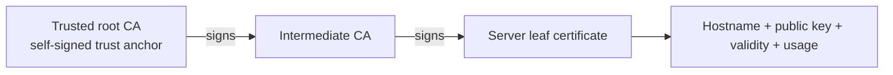
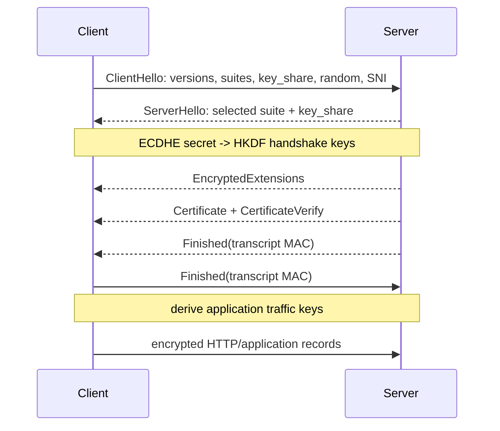
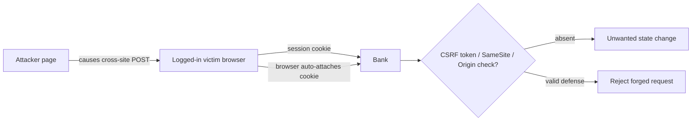
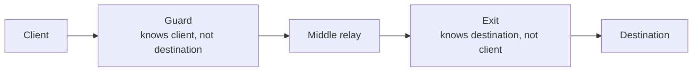
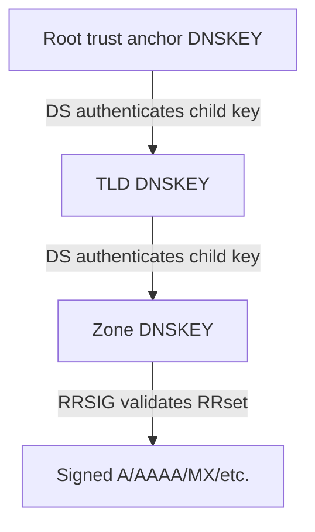

# Bismillah.

# Cybersecurity — Core-Complete Viva Recall

> **Current source basis:** the Security folder now contains `ABS_Merged_taky.pdf` (815 pages), `ART_merged_taky.pdf` (722 pages), and the 35-page image-dominant `ABS_Sir(Note).pdf`: **1572 pages total**. The merged slides were re-read in lecture order and the note was visually reviewed. The original viva-focused chapters below are retained, then expanded with the slide sequence: classical/modern cryptography, web security, memory safety, network attacks, TLS/DoS/IDS, malware, DNS security and anonymity.

Security answers should begin with the asset, adversary, and threat model. “Use encryption” is incomplete until you say **what is encrypted, against whom, where the key lives, and what integrity/authentication mechanism is used**.

---

# 1. Security objectives and vocabulary

## 1.1 CIA triad

- **Confidentiality:** unauthorized parties cannot learn protected information. Controls include access control, encryption, segmentation, minimization, and secure deletion.
- **Integrity:** unauthorized or accidental modification is prevented or detectable. Controls include authenticated encryption, MACs, digital signatures, validation, database constraints, versioning, and audit logs.
- **Availability:** authorized users can access the service/data when needed. Controls include redundancy, backups, capacity planning, rate limiting, failover, monitoring, and denial-of-service resistance.

One control can affect several goals. Encryption supports confidentiality, but encryption without authentication may not protect integrity. Backups support availability, but an unencrypted backup can violate confidentiality.

### Exact viva answer

> “The CIA triad is confidentiality, integrity, and availability. Confidentiality restricts disclosure, integrity prevents or detects unauthorized modification, and availability keeps systems usable for authorized users. A secure design balances all three according to its threat model.”

## 1.2 Additional properties

- **Authentication:** establish an identity or the origin of data.
- **Authorization:** decide what an authenticated principal may do.
- **Accountability/auditing:** actions can be associated with principals through trustworthy records.
- **Non-repudiation:** evidence makes it difficult for a signer to credibly deny a signed action; this requires more than an ordinary application log.
- **Privacy:** appropriate collection, use, retention, and disclosure of personal data; it is broader than secrecy.
- **Safety:** prevent unacceptable physical/human harm. A system can be secure against an attacker yet unsafe due to a design error.

## 1.3 Threat, vulnerability, exploit, and risk

- **Asset:** something of value—credentials, money, health data, availability, reputation, device control.
- **Threat:** a possible cause of harm.
- **Threat actor/adversary:** entity with capabilities and goals.
- **Vulnerability:** a weakness that can be used or triggered.
- **Exploit:** technique/input that takes advantage of a vulnerability.
- **Risk:** expected harm, often ranked qualitatively as likelihood × impact.
- **Control/mitigation:** measure that prevents, detects, limits, or helps recover from harm.
- **Residual risk:** risk remaining after controls.

Do not call every bug a vulnerability. A vulnerability needs a plausible security consequence under stated assumptions.

---

# 2. Security design principles

## 2.1 Least privilege

Give each user, process, service, and key only the permissions needed for the required duration. Separate read, write, administration, deployment, and key-management roles. Remove stale accounts and privileges.

## 2.2 Defense in depth

Use independent layers so one failure is not catastrophic: authenticated user → object-level authorization → service identity → network policy → database role → encryption → detection/audit. Layers should address different failure modes; repeating the same weak check is not depth.

## 2.3 Fail securely

When validation, authorization, dependency, or policy lookup fails, default to the safe state. “Fail closed” does not mean crash the whole service; design an explicit safe degradation path.

## 2.4 Complete mediation

Check authorization on every protected operation and object, not only when the user opens a page. A hidden button is not an authorization control.

## 2.5 Separation of duties

Split dangerous powers. For example, the person who requests a high-value payment should not be the only person who approves it; an application service should not also control the master encryption key without a justified boundary.

## 2.6 Minimize attack surface and data

Disable unused services/endpoints, validate exposed interfaces, collect only necessary data, retain it only as long as required, and keep secrets out of clients/logs/source control.

## 2.7 Never trust the client

The client is under user control. Recalculate prices, roles, ownership, and state transitions on the server. Validate but do not rely on UI restrictions, hidden fields, or client-side checks.

---

# 3. Threat modeling

## 3.1 Five questions

1. What are we building—components, data flows, trust boundaries?
2. What assets and security properties matter?
3. Who is the adversary and what can they access/control?
4. What can go wrong?
5. Which preventive, detective, and recovery controls reduce risk, and how will we verify them?

## 3.2 STRIDE recall

| Category | Violated idea | Example | Typical controls |
|---|---|---|---|
| Spoofing | authentication | stolen session token | MFA, secure session handling |
| Tampering | integrity | modified API request/state | authorization, MAC/signature, validation |
| Repudiation | accountability | denying an administrative action | protected audit trails, signatures where needed |
| Information disclosure | confidentiality | secret in log/backup | minimization, access control, encryption |
| Denial of service | availability | request/resource exhaustion | quotas, rate limits, isolation, capacity |
| Elevation of privilege | authorization | ordinary user becomes admin | least privilege, server-side policy checks |

STRIDE is a prompt for analysis, not proof that every threat was found.

## 3.3 Attack trees

Write the attacker’s goal at the root, decompose into OR alternatives and AND prerequisites, then attach controls/cost/evidence. Attack trees are especially useful when a single goal can be achieved through credentials, implementation bugs, social engineering, or physical access.

---

# 4. Cryptographic primitives

## 4.1 Symmetric encryption

The same secret key encrypts/decrypts. It is fast and used for bulk data. Examples: AES and ChaCha20.

Encryption must use a secure construction/mode. **AEAD**—such as AES-GCM or ChaCha20-Poly1305—provides confidentiality and integrity/authenticity together.

Conceptually:

```text
(ciphertext, tag) = AEAD_Encrypt(key, nonce, plaintext, associated_data)
plaintext         = AEAD_Decrypt(key, nonce, ciphertext, tag, associated_data)
```

Associated data is authenticated but not encrypted—for example, a protocol version or record identifier.

### Nonce rule

Many AEAD schemes require a nonce that is unique for each encryption under the same key. Reusing an AES-GCM or stream-cipher nonce can reveal relationships between plaintexts and break authentication. A nonce need not be secret; it must follow the construction’s uniqueness/randomness requirement.

Never use ECB for structured data: identical plaintext blocks produce identical ciphertext blocks. CBC/CTR alone do not authenticate ciphertext; pair them correctly with a MAC or use AEAD.

## 4.2 Asymmetric cryptography

A public/private key pair supports operations such as encryption/key encapsulation, signature, or key agreement, depending on the scheme.

- Public-key operations are slower than symmetric bulk encryption.
- Hybrid protocols use public-key methods to authenticate/establish a session secret, then symmetric AEAD for application data.
- RSA, elliptic-curve signatures, and Diffie–Hellman solve different jobs; “asymmetric encryption” is not one universal operation.

## 4.3 Key agreement and forward secrecy

Diffie–Hellman lets parties derive a shared secret over an insecure channel, but unauthenticated DH is vulnerable to man-in-the-middle attack. Authenticate the exchange with certificates/signatures or a pre-established method.

Ephemeral DH keys give **forward secrecy**: later compromise of the server’s long-term signing key does not by itself decrypt previously recorded sessions, assuming ephemeral secrets were erased and the protocol was correctly used.

## 4.4 Hash functions

A cryptographic hash maps arbitrary input to fixed-length output. Desired properties include:

- preimage resistance: hard to find an input matching a given digest;
- second-preimage resistance: given one input, hard to find a different one with the same digest;
- collision resistance: hard to find any two distinct inputs with the same digest.

Collisions are mathematically unavoidable because the input space is larger than the output space. For an ideal `n`-bit hash, a generic collision search needs roughly `2^(n/2)` work due to the birthday effect, not `2^n`.

A bare hash does not authenticate a message: an attacker who can change the message can calculate a new public hash.

## 4.5 MAC and HMAC

A message authentication code uses a shared secret to authenticate message integrity/origin. HMAC is a secure construction built around a cryptographic hash. Both sender and verifier know the key, so a MAC does not provide public non-repudiation.

## 4.6 Digital signatures

The signer uses a private key; anyone with the public key can verify. A signature gives integrity and origin authentication under key-management assumptions. Sign the intended structured representation/domain, not an ambiguous string. Verification also needs certificate/key trust, revocation/expiry policy, and replay context.

## 4.7 Encoding is not encryption

- Base64/hex: reversible representation with no secret.
- Encryption: confidentiality using a key.
- Hashing: one-way digest; no decryption operation.
- Compression: redundancy reduction; not secrecy.

---

# 5. Password storage

## 5.1 Correct answer

> “Passwords should normally be stored using a per-password random salt and a deliberately slow password KDF such as Argon2id, scrypt, bcrypt, or appropriately configured PBKDF2—not reversible encryption and not a fast general hash. On login, derive again with the stored salt and parameters and compare in constant-time where supported.”

Record format conceptually stores:

```text
algorithm | parameters | salt | derived_hash
```

- **Salt:** unique random value; prevents identical passwords sharing a digest and defeats one precomputed table across all users. It is stored openly.
- **Work factor/memory cost:** makes each guess expensive; parameters should be upgradeable.
- **Pepper:** optional application-wide secret kept separately in a secret manager/HSM. It does not replace salt and complicates rotation/recovery.

Rate limiting and MFA help against online guessing; a slow KDF mainly limits offline guessing after database theft. Reset tokens should be random, short-lived, single-use, and preferably stored hashed.

## 5.2 Why plain SHA-256 is wrong for passwords

SHA-256 is designed to be fast. Attackers with GPUs can test enormous dictionaries quickly. Adding a salt stops precomputation/reuse but does not make each guess expensive enough; the password KDF supplies tunable CPU/memory cost.

---

# 6. How to ensure confidentiality of files on your system

## 6.1 Complete viva answer

> “First I define the threat: a stolen disk, another local user, malware running under my account, a privileged administrator, or a leaked backup require different controls. I restrict access with least-privilege OS permissions, encrypt data at rest with full-disk or file-level encryption, protect data in transit with authenticated protocols, and keep keys outside the encrypted data with secure backup and rotation. I also encrypt backups, avoid secrets in logs/temp files, patch the system, lock the session, and audit access. Encryption at rest protects a powered-off stolen disk, but it does not protect a file after malware has obtained my unlocked session and key access.”

## 6.2 Full-disk versus file/application encryption

| Control | Strong against | Important limitation |
|---|---|---|
| Full-disk encryption | lost/stolen powered-off storage | transparent after login/unlock |
| Filesystem/file encryption | selected paths and sometimes user separation | keys often available during active session |
| Application/field encryption | database/storage admins or narrower trust boundary, depending on key placement | search/indexing and key-service complexity |
| Permissions/ACLs | other users/processes under OS policy | privileged compromise/misconfiguration may bypass |
| Encrypted backup | lost/leaked backup media | key loss makes recovery impossible |

## 6.3 Key management

Key management often dominates the security of encryption:

- generate keys with a cryptographically secure random generator;
- store them in OS keystore, secret manager, KMS, TPM/HSM as appropriate;
- separate data and keys;
- restrict use, not merely key-file read access;
- rotate/version keys and plan re-encryption;
- back up recovery keys securely;
- log key use without logging the key;
- revoke on compromise;
- securely erase plaintext/temp files where the storage threat model makes that meaningful.

Hard-coding a key in source, mobile app, environment dump, or the same database does not create a useful security boundary.

---

# 7. Should database entries be encrypted?

## 7.1 Strong answer

> “Encrypt sensitive data according to its classification and threat model, not every field blindly. Use TLS for data in transit and disk/TDE for stolen-media protection. For highly sensitive fields, use application- or column-level authenticated encryption with keys in a separate KMS and strict access/auditing. Field encryption can break indexing, sorting, range queries, constraints, analytics, and key rotation, so non-sensitive fields may rely on access control and storage encryption. Passwords are the special case: store salted slow hashes, not decryptable ciphertext.”

## 7.2 Layers and the threats they address

- **TLS connection:** protects client/server traffic from network interception/tampering.
- **Disk/storage encryption:** protects lost media/snapshots; a running DB with keys can still read data.
- **Transparent Database Encryption (TDE):** encrypts database files/logs/backups beneath queries; a compromised DB account still sees plaintext.
- **Column/database-function encryption:** narrows exposure but DB may still hold/use keys.
- **Application-level encryption:** DB sees ciphertext; strongest separation from DB administrators if keys are elsewhere, but query capability becomes limited.
- **Tokenization:** replace sensitive value with a token and keep mapping in a separate protected service.

## 7.3 Queryability trade-offs

Randomized authenticated encryption hides equality patterns but ordinary equality/range indexes stop working. Deterministic encryption can support equality lookup but reveals repeated values and frequency patterns. Order-preserving approaches leak even more. Do not choose searchable encryption casually; state the leakage and business need.

## 7.4 Data lifecycle

Classification, retention, backups, replicas, exports, caches, logs, analytics warehouses, and deletion matter as much as the primary table. Encrypting one column while copying plaintext to logs or CSV exports defeats the control.

---

# 8. Authentication, authorization, and access control

## 8.1 Authentication versus authorization

- Authentication: “Who are you?”
- Authorization: “May this principal perform this action on this object now?”

A valid login does not authorize access to every object. Enforce policy server-side at the object/action boundary.

## 8.2 Authentication factors

- knowledge: password/PIN;
- possession: authenticator/device/hardware key;
- inherence: biometric.

Two passwords are not two-factor. MFA uses independent factor types. Biometrics are probabilistic and difficult to revoke, so they normally unlock a protected credential rather than replace all key material.

## 8.3 Session cookies

Use an unpredictable session identifier; store session state server-side or use protected tokens. Cookies should commonly be `Secure`, `HttpOnly`, and appropriate `SameSite`; rotate the session identifier after authentication/privilege change, expire/revoke sessions, and protect state-changing requests against CSRF.

## 8.4 JWT

A JWT is a token format, not an authentication system by itself. Validate:

- expected signature algorithm—never accept attacker-selected `none`;
- signature with the correct key;
- issuer, audience, expiry/not-before;
- token type/purpose and required claims;
- authorization against current server policy.

Signed JWT content is readable unless separately encrypted. Short lifetime limits exposure; revocation/state changes are harder than with server sessions. Never put secrets in an ordinary signed JWT payload.

## 8.5 OAuth 2.0 and OpenID Connect

- OAuth 2.0 delegates authorization to access protected resources.
- OpenID Connect adds an identity/authentication layer and ID token.
- Authorization Code with PKCE protects modern public clients against code interception.

Validate redirect URIs exactly, state/nonce as applicable, issuer/audience/signatures, and token destination. “Login with Google” normally uses OIDC, not bare OAuth as an authentication proof.

## 8.6 RBAC and ABAC

- **RBAC:** permissions assigned through roles; simple and auditable but can cause role explosion.
- **ABAC:** policy uses subject, object, action, and environment attributes; expressive but harder to reason about/test.

Object ownership checks are still required: a role of `user` does not let one user read another user’s incident report.

---

# 9. TLS and HTTPS

## 9.1 What TLS provides

TLS protects application traffic with:

- confidentiality through symmetric encryption;
- integrity/authenticity through AEAD;
- server authentication through certificate validation;
- optional client authentication;
- forward secrecy in modern ephemeral-key handshakes.

HTTPS is HTTP carried over TLS.

## 9.2 High-level handshake

1. Client sends supported versions, cipher options/key share, randomness, and requested server name.
2. Server selects parameters, sends its key share and certificate chain, and proves possession of the certificate’s private key.
3. Client verifies hostname, validity, chain/trust, signature, and policy.
4. Both derive symmetric traffic keys from the authenticated key exchange.
5. Finished messages authenticate the transcript; application records then use AEAD.

TLS does not say the application is trustworthy, prevent an authorized server from leaking data, or fix SQL injection. If certificate verification is disabled, encryption may terminate at the attacker.

## 9.3 SYN/ACK versus TLS

The TCP three-way handshake (`SYN`, `SYN-ACK`, `ACK`) establishes transport state and sequence numbers. The TLS handshake then establishes authenticated cryptographic keys over that connection. TCP ACK means acknowledgment; it is not a cryptographic guarantee.

---

# 10. Network security controls

## 10.1 Firewall, WAF, IDS, and IPS

- Firewall filters network traffic by addresses, ports, state, and policy.
- WAF inspects HTTP/application patterns; it supplements secure code rather than fixing it.
- IDS detects suspicious activity and alerts.
- IPS sits inline and can block, creating false-positive/availability trade-offs.

### 10.1.1 Stateless versus stateful packet filtering

| Filter | Decision uses | Strength | Main limitation |
|---|---|---|---|
| Stateless | current packet headers/rule only | fast, simple, low per-flow memory | cannot reliably tell whether inbound traffic belongs to a permitted conversation |
| Stateful | packet plus connection/flow history | can allow established/related return traffic and reject unsolicited inbound traffic | consumes state; tables can be exhausted; unusual protocols, fragmentation and encryption complicate inspection |

For the policy “allow outbound connections and their replies, deny other inbound traffic,” a stateful filter records the outbound flow and admits matching return packets. A stateless TCP approximation such as “allow inbound packets with ACK set” is only a heuristic: flags can be forged and it does not establish that the firewall observed a valid connection. UDP has no transport handshake, so return-flow policy especially needs timed state or application knowledge.

Stateful does not mean application-secure. A permitted connection can carry an attack, and end-to-end encryption hides application payload from a network filter unless traffic is explicitly terminated/inspected at a trusted proxy.

## 10.2 Segmentation

Separate user, application, database, management, and sensitive workloads; allow only necessary flows. Segmentation limits lateral movement after one component is compromised.

## 10.3 VPN

A VPN creates an authenticated encrypted tunnel between endpoints/networks. It protects traffic on the path but does not make the endpoint or tunneled application safe. Broad VPN access can increase blast radius without internal authorization/segmentation.

## 10.4 NAT is not a firewall

NAT translates addresses/ports. Stateful NAT may incidentally block unsolicited inbound mappings, but security policy should be expressed by a firewall. IPv6’s large address space and lack of mandatory NAT do not mean hosts must be exposed.

## 10.5 DNS and email protections

DNSSEC authenticates DNS data origin/integrity; it does not encrypt queries. DoH/DoT encrypt resolver traffic but shift trust to the resolver. SPF, DKIM, and DMARC address different parts of sender authorization/message signing/domain policy and do not make every email trustworthy.

---

# 11. Web and API vulnerabilities

## 11.1 SQL injection

Cause: untrusted input changes SQL syntax.

Wrong:

```java
String sql = "SELECT * FROM users WHERE email='" + email + "'";
```

Correct pattern:

```java
PreparedStatement ps = connection.prepareStatement(
    "SELECT id, role FROM users WHERE email = ?"
);
ps.setString(1, email);
ResultSet rs = ps.executeQuery();
```

Parameterized queries separate code from data. Also use least-privilege DB accounts and allow-list identifiers when a value cannot be parameterized, such as a selected sort column.

## 11.2 Cross-site scripting (XSS)

Untrusted data becomes executable browser content. Prevent with context-aware output encoding, safe templating, sanitization when HTML is intentionally accepted, avoiding dangerous DOM sinks, and a restrictive Content Security Policy as defense in depth.

- stored XSS persists on server;
- reflected XSS returns attacker-controlled request data;
- DOM XSS occurs in client-side source/sink logic.

## 11.3 CSRF

The attacker causes a victim’s browser to send an unwanted state-changing request using automatically attached credentials. Use SameSite cookies, unpredictable CSRF tokens, Origin/Referer validation where appropriate, and re-authentication for high-risk actions. CSRF differs from XSS; XSS can often bypass CSRF defenses from within the trusted origin.

## 11.4 Broken object-level authorization / IDOR

Changing `/reports/123` to `/reports/124` reveals another user’s object because the server checked authentication but not ownership/policy. Query by both object ID and authorized principal or apply a centralized policy check on every operation.

## 11.5 SSRF

The server fetches an attacker-chosen URL, allowing access to internal services or cloud metadata. Use strict destination allow-lists, safe URL parsing/resolution, block private/link-local ranges after DNS resolution, control redirects, restrict egress, and isolate fetchers.

## 11.6 Command injection

Untrusted input enters a shell command. Prefer library APIs and fixed argument arrays; avoid a shell, allow-list choices, and run with least privilege. Escaping alone is fragile across shells/platforms.

## 11.7 Path traversal and file upload

Canonicalize and confine paths to an approved root; generate server-side filenames; validate type/content/size; store outside executable/web roots; scan when justified; set quotas; and serve with safe content disposition/type. Checking only the extension is insufficient.

## 11.8 CORS

CORS is a browser policy controlling which origins may read cross-origin responses. It is not authentication and does not stop direct requests from scripts outside the browser. Never combine credentialed access with an arbitrary reflected origin.

## 11.9 Rate limiting and abuse controls

Choose the identity and resource being protected—account, IP, device, API key, endpoint, expensive operation. Use quotas/token buckets, progressive delay, lockout carefully, bot detection where justified, and monitoring. A single global IP limit can punish users behind NAT and can be bypassed by distributed attackers.

---

# 12. Secure software lifecycle and operations

## 12.1 Shift left and keep runtime controls

Security requirements and threat modeling begin during design. Use code review, tests, static/dynamic analysis, dependency/secret/container scanning, and controlled CI/CD. Runtime still needs least privilege, monitoring, rate limits, incident response, and patching; testing cannot prove absence of vulnerabilities.

## 12.2 Secrets

Keep secrets out of repositories, mobile/web bundles, logs, images, and ordinary shared documents. Use a secret manager/KMS, short-lived credentials, workload identity where possible, scoped permissions, rotation, and emergency revocation. After a leak, removing the Git line is insufficient; revoke/rotate the credential and investigate access.

## 12.3 Logging

Log authentication, authorization denials, administrative actions, security-policy changes, critical state transitions, and correlation IDs. Protect integrity/access/retention. Do not log passwords, tokens, private keys, full payment data, or unnecessarily sensitive personal data.

## 12.4 Backups and ransomware

Use versioned/offline or immutable copies, separate credentials, encryption, monitored backup jobs, and regular restore tests. A backup that has never been restored is an assumption, not a recovery control.

## 12.5 Vulnerability handling

Confirm scope and reproducibility, assess impact/exploitability, contain, patch/mitigate, rotate exposed credentials, monitor for abuse, communicate appropriately, and perform root-cause/post-incident improvement. Preserve evidence and avoid silently destroying logs.

---

# 13. High-probability viva questions

## “How do you ensure confidentiality?”

> “Classify the data and define the attacker. Enforce least-privilege access, encrypt in transit and at rest with authenticated schemes, separate and protect keys, minimize collection/retention, secure backups/logs/temp copies, and audit access. Encryption is one layer; an authorized compromised endpoint can still read plaintext.”

## “Does hashing provide confidentiality?”

No. A hash is not encryption and has no decryption key. It supports fingerprinting/integrity constructions; low-entropy input such as passwords can still be guessed unless protected by a salted slow KDF.

## “Can encryption alone ensure integrity?”

Not ordinary unauthenticated encryption. Use AEAD or an encrypt-then-MAC construction correctly. Otherwise ciphertext may be malleable.

## “Why not encrypt every database column?”

Because protection should match sensitivity/threats, while field encryption adds key, index, query, constraint, analytics, rotation, and availability costs. Encrypt sensitive fields with the right boundary; use access control/TDE for other risks; hash passwords.

## “What if the encryption key is stored beside the data?”

It may still help against accidental media loss under some setups, but it gives little separation against compromise that reads both. Put keys in a separate controlled keystore/KMS/HSM boundary with scoped use and audit.

## “Authentication succeeded; why check authorization again?”

Authentication establishes identity, not permission for this action/object. Every protected operation needs current server-side authorization.

## “Can TLS stop phishing or malware?”

TLS authenticates the domain endpoint under PKI assumptions and protects transport. A malicious authenticated site can still phish, and malware on an endpoint can access data before encryption or after decryption.

## “Is perfect security possible?”

Not for a useful real system. Security manages risk under assumptions, costs, usability, and changing threats. State residual risk and verify controls continuously.

---

# 14. Cryptographic Foundations from the ABS Slides

## 14.1 Security must not depend on hiding the algorithm

**Kerckhoffs's principle:** a cryptosystem should remain secure even if everything about the system except the key is public. Algorithms receive public scrutiny; keys are smaller, replaceable secrets. “The attacker will not understand our custom algorithm” is obscurity, not a defensible cryptographic assumption.

Define the experiment:

```text
K <- KeyGen()
C <- Enc(K, M)
M or failure <- Dec(K, C)
```

Correctness requires `Dec(K, Enc(K,M))=M`. Security is a separate property: correctness alone says nothing about what ciphertext reveals or whether it can be modified.

## 14.2 Classical ciphers and why they fail

- **Caesar/shift:** $E_k(x)=(x+k)\bmod26$; only 26 keys, so brute force is trivial.
- **Monoalphabetic substitution:** a permutation of the alphabet gives a large key space, but language-frequency and pattern leakage defeat it.
- **Vigenère:** repeated-key shifts hide single-letter frequencies better; repeated key period enables Kasiski/index-of-coincidence style analysis.

Lesson: a large nominal key space is not sufficient when ciphertext structure leaks information.

## 14.3 Perfect secrecy and the one-time pad

For bit strings, OTP uses:

$$C=M\oplus K,\qquad M=C\oplus K.$$

For an $\ell$-bit message, sample $K$ uniformly from $\{0,1\}^{\ell}$, independently of $M$. If this same-length key is kept secret and used for exactly one message, then for every $m,c$:

$$P(M=m\mid C=c)=P(M=m).$$

Intuition: for every candidate message $m$, exactly one equally likely key $k=m\oplus c$ explains ciphertext $c$. Therefore ciphertext changes no message probability.

The requirements are also why OTP is rarely a general storage/network solution:

- key length equals message length;
- secure key distribution/storage is difficult;
- reuse is catastrophic: $C_1\oplus C_2=M_1\oplus M_2$;
- OTP provides no integrity—an attacker can flip chosen plaintext bits by flipping ciphertext bits.

The independence condition matters: a key chosen from, derived from or correlated with the message is not an OTP proof. “Random-looking” is also insufficient for perfect secrecy; the key must actually be uniform over the whole key space. Computational stream ciphers deliberately replace this information-theoretic guarantee with a practical CSPRNG-based guarantee.

## 14.4 Security games: IND-CPA and EU-CPA

Security is defined against an attacker capability, not by saying ciphertext “looks scrambled.”

### IND-CPA: confidentiality under chosen-plaintext attack

```text
Adversary                         Challenger
    |---- encryption queries M ----->|
    |<--------- Enc(K,M) -------------|
    |---- equal-length M0, M1 -------->|
    |                       choose b <- {0,1}
    |<---------- C* = Enc(K,Mb) -------|
    |---- guess b' ------------------->|
```

The scheme is IND-CPA secure if every feasible adversary has only negligible advantage:

$$
\operatorname{Adv}^{\mathrm{ind\text{-}cpa}}
=\left|\Pr[b'=b]-\frac12\right|.
$$

The equal-length rule prevents winning merely from ciphertext length. Encryption must be randomized or nonce-based: deterministic encryption leaks equality and is normally not IND-CPA secure.

### EU-CPA: integrity/authenticity under chosen-message queries

The slides call the MAC/signature goal **EU-CPA** (“existential unforgeability under chosen-plaintext attack”). The standard name is usually **EUF-CMA** (“existential unforgeability under chosen-message attack”):

1. the attacker requests valid tags/signatures for messages of its choice;
2. it outputs a new pair $(M^*,T^*)$;
3. it wins only if verification accepts and $M^*$ was not previously queried.

“Existential” means producing *any* new valid message-tag pair is already a break; the attacker need not forge a chosen meaningful sentence.

| Property | Attacker's challenge | What it does **not** imply |
|---|---|---|
| IND-CPA | distinguish encryption of $M_0$ from $M_1$ | ciphertext integrity |
| EU-CPA / EUF-CMA | forge a valid tag/signature for a fresh message | confidentiality |

AEAD is used because confidentiality alone permits malleability, while a MAC alone leaves the plaintext visible.

## 14.5 Block cipher model, DES, and AES

A block cipher is a keyed pseudorandom permutation on fixed-size blocks:

$$E_K:\{0,1\}^n\rightarrow\{0,1\}^n.$$

It does not by itself define how to encrypt a long message.

**DES** is a 16-round Feistel network on 64-bit blocks with an effective 56-bit key. In a Feistel round:

$$L_{i+1}=R_i,\qquad R_{i+1}=L_i\oplus F(R_i,K_i).$$

The Feistel structure makes decryption use the same structure with subkeys reversed. DES is obsolete because exhaustive key search is practical; 3DES extended life but is slow and has a small block size.

**AES** is a substitution–permutation network with 128-bit blocks and 128/192/256-bit keys. For AES-128, after initial `AddRoundKey`, 9 full rounds apply:

1. `SubBytes`—nonlinear S-box;
2. `ShiftRows`—permute byte positions;
3. `MixColumns`—linear diffusion over $GF(2^8)$;
4. `AddRoundKey`—XOR round key.

The tenth round omits `MixColumns`. Nonlinearity supplies confusion; permutations/mixing spread one input change across the state (diffusion). Use a standard library/mode—do not implement AES primitives for an application.

# 15. Modes of Operation and Authenticated Encryption

For blocks $P_i,C_i$ and block cipher $E_K$:

| Mode | Core relation | Required uniqueness | Main warning |
|---|---|---|---|
| ECB | $C_i=E_K(P_i)$ | none | equal blocks leak patterns; do not use for structured messages |
| CBC | $C_i=E_K(P_i\oplus C_{i-1}),\ C_0=IV$ | unpredictable fresh IV | padding, sequential encryption, malleable without MAC |
| CFB | $C_i=P_i\oplus E_K(C_{i-1}),\ C_0=IV$ for full blocks | unpredictable fresh IV | sequential encryption; reuse leaks first-segment relations; no integrity |
| CTR | $C_i=P_i\oplus E_K(N\|counter_i)$ | never repeat nonce/counter under a key | reuse exposes XOR of plaintexts; no integrity alone |
| GCM | CTR encryption plus polynomial authenticator | unique nonce, normally 96 bits | nonce reuse can break confidentiality and authentication |

CBC decryption is

$$P_i=D_K(C_i)\oplus C_{i-1}.$$

Changing one ciphertext block predictably flips bits in the next plaintext block, showing why encryption alone does not authenticate. A padding oracle occurs when a system reveals whether decrypted CBC padding is valid; the response becomes a decryption side channel. Authenticate before exposing parsing differences, or use a well-designed AEAD.

## 15.1 CFB mode viva trace

Cipher Feedback turns a block cipher into a self-synchronizing stream-like mode. For full-block CFB:

$$
C_0=IV,\qquad C_i=P_i\oplus E_K(C_{i-1}),
$$

$$
P_i=C_i\oplus E_K(C_{i-1}).
$$

- It can process data in segments and therefore does not require message padding.
- Encryption is sequential because $C_i$ is needed for the next segment. Decryption can be parallelized when all ciphertext segments are available.
- With an unpredictable fresh IV, the first keystream segment is fresh. Reusing the IV under one key leaks whether/equates relationships in the first plaintext segment.
- A flipped ciphertext bit flips the corresponding plaintext bit and also disrupts following feedback output before recovery; this is error propagation, not integrity protection.

**Viva choice:** CFB is historically useful for streaming/feedback behavior, but new application protocols should normally choose a standard AEAD such as AES-GCM or ChaCha20-Poly1305.

AEAD interface:

$$ (C,T)=\operatorname{Enc}_K(N,P,A),\qquad
P\ \text{or}\ \bot=\operatorname{Dec}_K(N,C,A,T),$$

where associated data $A$—such as version, record type or identifier—is authenticated but not encrypted. Never release unauthenticated plaintext before tag verification.

Nonce, IV, salt, and key are different:

- a **key** is secret;
- a **nonce** is a once-per-key value, often public;
- an **IV** is an initialization value whose unpredictability/uniqueness rule depends on the mode;
- a **salt** separates password/KDF instances and is normally public.

# 16. Randomness, Key Derivation, DH, RSA, ElGamal, and DSA

## 16.1 PRG/CSPRNG and entropy

A pseudorandom generator expands a short random seed into a longer deterministic stream:

$$G:\{0,1\}^s\rightarrow\{0,1\}^{\ell},\quad \ell>s.$$

For cryptography, output should be computationally indistinguishable from random to feasible attackers and resist state compromise according to the generator's guarantee. Seed from the operating system CSPRNG; timestamps, process IDs, ordinary language PRNGs and user names are not cryptographic entropy.

A KDF such as HKDF derives context-separated keys:

$$PRK=\operatorname{HMAC}(salt,IKM),\qquad
OKM=\operatorname{Expand}(PRK,info,L).$$

`info` binds purpose/protocol/context so the same input secret does not silently reuse one key across encryption, MAC and unrelated protocols.

### 16.1.1 Historical caution: Dual_EC_DRBG

> **Do not use Dual_EC_DRBG.** This is a historical design/provenance lesson, not a current algorithm choice.

Dual_EC used public elliptic-curve points $P$ and $Q$. If someone knows a hidden scalar relation between them, observing enough generator output can reveal internal state and permit prediction of later—and under the discussed construction, earlier—output. The slides also emphasize that it was slow, had detectable bias, and used unexplained parameters whose generation could not be independently trusted.

**Viva lesson:** a named or standardized algorithm is not automatically safe. Prefer reviewed current constructions, transparent parameter generation, the operating-system CSPRNG, explicit dependency inventory and the ability to replace a primitive. “Nothing-up-my-sleeve” parameters reduce suspicion because their selection process is reproducible.

## 16.2 Diffie–Hellman

In a group generated by $g$:

1. Alice chooses secret $a$, sends $A=g^a$.
2. Bob chooses secret $b$, sends $B=g^b$.
3. Alice computes $B^a=g^{ab}$; Bob computes $A^b=g^{ab}$.

An eavesdropper sees $g,g^a,g^b$ but should not feasibly recover $g^{ab}$ under the computational Diffie–Hellman assumption for the chosen group.

DH establishes a secret but not identity. An active attacker can form separate secrets with Alice and Bob. Authenticate the transcript with signatures/certificates, a PSK, or another trusted mechanism. Ephemeral DH (`DHE`/`ECDHE`) gives forward secrecy when ephemeral secrets are erased.

### Worked toy DH calculation

Let $p=23$, $g=5$, Alice choose $a=6$, and Bob choose $b=15$:

$$
A=5^6\bmod23=8,\qquad B=5^{15}\bmod23=19.
$$

Both derive the same secret:

$$
s_A=19^6\bmod23=2,\qquad s_B=8^{15}\bmod23=2.
$$

The transmitted values are $p,g,A,B$; the private exponents are not sent. These tiny values are only arithmetic practice and provide no real security.

## 16.3 RSA

Educational key generation:

1. choose large primes $p,q$, set $n=pq$;
2. $\phi(n)=(p-1)(q-1)$;
3. choose $e$ with $\gcd(e,\phi(n))=1$;
4. choose $d\equiv e^{-1}\pmod{\phi(n)}$.

Then:

$$c=m^e\bmod n,\qquad m=c^d\bmod n.$$

Textbook RSA is deterministic and insecure. Encryption needs randomized OAEP; signatures need a signature encoding such as PSS. Encryption and signing are not simply interchangeable “private-key encryption.” Modern protocols generally use RSA/ECDSA/EdDSA for authentication and ephemeral (EC)DH for key agreement, then symmetric AEAD for data.

### Worked toy RSA calculation

Choose $p=5$, $q=11$:

$$
n=55,\qquad \phi(n)=4\cdot10=40.
$$

Choose $e=3$. Since $3\cdot27=81\equiv1\pmod{40}$, $d=27$. For $m=7$:

$$
c=7^3\bmod55=343\bmod55=13.
$$

Using repeated squaring,

$$
13^2\equiv4,\quad13^4\equiv16,\quad13^8\equiv36,\quad13^{16}\equiv31\pmod{55},
$$

so

$$
13^{27}=13^{16+8+2+1}\equiv31\cdot36\cdot4\cdot13\equiv7\pmod{55}.
$$

The arithmetic demonstrates correctness only. Real RSA needs large approved parameters, safe key generation, OAEP/PSS, side-channel-resistant implementation and validation.

## 16.4 ElGamal encryption

For group generator $g$, Bob chooses private $b$ and publishes $B=g^b$. To encrypt group message $M$, Alice chooses a fresh random $r$:

$$
C_1=g^r,\qquad C_2=M\cdot B^r.
$$

Bob recovers:

$$
M=C_2\cdot(C_1^b)^{-1}.
$$

Using the slide exercise $p=11$, $g=2$, $b=4$, $M=7$, $r=3$:

$$
B=2^4\bmod11=5,\quad C_1=2^3\bmod11=8,
$$

$$
C_2=7\cdot5^3\bmod11=6.
$$

Because $C_1^b=8^4\bmod11=4$ and $4^{-1}\equiv3\pmod{11}$:

$$
M=6\cdot3\bmod11=7.
$$

**Security nuance:** ElGamal over the intended nonzero group is randomized and can be IND-CPA secure under the Decisional Diffie–Hellman assumption. A naive encoding that admits $M=0$ is immediately distinguishable because $C_2=0$, matching the slide warning. Textbook ElGamal is also multiplicatively malleable—changing $C_2$ predictably changes $M$—so it is not CCA-secure/authenticated. Practical designs use a standardized KEM/DEM or hybrid authenticated-encryption construction.

## 16.5 DSA/ECDSA and the per-signature secret

For DSA—with analogous group arithmetic in ECDSA—use private key $x$, public key $y=g^x$, message hash $h$, and per-signature secret $k$:

$$
r=(g^k\bmod p)\bmod q,\qquad
s=k^{-1}(h+xr)\bmod q.
$$

The crucial implementation rule is that $k$ must never repeat and must not be exposed or biased. If the same $k$ gives signatures $(r,s_1)$ and $(r,s_2)$ on hashes $h_1,h_2$:

$$
k=(h_1-h_2)(s_1-s_2)^{-1}\bmod q,
$$

$$
x=(s_1k-h_1)r^{-1}\bmod q.
$$

Thus nonce reuse reveals the long-term private key. Although $k$ is often called a nonce, unlike a public AEAD nonce it must also remain secret/unpredictable—or be derived deterministically by an approved deterministic-signature procedure. DSA/ECDSA provides signatures, not encryption.

# 17. Hashes, MACs, Signatures, and Certificates

## 17.1 Hash security and the birthday bound

For an ideal $n$-bit hash:

- preimage work is about $2^n$;
- second-preimage work is about $2^n$;
- collision work is about $2^{n/2}$.

With $q$ random samples, collision probability is approximately

$$1-\exp\left(-\frac{q(q-1)}{2^{n+1}}\right).$$

Collision resistance does not make a bare hash a MAC. If an attacker changes `message`, they can recompute `Hash(message)`.

HMAC is conceptually

$$\operatorname{HMAC}_K(m)=H((K'\oplus opad)\|H((K'\oplus ipad)\|m)).$$

It is not just `H(key || message)` and avoids weaknesses such as length extension in common Merkle–Damgård hashes.

## 17.2 MAC versus signature

| Property | MAC | Digital signature |
|---|---|---|
| keys | shared secret | private signing/public verification |
| who can verify | secret holders | anyone trusted to possess public key |
| can verifier forge? | yes, verifier knows shared key | no, under signature security |
| public attribution | no | potentially, with identity/key evidence |
| speed | normally faster | normally slower |

Both require canonical encoding, domain separation and replay context. Signing a JSON string without a defined canonical representation can let equivalent/ambiguous encodings undermine what was approved.

## 17.3 PKI and certificate validation

An X.509 certificate binds a subject name/public key to issuer-signed metadata such as validity period, serial number, key usage and extensions. A typical chain is:



A TLS client must:

1. build a chain to a locally trusted anchor;
2. verify every signature;
3. verify current validity;
4. match requested hostname against SAN entries;
5. enforce basic constraints/key usage/policy;
6. apply revocation handling according to platform policy.

A certificate does not mean the site is benevolent; it means the validated key is authorized for the stated name under the CA trust model.

# 18. TLS 1.3 in Enough Detail for a Viva

> **Current external validation—not a replacement for the slides (checked 24 July 2026):** [RFC 9846, *The Transport Layer Security (TLS) Protocol Version 1.3*](https://www.rfc-editor.org/info/rfc9846/) is now the current core TLS 1.3 specification and obsoletes RFC 8446. It keeps the protocol version TLS 1.3 and is backward compatible with RFC 8446, while tightening/clarifying requirements—for example, forbidding `KeyShare` reuse between connections and forbidding negotiation of deprecated TLS 1.0/1.1. The slide-grounded handshake explanation below remains conceptually valid.



The server's certificate signature authenticates its long-term public key; `CertificateVerify` proves possession and signs the current handshake transcript. `Finished` authenticates the transcript using a derived secret, detecting parameter tampering. Record protection then uses AEAD with sequence-derived nonces.

TLS 1.3 removes obsolete static RSA key exchange and old unauthenticated/weak constructions. Cipher-suite naming mainly selects AEAD and hash because key exchange/signature choices are negotiated separately.

Session resumption uses a PSK/ticket to reduce latency. **0-RTT early data** can be replayed, so use it only for replay-safe/idempotent operations under an explicit anti-replay design. TLS protects bytes between TLS endpoints; a reverse proxy that terminates TLS becomes a plaintext/trust endpoint.

# 19. Browser Security, Cookies, CSRF, XSS, and SQL Injection

## 19.1 Same-origin policy and cookies

An origin is the tuple `(scheme, host, port)`. The same-origin policy prevents a document from freely reading another origin's data; controlled mechanisms such as CORS, `postMessage` and embedded-resource rules create exceptions.

Cookie controls:

- `Secure`: send only over HTTPS;
- `HttpOnly`: JavaScript cannot read it, reducing token theft from XSS but not actions performed by XSS;
- `SameSite=Lax/Strict/None`: controls cross-site attachment (`None` requires `Secure`);
- narrow `Domain`/`Path`, short lifetime and rotation reduce exposure.

Prefer an opaque unpredictable session ID in a secure cookie. Regenerate it after login/privilege change; expire server-side on logout; do not put session IDs in URLs.

## 19.2 CSRF request trace



CSRF relies on ambient credentials and an action endpoint; the attacker often cannot read the response. XSS executes in the trusted origin and can often read tokens or call same-origin APIs, so eliminating XSS is critical.

## 19.3 Context-specific XSS defense

Encoding depends on where data is inserted: HTML text, attribute, URL, JavaScript string and CSS have different grammars. Prefer framework auto-escaping and safe DOM APIs such as `textContent`; avoid `innerHTML`, inline script construction and `eval`. Sanitize only when the product intentionally permits HTML. CSP with nonces/hashes and `object-src 'none'` is defense in depth, not permission to interpolate unsafely.

## 19.4 SQL injection, prepared statements, and identifiers

Parameter binding keeps values out of SQL grammar:

```python
row = db.execute(
    "SELECT id, role FROM users WHERE email = ?",
    (email,)
).fetchone()
```

Parameters cannot usually stand for table/column/order keywords. Map an external choice to a fixed allow-list:

```python
columns = {"newest": "created_at DESC", "price": "price ASC"}
order_sql = columns.get(user_choice)
if order_sql is None:
    raise ValueError("invalid sort")
query = "SELECT id, price FROM products ORDER BY " + order_sql
```

Stored procedures are safe only if they avoid unsafe dynamic SQL. Input escaping is database/encoding-specific and inferior to separating code/data.

## 19.5 CAPTCHA

CAPTCHA attempts to distinguish automated abuse from human use. It raises attacker cost but can harm accessibility/privacy and is vulnerable to solver services, ML and session/token replay. Bind challenges to action/session, expire them, rate-limit verification and use risk-based layered controls; CAPTCHA is not authentication or authorization.

## 19.6 Clickjacking: stealing a trusted user gesture

Clickjacking, or UI redressing, places a sensitive page/control where the victim does not realize it is being clicked:

```text
what victim sees:       [ Play video ]
transparent top layer:  [ Delete account ]  <- framed legitimate site
user click:                      X
```

The same-origin policy may stop the attacker page from *reading* the framed page, but it does not by itself stop the user from interacting with that frame. Variants include an invisible iframe over bait, malicious overlays over a visible legitimate frame, cursorjacking, and changing the target immediately before a click.

Defenses:

- send CSP `frame-ancestors 'none'` or a narrow origin allow-list;
- use `X-Frame-Options: DENY`/`SAMEORIGIN` for legacy coverage;
- require clear confirmation or recent reauthentication for high-impact actions;
- preserve visual/temporal integrity so security dialogs cannot be imitated or swapped at the click instant.

JavaScript “frame-busting” alone is weaker than browser-enforced response headers.

## 19.7 Phishing and real-time 2FA relay

Phishing makes an attacker-controlled interaction look legitimate. A padlock only says TLS authenticated the domain in the address bar; it does not say the domain is the one the user intended or that its content is honest. Warning signs include deceptive subdomains, Unicode homographs, look-alike domains and browser-in-browser pages that draw a fake address bar.

```text
Victim -> phishing proxy: password + OTP
             |
             +---- immediately relays ----> real service
Victim <- phishing proxy <- real service: authenticated session
             |
             +---- attacker steals/uses session
```

Password plus SMS/TOTP is better than password alone, but a real-time phishing proxy can relay both factors. SMS additionally faces SIM-swap and recovery-channel attacks. Rate limiting helps guessing but does not stop a correctly relayed one-time code.

Phishing-resistant security keys/WebAuthn bind a signed challenge to the legitimate relying-party identity/origin. On an attacker origin, the authenticator will not produce a signature valid for the real site. Combine this with secure recovery, transaction details/confirmation, short sessions and user-visible domain controls; do not make the user the only defense.

## 19.8 Spectre: transient execution and a side channel

Spectre mistrains branch prediction so the CPU transiently executes a path that should not architecturally run. The processor later discards the architectural result, but microarchitectural traces—especially cache state—may remain. Timing accesses to probe data can reveal which cache line was touched and therefore leak a secret.

```text
train predictor -> transient secret-dependent access
                        |
                 cache line changes
                        |
              time probe accesses -> infer secret
```

This crosses abstractions: a language/JavaScript bounds check can be architecturally correct while speculative execution still leaves a measurable trace. Browser site isolation separates sites—and selected stronger isolation boundaries—into different OS processes, reducing cross-origin memory exposure; it is an important containment measure, not a universal “CPU fixed” claim. Complete mitigation is layered—hardware/microcode and compiler techniques, process isolation, reduced timer/shared-memory attack surfaces and keeping secrets out of attacker-co-resident contexts—with security/performance costs.

# 20. Tor and Anonymity

Tor routes traffic through a circuit—typically guard, middle and exit—and layers encryption so each relay learns only adjacent hops:



The client negotiates separate keys with relays and wraps cells in layers; each relay removes one layer. The exit can observe non-TLS destination traffic, so use HTTPS. Tor hides network linkage under assumptions; it does not fix browser fingerprinting, logged-in identity, malicious downloads, endpoint compromise, application identifiers or global traffic-correlation attackers. A VPN shifts trust to one provider; Tor distributes trust across circuit relays and has different performance/threat assumptions.

# 21. Memory Safety

## 21.1 Main bug classes

- stack/heap buffer overflow or out-of-bounds read/write;
- use-after-free and double free;
- uninitialized memory;
- integer overflow/truncation leading to wrong allocation/bounds;
- format-string vulnerability;
- null/dangling pointer and type confusion.

Vulnerable C:

```c
void copy_name(const char *src) {
    char name[16];
    strcpy(name, src);          // no destination bound
    printf(name);               // attacker controls format string
}
```

Safer shape:

```c
bool copy_name(char dst[16], const char *src) {
    size_t n = strlen(src);
    if (n >= 16) return false;
    memcpy(dst, src, n + 1);
    printf("%s", dst);
    return true;
}
```

The safe version still needs a trustworthy NUL-terminated `src`; APIs carrying `(pointer,length)` and memory-safe languages reduce hidden assumptions.

## 21.2 From overwrite to control-flow attack

A stack overflow may corrupt adjacent data, a saved frame pointer or return address. Historical attacks injected machine code; with non-executable memory, attackers may reuse existing code through return-to-libc or return-oriented programming (ROP). A ROP chain combines short instruction sequences (“gadgets”) ending in control transfers.

Mitigations are layered:

| Mitigation | Stops/raises cost | Limitation |
|---|---|---|
| bounds checks / safe APIs / safe language | root memory bug | unsafe FFI/native components remain |
| stack canary | detects overwrite before return | leaks/bypasses/non-stack targets |
| NX/DEP | prevents executing writable data | code-reuse attacks |
| ASLR + PIE | randomizes addresses | information leaks/brute force reduce benefit |
| RELRO | hardens relocation tables | not all control/data targets |
| CFI | restricts indirect control flow | policy precision/overhead/implementation |
| sanitizers | detect bugs in testing | overhead; not complete production prevention |

Patch the root bug; mitigations do not make unsafe code correct.

## 21.3 Integer and lifetime example

Before allocating `count * element_size`, check overflow:

```c
if (count > SIZE_MAX / element_size) return ERROR;
size_t bytes = count * element_size;
```

A use-after-free may become exploitable when the freed slot is reallocated with attacker-controlled data. Ownership/borrowing discipline, RAII, smart pointers, garbage collection or memory-safe languages reduce lifetime errors, but logic-level resource leaks and races still exist.

## 21.4 Format-string vulnerability

`printf(user_input)` treats attacker data as a *program in the format-string grammar*, not merely as text:

- `%x`/`%p` can disclose machine words or pointers;
- `%s` treats a fetched value as a pointer and reads memory until a NUL;
- `%n` treats a fetched value as a pointer and writes the number of characters printed so far.

```c
printf(user_input);        // vulnerable: user controls directives
printf("%s", user_input);  // data is consumed only as a string value
```

With layout knowledge and positional/padding directives, `%n` can become an attacker-influenced write primitive. Defend with constant format strings, compiler format warnings/hardening, safe logging APIs and removal of any secret-dependent memory disclosure. This is distinct from a buffer overflow even though both may lead to memory compromise.

## 21.5 Heap overflow

Moving a buffer from the stack to `malloc` does not make an unbounded copy safe:

```c
char *name = malloc(20);
gets(name);                 // still unbounded: now a heap overflow
```

A heap overflow can corrupt an adjacent object, length, pointer, callback/vtable-like target or allocator metadata; the useful target depends on allocator and object layout. Validate lengths before allocation/copy, check arithmetic overflow, carry explicit `(pointer, length)` information, and prefer memory-safe abstractions. Stack canaries specifically protect selected stack frames and do not stop heap corruption.

## 21.6 Why one off-by-one byte can matter

```c
void read_name(void) {
    char name[20];
    fread(name, 1, 21, stdin);   // writes one byte past name
}
```

The 21st byte may change a terminator, adjacent length/flag, pointer byte or—in a layout like the slide walkthrough—the low byte of a saved frame pointer. Later function epilogues or pointer use can turn that one-byte corruption into a redirected memory/control-flow operation. The exact target is compiler/ABI/layout-dependent, but “only one byte” is not a safety argument.

```c
void read_name_safely(void) {
    char name[20];
    size_t n = fread(name, 1, sizeof(name) - 1, stdin);
    name[n] = '\0';
}
```

Always reason about the boundary: capacity $N$ permits indexes $0$ through $N-1$, and a C string also needs space for `'\0'`.

# 22. Low-Level Network and Routing Attacks

## 22.1 ARP, spoofing, and local networks

ARP has no built-in authentication. A local attacker can send forged mappings so traffic uses the attacker's MAC, enabling interception or denial. Defenses include switch port security, DHCP snooping plus Dynamic ARP Inspection, segmentation, static entries for narrow fixed cases, and end-to-end TLS so a poisoned path still cannot read/modify application content.

IP source addresses can be spoofed where networks do not filter impossible sources. Ingress/egress filtering (BCP 38-style), stateful challenge/response and cryptographic authentication reduce abuse. A source address alone is not identity.

## 22.2 TCP attacks and defenses

- **SYN flood:** many half-open handshakes consume backlog/state. Use SYN cookies, tuned backlogs/timeouts, rate controls and upstream mitigation.
- **Sequence prediction/injection:** an off-path attacker needs an acceptable sequence number; modern random initial sequence numbers and challenge ACK behavior raise difficulty.
- **RST injection:** a forged acceptable reset tears down a connection; encrypted/authenticated upper layers protect content but TCP reset can still cause availability loss.
- **Session hijacking:** on-path observation/injection may take over plaintext protocols; TLS authenticates and integrity-protects application records.

## 22.3 UDP reflection/amplification

Connectionless UDP lets an attacker spoof a victim's source address; public servers send replies to the victim. If response size exceeds request size:

$$\text{amplification factor}=\frac{\text{response bytes}}{\text{request bytes}}.$$

Prevent source spoofing at networks, avoid open amplifiers, use response-rate limiting/cookies, minimize unauthenticated response size and obtain provider-scale scrubbing for large attacks.

## 22.4 BGP attacks

BGP exchanges reachability between autonomous systems and historically trusts advertisements. A mistaken or malicious announcement can hijack a prefix or create a more-specific route that wins longest-prefix matching.

Controls:

- prefix/AS-path filters and maximum-prefix limits;
- monitoring and rapid coordination/withdrawal;
- RPKI Route Origin Authorizations and Route Origin Validation to check whether an AS may originate a prefix;
- path-validation mechanisms where deployed.

RPKI origin validation does not prove the whole AS path is legitimate and deployment/policy determine effect.

# 23. Denial of Service and Intrusion Detection

DoS can target:

- **volume:** exhaust link bandwidth;
- **protocol/state:** exhaust connection, fragment, NAT/firewall or kernel state;
- **application:** force expensive database/search/authentication work;
- **dependency/business logic:** exhaust quotas, inventory or third-party limits.

Use capacity and redundancy, caching/CDNs/anycast, bounded queues/timeouts, authentication before expensive work where possible, per-principal/resource rate limits, circuit breakers, graceful degradation, provider scrubbing and rehearsed incident response.

## 23.1 IDS/IPS models

- **Signature/misuse detection:** precise for known patterns, weaker for novel variants.
- **Anomaly detection:** models normal behavior, can detect novelty but often produces false positives under legitimate change.
- **Host-based IDS:** process/file/system-call/endpoint telemetry.
- **Network IDS:** packets/flows/protocol behavior at observation points.

Base rates matter. If prevalence is $P(A)$, true-positive rate $TPR$ and false-positive rate $FPR$:

$$P(A\mid alert)=
\frac{TPR\cdot P(A)}
{TPR\cdot P(A)+FPR\cdot(1-P(A))}.$$

Example: with 0.1% attacks, 99% detection and 1% false-positive rate:

$$P(A\mid alert)\approx
\frac{0.99(0.001)}{0.99(0.001)+0.01(0.999)}
\approx9\%.$$

Even a seemingly good detector gives mostly false alerts. Improve context, correlation, thresholds and response workflow; do not report only accuracy.

# 24. Malware, Viruses, Worms, Rootkits, and Ransomware

| Term | Defining feature |
|---|---|
| Trojan | malicious behavior disguised as/inside desired software; does not define self-replication |
| Virus | attaches to a host file/boot/document and replicates when the host executes |
| Worm | self-propagates across systems/networks without needing a host file |
| Bot | compromised machine remotely controlled as part of a botnet |
| Spyware/keylogger | covertly observes/exfiltrates activity |
| Ransomware | denies access, commonly by encrypting data and attacking backups |
| Rootkit | hides/preserves privileged access by modifying or subverting system visibility |

A malware lifecycle may include delivery, exploitation/execution, persistence, privilege escalation, defense evasion, credential access, discovery/lateral movement, command-and-control and impact/exfiltration. These are behaviors, not a guaranteed linear order.

Defenses: patching, least privilege, application control, macro/script restrictions, endpoint detection, segmentation, egress control, protected credentials, centralized logs, sandboxing, immutable/offline backups and restore tests. Signature scanning alone misses new/packed/fileless behavior; anomaly/behavior detection has false positives.

A kernel rootkit may hook kernel data/control paths so normal tools lie. Investigate from a trusted environment; compromise of the observation layer undermines in-system evidence. For high-assurance recovery, rebuild from known-good media, rotate credentials and restore verified data rather than merely deleting one visible file.

# 25. DNS Security, DNSSEC, DoT, and DoH

## 25.1 Resolver and cache-poisoning model

A recursive resolver follows referrals from root to TLD to authoritative servers and caches results until TTL expiry. In classic spoofing, an attacker races a forged response matching the outstanding query. Random transaction IDs and source ports enlarge the guessing space; bailiwick rules limit which additional records are accepted; query minimization reduces exposed names.

DNS cache poisoning redirects future clients even if their own machines were not directly attacked. TLS hostname/certificate validation can still stop transparent HTTPS impersonation, but DNS manipulation can deny service or redirect users to convincing different names.

### 25.1.1 Kaminsky DNS cache-poisoning attack

Older off-path poisoning gave the attacker roughly one race per cached name: after the legitimate response arrived, the attacker had to wait for its TTL to expire. Kaminsky's technique created repeated cache misses with random, nonexistent subdomains:

```text
1. Trigger query for r1.victim.com  -> resolver sends upstream query
2. Flood forged replies guessing transaction ID + source port
3. Wrong/late guess? Trigger r2.victim.com and race again immediately
4. Correct forged reply first? Cache malicious victim.com delegation/glue
```

The important insight is not merely “guess a 16-bit ID.” Each random label forces a fresh outstanding query, giving many independent races while the forged authority/additional data attempts to replace the parent zone's name-server path. A resolver should accept a response only when query/response attributes match and only cache authority/additional records allowed by bailiwick rules.

Defenses are layered:

- unpredictable transaction IDs **and** randomized UDP source ports enlarge the guessing space;
- strict response matching, bailiwick checking and limiting outstanding duplicate queries reduce acceptance opportunities;
- DNSSEC validation authenticates signed DNS data and defeats forged unsigned answers for properly signed/validated zones.

DoT/DoH protects the client-to-recursive-resolver transport but does not make a malicious or non-validating resolver's cache trustworthy.

## 25.2 DNSSEC chain of trust



- `DNSKEY` publishes zone public keys;
- `RRSIG` signs an RRset;
- parent `DS` authenticates a digest of the child's key;
- `NSEC/NSEC3` gives authenticated denial of existence.

DNSSEC provides origin authentication and integrity of DNS data, not confidentiality. It also does not prove the named server/application is benevolent.

## 25.3 Encrypted DNS

- **DoT:** DNS over TLS, conventionally on a dedicated port.
- **DoH:** DNS carried over HTTPS.

Both encrypt client-to-resolver queries and authenticate the resolver under TLS, protecting against local path observation/modification. They shift visibility/trust to the chosen resolver and do not hide subsequent destination IP/SNI/traffic from every observer. DNSSEC validates data; DoT/DoH encrypt a transport leg—they solve different problems.

## 25.4 Current slide-source ledger

| Current source | Pages | Lecture sequence represented |
|---|---:|---|
| `ABS_Merged_taky.pdf` | 815 | security principles; introductory/classical crypto; OTP/block ciphers/modes; hashes/MAC; PRNG/DH; public-key crypto/signatures/certificates/passwords; web/cookies/CSRF/XSS/SQLi/CAPTCHA; Tor; memory safety |
| `ART_merged_taky.pdf` | 722 | principles; memory safety I/II; network foundations and low-level attacks; BGP/TCP/UDP; TLS; DoS; IDS; malware/virus/worm/rootkit; DNS, DNSSEC and encrypted DNS |
| `ABS_Sir(Note).pdf` | 35 | image-dominant handwritten reinforcement, visually reviewed and routed into cryptography/web/memory topics |
| **Total** | **1572** | **all current Security folder pages routed** |

### Focused audit mapping added in this revision

| Note topic | Local slide grounding |
|---|---|
| OTP independence; IND-CPA | `ABS_Merged_taky.pdf`, pp. 86–102 |
| CFB mode | `ABS_Merged_taky.pdf`, pp. 225–226 |
| EU-CPA / MAC and signature unforgeability | `ABS_Merged_taky.pdf`, pp. 266–268 and 377–379 |
| DH and toy modular arithmetic | `ABS_Merged_taky.pdf`, pp. 323–346 |
| ElGamal and its exercise | `ABS_Merged_taky.pdf`, pp. 352–358 |
| RSA construction/walkthrough | `ABS_Merged_taky.pdf`, pp. 360–368 |
| DSA/ECDSA per-signature secret failures | `ABS_Merged_taky.pdf`, pp. 383–387 |
| Dual_EC_DRBG sabotage caution | `ABS_Merged_taky.pdf`, pp. 425–428 |
| Spectre/browser isolation | `ABS_Merged_taky.pdf`, pp. 540–545 |
| Clickjacking | `ABS_Merged_taky.pdf`, pp. 614–633 |
| Phishing and 2FA relay/security keys | `ABS_Merged_taky.pdf`, pp. 634–657 |
| Heap overflow | `ART_merged_taky.pdf`, pp. 105–115 |
| Format-string read/write primitives | `ART_merged_taky.pdf`, pp. 123–147 |
| Off-by-one exploit | `ART_merged_taky.pdf`, pp. 159–171 |
| Stateless/stateful packet filters | `ART_merged_taky.pdf`, pp. 416–419 |
| Kaminsky DNS cache poisoning | `ART_merged_taky.pdf`, pp. 615–637 |

The RFC 9846 callout in Section 18 is explicitly marked **current external validation**. It updates the normative reference only; it does not replace or masquerade as local slide grounding.

---

# 26. Final security self-test

- [ ] Define every CIA property with one control and one failure example.
- [ ] State an asset/adversary/trust boundary before proposing a defense.
- [ ] Distinguish encryption, hashing, MAC, signature, encoding, and key agreement.
- [ ] Explain AEAD and the nonce-reuse danger.
- [ ] Explain salted slow password hashing and why SHA-256 alone is inadequate.
- [ ] Give the full file-confidentiality answer and its unlocked-endpoint limitation.
- [ ] Give the layered database-encryption answer, including queryability and key management.
- [ ] Explain a modern TLS handshake at the certificate/key/session level.
- [ ] Separate authentication, authorization, session, JWT, OAuth, and OIDC.
- [ ] Defend SQLi, XSS, CSRF, IDOR, SSRF, command injection, traversal, upload, and CORS controls.
- [ ] Explain why NAT, TLS, a WAF, or encryption alone is never the complete security story.
- [ ] Prove OTP secrecy intuitively and state every condition; explain two-time-pad failure.
- [ ] Run the IND-CPA and EU-CPA/EUF-CMA games and state their different win conditions.
- [ ] Compare ECB/CBC/CTR/GCM and state exact IV/nonce/authentication requirements.
- [ ] Trace CFB encryption/decryption, padding, parallelism, IV reuse and error propagation.
- [ ] Draw AES round structure and a Feistel round; explain why DES is obsolete.
- [ ] Calculate DH/RSA toy steps and explain why authentication/padding are mandatory.
- [ ] Compute the toy ElGamal example; explain zero-message encoding, malleability and hybrid AEAD.
- [ ] Derive why repeated DSA/ECDSA $k$ reveals the private key.
- [ ] Explain the Dual_EC lesson about parameter provenance and replaceable primitives.
- [ ] Distinguish hash, HMAC, signature and certificate-chain validation.
- [ ] Draw the TLS 1.3 transcript and explain `CertificateVerify`, `Finished`, forward secrecy and 0-RTT replay.
- [ ] State why RFC 9846 updates the TLS 1.3 reference without changing the version number.
- [ ] Explain SOP/cookies, CSRF request flow, contextual XSS encoding and prepared SQL.
- [ ] Defend clickjacking; distinguish phishing from a real-time 2FA relay; explain WebAuthn origin binding.
- [ ] Explain Spectre's transient execution/cache channel and why site isolation is containment, not a universal CPU fix.
- [ ] Explain Tor's guard/middle/exit knowledge and its endpoint/correlation limits.
- [ ] Trace buffer overflow/code reuse and compare canary, NX, ASLR, PIE and CFI.
- [ ] Explain format-string reads/`%n` writes, heap-overflow targets and one-byte off-by-one impact.
- [ ] Defend against SYN flood, UDP amplification, ARP poisoning and BGP hijack.
- [ ] Compare stateless and stateful packet filtering using the “outbound plus replies” policy.
- [ ] Use Bayes's rule to explain IDS false-alert base-rate problems.
- [ ] Distinguish virus, worm, Trojan, bot, ransomware and rootkit.
- [ ] Draw DNSSEC's DS/DNSKEY/RRSIG chain and distinguish DNSSEC from DoT/DoH.
- [ ] Trace the Kaminsky attack's random-subdomain retries and transaction-ID/source-port race.
