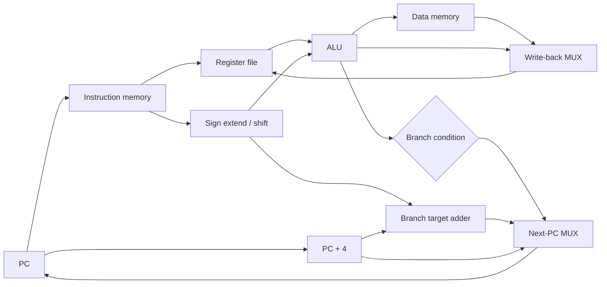
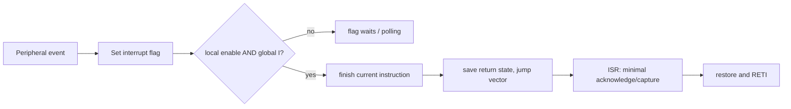

# Bismillah.

# Computer Architecture, Digital Logic, and Microprocessors — Core-Complete Viva Recall

This file treats hardware as one of your strengths. It builds one continuous story:

```text
Boolean logic -> combinational blocks -> state/flip-flops -> registers and FSMs
-> datapath and control -> instruction set -> pipeline/cache/memory -> I/O
-> microprocessor/microcontroller embedded system
```

In a viva, do not merely name components. Draw signals, state the clock/timing assumption, calculate one example, and connect the circuit to its software-visible behavior.

## Current source-scope note

The hardware folders are present and were re-read:

| Current source | Pages | Main coverage |
|---|---:|---|
| `Merged_Tanzima_Maam_Combinational_Cir.pdf` | 131 | Boolean minimization, codes, arithmetic, mux/decoder/encoder, comparators, programmable logic and hazards |
| `Merged_Adnan_Sir_Sequential_Cir.pdf` | 60 | image-dominant latches/flip-flops, sequential analysis, registers, counters, FSM reduction and asynchronous machines |
| `CSE305AllSlidesMerged.pdf` | 459 | ISA/datapath, performance, pipelining, cache and virtual memory/TLB |
| `CSE315AllMerged.pdf` | 899 | 8086 architecture/assembly, data/addressing, procedures/stack/interrupts and ATmega32 peripherals |
| `ElinSir_merged.pdf` | 192 | microprocessor/embedded-system reinforcement and laboratory-style examples |
| `Elin_Sir_Formulas.pdf` | 3 | image-formula last-pass sheet |
| **Total** | **1744** | **191 DLD + 459 Architecture + 1094 Microprocessor pages** |

The 60-page sequential-DLD PDF and 3-page formula sheet have sparse text layers, so their pages were reviewed visually rather than treated as empty.

## Part I — Digital Logic Design

## 1. Number systems and digital representation

### P0 — Positional representation

For base `r`, digits represent powers of `r`. Convert integer parts by repeated division or weighted sum; convert fractional parts by repeated multiplication or negative powers.

Hexadecimal is compact binary: one hex digit represents four bits. Octal represents three bits. Always specify bit width—`1111` can be unsigned 15 or signed two’s-complement -1.

### P0 — Unsigned and signed integers

For `n` bits:

- unsigned range: `0` to `2^n - 1`;
- two’s-complement signed range: `-2^(n-1)` to `2^(n-1)-1`.

To negate an `n`-bit two’s-complement number: invert bits and add one, discarding carry beyond width. Zero has one representation, and the negative range contains one extra value.

### P0 — Carry vs signed overflow

Carry-out indicates unsigned overflow. Signed two’s-complement overflow occurs when adding operands of the same sign produces a result of the opposite sign. Equivalent hardware test: carry into the sign bit differs from carry out.

Example in 4 bits: `0111 (7) + 0001 (1) = 1000`, which represents `-8`; signed overflow occurred even though the bit addition is valid modulo 16.

### P1 — Fixed point and floating point

Fixed point chooses an implied binary-point position; it is predictable and efficient but has limited dynamic range. IEEE-style floating point represents sign, biased exponent, and fraction/significand, with normal, subnormal, infinity, and NaN cases. Floating point provides wide dynamic range but finite precision; addition is not mathematically associative because of rounding.

### P1 — Codes

- BCD stores each decimal digit in four bits; six of sixteen patterns are invalid.
- Gray code changes one bit between adjacent values, useful when transition ambiguity matters, such as some encoders.
- ASCII/Unicode are character-encoding concepts; Unicode assigns abstract code points while UTF-8/UTF-16 encode them.
- Parity detects any odd number of bit flips but cannot correct and misses even-count changes.

## 2. Boolean algebra and logic minimization

### P0 — Fundamental operations and laws

Know identity, null, idempotent, complement, involution, commutative, associative, distributive, absorption, and De Morgan:

```text
NOT(A AND B) = (NOT A) OR (NOT B)
NOT(A OR B)  = (NOT A) AND (NOT B)
```

De Morgan is essential when implementing with NAND/NOR. NAND and NOR are **functionally complete**: any Boolean function can be built using only one of them.

### P0 — SOP, POS, minterms, maxterms

- A minterm is true for exactly one input assignment; canonical SOP is OR of selected minterms.
- A maxterm is false for exactly one assignment; canonical POS is AND of selected maxterms.
- Canonical forms include every variable in each term; minimized forms may not.

### P0 — Karnaugh map

Place cells in Gray-code adjacency. Group `1,2,4,8,...` adjacent 1s for SOP or 0s for POS, wrap around edges, use the largest useful groups, and allow overlap when it reduces literals. Don’t-care entries may be used or ignored to simplify.

A K-map gives a two-level simplification for small variable counts. It does not automatically optimize propagation delay, fan-in, hazards, or a multilevel technology mapping.

### P1 — Static hazards

A static-1 hazard briefly drops output from 1 due to unequal path delays; in an SOP network it can be removed by adding a consensus term covering adjacent 1-regions. Synchronous systems often sample after settling, but asynchronous/control signals may require hazard-free design.

## 3. Combinational circuits

### P0 — Combinational vs sequential

A combinational circuit’s output depends only on current inputs after propagation delay. A sequential circuit’s output/state depends on current inputs and stored past state.

### P0 — Half/full adder and subtractor

Half adder:

```text
sum   = A XOR B
carry = A AND B
```

Full adder:

```text
sum  = A XOR B XOR Cin
Cout = AB + Cin(A XOR B)
```

Cascade full adders for ripple-carry addition; worst-case delay grows with word width because carry ripples. Carry-lookahead computes generate/propagate relationships in parallel at greater hardware complexity.

Subtraction `A-B` can use `A + two_complement(B)`, allowing one adder-subtractor with XOR-controlled inversion and initial carry-in.

### P0 — Multiplexer

A `2^k-to-1` MUX selects one data input using `k` select bits. It can implement Boolean functions by assigning variables to select lines and wiring data inputs to constants/remaining variables. A MUX is a data selector; a demultiplexer routes one input to one selected output.

### P0 — Decoder and encoder

- Decoder: `n` input code activates one of up to `2^n` outputs, often with enable; used in address/chip select and minterm generation.
- Encoder: inverse-style operation that codes an active input; a priority encoder resolves multiple active inputs and usually exposes a valid bit.

### P1 — Comparator and ALU

A magnitude comparator determines `<`, `=`, `>`; wide comparison cascades from most significant differences. An ALU selects arithmetic/logic functions and produces flags such as zero, negative/sign, carry, and overflow. Flags must be interpreted according to signed/unsigned operation.

### Board — Implement a function

Given truth table or `F(A,B,C)=Σm(...)`:

1. write canonical SOP;
2. minimize with K-map;
3. implement using AND/OR/NOT;
4. transform to NAND-only using double negation and De Morgan;
5. discuss propagation levels and any hazard.

## 4. Sequential circuits and timing

### P0 — Latch vs flip-flop

A latch is level-sensitive: while enable is active, output can follow input. A flip-flop is edge-triggered: it samples at a clock edge. Both store state, but timing behavior differs.

### P0 — Common flip-flops

| Type | Next-state behavior |
|---|---|
| SR | set/reset; basic form has a forbidden/ambiguous combination |
| D | `Q_next = D` |
| JK | hold, reset, set, toggle; `Q_next = J*NOT(Q) + NOT(K)*Q` |
| T | hold when 0, toggle when 1; `Q_next = T XOR Q` |

Know characteristic tables (input/state to next state) and excitation tables (current/desired next state to required input). D is easiest for synthesized state machines; T is natural for counters.

### P0 — Setup, hold, and clock-to-Q

- Setup time: input must be stable before the active edge.
- Hold time: input must remain stable after it.
- Clock-to-Q: delay from sampling edge to output change.
- Combinational delay: maximum/minimum data-path delay between registers.

A simplified single-cycle timing constraint is:

```text
Tclock >= t_clk_to_Q + t_comb_max + t_setup + t_skew_margin
```

Hold is a minimum-delay constraint and cannot normally be fixed just by slowing the clock.

### P0 — Metastability

If setup/hold is violated, a flip-flop can enter a metastable analog state before resolving. It cannot be eliminated completely; synchronizer chains reduce the probability that metastability propagates when sampling an asynchronous single-bit signal. Multi-bit clock-domain crossing needs a protocol such as handshake, Gray-coded counter, or asynchronous FIFO—not independent synchronizers for every bit.

### P1 — Race-around and master-slave idea

In a level-triggered JK device with `J=K=1` and a clock pulse longer than propagation behavior, repeated toggling can make final state uncertain. Edge-triggered/master-slave structures avoid the classical race-around issue.

## 5. Registers and counters

### P0 — Registers

A register is a group of flip-flops storing a word. Shift registers move data per clock:

- SISO, SIPO, PISO, PIPO;
- bidirectional/universal shift register;
- applications include serialization, delay, sequence generation, and arithmetic shifts.

Logical shift inserts zeros; arithmetic right shift replicates sign bit for two’s-complement signed division-like behavior, with rounding caveats. Rotate wraps bits around.

### P0 — Asynchronous/ripple counter

Only the first flip-flop receives the external clock; each later stage is clocked by a previous output. Each toggling stage divides frequency by two, but transitions ripple, causing cumulative delay and temporary invalid decoded states.

For a 32 kHz clock and four actual divide-by-two stages:

```text
Q1 = 16 kHz
Q2 =  8 kHz
Q3 =  4 kHz
Q4 =  2 kHz
```

Thus **the fourth flip-flop output is 2 kHz**. The reported 4 kHz answer is the third-stage output or uses a different counting convention. Draw and label stages before answering.

### P0 — Synchronous counter

All flip-flops receive the same clock; combinational next-state logic determines which toggle. It is faster and avoids ripple accumulation, though next-state logic grows. A modulo-`M` counter needs at least `ceil(log2 M)` flip-flops and must handle unused states deliberately.

For a synchronous binary up-counter using T flip-flops:

```text
T0 = 1
T1 = Q0
T2 = Q1 Q0
T3 = Q2 Q1 Q0
```

### P1 — Ring and Johnson counters

A ring counter circulates one hot bit; `n` flip-flops give up to `n` states and simple decoding. A Johnson/twisted-ring counter feeds inverted last output to first and produces up to `2n` states. Both use more flip-flops than a binary counter but can simplify decoding/timing.

### Board — Design a modulo counter

1. determine number of flip-flops;
2. list states and desired transitions;
3. choose D/JK/T flip-flops;
4. use excitation table and K-map for input equations;
5. decide what unused states do—self-correct or reset;
6. draw clock/reset and discuss synchronous vs asynchronous reset.

## 6. Finite-state machines

### P0 — Moore vs Mealy

- Moore output depends only on state; often changes after a clock edge and is easier to keep glitch-free.
- Mealy output depends on state and current input; may respond within the cycle with fewer states, but input glitches can affect output.

Design steps:

1. define behavior/overlap policy;
2. create state diagram;
3. make state/output table;
4. minimize equivalent states if useful;
5. assign binary/one-hot encoding;
6. derive next-state/output logic;
7. verify reset and all input/state combinations.

### Board — Sequence detector

Design an overlapping detector for `101`. Explain why after recognizing `101`, the final `1` may also be the prefix of the next pattern. Produce Moore and Mealy versions and compare state count/output timing.

## Part II — Computer Architecture

## 7. Architecture, organization, and ISA

### P0 — Architecture vs organization

- **ISA/architecture:** programmer-visible contract—operations, registers, types, addressing, instruction encodings, memory/exception/privilege behavior.
- **Microarchitecture/organization:** implementation—pipeline, cache, branch predictor, buses, execution units, control logic.

Different processors can implement the same ISA with different performance/power; binaries remain compatible within defined extensions and system conventions.

### P0 — Von Neumann vs Harvard

A classic Von Neumann design uses a shared memory/address path for instructions and data; a Harvard design separates them. Modern CPUs often present a unified address space while using split L1 instruction/data caches—modified Harvard organization. The “Von Neumann bottleneck” refers to limited instruction/data transfer relative to computation.

### P0 — RISC vs CISC

RISC traditionally emphasizes regular, simple instructions, load/store operation, and easier pipelining; CISC emphasizes richer, variable-format instructions and memory operations. Modern designs blur the boundary: a CISC ISA may decode into internal micro-operations, and RISC ISAs gain extensions. Compare actual ISA and implementation, not slogans like “RISC is always faster.”

### P0 — Instruction formats and addressing modes

Fields may encode opcode, source/destination registers, immediate, and function bits. Common addressing:

- immediate;
- register;
- direct/absolute;
- register indirect;
- base + displacement;
- indexed/scaled indexed;
- PC-relative;
- stack/implied.

Effective-address calculation belongs to the ISA. PC-relative addressing supports relocatable branches; base+offset is common for stack frames/arrays/structures.

## 8. Datapath and control

### P0 — Instruction cycle

Conceptually:

```text
fetch -> decode/register read -> execute/address calculation
-> memory access if required -> write back -> next PC
```

Interrupt/exception checks and precise state rules integrate with this sequence.

### P0 — Basic datapath

Draw program counter, instruction memory/cache, register file, sign/immediate generator, ALU, data memory/cache, multiplexers, and control. For each instruction ask:

1. which values are read?
2. what ALU operation/effective address is needed?
3. is memory read/written?
4. what writes back?
5. how is next PC chosen?

### P0 — Hardwired vs microprogrammed control

Hardwired control derives control signals with logic/FSMs—fast but harder to modify for complex instruction sets. Microprogrammed control stores microinstructions in control memory—flexible/structured but adds control-store sequencing overhead. Modern CPUs may combine hardwired common paths and microcode for complex operations/patches.

### P1 — Single-cycle vs multicycle

A single-cycle design completes every instruction in one long clock, so clock period must accommodate the slowest instruction and hardware may be duplicated. A multicycle design reuses units across shorter steps with control state; instructions take different cycle counts. Pipelining overlaps steps of different instructions.

## 9. Performance analysis

### P0 — CPU-time equation

```text
CPU time = instruction count × CPI × clock cycle time
         = instruction count × CPI / clock rate
```

Clock rate alone does not determine performance. An optimization can change instruction count, CPI, and clock period. Use execution time for a defined workload.

### P0 — Latency, throughput, speedup

Latency is time for one task; throughput is tasks per unit time. Pipelining ideally improves throughput after filling, not the intrinsic latency of one instruction. Speedup is `old_time/new_time`.

### P0 — Amdahl’s law

If fraction `f` is improved by factor `s`:

```text
overall speedup = 1 / ((1-f) + f/s)
```

The unimproved fraction limits total speedup. Accelerating 90% infinitely gives at most 10×. For parallelism, clarify serial fraction and overhead; real scaling also has communication/contention.

### P1 — CPI composition

Average CPI is weighted by instruction mix plus stall contributions:

```text
CPI = base CPI + memory-stall CPI + branch-stall CPI + other stalls
```

This connects cache misses and branch prediction to execution time.

## 10. Pipelining

### P0 — Five-stage pipeline

Typical educational stages: IF, ID, EX, MEM, WB. Pipeline registers isolate stages. Ideal steady-state CPI approaches 1 for a single-issue pipeline, but fill/drain and hazards add cycles.

### P0 — Hazards

- **Structural:** two operations need same hardware resource; duplicate, multiport, or schedule it.
- **Data:** an instruction depends on another.
- **Control:** next PC uncertain due to branch/jump/exception.

In a simple in-order pipeline:

- RAW (read after write) is the main true dependency;
- WAR and WAW do not normally occur with in-order read/write stages, but appear in out-of-order execution.

Forwarding/bypassing routes a produced value directly to a later pipeline stage without waiting for register write-back. A load-use dependency may still require a bubble because data arrives after memory stage. Compiler scheduling can fill delay opportunities when ISA/compiler permits.

### P0 — Branch handling

Options include stall until resolved, predict static/dynamic, compute target early, and speculatively execute. On misprediction, wrong-path work is flushed. Deeper/wider pipelines can have larger penalties. A branch predictor predicts direction; a branch target buffer predicts/holds target; a return-address stack helps returns.

### P1 — Superscalar and out-of-order

Superscalar processors issue several instructions per cycle if dependencies/resources permit. Register renaming removes false WAR/WAW name dependencies. Out-of-order execution schedules ready operations while preserving architectural correctness, commonly committing in order through a reorder structure for precise exceptions.

### Board — Pipeline trace

Trace five instructions in a stage table. Mark a RAW dependency, forwarding path, one load-use stall, branch resolution, and flush. Calculate total cycles, not just ideal `n+k-1`.

## 11. Memory hierarchy and cache

### P0 — Why hierarchy works

Fast memory is expensive/small; large memory is slower/cheaper. Temporal and spatial locality let small upper levels serve most accesses. Typical hierarchy: registers, L1/L2/L3 caches, DRAM, SSD/HDD.

### P0 — Cache address fields

For byte-addressed memory:

```text
number of sets = cache_size / (block_size × associativity)
offset bits    = log2(block_size)
index bits     = log2(number of sets)
tag bits       = address_bits - index_bits - offset_bits
```

Example: 32-bit addresses, 32 KiB cache, 64-byte block, 4-way:

```text
sets = 32768/(64×4)=128
offset=6, index=7, tag=19 bits
```

### P0 — Mapping organizations

- Direct mapped: one possible line per block; simple/fast, more conflict misses.
- Fully associative: any line; minimal mapping conflict, expensive lookup/replacement.
- Set associative: block maps to one set and any way in it; practical compromise.

Miss types: compulsory/cold, capacity, and conflict; coherence misses are added in multiprocessors. Increasing associativity mainly reduces conflict misses but can affect hit time/energy.

### P0 — Write policy

- Write-through: update next level on every hit, usually with write buffer; simpler coherence/durability path but more traffic.
- Write-back: update cached block and mark dirty; write to next level on eviction; reduces traffic but complicates replacement/coherence.
- Write-allocate: on write miss fetch block then write, common with write-back.
- No-write-allocate/write-around: write lower level without filling, often paired with write-through.

### P0 — AMAT

```text
AMAT = hit time + miss rate × miss penalty
```

For multiple levels, expand miss penalty recursively. Use rates conditional on reaching that level. A small miss-rate reduction can dominate if penalty is large.

### P1 — Replacement and prefetching

LRU is feasible only approximately/at low associativity; pseudo-LRU, random, and adaptive policies are common. Prefetching can hide latency but may waste bandwidth, pollute cache, or fetch unused data.

### P0 — Cache coherence

Private multicore caches may hold copies. Coherence protocols maintain per-block write serialization/visibility, often with states such as Modified, Exclusive, Shared, Invalid. **False sharing** occurs when independent variables on the same cache line cause coherence traffic. Coherence does not itself provide correct synchronization or a simple global ordering of all memory operations.

## 12. Main memory and virtual memory interface

### P1 — SRAM vs DRAM vs nonvolatile storage

SRAM uses bistable cells, is fast and no refresh but larger/costlier—used for caches. DRAM stores charge, needs refresh, is dense—used for main memory. Flash is nonvolatile with erase/write constraints—used for storage and embedded program memory.

### P1 — DRAM organization

DRAM is organized into channels, ranks, banks, rows, and columns. A row buffer makes accesses to an open row faster; controllers schedule requests for locality and timing constraints. Bandwidth and latency are distinct.

### P0 — Cache vs TLB vs page table

- Cache maps physical or virtual-address-related blocks to cached **data/instructions**.
- TLB caches recent **address translations/permissions**.
- Page table is the authoritative in-memory translation/protection structure managed by OS/hardware.

A TLB miss can be a page-table hit; a cache miss can occur with a TLB hit; a page fault is much more expensive and enters the OS.

## 13. I/O, buses, and interrupts

### P0 — Bus/interconnect concepts

An interconnect carries addresses/requests, data, and control/response. Key issues are width, bandwidth, arbitration, synchronous/asynchronous timing, latency, protocol, and multiple masters. Modern systems use point-to-point packetized interconnects as well as traditional buses.

### P0 — Memory-mapped vs isolated I/O

Memory-mapped I/O gives device registers addresses in the normal address space and uses load/store instructions; regions require special ordering/cache attributes. Isolated/port-mapped I/O uses a separate address space and instructions. MMIO pointers must be treated with the platform/language’s volatile and ordering rules, but `volatile` alone does not create thread synchronization.

### P0 — Polling, interrupt, and DMA

- Polling repeatedly reads status—low setup, wastes CPU for long waits.
- Interrupt lets a device notify CPU—better for infrequent events, incurs handler/context overhead.
- DMA moves blocks between device and memory after CPU setup—efficient for bulk transfer; coherence, pinning/mapping, and completion must be managed.

### P0 — Interrupt sequence

Device asserts request; controller prioritizes/masks and supplies vector or cause; CPU completes/precisely stops at an architectural boundary, saves context, enters privileged handler, acknowledges/services source, and returns. Exact sequence is architecture-specific.

- Maskable interrupts can be disabled/prioritized.
- Non-maskable interrupts are reserved for critical events.
- Exceptions are synchronous; interrupts are normally asynchronous.

### P1 — Interrupt latency

Latency includes current-instruction completion, masking/priority, pipeline effects, context save, handler dispatch, and higher-priority work. Real-time design bounds the worst case, keeps ISRs short, and defers substantial work.

## Part III — Microprocessors and Microcontrollers

## 14. Microprocessor, microcontroller, and SoC

### P0 — Precise comparison

| Microprocessor | Microcontroller |
|---|---|
| CPU-centric, often requires external RAM/storage/peripherals | CPU + flash/RAM + GPIO/timers/serial/ADC on one chip |
| General-purpose/high-performance systems | Embedded control, deterministic I/O, low power/cost |
| Rich OS/MMU/cache often expected | May run bare-metal or RTOS; capabilities vary |
| Flexible large memory/system expansion | Integrated but resource-limited |

A system-on-chip integrates one or more processors plus controllers/accelerators/interconnect and may be far more capable than a traditional MCU. Categories overlap; compare a specific device and application.

### P0 — Why can a microcontroller be cheap?

System-level integration reduces chip count, PCB area, external buses, power circuitry, packaging, assembly, and memory requirements. Simpler cores, modest clocks, small on-chip memories, mature fabrication nodes, and enormous volume also help. A high-end MCU can cost more than a low-end microprocessor, so “always cheaper” is wrong.

### P0 — Minimum embedded system

An MCU-based design needs suitable clock/reset, power/decoupling, programming/debug path, and application I/O. Firmware configures pin multiplexing, direction, pull-ups, timers, interrupts, and peripherals. Watchdog and brown-out reset improve resilience.

## 15. Processor registers, stack, and assembly reasoning

### P0 — Register categories

- general-purpose/data registers;
- program counter/instruction pointer;
- stack pointer;
- status/flags register;
- control/system registers;
- index/base/address registers depending on ISA.

Calling conventions specify argument/return registers, caller/callee-saved registers, stack alignment, return address, and stack-frame rules. They are an ABI/software convention layered on the ISA.

### P0 — Stack operation

The stack supports calls, returns, local storage, saved registers, and interrupt context. Stack direction and whether SP points to last-used/next-free are ISA-specific. A buffer overflow can corrupt control data when protection/compiler/runtime controls fail; stack and heap are memory-management regions, not different physical memory technologies.

### P1 — Assembly trace

When given code:

1. write initial register/memory values;
2. determine operand width and signedness;
3. calculate effective address;
4. update destination;
5. update only flags defined by the instruction;
6. follow branch condition precisely.

Do not infer high-level types that assembly does not carry.

## 16. Classic 8086 concepts

### P1 — Why 20-bit address from 16-bit registers?

On the original 8086, the address adder forms `segment << 4` plus the offset and the 20-bit address bus exposes the low 20 bits:

```text
physical = (segment × 16 + offset) mod 2^20
```

Thus ordinary real-mode addresses cover a 1 MiB space. If the arithmetic exceeds `FFFFFh`, the original 8086 discards the carry and wraps; for example, `FFFFh:0010h` wraps to physical `00000h`. Later x86 systems can expose addresses just above 1 MiB when the A20 line is enabled, but that is not the classic 8086-bus answer. Segments can overlap; many segment:offset pairs name the same physical address. Typical segment registers are CS, DS, SS, ES with IP and offset/index registers.

Example: `1234h:0010h -> 12340h + 0010h = 12350h`.

### P1 — BIU and EU

The Bus Interface Unit fetches instructions, forms physical addresses, and handles bus activity; the Execution Unit decodes/executes using registers/ALU. The prefetch queue overlaps fetch and execution, an early pipeline-like optimization. A control transfer flushes/refills the queue.

### P1 — Interrupts

8086 supports hardware/software/internal exceptions through an interrupt vector table. On interrupt, it saves flags and return location, adjusts interrupt/trap control as defined, loads handler CS:IP, then `IRET` restores. Exact signal/vector behavior distinguishes NMI, INTR, software `INT`, and exceptions.

## 17. Microcontroller peripherals

### P0 — GPIO

GPIO pin configuration includes input/output mode, pull-up/down, drive type/strength, alternate function, and sometimes open-drain. A floating digital input can produce unpredictable transitions and power use; a pull resistor defines idle level.

### P0 — Timer/counter and PWM

A timer counts internal clock ticks; a counter may count external events. Prescaler divides clock. Compare registers can generate interrupt or output transitions. PWM represents duty cycle:

```text
duty = high_time / period
```

Used for motor power, LED brightness, and DAC-like filtering. Frequency and resolution trade off for a fixed timer clock/counter width.

### P0 — ADC and DAC

An `n`-bit ADC ideally maps the reference range into `2^n` codes; nominal LSB size is about `Vref/2^n` depending on endpoint convention. Accuracy also depends on reference, noise, sampling time, input impedance, offset/gain error, INL/DNL, and effective number of bits. Sampling must respect signal bandwidth/anti-aliasing; Nyquist’s rate condition alone does not build the filter.

### P0 — UART, SPI, and I2C

| UART | SPI | I2C |
|---|---|---|
| asynchronous, TX/RX, agreed baud/frame | synchronous, clock + data + chip select, full duplex | two-wire open-drain clock/data, addressed shared bus |
| point-to-point/common serial | high speed, more select wires | multi-device, arbitration/ACK, pull-ups |

UART uses start/data/optional parity/stop framing and no shared clock. SPI modes depend on clock polarity/phase. I2C devices use start/stop, address, ACK/NACK; open-drain outputs require pull-ups and allow wired arbitration.

### P0 — Watchdog

A watchdog timer resets or interrupts the system unless software services it within a window. Service it only after confirming critical tasks are healthy; blindly kicking it from an unrelated timer hides failures.

### P1 — Debouncing

Mechanical switches bounce, producing rapid transitions. Debounce with RC/Schmitt hardware or software sampling/time validation. An ISR should not normally busy-wait through the entire debounce interval.

### P1 — Bare metal vs RTOS

Bare-metal superloop is simple and low overhead but becomes difficult as concurrency/timing grows. An RTOS provides tasks, priorities, timers, queues, semaphores, and scheduling, but introduces context switching, stack sizing, priority inversion, and concurrency design. Hard real-time means provable deadlines, not simply using an RTOS.

## 18. Hardware/software co-design and reliability

### P1 — Choosing hardware

Consider computation, memory, I/O/peripherals, deadline/latency, power/energy, cost, environment, certification, security, toolchain, lifecycle, and supply. “Fastest CPU” may increase cost/power without solving ADC accuracy or real-time response.

### P1 — Reset and clock-domain design

Power-on reset initializes a known state. Asynchronous assertion with synchronous deassertion is common because release near a clock edge can violate timing. Clock gating saves dynamic power but must avoid glitches; use dedicated cells/enables rather than arbitrary combinational clock logic.

### P1 — Faults and protections

- brown-out detector for low voltage;
- watchdog for stalled software;
- ECC/parity for memory/data integrity;
- CRC for communication/storage error detection;
- MPU/MMU for region/process protection;
- secure boot verifies authorized firmware;
- debug-port locking and key protection;
- redundancy/fail-safe state for safety requirements.

Security and safety overlap but differ: safety protects people/environment from accidental failure; security handles malicious behavior. A secure design can still be unsafe and vice versa.

## 19. Board-ready exercises

1. Minimize a four-variable Boolean function using K-map; implement NAND-only.
2. Build a full adder from half adders and derive carry.
3. Convert JK/T excitation requirements into a modulo-6 synchronous counter.
4. Draw an overlapping `101` Moore/Mealy detector.
5. Calculate four-stage ripple-counter frequencies from 32 kHz.
6. Draw a single-cycle datapath for load, store, arithmetic, and branch.
7. Trace pipeline hazards with forwarding, one load stall, and a branch flush.
8. Calculate CPU time/CPI and apply Amdahl’s law.
9. Split cache address into tag/index/offset and calculate AMAT.
10. Trace polling vs interrupt vs DMA for an input device.
11. Compute an 8086 segment:offset physical address and identify registers.
12. Configure conceptually an MCU timer for periodic interrupt/PWM.
13. Compare UART, SPI, and I2C for a sensor and justify one.

## 20. High-yield comparisons

| Pair | Strong distinction |
|---|---|
| Combinational vs sequential | current inputs only vs stored state/history |
| Latch vs flip-flop | level-sensitive vs edge-triggered |
| Synchronous vs ripple counter | shared clock/parallel transition vs chained clocks/delay |
| Moore vs Mealy | output from state vs state + input |
| Carry vs overflow | unsigned width overflow vs signed range error |
| Architecture vs organization | programmer contract vs implementation |
| RISC vs CISC | design traditions, not universal speed ranking |
| Single-cycle vs pipeline | one long cycle per instruction vs overlapped stages |
| Latency vs throughput | time per task vs tasks per time |
| RAW vs WAR/WAW | true dependency vs name dependencies |
| Direct vs associative cache | one location vs many possible locations |
| Write-through vs write-back | immediate lower update vs dirty eviction |
| Cache vs TLB | data/instructions vs address translations |
| Polling vs interrupt | repeated checking vs device notification |
| Interrupt vs exception | asynchronous external vs synchronous instruction-related |
| Microprocessor vs MCU | CPU-centric system vs integrated embedded controller |
| UART vs SPI vs I2C | async point link vs synchronous selected bus vs addressed two-wire bus |

## 21. Rapid oral questions

1. **Why is XOR useful in an adder?** It produces sum without carry for two bits; parity-like odd-one behavior extends with carry-in.
2. **Can NAND build NOT?** Tie inputs together: `NAND(A,A)=NOT A`.
3. **Why Gray code in an encoder?** Adjacent positions change one bit, reducing ambiguous multi-bit transitions.
4. **Does K-map always give globally best hardware?** It minimizes two-level literals for small functions, not every timing/technology objective.
5. **Why not gate a clock with ordinary AND logic?** Glitches/skew can create unintended edges; use clock-enable/dedicated gating structures.
6. **Can metastability be eliminated?** No; probability can be reduced to an acceptable level with proper CDC design.
7. **Why is synchronous counter faster?** All state elements share the edge; logic delay does not accumulate through clocked stages.
8. **How many flip-flops for modulo 10?** At least 4 because `2^3<10<=2^4`; handle six unused states.
9. **Why can Mealy need fewer states?** Output can depend directly on input rather than encoding response in a separate state.
10. **Does higher clock rate mean faster CPU?** Not alone; instruction count and CPI matter.
11. **Why can a pipeline be slower for one instruction?** Pipeline-register overhead and stage partitioning can increase individual latency even as throughput improves.
12. **What is a precise exception?** Architectural state appears as if all older instructions completed and no younger instruction did.
13. **What does forwarding solve?** Many RAW hazards by routing result before register write-back; not all timing cases such as immediate load-use.
14. **What is false sharing?** Different cores update independent data sharing one cache line, causing coherence invalidations.
15. **Why is fully associative cache expensive?** A tag may need comparison against every line/way and replacement tracking.
16. **Does write-back lose data?** Dirty data is vulnerable to failures before reaching durable storage; systems define persistence and protection separately.
17. **Why use DMA?** Bulk transfer without CPU copying each word, improving CPU availability and throughput.
18. **Why does an MCU still need decoupling capacitors?** Local transient current and supply-noise control for reliable switching.
19. **Can UART devices communicate at arbitrary different baud rates?** They must agree closely enough on baud and framing for sampling tolerance.
20. **Why is I2C open-drain?** Devices can safely share lines, acknowledge, and arbitrate without driving opposite levels; pull-ups restore high.

## 22. Common wrong answers

- “Digital 0 and 1 are exactly 0 V and 5 V.” They are logic ranges depending on technology/supply.
- “Sequential circuits always need a clock.” Asynchronous sequential circuits exist; synchronous design is dominant.
- “Four flip-flops at 32 kHz output 4 kHz.” The fourth divide-by-two output is 2 kHz; label counting.
- “Asynchronous counters are faster.” Ripple delay makes them slower for larger/high-speed designs.
- “A microprocessor has no memory.” It has registers/caches; the distinction is system integration, not absolute absence.
- “Microcontrollers are always 8-bit and slow.” Modern MCUs include powerful 32/64-bit cores, DSP, accelerators, and rich peripherals.
- “RISC uses fewer instructions in a program.” It means a design philosophy; dynamic instruction count can be greater or smaller.
- “Pipelining reduces execution time of every instruction.” It mainly increases throughput.
- “Cache stores the most recently used data only.” Placement and replacement policy approximate locality under constraints.
- “Virtual memory and cache are the same.” One is address abstraction/protection/capacity management; the other is mainly speed hierarchy.
- “Interrupt is always faster than polling.” High-rate/tiny work can make polling efficient; workload matters.
- “DMA means CPU is uninvolved.” CPU/driver sets up, synchronizes, maps buffers, and handles completion/errors.
- “An RTOS makes a system real-time.” Schedulability and bounded worst-case behavior do.

## 23. DLD Slide Additions: Minimization, Arithmetic, PLDs, and Asynchronous Machines

### 23.1 Quine–McCluskey tabulation

K-maps are practical for a few variables; Quine–McCluskey systematizes two-level minimization:

1. list minterms in binary and group by number of `1` bits;
2. combine terms in adjacent groups that differ in one position, replacing it by `-`;
3. repeat on newly formed implicants; mark every combined term;
4. uncombined terms are **prime implicants**;
5. build a prime-implicant chart: rows are prime implicants, columns are required minterms;
6. select **essential** prime implicants (a column covered by only one row);
7. cover remaining columns with a minimum-cost set, using inspection or Petrick's method.

Example:

```text
0000 (m0) and 0001 (m1) -> 000-
0001 (m1) and 0011 (m3) -> 00-1
```

Two implicants combine only when their dash positions match and exactly one remaining bit differs. Do not combine terms differing in two positions. Tabulation can grow exponentially; it is exact for two-level cost criteria, not a guarantee of the best multilevel physical circuit.

### 23.2 Static hazards and the consensus term

In a two-level SOP, a **static-1 hazard** can occur when output should remain 1 while one variable changes but the two covering product paths have unequal delay. The consensus theorem is:

$$XY+\bar XZ+YZ=XY+\bar XZ.$$

Logically `YZ` is redundant, but physically adding it bridges the transition and can remove the static-1 hazard:

$$F=XY+\bar XZ\quad\longrightarrow\quad F_h=XY+\bar XZ+YZ.$$

Static-0 hazards are dual in POS circuits. Dynamic hazards involve multiple output changes and generally require multilevel-delay analysis. Synchronous systems often sample after settling, but asynchronous/control/clock paths require explicit hazard discipline.

### 23.3 Carry lookahead and BCD addition

Using $G_i=A_iB_i$ and $P_i=A_i\oplus B_i$:

$$C_{i+1}=G_i+P_iC_i.$$

Expansion avoids waiting for a ripple:

$$
\begin{aligned}
C_1&=G_0+P_0C_0,\\
C_2&=G_1+P_1G_0+P_1P_0C_0,\\
C_3&=G_2+P_2G_1+P_2P_1G_0+P_2P_1P_0C_0.
\end{aligned}
$$

Carry lookahead trades more gates/fan-in/wiring for shorter carry depth; large adders use hierarchical groups.

For one BCD digit, first add the two 4-bit digits and carry-in. If the binary result exceeds `1001` or produces a carry, add `0110`. A common correction detector for intermediate bits $S_3S_2S_1S_0$ and carry $C_4$ is

$$K=C_4+S_3S_2+S_3S_1.$$

### 23.4 Multipliers, comparators, code/parity blocks

An unsigned shift-add multiplier examines each multiplier bit: if bit $i=1$, add multiplicand shifted by $i$. An $n\times n$ combinational array uses partial products $a_jb_i$ and adder rows; it is fast but area-heavy. Sequential multiplication reuses an adder over cycles.

For an equality comparator:

$$A=B=\bigwedge_i(A_i\ \text{XNOR}\ B_i).$$

For magnitude, compare from the most significant differing bit. Cascaded comparator inputs propagate “less/equal/greater” from less significant groups.

- Binary-to-Gray: $G_{n-1}=B_{n-1}$ and $G_i=B_{i+1}\oplus B_i$.
- Gray-to-binary: $B_{n-1}=G_{n-1}$ and $B_i=B_{i+1}\oplus G_i$.
- Even parity bit: $p=d_0\oplus d_1\oplus\cdots$ so total XOR becomes 0.

### 23.5 Decoder, MUX, tri-state, ROM, PLA, and PAL

- An $n$-to-$2^n$ decoder generates minterms; OR selected outputs to realize an SOP.
- A $2^n$-to-1 MUX uses variables as selects and data inputs as constants/remaining-variable functions.
- A tri-state output can be `0`, `1`, or high impedance `Z`; only one enabled driver may own a shared line unless the electrical scheme explicitly supports otherwise.
- ROM has fixed decoding and programmable output contents.
- PLA has programmable AND and OR planes—flexible shared product terms.
- PAL traditionally has programmable AND and fixed OR—simpler/faster but less flexible.

### 23.6 Sequential analysis, reduction, and incompletely specified machines

For a synchronous sequential circuit:

1. write flip-flop input equations from combinational logic;
2. use characteristic equations to derive next-state bits;
3. derive output equations;
4. build state table and state diagram;
5. identify unreachable states and verify recovery.

Characteristic/excitation recall:

| FF | Characteristic next state | Required excitation |
|---|---|---|
| D | $Q^+=D$ | $D=Q^+$ |
| T | $Q^+=Q\oplus T$ | $T=Q\oplus Q^+$ |
| JK | $Q^+=J\bar Q+\bar KQ$ | `0→0: J=0`; `0→1: J=1`; `1→0: K=1`; `1→1: K=0` |

Two states of a completely specified Moore machine are equivalent if they produce the same output and their next states under every input are equivalent. Partition refinement:

```text
partition by output
repeat split any block whose states transition to different blocks
until no block changes
```

For an incompletely specified machine, states may be **compatible** even if not fully equivalent: specified outputs do not conflict and implied successor pairs are compatible. Use implication/compatibility tables, maximal compatibles and a closed cover; compatibility is not always transitive.

### 23.7 Asynchronous sequential circuits: races and flow tables

An asynchronous circuit changes state as inputs/propagation permit—there is no global sampling edge. A **race** occurs when multiple state variables should change and path delays determine the visited/final state. A race is **critical** if final stable state depends on order; otherwise noncritical.

Design steps in fundamental mode:

1. permit only one external input change at a time and wait for stability;
2. construct primitive flow table;
3. reduce compatible rows;
4. assign binary states to avoid critical races, adding intermediate states if needed;
5. derive excitation/output logic and remove essential hazards.

Fundamental-mode assumptions are part of correctness; violating them can invalidate the design.

## 24. MIPS-Style ISA and Single-Cycle Datapath

### 24.1 Instruction formats

```text
R: op[31:26] rs[25:21] rt[20:16] rd[15:11] shamt[10:6] funct[5:0]
I: op[31:26] rs[25:21] rt[20:16] immediate[15:0]
J: op[31:26] target[25:0]
```

- `add rd,rs,rt`: `R[rd]=R[rs]+R[rt]`.
- `lw rt,imm(rs)`: address=`R[rs]+signext(imm)`; read memory into `rt`.
- `sw rt,imm(rs)`: write `R[rt]` to that address.
- `beq rs,rt,label`: if equal, branch to `PC+4+(signext(imm)<<2)`.
- `j target`: combine upper bits of `PC+4` with `target<<2` in the classic 32-bit MIPS encoding.

The immediate is sign-extended for arithmetic/address/branch operations; logical immediates use zero extension in the relevant instructions.

### 24.2 Datapath story



Single-cycle control summary (`X` means don't care):

| Instruction | RegDst | ALUSrc | MemtoReg | RegWrite | MemRead | MemWrite | Branch | ALUOp idea |
|---|---:|---:|---:|---:|---:|---:|---:|---|
| R-type | 1 | 0 | 0 | 1 | 0 | 0 | 0 | use `funct` |
| `lw` | 0 | 1 | 1 | 1 | 1 | 0 | 0 | add |
| `sw` | X | 1 | X | 0 | 0 | 1 | 0 | add |
| `beq` | X | 0 | X | 0 | 0 | 0 | 1 | subtract/compare |

The clock period must accommodate the slowest instruction path, usually load: instruction memory → register read → ALU → data memory → register setup. That simplicity wastes time for short instructions and motivates multicycle/pipelined designs.

### 24.3 Assembly loop example

C:

```c
int sum = 0;
for (int i = 0; i < n; ++i) sum += a[i];
```

MIPS-like:

```asm
    add  $t0, $zero, $zero    # i = 0
    add  $t1, $zero, $zero    # sum = 0
loop:
    beq  $t0, $a1, done
    sll  $t2, $t0, 2          # byte offset i*4
    add  $t3, $a0, $t2
    lw   $t4, 0($t3)
    add  $t1, $t1, $t4
    addi $t0, $t0, 1
    j    loop
done:
    add  $v0, $t1, $zero
```

Know which registers conventionally carry arguments/results/temporaries/saved values, but a calling convention is an ABI agreement rather than an ISA law.

## 25. Pipeline, Cache, and Virtual-Memory Calculation Cards

### 25.1 Five-stage pipeline control

`IF → ID → EX → MEM → WB`. Pipeline registers hold both data and the control bits needed later.

For:

```asm
lw  $t0, 0($s0)
add $t1, $t0, $s1
sub $t2, $t1, $s2
```

- load value appears after MEM, too late for the next instruction's EX input in the classic timing; insert one bubble even with forwarding;
- forward the `add` result from an EX/MEM or MEM/WB path to the `sub`;
- detect load-use when ID/EX is a load and its destination matches an IF/ID source;
- on a taken branch resolved later, squash younger wrong-path instructions.

Pipeline ideal cycles for $N$ instructions and $k$ stages are $N+k-1$; stalls/flushes add cycles:

$$CPI_{\text{actual}}=CPI_{\text{ideal}}+\text{stall cycles/instruction}.$$

### 25.2 Cache fields and miss equations

For capacity $C$, block size $B$, associativity $A$:

$$\text{sets}=\frac{C}{BA},\quad
b=\log_2B,\quad s=\log_2(\text{sets}),\quad
t=\text{address bits}-s-b.$$

Example: 32 KiB, 64-byte blocks, 4-way, 32-bit addresses:

$$\text{sets}=\frac{32768}{64\cdot4}=128,\quad
b=6,\ s=7,\ t=19.$$

Average memory access time:

$$AMAT=T_{hit}+MR\cdot MP.$$

For multiple levels:

$$AMAT=T_{L1}+MR_{L1}(T_{L2}+MR_{L2}MP_{memory}).$$

Distinguish compulsory, capacity and conflict misses; coherence misses appear in multiprocessors. Larger blocks exploit spatial locality but increase miss penalty/pollution and reduce number of lines.

### 25.3 Page translation and TLB

For virtual page number `VPN` and page offset:

```text
VA = VPN | offset
TLB hit: VPN -> PPN
PA = PPN | same offset
```

On a TLB miss, hardware/software walks page tables. A valid present PTE refills the TLB; a not-present mapping causes a page fault and OS intervention. Protection is checked during translation.

Ignoring overlap and using TLB lookup time $t_T$, memory time $t_M$, hit rate $h$, one-level page table:

$$EAT=h(t_T+t_M)+(1-h)(t_T+2t_M),$$

before adding page-fault probability. Because a page fault may cost milliseconds, even a tiny fault rate can dominate.

### 25.4 x86 protected-mode segmentation and two-level paging

The three-page microprocessor formula note distinguishes **logical**, **linear**, and **physical** addresses. In protected mode, a logical address is a segment selector plus an offset. A 16-bit selector has:

```text
15                    3 2  1 0
+----------------------+----+--+
| descriptor-table index | TI |RPL|
+----------------------+----+--+
```

- `index`: selects an 8-byte descriptor;
- `TI=0`: Global Descriptor Table (GDT), `TI=1`: Local Descriptor Table (LDT);
- `RPL`: requested privilege level.

Ignoring descriptor caching for the explanation,

$$
\text{descriptor address}
=
\begin{cases}
\text{GDTR.base}+8(\text{index}), & TI=0,\\
\text{LDTR-table base}+8(\text{index}), & TI=1.
\end{cases}
$$

The descriptor supplies the segment base, limit, type and privilege/access bits. After limit and privilege checks,

$$\text{linear address}=\text{descriptor.base}+\text{offset}.$$

If paging is disabled, the linear address is the physical address. With classic 32-bit, two-level 4 KiB paging, split the 32-bit linear address as:

```text
31            22 21            12 11             0
+---------------+----------------+-----------------+
| directory (10)| page table (10)| byte offset (12)|
+---------------+----------------+-----------------+
```

`CR3` gives the page-directory base. A 10-bit directory index chooses one of $2^{10}=1024$ page-directory entries; the selected PDE gives a page-table base; the next 10 bits choose one of 1024 PTEs; the PTE gives the page-frame base. Since a page is $2^{12}=4096$ bytes,

$$\text{physical address}=(\text{page-frame number}\ll12)+\text{offset}.$$

Each 4-byte table has $1024\times4=4096$ bytes, exactly one page. Present, writable, user/supervisor and related control bits are checked along the walk. A TLB hit skips the memory-resident walk but does not change the translation or protection semantics.

**Do not mix the two modes:** real-mode 8086 uses `segment << 4 + offset`; protected mode uses a selector to locate a descriptor, then adds the descriptor base, and may subsequently page the resulting linear address.

## 26. 8086 Architecture and Assembly Recall

### 26.1 Programmer-visible registers

- General: `AX`, `BX`, `CX`, `DX`, each split into high/low bytes.
- Pointer/index: `SP`, `BP`, `SI`, `DI`.
- Segments: `CS`, `DS`, `SS`, `ES`.
- Instruction pointer: `IP`.
- Flags: `CF PF AF ZF SF TF IF DF OF` plus reserved bits.

The Bus Interface Unit (BIU) forms addresses, fetches instructions through a prefetch queue and handles bus operations; the Execution Unit decodes/executes using ALU/registers. Fetch/execute overlap improves throughput but a branch flushes the queue.

### 26.2 Segmented physical addresses

$$\text{physical address}=16\times\text{segment}+\text{offset}
=(\text{segment}\ll4)+\text{offset}.$$

Example:

$$1234_h:5678_h\rightarrow12340_h+5678_h=179B8_h.$$

Different pairs can name the same byte because segments overlap. Classic 8086 has a 20-bit address bus (1 MiB address space) while registers are 16 bits.

Default pairs:

- instruction fetch: `CS:IP`;
- stack: `SS:SP`, and BP-based addresses normally default to `SS`;
- most data: `DS` plus effective address;
- string destination: `ES:DI`, source often `DS:SI`.

### 26.3 Addressing modes

```asm
mov ax, bx              ; register
mov ax, 1234h           ; immediate
mov ax, [1234h]         ; direct memory offset
mov ax, [bx]            ; register indirect
mov ax, [bx+si]         ; based-indexed
mov ax, [bp+di+8]       ; based-indexed + displacement, SS default
```

Memory-to-memory ordinary `MOV` is generally not allowed (string instructions are special). Operand size must be inferable or specified.

### 26.4 Arithmetic, flags, branches, and a loop

`CMP a,b` performs `a-b` only to set flags. For unsigned comparisons use CF/ZF-based conditions (`JA/JB` families); for signed comparisons use SF/OF/ZF (`JG/JL` families). Mixing them gives wrong answers around the sign bit.

Sum `1..N`:

```asm
; input: CX = N, output: AX = sum (assuming it fits 16 bits)
xor ax, ax
test cx, cx
jz   done
again:
add  ax, cx
loop again              ; CX <- CX-1; jump if CX != 0
done:
```

For unsigned multiplication, `MUL r/m16` multiplies `AX` by the operand and returns `DX:AX`; `DIV r/m16` divides `DX:AX`, placing quotient in `AX`, remainder in `DX`. `IMUL/IDIV` are signed.

### 26.5 Stack, procedure, and interrupt

The stack grows toward lower addresses. A 16-bit `PUSH` decrements `SP` by 2 then stores; `POP` loads then increments. `CALL` pushes return IP (and CS for far call), then transfers; `RET` restores return address.

```asm
sum2 proc near
    push bp
    mov  bp, sp
    mov  ax, [bp+4]      ; first stack argument under this convention
    add  ax, [bp+6]
    pop  bp
    ret
sum2 endp
```

The exact argument offsets depend on push order, near/far call, saved registers and ABI; draw the stack before answering.

For an interrupt, the CPU saves `FLAGS`, `CS`, `IP`, clears trap/interrupt enable as specified, and loads the handler address from the interrupt-vector table. 8086 IVT begins at physical 0; vector type $n$ occupies four bytes at $4n$: offset then segment. `IRET` restores `IP`, `CS`, and `FLAGS`. An interrupt is asynchronous hardware/software service; an exception arises synchronously from the current instruction (terminology varies by architecture).

## 27. ATmega32 / AVR Embedded Recall

### 27.1 Core and register model

ATmega32 is an 8-bit AVR microcontroller with separate program/data address spaces (Harvard-style), 32 general-purpose 8-bit registers `R0..R31`, flash, SRAM, EEPROM, GPIO, timers, ADC and serial peripherals. Register pairs `X=R27:R26`, `Y=R29:R28`, `Z=R31:R30` support indirect addressing.

`SREG` flags include:

```text
I T H S V N Z C
```

`I` globally enables maskable interrupts; `C/Z/N/V/S/H` reflect arithmetic. The stack pointer lives in I/O registers and should be initialized by startup/runtime before calls/interrupts.

### 27.2 GPIO

For port `B`:

- `DDRB` bit 1 = output, 0 = input;
- `PORTB` writes output value; on an input, writing 1 enables internal pull-up;
- `PINB` reads pin state.

```c
#include <avr/io.h>

int main(void) {
    DDRB |=  (1u << PB0);      // LED output
    DDRD &= ~(1u << PD2);      // button input
    PORTD |= (1u << PD2);      // enable pull-up

    for (;;) {
        if (!(PIND & (1u << PD2))) PORTB |=  (1u << PB0);
        else                       PORTB &= ~(1u << PB0);
    }
}
```

With a pull-up, pressed-to-ground reads 0; forgetting active-low polarity is a frequent lab/viva error.

### 27.3 Timers, CTC, and PWM

Timer tick:

$$f_{tick}=\frac{f_{CPU}}{N},\qquad
T_{overflow}=\frac{N(TOP+1)}{f_{CPU}}.$$

For CTC interrupt at `OCR`:

$$f_{interrupt}=\frac{f_{CPU}}{N(1+OCR)}.$$

Example: $f_{CPU}=8$ MHz, prescaler 64, desired 1 kHz:

$$OCR=\frac{8\,000\,000}{64\cdot1000}-1=124.$$

```c
OCR0 = 124;
TCCR0 = (1u << WGM01) | (1u << CS01) | (1u << CS00); // CTC, /64
TIMSK |= (1u << OCIE0);
sei();
```

PWM changes average delivered power/duty without analog output. In 8-bit fast PWM, duty is approximately `(OCR+1)/256` under the chosen polarity/mode; state exact mode because formulas differ for phase-correct PWM and toggle output.

### 27.4 ADC

For an ideal $n$-bit ADC:

$$code\approx\operatorname{round}\left(\frac{V_{in}}{V_{ref}}(2^n-1)\right),\qquad
LSB\approx\frac{V_{ref}}{2^n}.$$

ATmega32 ADC is 10-bit. Select reference/channel in `ADMUX`, enable and choose prescaler in `ADCSRA`, start with `ADSC`, wait for completion/flag, then read low/high result in the documented order.

```c
ADMUX  = (1u << REFS0);                         // AVCC reference, ADC0
ADCSRA = (1u << ADEN) | (1u << ADPS2) |
         (1u << ADPS1) | (1u << ADPS0);        // enable, /128
ADCSRA |= (1u << ADSC);
while (ADCSRA & (1u << ADSC)) { }
uint16_t sample = ADC;
```

Choose ADC clock in the datasheet's accuracy range; source impedance, reference decoupling, acquisition time and noise matter beyond the formula.

### 27.5 UART

Asynchronous normal-speed baud setting:

$$UBRR\approx\frac{f_{CPU}}{16\,baud}-1.$$

```c
static void uart_init(uint16_t ubrr) {
    UBRRH = (uint8_t)(ubrr >> 8);
    UBRRL = (uint8_t)ubrr;
    UCSRB = (1u << RXEN) | (1u << TXEN);
    UCSRC = (1u << URSEL) | (1u << UCSZ1) | (1u << UCSZ0); // 8N1
}

static void uart_putc(uint8_t c) {
    while (!(UCSRA & (1u << UDRE))) { }
    UDR = c;
}
```

The achieved baud differs after integer rounding; calculate percentage error and ensure both endpoints' combined clock error remains tolerable.

### 27.6 Interrupt discipline



An ISR should be short, bounded, nonblocking, and share data with main code using `volatile` plus atomic/critical-section rules appropriate to data width. Clear flags according to the device's exact write-one-to-clear/read sequence; an incorrect generic assignment can lose events.

## 28. Current Hardware Source Ledger

| Folder | Pages | Material retained |
|---|---:|---|
| 205-DLD | 191 | number/codes, Boolean algebra/K-map/Quine–McCluskey, combinational arithmetic/data selectors/PLDs/hazards; latches/FFs, analysis, registers/counters, Moore/Mealy, reduction/compatibility, asynchronous flow tables/races |
| 305-CA | 459 | ALU and MIPS-style ISA/datapath/control, performance/CPI/Amdahl, pipeline/hazards/forwarding/branch, cache, VM/TLB |
| 315-MP | 1094 | 8086 assembly/architecture/segmentation/addressing/arrays/procedures/interrupts plus ATmega32 GPIO/interrupt/ADC/timer/PWM/UART |
| **Total** | **1744** | **all current DLD + CA + MP pages routed** |

---

## 29. Hardware core-subject self-test

- [ ] Convert signed/unsigned numbers and detect carry/overflow.
- [ ] Minimize Boolean functions and implement NAND/NOR-only.
- [ ] Derive adders, MUX/decoder designs, and an ALU slice.
- [ ] Explain flip-flop equations/excitation and setup/hold/metastability.
- [ ] Design synchronous modulo counters and Moore/Mealy sequence detectors.
- [ ] Draw an ISA-to-datapath explanation and compare control implementations.
- [ ] Calculate CPU time, CPI, speedup, and Amdahl limits.
- [ ] Trace pipeline hazards, forwarding, stalls, prediction, and flushes.
- [ ] Calculate cache fields, miss types, write policies, AMAT, and false sharing.
- [ ] Explain DRAM, virtual-memory interface, buses, MMIO, interrupt, and DMA.
- [ ] Defend microprocessor vs MCU/SoC and explain why integration affects cost.
- [ ] Trace registers/stack/calling convention and an 8086 segment address.
- [ ] Explain GPIO, timer/PWM, ADC, UART, SPI, I2C, watchdog, and RTOS trade-offs.
- [ ] Perform Quine–McCluskey and identify essential prime implicants.
- [ ] Derive carry-lookahead equations and explain BCD correction.
- [ ] Reduce a complete FSM and explain compatibility/closed cover for incomplete FSMs.
- [ ] Explain critical races and fundamental-mode assumptions in asynchronous circuits.
- [ ] Encode/decode MIPS R/I/J instructions and draw control/data paths for `lw/sw/beq/R`.
- [ ] Trace one load-use stall, forwarding path and branch flush.
- [ ] Write/trace 8086 loops, flags, addressing modes, stack frame and interrupt vector.
- [ ] Configure AVR GPIO, timer CTC/PWM, ADC and UART with formulas/register roles.
- [ ] Account for all 1744 current hardware-source pages using the ledger.
- [ ] Complete at least five board exercises cleanly within five minutes each.
