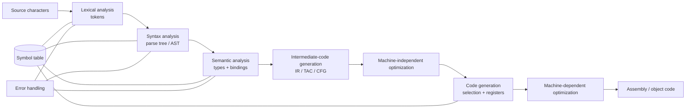
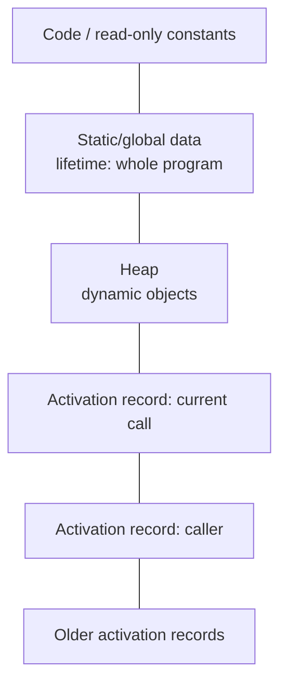
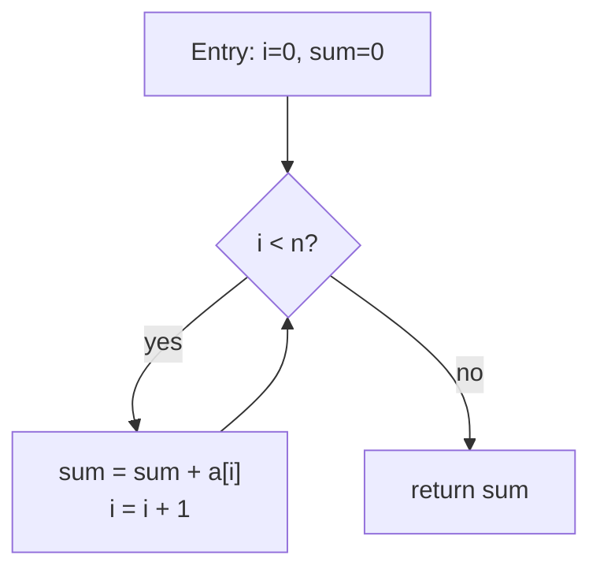

# Bismillah.

# Theory of Computation and Compiler Design — Slide-Grounded Viva Recall

> **Current source basis:** TOC contains `AtifSir_Merged.pdf` (703 pages) and `MasroorSir_Merged.pdf` (562 pages); Compiler contains `CSE309_KMS_Merged.pdf` (509 pages) and `CSE309_Mashroor_Merged.pdf` (893 pages). All **2667 pages** were re-read and routed here: **1265 TOC + 1402 Compiler**. The first part emphasizes formal definitions/constructions/proofs; the second follows the complete compiler pipeline with algorithms, equations, data structures and code-like procedures.

The subject asks three increasingly deep questions:

1. What can a machine with a fixed finite amount of memory recognize?
2. What changes when we add a stack or an unbounded tape?
3. Among decidable problems, which ones can be solved efficiently?

---

# 1. Alphabets, strings, and languages

- An **alphabet** `Sigma` is a finite nonempty set of symbols.
- A **string** over `Sigma` is a finite sequence of symbols.
- `epsilon` is the empty string and has length `0`.
- `Sigma*` is every finite string over `Sigma`, including `epsilon`.
- `Sigma+ = Sigma* - {epsilon}`.
- A **language** over `Sigma` is any subset of `Sigma*`.

For string `x,y`, concatenation is `xy`; `|xy|=|x|+|y|`. Concatenation is associative but not generally commutative. `x^0=epsilon`.

For languages `A,B`:

```text
A union B       = {w | w in A or w in B}
AB              = {xy | x in A and y in B}
A^0             = {epsilon}
A*              = union_(i>=0) A^i
A+              = union_(i>=1) A^i
reverse(A)      = {reverse(w) | w in A}
```

A language may be described by a machine that accepts it, a grammar that generates it, or a declarative property of its strings.

---

# 2. Deterministic finite automata

## 2.1 Definition

A DFA is a five-tuple

```text
M=(Q, Sigma, delta, q0, F)
```

where `Q` is a finite state set, `Sigma` the input alphabet, `delta:Q x Sigma -> Q` a total transition function, `q0` the start state, and `F subseteq Q` the accepting states.

The extended transition function processes a whole string:

```text
delta*(q, epsilon)=q
delta*(q, xa)=delta(delta*(q,x),a)
```

The accepted language is

```text
L(M)={w in Sigma* | delta*(q0,w) in F}.
```

Every state represents the finite information about the processed prefix that is relevant to future acceptance.

## 2.2 Example: even number of `1`s

Use states `E` and `O`; start/accept at `E`. Reading `1` toggles; reading `0` stays.

```text
        0      1
E       E      O
O       O      E
```

Invariant: after reading any prefix, the state records whether the prefix contains an even or odd number of ones. This invariant is the correctness proof.

## 2.3 Product construction

To recognize intersection of DFA languages `L1,L2`, build states `(q1,q2)`, advance both components on each symbol, and accept when both are accepting. Choose final pairs differently for union, difference, or symmetric difference.

If the DFAs have `m,n` states, the product has at most `mn` states before unreachable-state removal.

## 2.4 Complement

For a **complete** DFA, swap accepting and nonaccepting states. If transitions are missing, first add a dead state. Complementing an NFA’s final-state set directly is not valid because NFA acceptance is existential over paths.

---

# 3. NFA and epsilon-NFA

## 3.1 Definition

An NFA may have zero, one, or many transitions for a state/symbol. Formally `delta:Q x Sigma -> P(Q)`. It accepts if **at least one** complete path consumes the whole string and reaches a final state.

An epsilon-NFA also moves without consuming input. `epsilon-closure(S)` is every state reachable from set `S` using only epsilon transitions, including `S` itself.

NFAs are not more expressive than DFAs; both recognize exactly the regular languages. NFAs can be exponentially more concise.

## 3.2 Subset construction

Each DFA state represents a set of possible NFA states.

```text
start = epsilon_closure({nfa_start})
queue = [start]
seen  = {start}

while queue not empty:
    S = pop(queue)
    for each symbol a:
        T = epsilon_closure(union of delta(q,a) for q in S)
        dfa_transition[S,a] = T
        if T not in seen:
            add T to seen and queue

accepting DFA sets = {S | S intersects NFA_accepting}
```

An `n`-state NFA yields at most `2^n` subset states, although many may be unreachable.

## 3.3 Epsilon-closure algorithm

Run DFS/BFS starting from all states in `S`, following only epsilon edges. With adjacency lists, one closure is `O(V+E_epsilon)` worst case.

---

# 4. Regular expressions and equivalence

Regular expressions are built from:

- `emptyset`, denoting no strings;
- `epsilon`, denoting `{epsilon}`;
- each symbol `a`, denoting `{a}`;
- union `R|S`;
- concatenation `RS`;
- star `R*`.

Precedence is normally star, concatenation, then union. Parenthesize in a viva.

Kleene’s theorem: regular expressions, DFAs, NFAs, epsilon-NFAs, and regular grammars describe exactly the regular languages.

## 4.1 Regex to automaton

Thompson construction recursively builds an epsilon-NFA:

- symbol: one labeled edge;
- union: new start/final with epsilon branches;
- concatenation: epsilon-connect first final to second start;
- star: new start/final with epsilon skip and loop edges.

Then apply subset construction if a DFA is needed.

## 4.2 Automaton to regex

State elimination labels edges with regular expressions. When eliminating state `k`, update every remaining edge `i->j`:

```text
R_ij <- R_ij | R_ik (R_kk)* R_kj.
```

Introduce one start with no incoming edges and one accept with no outgoing edges. Elimination order affects expression size, not the recognized language.

---

## 4.3 Kleene's algorithm — hidden seniors' workbook topic, with simulation

**Source:** hidden sheet “Niche Topics”, C6. Kleene's theorem is the equivalence
result; Kleene's algorithm constructs a regex using dynamic programming over
allowed intermediate states. It is not merely applying the star operator.

Number states $1,\ldots,n$. Let $R_{ij}^{(k)}$ denote all labels of paths from
$i$ to $j$ whose internal states are among $1,\ldots,k$.

$$R_{ij}^{(k)}=R_{ij}^{(k-1)}\ \mid\
R_{ik}^{(k-1)}(R_{kk}^{(k-1)})^*R_{kj}^{(k-1)}.$$

Base $R^{(0)}$: union all direct edge labels, and include $\epsilon$ on the
diagonal for the zero-edge path; no path is $\emptyset$, not $\epsilon$.
Either a path never visits state $k$, or it first enters $k$, loops there zero
or more times, and finally leaves. This is the same decomposition pattern as
Floyd–Warshall, with union/concatenation/star replacing min/add.

```text
before allowing k:                  after allowing k:
i ----d----> j                      i -- (d | a c* b) --> j
 \          ^
  a         b
   v       /
      k --c--> k
```

For a start state with loop `a`, a `b` edge to an accepting state with loop `c`,
the final language is `a*bc*`: zero or more a's, exactly one b, then c's. It
accepts `b`, `aabcc`; rejects the empty string, `ac`, and `bb`.

```text
R = matrix of base regular expressions
for k in 1..n:
    old = R
    R = fresh n-by-n matrix
    for i in 1..n:
        for j in 1..n:
            R[i,j] = union(old[i,j],
                           concat(old[i,k], star(old[k,k]), old[k,j]))
answer = union of R[start,f] over all accepting f
```

Use immutable expression nodes or separate matrices so all recurrence operands
refer to the previous stage. Simplify $\emptyset R=\emptyset$,
$\epsilon R=R$, $\emptyset\mid R=R$, and $\emptyset^*=\epsilon$.
There are $O(n^3)$ **symbolic updates**, but expanded regex strings can be
exponentially large. Do not equate the update count with $O(n^3)$ time to print
the fully expanded expression. Shared expression DAGs avoid needless copies.
[Cornell's automaton-to-regex explanation](https://www.cs.cornell.edu/courses/cs2800/2017sp/lectures/lec27-kleene.html).

# 5. DFA minimization and Myhill-Nerode

## 5.1 Distinguishable states

States `p,q` are distinguishable if some suffix `z` makes exactly one of `delta*(p,z)`, `delta*(q,z)` accepting. Otherwise they are equivalent and can be merged.

## 5.2 Partition refinement

1. Remove unreachable states.
2. Start with partition `{F, Q-F}`.
3. Split a block whenever two states transition on some symbol into different current blocks.
4. Repeat until stable.
5. Each final block becomes one minimal-DFA state.

Correctness idea: final/nonfinal states are distinguished by `epsilon`; each refinement discovers a longer distinguishing suffix. Stable states accept the same future language.

## 5.3 Table-filling alternative

Mark every accepting/nonaccepting pair. Repeatedly mark pair `(p,q)` if some symbol sends it to an already marked pair. Unmarked pairs are equivalent.

## 5.4 Myhill-Nerode theorem

Define `x ~_L y` iff for every suffix `z`, `xz in L` exactly when `yz in L`. A language is regular iff this relation has finitely many equivalence classes. The number of classes equals the number of states in the minimal complete DFA.

To prove nonregularity, it is enough to exhibit infinitely many prefixes pairwise distinguishable by suffixes. For `L={0^n1^n}`, prefixes `epsilon,0,00,...` are pairwise distinguishable: for `i<j`, suffix `1^i` accepts after `0^i` but not after `0^j`.

---

# 6. Closure and decision properties of regular languages

Regular languages are closed under union, intersection, complement, difference, symmetric difference, concatenation, star, reversal, homomorphism, inverse homomorphism, and intersection with another regular language.

Important decision problems are decidable:

- membership: simulate DFA in `O(|w|)`;
- emptiness: graph-search for a reachable final state;
- finiteness: check whether a reachable cycle can still reach a final state;
- equivalence: test emptiness of symmetric difference using a product DFA;
- inclusion `L1 subseteq L2`: test emptiness of `L1 intersection complement(L2)`.

---

# 7. Pumping lemma for regular languages

If `L` is regular, there exists pumping length `p` such that every `w in L` with `|w|>=p` can be written `w=xyz` with:

```text
|xy|<=p,
|y|>0,
and x y^i z in L for every i>=0.
```

The quantifiers matter:

```text
exists p, for every long w in L,
exists a valid split xyz,
for every i>=0, the pumped string remains in L.
```

To disprove regularity, reverse the game:

1. Assume `L` regular and receive arbitrary `p`.
2. Choose a strategic `w in L` depending on `p`.
3. Consider **every** split meeting the length conditions.
4. Choose an `i` that makes the string leave `L`.
5. Contradict the lemma.

### Board proof: `{0^n1^n | n>=0}` is not regular

Choose `w=0^p1^p`. Since `|xy|<=p` and `|y|>0`, `y` contains only zeros. Pump down with `i=0`; the result has fewer zeros than ones and is outside the language. This works for every valid split.

The pumping lemma is necessary, not sufficient: satisfying a pumping-like property is not the normal way to prove a language regular.

---

# 8. Context-free grammars

A CFG is `G=(V,Sigma,R,S)` where `V` is a finite nonterminal set, `Sigma` terminals, `R` productions `A->alpha`, and `S` the start symbol.

- A derivation applies productions.
- A leftmost/rightmost derivation chooses which nonterminal to replace.
- A parse tree records hierarchical production use; its leaf yield is the string.
- `L(G)` is the set of terminal strings derivable from `S`.

Example for balanced parentheses:

```text
S -> SS | (S) | epsilon
```

## 8.1 Ambiguity

A grammar is ambiguous if some string has two distinct parse trees/equivalently two distinct leftmost derivations. Ambiguity belongs to the grammar; a language is inherently ambiguous only if every CFG for it is ambiguous.

The expression grammar

```text
E -> E+E | E*E | id
```

is ambiguous. Encode precedence and associativity:

```text
E -> E+T | T
T -> T*F | F
F -> (E) | id
```

## 8.2 Left recursion removal

For immediate left recursion

```text
A -> A alpha_1 | ... | A alpha_m | beta_1 | ... | beta_n
```

where no `beta` begins with `A`, transform to

```text
A  -> beta_1 A' | ... | beta_n A'
A' -> alpha_1 A' | ... | alpha_m A' | epsilon
```

This helps predictive top-down parsing; it does not by itself remove all ambiguity.

## 8.3 Simplification and Chomsky Normal Form

Remove non-generating and unreachable symbols; eliminate epsilon and unit productions under the transformation’s rules. In CNF, productions are:

```text
A -> BC
A -> a
```

plus a controlled start-to-epsilon rule if `epsilon` belongs to the language. CNF supports proofs and CYK; it is not meant to be readable source grammar.

---

# 9. Pushdown automata

A PDA is a finite automaton with a stack. A transition can depend on the state, next input/epsilon, and stack top, then change state and replace/pop/push stack symbols.

Nondeterministic PDAs recognize exactly the context-free languages. Unlike finite automata, deterministic and nondeterministic PDAs do not recognize the same class: deterministic CFLs form a proper subset of CFLs.

### PDA intuition for `0^n1^n`

- push one marker per `0`;
- nondeterministically/structurally switch at the first `1`;
- pop one marker per `1`;
- reject incorrect order, missing/excess symbols;
- accept when input and required stack content finish.

The stack supplies unbounded nested/counting memory in LIFO form, but one stack cannot in general compare three independent counts such as `a^n b^n c^n`.

Acceptance by empty stack and final state are equivalent for nondeterministic PDAs after standard transformations, but the machine definitions differ.

---

# 10. CFL closure and pumping

CFLs are closed under union, concatenation, star, reversal, homomorphism, inverse homomorphism, and intersection with a regular language. They are not closed under general intersection, complement, or difference.

The intersection-with-regular property is powerful: assume a language CFL, intersect it with a carefully chosen regular language, and obtain a known non-CFL.

## 10.1 CFL pumping lemma

For every CFL `L`, sufficiently long `w` can be written

```text
w = u v x y z
|vxy| <= p
|vy| > 0
u v^i x y^i z in L for every i>=0.
```

Two regions `v` and `y` pump together. To disprove CFL status, cover every placement of the short window `vxy`. Some non-CFLs resist this lemma; Ogden’s lemma lets the prover mark positions and is stronger.

## 10.2 Why `{a^n b^n c^n}` is not context-free

Choose `a^p b^p c^p`. Since `|vxy|<=p`, the pumped regions cannot cover all three symbol blocks. Pumping changes at most two blocks while the third count remains `p`, breaking equality for a suitable `i`.

State the case split carefully: `v,y` may lie in one block or cross one boundary; the length bound prevents spanning both boundaries.

---

# 11. CYK parsing

For a grammar in CNF and input `w_1...w_n`, let `T[i,l]` contain nonterminals deriving the substring beginning at `i` of length `l`.

```text
for i=1..n:
    T[i,1] = {A | A -> w_i}

for length=2..n:
    for start=1..n-length+1:
        for split=1..length-1:
            for each production A -> BC:
                if B in T[start,split]
                   and C in T[start+split,length-split]:
                    add A to T[start,length]

accept iff S in T[1,n]
```

With a straightforward indexed grammar, time is `O(n^3 |G|)` and table space `O(n^2 |V|)`/bitset equivalent. Store backpointers to reconstruct a parse tree.

---

# 12. Turing machines

A deterministic single-tape TM has finite control, a conceptually unbounded tape, a read/write head, and transition function that reads a symbol, writes a symbol, moves left/right (sometimes stay), and changes state.

A typical formal tuple contains states, input alphabet, tape alphabet, blank symbol, transition function, start state, and accept/reject states.

The exact tuple convention matters less than the model:

- input begins on tape;
- computation may use unbounded cells over time;
- accept/reject are halting outcomes;
- a machine may loop unless it is a decider.

Multitape, nondeterministic, two-way-infinite tape, and other standard variants have the same computability power, though simulation time can differ.

## 12.1 Recognizer versus decider

- A **recognizer** accepts every member; on a nonmember it may reject or loop.
- A **decider** halts on every input and accepts exactly the members.
- Recognizable languages are also called recursively enumerable/Turing-recognizable.
- Decidable languages are recursive.

Every decidable language is recognizable. A language is decidable iff both it and its complement are recognizable: dovetail the two recognizers until one accepts.

## 12.2 Enumerator equivalence

A language is recognizable iff some TM enumerator prints exactly its strings. To recognize from an enumerator, run until the target appears. To enumerate from a recognizer, dovetail simulations across all strings and time steps so one nonhalting input cannot block the rest.

## 12.3 Church-Turing thesis

The thesis says every effectively computable procedure is computable by a Turing-equivalent model. It is a foundational thesis, not an ordinary theorem, because “effectively computable” was an informal concept; many independently developed models converge to the same class.

---

# 13. Decidability and reductions

## 13.1 Mapping reduction

`A <=m B` means there is a total computable function `f` such that

```text
x in A iff f(x) in B.
```

Consequences:

- if `A <=m B` and `B` is decidable, then `A` is decidable;
- if `A` is undecidable and `A <=m B`, then `B` is undecidable;
- if `A <=m B` and `B` is recognizable, then `A` is recognizable: compute `f(x)` and run the recognizer for `B`;
- contrapositively, if `A` is not recognizable and `A <=m B`, then `B` is not recognizable.

Direction trap: to prove target `B` hard, reduce a known hard `A` **to** `B`, not `B` to `A`.

## 13.2 Halting problem

```text
HALT_TM={<M,w> | M halts on w}
```

is undecidable. It is recognizable: simulate `M(w)` and accept if it halts.

A contradiction proof assumes a total decider `H(M,w)`, then constructs a machine that on encoding `x` does the opposite/loops when `H(x,x)` predicts halting. Running it on its own encoding contradicts the prediction.

## 13.3 Acceptance problem

```text
A_TM={<M,w> | M accepts w}
```

is recognizable but undecidable. `HALT` and `A_TM` are related but not identical: a machine may halt and reject.

## 13.4 Rice’s theorem

Every nontrivial semantic property of the partial function/language recognized by a TM is undecidable. “Does `M` accept any string?”, “Is `L(M)` regular?”, and “Does `M` accept all strings?” are semantic and nontrivial.

Rice does not apply directly to syntactic properties such as “Does the machine description contain ten states?”

## 13.5 Post Correspondence Problem

Given top/bottom string tiles, PCP asks whether a nonempty sequence of tile indices makes the concatenated top and bottom strings equal. PCP is recognizable but undecidable and is a common source for grammar/automata undecidability reductions.

---

# 14. Complexity classes

Complexity normally studies decision problems under a reasonable machine model.

- **P:** decidable in deterministic polynomial time.
- **NP:** yes-instances have polynomial-size certificates verifiable in polynomial time; equivalently nondeterministic polynomial time.
- **co-NP:** complements of NP languages.
- **NP-hard:** every NP problem polynomial-time reduces to it; it need not be a decision problem, in NP, or decidable.
- **NP-complete:** both in NP and NP-hard.

Known: `P subseteq NP`; unknown: `P=NP`. NP does **not** mean “non-polynomial.”

## 14.1 Showing membership in NP

State:

- certificate;
- polynomial bound on certificate length;
- verifier;
- verifier running time;
- why a yes-instance has a certificate and a no-instance has none accepted.

For Hamiltonian cycle, certificate is an ordered vertex list; verify every vertex appears once, consecutive edges exist, and last connects to first in polynomial time.

## 14.2 NP-completeness proof template

To prove target `X` NP-complete:

1. Show `X in NP`.
2. Choose known NP-complete `Y`.
3. Construct polynomial transformation `Y <=p X`.
4. Prove `y` is YES iff transformed instance is YES.
5. Bound transformation time and output size.

Do not reduce `X` to known hard `Y`; that only shows `X` is no harder than `Y`.

## 14.3 Optimization versus decision

“Find the shortest tour” is an optimization problem. Its decision version asks whether a tour of cost at most `K` exists. Decision TSP is NP-complete; optimization TSP is NP-hard. A polynomial optimization algorithm would solve the decision version.

## 14.4 Polynomial reductions and consequences

If an NP-complete problem is in P, then `P=NP`. If `A` is NP-hard and `A <=p B`, then `B` is NP-hard. If `A <=p B` and `B in P`, then `A in P`.

Weak versus strong NP-hardness matters for numeric problems: a pseudo-polynomial algorithm can still exist for weakly NP-hard problems such as ordinary knapsack formulations.

## 14.5 Space classes

- `L`: deterministic logarithmic space;
- `NL`: nondeterministic logarithmic space;
- `PSPACE`: deterministic polynomial space.

Standard containments include

```text
L subseteq NL subseteq P subseteq NP subseteq PSPACE.
```

Savitch’s theorem gives `NSPACE(s(n)) subseteq DSPACE(s(n)^2)` for suitable `s`, so `NPSPACE=PSPACE`. These classes are supplements unless present in the course syllabus.

---

# 15. Chomsky hierarchy

| Language class | Grammar restriction | Machine intuition |
|---|---|---|
| Regular | right/left-linear | finite automaton |
| Context-free | one nonterminal on LHS | nondeterministic PDA |
| Context-sensitive | noncontracting/context rules | linear-bounded automaton |
| Recursively enumerable | unrestricted | TM recognizer |

Containments are proper under the standard definitions. A grammar’s syntactic class determines an upper bound on language complexity; the same language may have grammars in a more powerful class too.

---

# 16. High-probability viva traps

1. **Can a DFA omit a transition?** A formal DFA transition is total; add a dead state.
2. **Can an NFA accept if one branch rejects?** Yes, if some complete branch accepts.
3. **Are NFAs faster?** They are mathematical models; implementation/simulation and state size determine cost.
4. **Can a finite automaton count?** It can count modulo a fixed constant, not arbitrary unbounded equality.
5. **Does pumping prove regularity?** No.
6. **Is every CFG unambiguous?** No; some languages are inherently ambiguous.
7. **Does one stack recognize `a^n b^n c^n`?** No; that language is not context-free.
8. **Are CFLs closed under intersection?** Not general intersection, but intersection with a regular language is CFL.
9. **Does a recognizer halt on nonmembers?** Not necessarily.
10. **Is every undecidable problem NP-hard?** Complexity/reduction definitions must be specified; undecidability and NP-completeness are different notions.
11. **Does NP mean hard to verify?** No, NP emphasizes polynomial-time verification of yes certificates.
12. **Does `A <=p B` mean A is harder?** No; `B` is at least as hard as `A` under that reduction.

---

# 17. Board-ready proof/construction checklist

- [ ] Design a DFA by defining the information each state remembers.
- [ ] Convert an epsilon-NFA to a DFA using closure/subsets.
- [ ] Minimize a DFA with partition refinement and a distinguishing suffix.
- [ ] Prove `{0^n1^n}` nonregular with correct pumping quantifiers.
- [ ] Remove immediate left recursion and explain why it helps parsing.
- [ ] Convert a small CFG to CNF and run one CYK table.
- [ ] Sketch a PDA for balanced parentheses or `0^n1^n`.
- [ ] Prove `{a^n b^n c^n}` non-CFL with all pumping-window cases.
- [ ] Distinguish TM recognizer, decider, enumerator, and dovetailing.
- [ ] State a mapping reduction in the correct direction.
- [ ] Explain HALT undecidability and Rice’s theorem boundaries.
- [ ] Prove a problem NP-complete using membership, reduction, iff correctness, and polynomial cost.

---

# Part II — Compiler Design

# 18. Compiler Mental Model and Phases

A compiler translates a source program to an equivalent target program while reporting errors and preserving the source-language meaning. It is not merely “convert high-level code to machine code”; it performs analysis, representation changes, optimization and target-specific synthesis.



- **Front end:** source-language dependent analysis and IR generation.
- **Middle end:** mostly target-independent IR optimization.
- **Back end:** target-machine instruction selection, scheduling and register allocation.
- **Phase:** conceptual function; **pass:** one traversal/read of a representation. Several phases can share a pass, or one phase can need several passes.

An interpreter executes a representation directly; a compiler produces another program. JIT systems compile during execution using runtime profiles; hybrid VMs may interpret, profile, then optimize hot methods.

**Bootstrapping:** implement a compiler for language `L` in `L`; an initial compiler/interpreter must already translate the subset. A **cross-compiler** runs on host `H` but emits code for target `T`.

# 19. Lexical Analysis

## 19.1 Token, lexeme, and pattern

- **Token:** category returned to parser, e.g. `ID`, `NUM`, `IF`, `LE`.
- **Lexeme:** exact source substring, e.g. `count`, `42`, `<=`.
- **Pattern:** rule describing all lexemes of a token, often a regular expression.

A token commonly carries an attribute:

```text
<ID, symbol-table pointer>
<NUM, numeric value>
<RELOP, LE>
```

The lexer removes whitespace/comments when language rules permit, tracks locations, recognizes literals/identifiers/operators, and coordinates with the symbol table. It should not normally parse nested grammatical structure; regular languages/finite automata are its natural model.

## 19.2 Regular definitions and automata

Example regular definitions:

```text
digit   -> [0-9]
letter  -> [A-Za-z_]
id      -> letter (letter | digit)*
integer -> digit+
real    -> digit+ "." digit+ ([eE][+-]?digit+)?
```

Construction pipeline:

```text
regular expressions
-> Thompson epsilon-NFA
-> subset-construction DFA
-> optional DFA minimization/table compression
-> scanner
```

If multiple patterns match, apply:

1. **maximal munch/longest lexeme**;
2. if equal length, rule priority.

Thus `>=` should be one token rather than `>` then `=`, and `ifx` is normally an identifier rather than keyword `if` plus `x`. Recognize the identifier, then consult a keyword table.

## 19.3 Scanner skeleton

```cpp
Token nextToken() {
    skipWhitespaceAndComments();
    SourcePos start = position();
    char c = peek();

    if (isLetter(c) || c == '_') {
        string s;
        do { s += get(); } while (isLetterOrDigit(peek()) || peek() == '_');
        if (auto kw = keywordToken(s)) return Token{*kw, s, start};
        return Token{ID, intern(s), start};
    }

    if (isDigit(c)) {
        long long v = 0;
        do {
            int d = get() - '0';
            if (v > (LLONG_MAX - d) / 10) lexicalError("integer overflow", start);
            v = 10 * v + d;
        } while (isDigit(peek()));
        return Token{INT_LITERAL, v, start};
    }

    c = get();
    if (c == '<' && peek() == '=') { get(); return {LE, "<=", start}; }
    if (c == '=' && peek() == '=') { get(); return {EQ, "==", start}; }
    if (isSingleCharToken(c)) return tokenFor(c, start);

    lexicalError("invalid character", start);
    return {ERROR_TOKEN, c, start};
}
```

Production scanners must handle Unicode/encodings, escapes, numeric suffixes, comment/string termination, overflow and source spans according to the language specification.

## 19.4 Input buffering

Reading one character per system call is slow. A two-buffer scheme reads blocks and places a sentinel at each end. `lexemeBegin` marks token start; `forward` scans and can cross/refill buffers; retract backs up when lookahead belongs to the next token.

The sentinel avoids testing “end of buffer?” on every ordinary character, but EOF and lexemes longer than a buffer still need explicit handling.

## 19.5 Lexical errors

Examples: illegal character, malformed exponent, unclosed string/comment, invalid escape, literal overflow. Recovery may delete/insert/replace/transposition-correct a character or return an error token, but must advance—otherwise the compiler loops at one bad character.

# 20. Context-Free Grammars and Top-Down Parsing

## 20.1 Parse tree versus AST

A parse tree includes every grammar nonterminal/terminal derivation. An AST removes punctuation and grammar-only nodes, retaining semantic structure.

For `a + b * c`, precedence grammar/AST should mean:

```text
      +
     / \
    a   *
       / \
      b   c
```

Ambiguity means one string has multiple parse trees/leftmost/rightmost derivations. Resolve by rewriting grammar or explicit parser precedence/associativity rules.

## 20.2 Eliminate immediate left recursion

For:

$$A\rightarrow A\alpha_1|\cdots|A\alpha_m|\beta_1|\cdots|\beta_n,$$

where no $\beta_i$ begins with $A$, transform:

$$
\begin{aligned}
A&\rightarrow\beta_1A'|\cdots|\beta_nA',\\
A'&\rightarrow\alpha_1A'|\cdots|\alpha_mA'|\epsilon.
\end{aligned}
$$

For indirect left recursion, order nonterminals, substitute earlier productions into later ones, then remove immediate recursion. Naively changing left-recursive arithmetic grammar may change associativity in the parse tree; build AST actions to preserve intended left associativity.

## 20.3 Left factoring

If:

$$A\rightarrow\alpha\beta_1|\alpha\beta_2|\gamma,$$

factor:

$$A\rightarrow\alpha A'|\gamma,\qquad A'\rightarrow\beta_1|\beta_2.$$

This delays a decision until enough input is seen; it does not remove true ambiguity.

## 20.4 FIRST and FOLLOW

`FIRST(α)` contains terminals that can begin strings derived from `α`, plus $\epsilon$ if `α⇒*ε`. `FOLLOW(A)` contains terminals that can immediately follow `A` in some sentential form; `$` is in `FOLLOW(start)`.

Fixed-point rules:

1. terminal `a`: `FIRST(a)={a}`;
2. for `A→X1...Xk`, add `FIRST(X1)-{ε}`, then continue while preceding symbols are nullable; add `ε` if all nullable;
3. put `$` in `FOLLOW(S)`;
4. for `A→αBβ`, add `FIRST(β)-{ε}` to `FOLLOW(B)`;
5. if `β⇒*ε` (including empty), add `FOLLOW(A)` to `FOLLOW(B)`;
6. repeat until no set changes.

Example grammar:

```text
E  -> T E'
E' -> + T E' | epsilon
T  -> id
```

```text
FIRST(E)=FIRST(T)={id}
FIRST(E')={+,epsilon}
FOLLOW(E)={$}
FOLLOW(E')={$}
FOLLOW(T)={+,$}
```

## 20.5 LL(1) table construction

For every production `A→α`:

- for each `a in FIRST(α)-{ε}`, put it in `M[A,a]`;
- if `ε in FIRST(α)`, for each `b in FOLLOW(A)`, put it in `M[A,b]`.

Two productions in one cell create an LL(1) conflict. A grammar is LL(1) when one lookahead token selects one production at every step; absence of table conflict after correct construction is the operational test.

Predictive parser:

```text
stack = [$, Start]
lookahead = nextToken()
while top(stack) != $:
    X = top(stack)
    if X is terminal:
        if X == lookahead: pop; lookahead=nextToken()
        else: report/recover missing or unexpected terminal
    else:
        production = M[X, lookahead]
        if none: report/recover
        else:
            pop X
            push RHS symbols in reverse, omitting epsilon
accept iff stack top and lookahead are both $
```

With a table and token stream, time is $O(n)$ for a fixed grammar, excluding semantic work/recovery.

## 20.6 Recursive descent

One procedure per nonterminal:

```cpp
Node* parseExpr() {
    Node* left = parseTerm();
    while (look.kind == PLUS || look.kind == MINUS) {
        Token op = take();
        Node* right = parseTerm();
        left = new Binary(op, left, right);  // preserves left associativity
    }
    return left;
}
```

Recursive descent can use more than one token/backtracking, but unrestricted backtracking can be exponential and produces poor errors. Predictive grammars make choices from lookahead sets.

## 20.7 Panic-mode recovery

On a nonterminal error, discard tokens until a synchronizing set—often `FOLLOW(nonterminal)` or statement delimiters—appears. Mark `synch` table entries. Recovery should report the earliest useful error, avoid cascades, preserve enough structure to find later errors and always make progress.

# 21. Bottom-Up Parsing: Shift–Reduce, LR, SLR, CLR, and LALR

## 21.1 Handles and shift–reduce actions

A **handle** is a substring matching a production RHS whose reduction is one step of the reverse rightmost derivation. A shift–reduce parser maintains a stack and input:

- **shift:** move next token to stack;
- **reduce `A→β`:** replace handle `β` by `A`;
- **accept**;
- **error**.

Conflicts:

- shift/reduce: both shifting and reducing appear valid;
- reduce/reduce: two reductions appear valid.

Operator-precedence declarations may resolve intended expression conflicts, but silently resolving a grammar-design mistake is dangerous.

## 21.2 LR(0) items, closure, and goto

An LR(0) item marks parser progress:

$$A\rightarrow\alpha\cdot\beta.$$

Closure:

```text
CLOSURE(I):
    repeat
        for each [A -> alpha . B beta] in I
            for each production B -> gamma
                add [B -> . gamma]
    until unchanged
```

Goto:

```text
GOTO(I, X) =
    CLOSURE({[A -> alpha X . beta] |
             [A -> alpha . X beta] in I})
```

Augment grammar with `S'→S`. Starting at `CLOSURE({S'→·S})`, repeatedly apply `GOTO` on grammar symbols to form the canonical collection/state DFA.

## 21.3 SLR table

For state `i`:

1. if `[A→α·aβ]` and `GOTO(i,a)=j`, set `ACTION[i,a]=shift j`;
2. if `[A→α·]`, `A≠S'`, set `ACTION[i,a]=reduce A→α` for each `a∈FOLLOW(A)`;
3. if `[S'→S·]`, set `ACTION[i,$]=accept`;
4. nonterminal transitions fill `GOTO[i,A]`.

Parser:

```text
state stack starts [0]
repeat:
    s = top state; a = lookahead
    case ACTION[s,a]:
      shift t: push a,t; a=next token
      reduce A->beta:
          pop 2*|beta| stack entries
          s=top state
          push A, GOTO[s,A]
          execute semantic action
      accept: return result
      error: recover/fail
```

Each state/symbol step is constant table work, so deterministic LR parsing is $O(n)$ for a fixed grammar.

## 21.4 Why LR(1) is stronger

An LR(1) item includes a lookahead:

$$[A\rightarrow\alpha\cdot\beta,\ a].$$

For `[A→α·Bβ,a]`, closure adds `[B→·γ,b]` for each

$$b\in FIRST(\beta a).$$

- **LR(0):** reductions without lookahead; weakest.
- **SLR(1):** LR(0) states, reductions on global `FOLLOW(A)`; compact but coarse.
- **Canonical LR(1)/CLR:** item-specific lookaheads; most states, strongest of these.
- **LALR(1):** merge canonical LR(1) states with identical LR(0) cores, union lookaheads; near-SLR table size and often stronger, but merging can introduce reduce/reduce conflicts absent in CLR.

All deterministic CFLs are not necessarily LL(1); LR methods recognize a larger practical grammar class and detect a viable-prefix error as soon as no valid continuation exists.

# 22. Syntax-Directed Translation and Semantic Analysis

## 22.1 Attributes

An SDD associates attributes/rules with grammar symbols:

- **synthesized** attribute flows from children to parent;
- **inherited** attribute flows from parent/siblings into a node.

An S-attributed definition uses only synthesized attributes and fits bottom-up evaluation. An L-attributed definition restricts inherited dependencies so a left-to-right depth-first traversal can evaluate them.

Example expression value:

```text
E -> E1 + T    { E.val = E1.val + T.val }
E -> T         { E.val = T.val }
T -> NUM       { T.val = NUM.lexval }
```

An **SDT** embeds actions in productions; action placement affects when values are available.

## 22.2 Symbol table and scope

Entry fields can include name, kind, type, scope depth, storage class, size/alignment, offset/address, parameter list, return type, declaration location and linkage.

Implement nested scopes with:

- a stack of hash tables; lookup searches innermost outward;
- one hash table plus scope chains/undo logs;
- persistent trees for functional compiler designs.

On entering scope, push; on declaration, reject illegal duplicate in same scope; on exit, remove/hide its bindings. Shadowing an outer name may be legal even when redeclaration in the same scope is not.

## 22.3 Type checking

Semantic analysis catches:

- undeclared/redeclared identifiers;
- incompatible operators/operands;
- wrong argument count/types;
- invalid return/break/index/member use;
- assignment incompatibility;
- inaccessible names and control-flow rules.

For numeric coercion:

```text
int + float -> convert int to float -> float result
```

Coercion is implicit conversion chosen by language rules; a cast is an explicit request. Widening may preserve range but still lose exactness (large integer to float); narrowing needs explicit policy/check.

A structural type system compares component structure; a nominal system relies on declared names/relationships. Static checking proves rules before execution under its model; dynamic checks still handle casts, bounds, null, tags or reflection where required.

# 23. Intermediate Representations and Three-Address Code

## 23.1 Common IR forms

- parse tree/AST;
- DAG for shared expression values;
- three-address code (TAC);
- quadruples/triples/indirect triples;
- control-flow graph;
- SSA and machine IR.

TAC forms:

```text
x = y op z
x = op y
x = y
if x relop y goto L
goto L
param x
t = call f, n
return x
x = y[i]
x[i] = y
x = &y / *y / *x = y
```

Example:

```text
x = (a - b) * (c + d)
```

becomes:

```text
t1 = a - b
t2 = c + d
t3 = t1 * t2
x  = t3
```

## 23.2 Quadruples, triples, indirect triples

- Quadruple: `(op,arg1,arg2,result)`, easy to reorder because results have names.
- Triple: result is instruction position, saving temporary names but making motion harder.
- Indirect triple: a separate pointer list gives reorderability without changing triple references.

## 23.3 Boolean short-circuit translation

For `B1 && B2`, evaluate `B2` only where `B1` is true. For `B1 || B2`, evaluate `B2` only where `B1` is false. Control-flow representation avoids materializing every Boolean:

```text
if a < b goto L_rhs
goto L_false
L_rhs:
if c != 0 goto L_true
goto L_false
```

## 23.4 Backpatching

Generate jumps before targets are known and keep lists:

- `makelist(i)`: singleton list containing instruction `i`;
- `merge(p1,p2)`: concatenate lists;
- `backpatch(p,i)`: fill every incomplete target in list `p` with label/instruction `i`.

Boolean attributes:

```text
B.truelist
B.falselist
```

For `B1 || M B2`:

```text
backpatch(B1.falselist, M.instr)
B.truelist = merge(B1.truelist, B2.truelist)
B.falselist = B2.falselist
```

For a statement sequence, backpatch the previous statement's `nextlist` to the next statement's first instruction.

# 24. Runtime Environments

## 24.1 Storage regions



- Static allocation works for fixed-lifetime objects but not arbitrary recursion.
- Stack allocation matches nested call/return lifetimes.
- Heap allocation supports objects whose lifetimes do not follow call nesting.

## 24.2 Activation record

Possible fields:

```text
arguments
return value slot
return address
control/dynamic link (caller's frame)
access/static link or display support
saved registers
local variables
temporaries/spill slots
```

Exact order is ABI/compiler-specific. A frame pointer gives stable offsets when stack pointer changes; compilers can omit it when unwind/debug/variable-size needs allow.

For lexically nested functions, a **static link** points to the frame of the lexically enclosing activation; the dynamic link points to the caller. They are not always the same. A display stores one active frame pointer per nesting level for faster nonlocal access.

## 24.3 Parameter passing

- call by value: copy value;
- reference: callee receives alias/address;
- value-result/copy-in-copy-out: copy in then out, with alias-order issues;
- name: delayed expression-like substitution/thunk semantics;
- object sharing: copy object reference value; mutation visible, rebinding local.

State the language's actual semantics rather than assuming “objects are passed by reference.”

## 24.4 Garbage collection

**Mark–sweep:**

1. start from roots (stacks, globals, registers);
2. traverse pointers and mark reachable objects;
3. sweep heap; reclaim unmarked objects.

Time is $O(\text{reachable graph}+\text{heap scanned})$. It can fragment memory and pause execution.

**Copying collector:** copy reachable objects from from-space to to-space; allocation becomes bump-pointer and compacts, but reserves space and cost tracks live data.

**Reference counting:** reclaim when count hits zero; often prompt/incremental, but cycles survive without additional tracing and updates add overhead.

Generational GC relies on the empirical hypothesis that most objects die young; a write barrier records old-to-young references.

# 25. Basic Blocks and Control-Flow Graphs

## 25.1 Leaders

Leaders are:

1. first TAC instruction;
2. every jump target;
3. instruction immediately following a jump/conditional/return if present.

A basic block begins at a leader and ends before the next. Inside it, control enters at the top and leaves at the bottom without branching except at the end.

CFG nodes are basic blocks. Add edge `B→C` if B can branch to C or fall through to C.



## 25.2 Dominators and natural loops

Node `d` dominates `n` if every path from entry to `n` passes through `d`. Equations:

$$Dom(entry)=\{entry\},$$

$$Dom(n)=\{n\}\cup\bigcap_{p\in pred(n)}Dom(p).$$

An edge `n→d` is a back edge when `d` dominates `n`. Its natural loop contains `d`, `n`, and nodes that can reach `n` without passing through `d`. Dominance helps identify safe code motion and loop structure.

# 26. Local and Global Optimization

Optimization must preserve observable semantics under the language model. Floating point, exceptions, overflow, volatile/atomic operations, aliasing and concurrency restrict algebraic transformations.

## 26.1 Local DAG/value-numbering ideas

For a basic block:

```text
t1 = a + b
t2 = a + b
x  = t2 * 1
```

Common-subexpression elimination and algebraic simplification can yield:

```text
t1 = a + b
x  = t1
```

Only if neither `a` nor `b` changed and evaluation has no observable distinction. A DAG node represents an operation and children; identifiers label the node containing their current value.

Common transformations:

- constant folding/propagation;
- copy propagation;
- common-subexpression elimination;
- dead-code/dead-store elimination;
- algebraic identities;
- strength reduction (`x*2` to shift only when semantics permit);
- loop-invariant code motion;
- induction-variable simplification;
- unreachable-code elimination;
- inlining with code-size trade-off.

## 26.2 Data-flow framework

For forward reaching definitions:

$$IN[B]=\bigcup_{P\in pred(B)}OUT[P],$$

$$OUT[B]=GEN[B]\cup(IN[B]-KILL[B]).$$

For backward live variables:

$$OUT[B]=\bigcup_{S\in succ(B)}IN[S],$$

$$IN[B]=USE[B]\cup(OUT[B]-DEF[B]).$$

`x` is live at a point if some path uses its current value before redefining it. A dead assignment can be removed only if the expression has no required side effect/exception.

Generic worklist:

```text
initialize IN/OUT to boundary and lattice defaults
put all blocks in worklist
while worklist not empty:
    B = remove one
    recompute transfer result using meet over neighbors
    if result changed:
        add affected neighbors
```

Finite bit-vector lattices and monotone transfer functions converge. Union is a “may” merge; intersection is often a “must” merge (e.g. an expression is available only if available on every incoming path).

## 26.3 SSA

Static Single Assignment gives each variable definition one version:

```text
if (...) x1 = 1
else     x2 = 2
x3 = phi(x1, x2)
```

The $\phi$ chooses the value from the executed predecessor; it is conceptual parallel edge selection, not an ordinary eager function call. SSA simplifies def-use chains, propagation and many optimizations; later lowering inserts/moves values into machine locations.

# 27. Code Generation and Register Allocation

## 27.1 Core back-end tasks

1. instruction selection: map IR patterns to target instructions/addressing modes;
2. register allocation/assignment;
3. evaluation order and instruction scheduling;
4. stack-frame/calling-convention generation;
5. branch/label/object emission;
6. target-specific peephole cleanup.

Quality objectives conflict: execution time, code size, compile time, energy and debugability.

For `x = a[i]` with 4-byte elements:

```text
t1 = i * 4
t2 = base(a) + t1
x  = load [t2]
```

A target with scaled-index addressing may combine arithmetic into one memory operand.

## 27.2 Register descriptors and next use

Within a block, a register descriptor records which current values reside in each register; an address descriptor records valid locations of a variable. Liveness/next-use guides choices:

- reuse a register whose value is dead/no next use;
- avoid spilling a soon-used dirty value;
- store a dirty live value before overwriting if memory needs the current copy.

## 27.3 Interference graph coloring

Two temporaries interfere when their live ranges overlap and cannot share a register. Build graph: vertex per live range, edge per interference.

Simplified coloring:

1. while a vertex of degree `<K` exists, remove/push it;
2. if none, choose a spill candidate and remove it optimistically;
3. pop vertices and assign a color different from colored neighbors;
4. if impossible, insert spill loads/stores and rebuild.

Graph coloring is NP-hard in general; allocators use heuristics/coalescing. Coalescing a move `x=y` can remove the move if their nodes do not interfere, but may make coloring harder.

Linear-scan allocation sorts live intervals by start, expires finished intervals and assigns free registers; otherwise it spills an interval. It is faster and common in JITs, often with somewhat lower code quality than sophisticated coloring.

## 27.4 Peephole optimization

Examine short instruction windows:

```text
MOV R1,R1          -> remove
JMP L1; L1:JMP L2  -> JMP L2
MUL R1,2           -> shift/add if exact target semantics permit
LOAD R1,x; STORE x,R1 -> second may be redundant if no intervening effect
```

Also eliminate unreachable code, redundant loads/stores and exploit machine idioms. Peephole rules need accurate flags, aliasing, delay-slot and exception semantics.

# 28. Compiler Errors and Diagnostics

| Phase | Example |
|---|---|
| lexical | illegal character, malformed number, unclosed string |
| syntax | missing `)`, unexpected `else`, malformed declaration |
| semantic | undeclared name, type mismatch, wrong arguments, invalid return |
| link | unresolved external, duplicate global symbol |
| runtime | division by zero, bounds/null failure, dynamic type error |
| logical | program compiles/runs but computes wrong result |

A diagnostic should include source span, clear primary message, relevant notes (previous declaration/type), and recovery that avoids cascades. Compilers cannot in general detect every runtime/logical error; Rice's theorem/undecidability explains broad limits.

# 29. Current Source Ledger

| Current source | Pages | Major blocks represented |
|---|---:|---|
| `AtifSir_Merged.pdf` | 703 | regular languages/FA/regex/minimization/pumping; CFG/PDA/CFL; TMs/decidability/reductions/complexity |
| `MasroorSir_Merged.pdf` | 562 | alternate derivations, constructions, grammar/machine proofs and computation/complexity reinforcement |
| `CSE309_KMS_Merged.pdf` | 509 | compiler phases, lexical/syntax/semantic analysis, IR, runtime, optimization and code generation |
| `CSE309_Mashroor_Merged.pdf` | 893 | detailed top-down/LR parsing, SDD/SDT, TAC/backpatching, CFG/data-flow, target code/register allocation |
| **Total** | **2667** | **1265 TOC + 1402 Compiler pages routed** |

# 30. Compiler Board-Ready Self-Test

- [ ] Distinguish token, lexeme and pattern; trace longest-match/priority.
- [ ] Convert regex → NFA → DFA conceptually and explain scanner buffering.
- [ ] Remove left recursion/left-factor; compute FIRST and FOLLOW to a fixed point.
- [ ] Construct and trace an LL(1) table/parser with panic-mode recovery.
- [ ] Compute LR closure/goto; build SLR actions and explain conflicts.
- [ ] Compare LR(0), SLR, CLR/LR(1), and LALR without saying they are identical.
- [ ] Build a symbol table for nested scopes and type-check a mixed expression/call.
- [ ] Emit TAC/quadruples and backpatch an `if`/`while` Boolean expression.
- [ ] Draw an activation record and distinguish static/dynamic links.
- [ ] Identify basic-block leaders, draw CFG, dominators and a natural loop.
- [ ] Solve reaching-definitions and liveness equations on a small CFG.
- [ ] Apply constant/copy/CSE/dead/loop optimizations with semantic caveats.
- [ ] Build an interference graph, color registers and identify a spill.
- [ ] Account for all 2667 current TOC+Compiler pages using the source ledger.
