Bismillah.

# BRACU — Seniors' Workbook Topics Explained

Focused companion to `Varsity_Topics_List_In Memory of Masud.xlsx`.
This book **copies existing explanations**, including their worked examples,
equations, code and diagrams. It is not another copy of the entire course pack.
The workbook's substantive topics across its subject tabs, interview questions,
embedded screenshots and hidden Niche Topics tab determine the selection.

This edition covers all identifiable technical topics in the workbook, plus its general research/interview preparation prompts.

Sections are copied whole so definitions and code prerequisites are not reduced
to isolated answers. Original section numbers, source labels, and cross-references
are retained; a reference to a section not reproduced here points back to the
named full book in `BRACU_Viva_Prep`. These are corrected explanations, not an
endorsement of inaccurate shorthand in the spreadsheet.

The DB tab says only “Work in progress”; database prompts elsewhere in the
workbook are included. Resource links, dedication artwork, and unidentified
questions have no technical explanation to copy; linked external collections
are not silently treated as read or solved. See the existing
`20_SENIORS_WORKBOOK_COVERAGE_AUDIT.md` for the cell-by-cell audit and screenshot
ledger. The original reference books and PDFs remain unchanged.

## Workbook-to-chapter map

| Chapter | Workbook topic routing |
|---|---|
| 1. Structured programming: parameter passing | DSA B42; BRAC Ques Bank C9 |
| 2. Object-oriented programming | DSA B40/B42/B62–B72; Random Screenshots constructors, abstract classes, friends and inheritance; BRAC C37/C45 |
| 3. Discrete mathematics and number theory | Runtime Analysis number-theory screenshot; BRAC C5/C37; graph and hashing prerequisites |
| 4. Data structures, searching, sorting and dynamic programming | DSA B7–B38/B58; Board B35/B37; Runtime Analysis sorting screenshot; BRAC array/list, circular array, DP, stock-profit and graph questions |
| 5. Graph algorithms, hashing and amortized analysis | DSA B5/B44–B56; Board B9–B15; Runtime Analysis MST/shortest-path screenshots; hidden Niche Topics C4 (Johnson) |
| 6. Database topics from the interviews | DB tab is work-in-progress; BRAC C19 (ACID), C41 (NoSQL to SQL); Board B41 (SQL injection) |
| 7. Software engineering | BRAC C5 (Agile versus waterfall); BRAC C11 professional ethics |
| 8. Operating systems | OS B3–B15; BRAC C11/C13/C31/C37/C49: scheduling, deadlock, semaphores, page tables, replacement and context switching |
| 9. Artificial intelligence | AI B4–B34; DSA BFS/DFS completeness claims; BRAC rationality, search, minimax and alpha-beta; ML horizon effect |
| 10. Machine learning | Entire ML tab; classification/regression/ensemble screenshots; BRAC bias–variance, k-means, MLE/EM, XGBoost, AdaBoost, GD, LSTM, Transformers and LM/LLM |
| 11. Computer networking | Computer Network B3/C3 (OSI); Board B31; BRAC TCP/UDP, IPv4/IPv6, NAT/PAT, MAC/IP and loss handling |
| 12. Security and cryptography | Things to Explain on Board: RSA/AES/MITM/spoofing/hijacking/Wi-Fi/cache poisoning/access/crypto/buffer overflow; BRAC CIA, hashing, salt, detection and hunting |
| 13. Architecture and digital logic | Computer Archi B8/B10/B12; Random Screenshots Moore/Mealy; BRAC signed overflow, cache/memory, exponent bias, asynchronous circuits |
| 14. Computer graphics | BRAC C5 (RGB/CMYK), C7 (ray tracing), C51 (ambient and illumination) |
| 15. Theory of computation and compiler phases | Hidden Niche Topics C6 (Kleene); BRAC C45 (compiler phases) |
| 16. Interview, research ownership and industry preparation | Industry Prep advice and BRAC question-bank prompts about thesis motivation, ownership, outcomes, research plans, CV and coding on paper |


<div class="volume-break"></div>

# 1. Structured programming: parameter passing

Workbook coverage: DSA B42; BRAC Ques Bank C9.


## 7.1 Prototype, call, definition

```c
int add(int x, int y);        /* declaration/prototype */

int main(void) {
    int result = add(2, 3);   /* call */
    printf("%d\n", result);
}

int add(int x, int y) {      /* definition */
    return x + y;
}
```

- Arguments are expressions at the call.
- Parameters are local objects in the called function.
- C passes arguments **by value**.
- To let a function modify a caller object, pass its address by value.

```c
void swap(int *a, int *b) {
    int t = *a;
    *a = *b;
    *b = t;
}
```

*Excerpt source: `04_C_PROGRAMMING_SLIDE_COMPLETE.md`, original lines 356–383. Original section numbers are retained.*


## 11.1 Address and dereference

```c
int x = 10;
int *p = &x;
*p = 20;        /* modifies x */
```

- `&x`: address of `x`;
- `int *p`: pointer intended to point to `int`;
- `*p`: referenced object, only valid if `p` points to a live suitable object;
- `NULL`: null pointer constant/conventional invalid “no object” state;
- uninitialized/dangling/out-of-bounds pointers must not be dereferenced.

*Excerpt source: `04_C_PROGRAMMING_SLIDE_COMPLETE.md`, original lines 655–668. Original section numbers are retained.*


## 11.3 Arrays are not pointers

An array is an object containing elements. In most expressions its name converts to a pointer to the first element, but differences remain:

- `sizeof array` is whole array size; `sizeof pointer` is pointer size;
- array assignment is not permitted;
- `&array` has pointer-to-array type;
- string arrays own writable storage, pointer-to-literal variables do not.

*Excerpt source: `04_C_PROGRAMMING_SLIDE_COMPLETE.md`, original lines 678–686. Original section numbers are retained.*


## 11.4 Pointer parameters

```c
int divide(int num, int den, int *q, int *r) {
    if (den == 0 || q == NULL || r == NULL) return 0;
    *q = num / den;
    *r = num % den;
    return 1;
}
```

C is still pass-by-value: copies of the pointer values are passed, and those copies refer to caller objects.

*Excerpt source: `04_C_PROGRAMMING_SLIDE_COMPLETE.md`, original lines 687–699. Original section numbers are retained.*


## 20.2 Pointer versus ordinary parameter

Draw two boxes:

```text
caller x=5
ordinary call f(x): parameter receives copy 5
pointer call g(&x): parameter receives copy of x's address -> *p names caller x
```

This is not pass-by-reference at the language level; it is pass-by-value of a pointer.

*Excerpt source: `04_C_PROGRAMMING_SLIDE_COMPLETE.md`, original lines 1159–1170. Original section numbers are retained.*


<div class="volume-break"></div>

# 2. Object-oriented programming

Workbook coverage: DSA B40/B42/B62–B72; Random Screenshots constructors, abstract classes, friends and inheritance; BRAC C37/C45.


## Part I — OOP foundations

### Object, class, state, behavior, and identity

- A **class** is a user-defined type or blueprint that declares representation (fields/data members), behavior (methods/member functions), and invariants.
- An **object** is a runtime instance of a class.
- **State** is the current value of its fields.
- **Behavior** is what its methods do.
- **Identity** distinguishes two objects even when their visible state is equal.

```text
Class: BankAccount
State: owner, balance
Behavior: deposit(), withdraw()
Invariant: balance must not become negative
Objects: accountA and accountB have separate identities
```

An object is not merely “data plus functions.” Good class design protects a valid state and exposes operations meaningful in the problem domain.

### The four central ideas

#### Encapsulation

Encapsulation bundles state and behavior and controls access to the representation. Data hiding is one consequence of encapsulation.

```java
final class Account {
    private long balance;

    Account(long opening) {
        if (opening < 0) throw new IllegalArgumentException();
        balance = opening;
    }

    public void deposit(long amount) {
        if (amount <= 0) throw new IllegalArgumentException();
        balance += amount;
    }

    public long balance() { return balance; }
}
```

Why not make `balance` public? A caller could set it to an invalid value and bypass validation.

#### Abstraction

Abstraction presents essential behavior and hides irrelevant implementation detail. An interface such as `Shape.area()` says **what** is available; subclasses decide **how** it is computed.

#### Inheritance

Inheritance creates an **is-a** relationship: a `Rectangle` is a `Shape`. It supports reuse and substitutability, but it also creates coupling. Use it when the subtype truly satisfies the supertype contract, not merely to reuse a few lines.

#### Polymorphism

Polymorphism means “one interface, multiple implementations.”

- **Compile-time/ad-hoc polymorphism:** overload resolution and C++ operator overloading.
- **Runtime/subtype polymorphism:** an overridden method is selected from the actual object at runtime.
- **Parametric polymorphism:** C++ templates and Java generics apply an abstraction to many types.

Do not say that overloading and overriding are the same. Overloading selects among different parameter lists at compile time; overriding replaces inherited instance behavior and enables runtime dispatch.

### Relationships between objects

- **Association:** one object knows or uses another; e.g., `Teacher` teaches `Course`.
- **Aggregation:** weak whole–part relation; parts may outlive the whole, e.g., `Department` and `Teacher`.
- **Composition:** strong ownership; the whole controls the part's lifetime, e.g., a `House` owns its `Room` objects.
- **Dependency:** temporary use, often through a parameter or local variable.
- **Inheritance:** an is-a/type relationship.

Viva line: “Prefer composition for has-a behavior because it reduces coupling; choose inheritance only when substitutability is valid.”

### Small design principles worth saying aloud

- Keep representation private and expose intention-revealing operations.
- Aim for **high cohesion** inside a class and **low coupling** between classes.
- **Single responsibility:** one main reason for a class to change.
- **Open/closed:** extend behavior through abstractions without repeatedly modifying stable code.
- **Liskov substitution:** code expecting a base type must remain correct for every subtype.
- **Interface segregation:** prefer focused interfaces over one large interface.
- **Dependency inversion:** high-level policy should depend on abstractions, not concrete details.
- Prefer immutability when state does not need to change.
- In C++, prefer RAII/value types and the Rule of Zero; in Java, close external resources deterministically with try-with-resources.

### C++ versus Java at a glance

| Issue | C++ | Java |
|---|---|---|
| Compilation | Native code is typical | Source → bytecode → JVM/JIT machine code |
| Object variables | Can hold an object value directly | Class variable holds a reference value |
| Memory | Automatic storage, RAII, and explicit dynamic allocation | Heap objects plus garbage collection |
| Destruction | Deterministic destructor at lifetime end | GC is nondeterministic; use `close()` for resources |
| Inheritance | Multiple class inheritance is allowed | One superclass; multiple interfaces |
| Runtime dispatch | Base function must normally be `virtual` | Ordinary overridable instance methods dispatch dynamically |
| Operator overloading | User-defined operators supported | No general user-defined operator overloading |
| Generic programming | Templates instantiate code, including primitives | Generics are mainly erased and require reference types |
| Parameters | Value, pointer, or reference | Always pass-by-value, including copied reference values |
| Exceptions | No checked-exception category | Checked and unchecked exceptions |
| Root class | No universal mandatory root | Every class ultimately extends `Object` |

---

*Excerpt source: `03_OOP_CPP_JAVA_SLIDE_COMPLETE.md`, original lines 20–123. Original section numbers are retained.*


## Constructors

A constructor establishes the initial valid state. It has the class name and no return type. It is called when an object is created.

```cpp
class Point {
    int x, y;
public:
    Point() : Point(0, 0) {}             // delegating constructor
    Point(int x, int y) : x(x), y(y) {}  // member-initializer list
};
```

Prefer an initializer list: members are initialized directly rather than default-initialized and then assigned. `const` and reference members must be initialized there.

*Excerpt source: `03_OOP_CPP_JAVA_SLIDE_COMPLETE.md`, original lines 202–216. Original section numbers are retained.*


## Lecture 3 — Assignment, copying, parameters, returns, and friends

### Copy initialization versus assignment

```cpp
T b = a;   // initialization: invokes copy constructor
T c(a);    // initialization: invokes copy constructor
c = a;     // existing object: invokes copy-assignment operator
```

Compiler-generated copying performs memberwise copying. For a raw owning pointer, that is a shallow copy: two objects point to one allocation, leading to aliasing, double deletion, or dangling pointers.

### Rule of Three, Five, and Zero

- If a class manually owns a resource and defines any of destructor, copy constructor, or copy assignment, it usually needs all three: **Rule of Three**.
- In C++11+, also consider move constructor and move assignment: **Rule of Five**.
- Best default: store resources in standard RAII members so none of those five needs custom code: **Rule of Zero**.

### Complete runnable ownership/copying example

```cpp
#include <algorithm>
#include <cstddef>
#include <iostream>
#include <utility>

class Buffer {
    std::size_t size_{};
    int* data_{};
public:
    explicit Buffer(std::size_t n)
        : size_(n), data_(n ? new int[n]{} : nullptr) {}

    ~Buffer() { delete[] data_; }

    Buffer(const Buffer& other)
        : Buffer(other.size_) {
        if (size_ != 0)
            std::copy(other.data_, other.data_ + size_, data_);
    }

    Buffer& operator=(const Buffer& other) {
        if (this != &other) {
            Buffer copy(other);   // deep copy
            swap(copy);           // old resource dies with copy
        }
        return *this;
    }

    Buffer(Buffer&& other) noexcept
        : size_(std::exchange(other.size_, 0)),
          data_(std::exchange(other.data_, nullptr)) {}

    Buffer& operator=(Buffer&& other) noexcept {
        if (this != &other) {
            delete[] data_;
            size_ = std::exchange(other.size_, 0);
            data_ = std::exchange(other.data_, nullptr);
        }
        return *this;
    }

    void swap(Buffer& other) noexcept {
        std::swap(size_, other.size_);
        std::swap(data_, other.data_);
    }

    int& operator[](std::size_t i) { return data_[i]; }
    const int& operator[](std::size_t i) const { return data_[i]; }
};

int main() {
    Buffer a(2);
    a[0] = 7;
    Buffer b = a;       // deep copy
    b[0] = 99;
    std::cout << a[0] << ' ' << b[0] << '\n'; // 7 99
}
```

In real code, `std::vector<int>` would give Rule-of-Zero behavior with much less risk.

### Parameter passing

- `void f(T x)`: copy/move a value; changes affect only `x`.
- `void f(T& x)`: modifiable reference; no copy.
- `void f(const T& x)`: read-only reference; avoids copying and accepts temporaries.
- `void f(T* x)`: pointer may be null and uses `->`.

The old slide wording that a by-value copy “does not call a constructor” is historical/oversimplified. Semantically, the parameter is initialized; copy elision may remove some physical copies.

Returning an object by value is normal modern C++. Copy elision/NRVO and moves make it efficient. Never return a reference or pointer to a destroyed local object.

### Friend

A `friend` is not a class member, but it is granted access to private/protected members. Typical cases are symmetric operators, stream insertion/extraction, or a function coordinating two classes.

Friendship is explicit, not inherited, not transitive, and not reciprocal.

*Excerpt source: `03_OOP_CPP_JAVA_SLIDE_COMPLETE.md`, original lines 251–349. Original section numbers are retained.*


## References

A reference is an alias and normally must be initialized. It is not reseatable.

```cpp
void square(int& x) { x *= x; }

int main() {
    int n = 5;
    int& alias = n;
    square(alias);                 // n becomes 25
}
```

Do not return a reference to a local variable. A `const T&` may bind to a temporary and extend its lifetime in specific initialization contexts.

*Excerpt source: `03_OOP_CPP_JAVA_SLIDE_COMPLETE.md`, original lines 391–406. Original section numbers are retained.*


## Lecture 5 — Function/constructor overloading, defaults, and ambiguity

### Overloading rules

Functions may share a name when their parameter lists differ sufficiently. Return type alone cannot distinguish overloads.

Overload resolution considers exact matches, promotions, standard conversions, user-defined conversions, and ellipsis. If no unique best viable function exists, compilation fails as ambiguous.

```cpp
void print(int);
void print(double);
// int print(int); // return type alone cannot overload void print(int)
```

Constructors are commonly overloaded for flexible creation and array support. A destructor cannot be overloaded.

### Copy constructor

Canonical form:

```cpp
T(const T& other);
```

The `const` reference avoids recursively copying the parameter and accepts const objects. It is used when a new object is initialized from an existing object; assignment uses `operator=`.

### Default arguments

```cpp
double area(double length, double width = 0.0);
```

- After the first defaulted parameter, every parameter to its right must also have a default.
- Specify the default in one visible declaration, not both declaration and definition.
- Defaults are substituted at the call site and are statically bound.
- Combining overloads and defaults can create ambiguity.

### Common ambiguities

- `f(float)` and `f(double)`, called with `int`: neither conversion may be better.
- `f(int)` and `f(int, int = 0)`, called with one argument.
- Value and reference overloads that are equally viable.
- Two user-defined conversions of equal rank.

### Address of an overloaded function

The target function-pointer type selects the overload:

```cpp
void space(int);
void space(int, char);

void (*p1)(int) = space;
void (*p2)(int, char) = space;
```

*Excerpt source: `03_OOP_CPP_JAVA_SLIDE_COMPLETE.md`, original lines 407–462. Original section numbers are retained.*


## Lecture 7 — Inheritance, access, construction order, and the diamond

### Inheritance access matrix

| Base member | Public inheritance | Protected inheritance | Private inheritance |
|---|---|---|---|
| `public` | public in derived | protected in derived | private in derived |
| `protected` | protected in derived | protected in derived | private in derived |
| `private` | inaccessible directly | inaccessible directly | inaccessible directly |

Private base state still exists inside the derived object; derived code accesses it through accessible base operations.

Default inheritance is private for `class Derived : Base` and public for `struct Derived : Base`.

### Construction/destruction order

1. Virtual base subobjects.
2. Direct base subobjects in declaration order.
3. Data members in declaration order.
4. Derived constructor body.

Destruction is the exact reverse. Initializer-list textual order does not change declaration order.

```cpp
class Derived : public Base {
    Member m;
public:
    Derived(int x) : Base(x), m(x) {}
};
```

### Multiple and multilevel inheritance

- Multilevel: `A <- B <- C`.
- Multiple: `D : public B1, public B2`.
- Hierarchical: multiple derived classes share one base.

In the diamond, non-virtual inheritance gives the most-derived object two copies of the common base. Virtual inheritance makes it share one common base subobject:

```text
Type relationship:

             B
            / \
          D1   D2
            \ /
           Final

Object subobjects:

non-virtual Final = [D1 [B]] + [D2 [B]]   -> two B objects; B member is ambiguous
virtual Final     = [shared B] + [D1] + [D2] -> one B object
```

```cpp
struct B { int value{}; };
struct D1 : virtual B {};
struct D2 : virtual B {};
struct Final : D1, D2 {};             // one B inside Final
```

The most-derived class constructs a virtual base.

*Excerpt source: `03_OOP_CPP_JAVA_SLIDE_COMPLETE.md`, original lines 531–593. Original section numbers are retained.*


## Lecture 10 — Virtual functions and runtime polymorphism

### Early versus late binding

- **Early/static binding:** target resolved at compile time; examples include overloads, non-virtual C++ methods, and static functions.
- **Late/dynamic binding:** target resolved at runtime from the actual object; implemented in C++ with virtual functions.

A base pointer/reference can point/refer to a derived object. The reverse conversion is not automatically safe.

The dispatch picture:

```text
source expression:       Shape* p = pointer to a Triangle object
                                  |
call:                     p->area()
                                  |
compile time:             verify Shape declares area(); choose virtual slot
                                  |
runtime object/vptr:      select Triangle's final overrider
                                  |
executed function:        Triangle::area()

If area() were non-virtual, the static type Shape* would select Shape::area().
```

Dynamic dispatch therefore needs both facts: the call is through a pointer/reference (not a sliced base value), and the member is virtual. Java ordinary overridable instance methods follow the same runtime-object idea by default; overload resolution and static-method hiding remain compile-time.

### Complete runnable runtime-polymorphism example

```cpp
#include <iostream>
#include <memory>
#include <vector>

class Shape {
public:
    virtual double area() const = 0;   // pure virtual
    virtual const char* name() const = 0;
    virtual ~Shape() = default;        // essential for polymorphic deletion
};

class Rectangle final : public Shape {
    double w_, h_;
public:
    Rectangle(double w, double h) : w_(w), h_(h) {}
    double area() const override { return w_ * h_; }
    const char* name() const override { return "rectangle"; }
};

class Triangle final : public Shape {
    double b_, h_;
public:
    Triangle(double b, double h) : b_(b), h_(h) {}
    double area() const override { return 0.5 * b_ * h_; }
    const char* name() const override { return "triangle"; }
};

int main() {
    std::vector<std::unique_ptr<Shape>> shapes;
    shapes.push_back(std::make_unique<Rectangle>(4, 5));
    shapes.push_back(std::make_unique<Triangle>(4, 3));
    for (const auto& s : shapes)
        std::cout << s->name() << ": " << s->area() << '\n';
}
```

Output:

```text
rectangle: 20
triangle: 6
```

An abstract class has at least one pure virtual function and cannot be instantiated, but pointers/references to it are allowed. A derived class remains abstract until it implements all required pure virtual functions.

### Virtual-destructor rule

If an object may be deleted through a base pointer, the base destructor must be virtual. Otherwise behavior is undefined and derived cleanup may not run.

Use `override` so the compiler catches signature mismatches; use `final` to prevent further overriding or derivation.

### Object slicing

```cpp
Derived d;
Base b = d;       // derived portion is sliced away
```

Pass/store polymorphic objects through references, pointers, or smart pointers—not base values.

*Excerpt source: `03_OOP_CPP_JAVA_SLIDE_COMPLETE.md`, original lines 680–769. Original section numbers are retained.*


## The pass-by-value correction

**Java is always pass-by-value.** For an object argument, the value copied into the parameter is a reference. Therefore:

- mutating the referenced object is visible to the caller;
- reassigning the parameter to another object is not visible to the caller.

```java
static void change(int[] a) {
    a[0] = 99;          // changes caller's array object
    a = new int[3];     // changes only local copied reference
    a[0] = 7;
}

public static void main(String[] args) {
    int[] x = {1};
    change(x);
    System.out.println(x[0]); // 99
}
```

Viva answer: “The object itself is not copied, but Java still passes the reference value by value.”

*Excerpt source: `03_OOP_CPP_JAVA_SLIDE_COMPLETE.md`, original lines 1055–1077. Original section numbers are retained.*


## Overriding, hiding, and dispatch

An override has the same signature and a compatible covariant return. It cannot reduce access and cannot throw broader checked exceptions. Use `@Override`.

- Instance method: runtime dispatch based on actual object.
- Static method: hidden; selected by compile-time reference/type.
- Field: hidden; selected by compile-time reference type.
- `private`, `static`, `final` methods and constructors are not overridden.

```java
class Base { void speak() { System.out.println("Base"); } }
class Child extends Base {
    @Override void speak() { System.out.println("Child"); }
}

Base x = new Child();
x.speak();                              // Child
```

The reference type controls which members are *accessible* at compile time; the actual type controls the selected override at runtime.

*Excerpt source: `03_OOP_CPP_JAVA_SLIDE_COMPLETE.md`, original lines 1264–1284. Original section numbers are retained.*


## Abstract classes and anonymous subclasses

An abstract class cannot be instantiated and may contain state, constructors, concrete methods, and abstract methods. A concrete subclass must implement all abstract methods. An anonymous subclass can provide a one-off implementation at the creation site.

*Excerpt source: `03_OOP_CPP_JAVA_SLIDE_COMPLETE.md`, original lines 1285–1288. Original section numbers are retained.*


## Interfaces

An interface specifies a role/capability. A class can implement several interfaces, enabling multiple inheritance of type.

- Ordinary interface methods are implicitly `public abstract`.
- Fields are implicitly `public static final`.
- Default methods have implementations and are inherited.
- Static interface methods belong to the interface and are not inherited as instance methods.
- Private interface methods (Java 9+) share code among default/static interface methods.
- Interfaces may extend multiple interfaces.

An implementing method must be public. If a class inherits conflicting unrelated default methods, it must override and resolve the conflict; it may explicitly call `InterfaceName.super.method()`.

```java
interface Printable { void print(); }
interface Resettable { default void reset() { System.out.println("reset"); } }

class Report implements Printable, Resettable {
    @Override public void print() { System.out.println("report"); }
}
```

Abstract class versus interface: use an abstract class for shared state/implementation in a close family; use an interface for a capability that unrelated types can implement. Modern interfaces are not literally “pure abstract classes” because they can contain default, static, and private methods.

*Excerpt source: `03_OOP_CPP_JAVA_SLIDE_COMPLETE.md`, original lines 1380–1403. Original section numbers are retained.*


## Abstract class versus interface in Java

| Abstract class | Interface |
|---|---|
| May hold instance state and constructors | No instance state; constants only |
| Single class inheritance | A class implements many interfaces |
| Any access for concrete members | Contract methods are public |
| Shared base implementation/family | Cross-cutting role/capability |

*Excerpt source: `03_OOP_CPP_JAVA_SLIDE_COMPLETE.md`, original lines 1870–1878. Original section numbers are retained.*


## Workbook board supplement — friends, constructors, and Java's diamond

**Source:** DSA B40/B42/B62–B72 and Random Screenshots images 1/3/6/12.
The screenshots mix C++ and Java rules; identify the language first.

### A friend class is not an inherited parent

```cpp
#include <iostream>
class Second;
class First {
    int a;
    friend class Second;
public:
    explicit First(int value) : a(value) {}
};
class Second {
    int b;
public:
    explicit Second(int value) : b(value) {}
    int sum(const First& other) const { return other.a + b; }
};
int main() {
    First x(4);
    Second y(7);
    std::cout << y.sum(x) << '\n'; // 11
}
```

`First` grants `Second` access. There is no is-a relationship, and First does
not thereby gain access to Second's private `b`. The workbook's picture omits
initialization and a declared result; the program above is complete. Friendship
can support a tightly coupled abstraction, but overuse weakens encapsulation.

### Constructor categories are a teaching map, not an exhaustive taxonomy

```text
Widget a;        -> default construction
Widget b(5);     -> construction from parameters
Widget c(b);     -> copy construction (when applicable)
Widget d(move(b))-> move construction (if a suitable move constructor exists)
c = a;           -> assignment, NOT construction
```

C++ also has converting/delegating/inherited constructors; “default,
parameterized, copy” is not the complete language taxonomy. A default
constructor can have parameters if all have defaults. Java does not synthesize
a C++-style copy constructor; copying an object reference does not copy its
referent. See the ownership example in C++ Lecture 3 for shallow/deep copy.

### Java interfaces can create a method conflict, not two superclass objects

```java
interface Left  { default String label() { return "L"; } }
interface Right { default String label() { return "R"; } }
class Both implements Left, Right {
    @Override public String label() {
        return Left.super.label() + Right.super.label();
    }
}
// new Both().label() -> "LR"
```

Without the override, unrelated inherited defaults conflict. Java permits one
direct superclass and multiple interfaces; C++ virtual base inheritance solves
a different duplicated-base-subobject problem. Java abstract classes can have
constructors, fields, static/final **concrete** methods and abstract methods.
An abstract method itself cannot be final or static. C++ has no `abstract`
class keyword: a pure virtual function makes the class abstract.

Finally, C passes arguments **by value**, including pointers. Passing `&x`
copies an address that lets the callee modify `x`; it does not add C++ reference
parameter semantics. Java likewise passes a copy of a primitive/reference
value. Trace both object mutation and parameter reassignment before saying
“objects are passed by reference.” See C §11.4 and Java current unit 2.

*Excerpt source: `03_OOP_CPP_JAVA_SLIDE_COMPLETE.md`, original lines 1905–1980. Original section numbers are retained.*


<div class="volume-break"></div>

# 3. Discrete mathematics and number theory

Workbook coverage: Runtime Analysis number-theory screenshot; BRAC C5/C37; graph and hashing prerequisites.


## 106. Graph definitions and types

A finite undirected graph is `G=(V,E)`, where `V` is the vertex set and each edge joins two vertices.

- In a **simple graph**, an edge is an unordered pair `{u,v}` with `u!=v`; there are no loops or parallel edges.
- A **multigraph** may have multiple edges between the same endpoints; depending on convention it may also allow loops.
- A **directed graph** or digraph is `G=(V,A)`, where an arc `(u,v)` has tail `u` and head `v`.
- A **weighted graph** associates a cost, distance, capacity, or other value with edges.

Vertices `u,v` are **adjacent** if `uv` is an edge. An edge is **incident** with each of its endpoints. The open neighborhood is

```text
N(v)={u in V : uv in E}.
```

For a simple graph, `deg(v)=|N(v)|`. With parallel edges, degree counts incidences, not distinct neighbors. A loop contributes 2 to undirected degree.

Maximum and minimum degree are

```text
Delta(G)=max_v deg(v),
delta(G)=min_v deg(v).
```

*Excerpt source: `10_DISCRETE_MATHEMATICS_SLIDE_COMPLETE.md`, original lines 2719–2742. Original section numbers are retained.*


## 107. Handshaking lemma and degree sequences

Every undirected edge has two endpoints, so double-counting vertex-edge incidences gives

```text
sum(v in V) deg(v)=2|E|.
```

Consequences:

1. the degree sum is even;
2. the number of odd-degree vertices is even.

Example: `(2,2,1)` and `(2,2,2,2,1)` cannot be degree sequences of any undirected graph because their sums are odd.

An even sum is necessary but not sufficient for a **simple** graph. The slide's `(3,3,3,1)` has even sum 10 but is impossible on four vertices: if three vertices have degree 3, each connects to every other vertex, forcing the fourth vertex to have degree at least 3, not 1.

### Havel-Hakimi test for a simple degree sequence

```text
isGraphical(degrees):
    repeatedly:
        remove all zeros
        if list is empty: return true
        sort nonincreasing
        remove first value d
        if d < 0 or d > remaining list length: return false
        subtract 1 from the next d values
        if any becomes negative: return false
```

The transformation preserves graphicality: a highest-degree vertex can be connected to vertices of the next-highest degrees without losing the existence of a realization. Straight sorting every round is polynomial (a simple implementation is `O(n^2 log n)`). For a viva, distinguish the handshaking necessary test from this actual decision algorithm.

*Excerpt source: `10_DISCRETE_MATHEMATICS_SLIDE_COMPLETE.md`, original lines 2743–2775. Original section numbers are retained.*


## 110. Walks, trails, paths, and cycles

Terminology varies, so state your convention:

- A **walk** is a vertex sequence where consecutive vertices are adjacent; vertices and edges may repeat.
- A **trail** is a walk with no repeated edge.
- A **path** is a walk with no repeated vertex.
- A **closed walk** starts and ends at the same vertex.
- A **cycle** is a closed path with no repeated vertex except first=last.

The deck informally calls any adjacent vertex sequence a “path” and then says **simple path** when vertices are distinct. If an examiner follows that convention, clarify rather than argue terminology.

A shortest unweighted `u-v` walk is simple: if it repeats a vertex, the segment between repetitions is a cycle; removing it produces a shorter walk.

*Excerpt source: `10_DISCRETE_MATHEMATICS_SLIDE_COMPLETE.md`, original lines 2808–2821. Original section numbers are retained.*


## 111. Connectedness and components

Vertices `u,v` are connected when a path joins them. An undirected graph is **connected** if every vertex pair is connected. A **connected component** is a maximal connected subgraph. A graph is connected iff it has exactly one component.

Breadth-first search marks exactly the vertices in the start vertex's component:

```text
BFS(G,s):
    mark s; Q.enqueue(s)
    while Q not empty:
        u=Q.dequeue()
        for each v in Adj[u]:
            if v unmarked:
                mark v
                parent[v]=u
                distance[v]=distance[u]+1
                Q.enqueue(v)
```

With adjacency lists, BFS is `Theta(V+E)` time and `Theta(V)` auxiliary space. It also finds shortest path lengths in an **unweighted** graph. Running BFS/DFS from every still-unmarked vertex counts and labels all components in the same `Theta(V+E)` total time.

*Excerpt source: `10_DISCRETE_MATHEMATICS_SLIDE_COMPLETE.md`, original lines 2822–2842. Original section numbers are retained.*


## 112. Trees and forests

A **forest** is an acyclic undirected graph. A **tree** is a connected acyclic undirected graph. A vertex of degree 1 is a **leaf**; a one-vertex tree is a special case whose only vertex has degree 0.

For a finite undirected graph `T` with `n` vertices, the following are equivalent:

1. `T` is connected and acyclic.
2. Every pair of vertices has exactly one simple path between them.
3. `T` is connected and has `n-1` edges.
4. `T` is acyclic and has `n-1` edges.
5. Removing any edge disconnects `T`—it is minimally connected.
6. Adding any missing edge creates exactly one cycle—it is maximally acyclic.

These are characterizations, not six unrelated facts.

*Excerpt source: `10_DISCRETE_MATHEMATICS_SLIDE_COMPLETE.md`, original lines 2843–2857. Original section numbers are retained.*


## 113. Core tree proofs from the slides

### Unique path

Connectivity gives at least one `u-v` path. If there were two distinct simple paths, follow them from `u` to their first divergence and then to their next common vertex; the two internally different subpaths form a cycle, contradicting acyclicity.

### Adding or removing an edge

In a tree there is a unique path between `u` and `v`; adding edge `uv` closes exactly that path into a cycle. Conversely, removing a tree edge `uv` destroys the unique `u-v` path and disconnects the graph.

### At least two leaves

In a tree with at least two vertices, take a longest simple path `v1,...,vk`. If `v1` had a neighbor other than `v2`, that neighbor either lies on the path—creating a cycle—or lies outside—extending the path. Both are impossible, so `v1` is a leaf; symmetrically `vk` is another leaf.

### A tree has `n-1` edges

Induct on `n`. A one-vertex tree has 0 edges. For `n>1`, remove a leaf and its incident edge. The remaining graph is still connected and acyclic, hence a tree with `n-1` vertices and, by induction, `n-2` edges. Restoring the leaf restores one edge, giving `n-1`.

### Useful converses

If a connected graph on `n` vertices had fewer than `n-1` edges, it could not connect all vertices; if it has exactly `n-1`, it cannot contain a cycle, because removing a cycle edge would leave a connected graph with too few edges. Dually, an acyclic graph with `n-1` edges must be connected.

Any subgraph of an acyclic graph is acyclic, because a cycle in the subgraph would also be a cycle in the original graph. Consequently, every **connected** subgraph of a tree is itself a tree; connectedness cannot be omitted.

*Excerpt source: `10_DISCRETE_MATHEMATICS_SLIDE_COMPLETE.md`, original lines 2858–2881. Original section numbers are retained.*


## Seniors' workbook supplement — number theory for the board

**Source:** BRAC Ques Bank C5 (Diophantine equations) and Runtime Analysis
`image4`, which lists thirteen number-theory topics. This is a September 2026
workbook-driven supplement, not a claim that these were in all CSE 103 slides.
Prioritize gcd, modular arithmetic, inverses, Diophantine equations and CRT;
Hensel and reciprocity are optional deeper follow-ups explicitly listed there.

### N1. Divisibility, Euclid, and extended Euclid

$a\mid b$ means $b=ak$ for some integer $k$. The gcd is the greatest positive
common divisor (with $\gcd(0,b)=|b|$ for nonzero $b$).

Euclid uses $\gcd(a,b)=\gcd(b,a\bmod b)$, because the two pairs have exactly
the same common divisors. Example:

```text
30 = 1*18 + 12
18 = 1*12 + 6
12 = 2*6  + 0      -> gcd = 6
6 = 18 - 12 = 18 - (30 - 18) = -30 + 2*18
```

Extended Euclid also returns Bézout coefficients $x,y$ with $ax+by=g$:

```python
def egcd(a, b):                 # nonnegative integers, not both zero
    if b == 0:
        return a, 1, 0
    g, x1, y1 = egcd(b, a % b)
    return g, y1, x1 - (a // b) * y1
```

The recurrence substitutes `a % b = a - (a//b)*b` into the returned identity.
Euclid performs $O(\log \min(a,b))$ divisions for positive arguments;
arbitrary-precision bit complexity also depends on the cost of each division.
For nonzero integers, $\operatorname{lcm}(a,b)=|ab|/\gcd(a,b)$; divide before
multiplying to reduce overflow risk in fixed-width code.

### N2. Modular arithmetic and inverse modulo

$a\equiv b\pmod m$ iff $m\mid(a-b)$, for $m>0$. Addition, subtraction and
multiplication preserve congruence. Division requires an inverse: $a^{-1}$
exists modulo $m$ exactly when $\gcd(a,m)=1$.

```python
def inverse_mod(a, m):
    if m <= 1:
        raise ValueError("modulus must exceed one")
    g, x, _ = egcd(a % m, m)
    if g != 1:
        raise ValueError("inverse does not exist")
    return x % m
```

For $3^{-1}\pmod7$, $3\cdot5=15\equiv1$, so the inverse is 5.
For $6x\equiv1\pmod9$, no solution exists because gcd is 3.
Never cancel a noninvertible factor blindly: $2x\equiv2\pmod6$ has both
$x\equiv1$ and $x\equiv4$, not just $x\equiv1\pmod6$.
See [Conrad's modular arithmetic notes](https://kconrad.math.uconn.edu/blurbs/ugradnumthy/modarith.pdf).

### N3. Linear Diophantine equations — definition and real use

A Diophantine equation asks for **integer** solutions. For $ax+by=c$, with
$a,b$ not both zero, solutions exist iff $g=\gcd(a,b)$ divides $c$.
Necessity: $g$ divides both terms and hence their sum. Sufficiency: multiply a
Bézout identity for $g$ by $c/g$.

If $(x_0,y_0)$ is one solution, all solutions are

$$x=x_0+\frac bg t,\qquad y=y_0-\frac ag t,\qquad t\in\mathbb Z.$$

**Packaging use:** can exactly 24 items be supplied using 6-item and 9-item
boxes? Solve $6x+9y=24$ with $x,y\ge0$. Gcd 3 divides 24. One solution is
$(4,0)$; all are $(4+3t,-2t)$. Nonnegativity requires $t=-1$ or 0, giving
`1 six-box + 2 nine-boxes`, or `4 six-boxes`. Gcd divisibility guarantees integer
solutions, **not** nonnegative ones; those inequalities are a separate step.

```python
def diophantine(a, b, c):       # a,b positive in this classroom version
    if a <= 0 or b <= 0:
        raise ValueError("expected positive coefficients")
    g, x, y = egcd(a, b)
    if c % g:
        return None
    return x * (c // g), y * (c // g), b // g, -a // g
    # (x0, y0, x_step, y_step); add t times the two steps
```

**Do not confuse with pigeonhole:** Diophantine reasoning solves integer
constraints; pigeonhole proves unavoidable sharing. For the latter say:
“101 distinct keys go to 100 buckets, so a collision is guaranteed.” Name the
objects, boxes, mapping and forced conclusion, as in §§53–59.

### N4. Bigmod / binary modular exponentiation

Repeated squaring computes $a^e\bmod m$ in $O(\log(e+1))$ modular
multiplications for nonnegative exponent, rather than $e$ multiplications.

```python
def bigmod(a, e, m):
    if e < 0 or m <= 0:
        raise ValueError("e >= 0 and m > 0 required")
    result = 1 % m
    a %= m
    while e:
        if e & 1:
            result = result * a % m
        a = a * a % m
        e //= 2
    return result
```

Invariant: `result * a**e` is congruent to the original requested power.
For $3^{13}\bmod7$, $13=8+4+1$, powers are
$3^1\equiv3,3^2\equiv2,3^4\equiv4,3^8\equiv2$; result
$2\cdot4\cdot3\equiv3$. Fixed-width multiplication itself may overflow before
`% m`; use a wider safe multiply/reduction technique for large moduli. This
educational loop is not constant-time cryptographic code.

### N5. Primes, sieve, and factorization

The fundamental theorem of arithmetic gives unique prime factorization of an
integer greater than 1, up to ordering. Trial division needs only test through
the square root: if $n=ab$ is composite, at least one factor is at most $\sqrt n$.

```python
def factorize(n):
    if n < 1:
        raise ValueError("positive n required")
    factors, p = [], 2
    while p <= n // p:
        exponent = 0
        while n % p == 0:
            n //= p
            exponent += 1
        if exponent:
            factors.append((p, exponent))
        p += 1
    if n > 1:
        factors.append((n, 1))
    return factors

def sieve(n):
    if n < 2:
        return []
    prime = [True] * (n + 1)
    prime[0] = prime[1] = False
    p = 2
    while p * p <= n:
        if prime[p]:
            for multiple in range(p*p, n+1, p):
                prime[multiple] = False
        p += 1
    return [i for i in range(2, n+1) if prime[i]]
```

`factorize(360)` gives $2^3 3^2 5$. Trial division takes $O(\sqrt n)$ divisions
worst case, exponential in half the input's bit length. The sieve finds **all**
primes through $N$ in $O(N\log\log N)$ time and $O(N)$ space. Start crossing
at $p^2$ because smaller multiples already have a smaller prime factor.
Through 20: cross multiples of 2 from 4, then 3 from 9; survivors are
`2,3,5,7,11,13,17,19`. A smallest-prime-factor table also supports many later
factorization queries efficiently.

### N6. Fermat's little theorem and Euler's totient theorem

For prime $p$, $a^p\equiv a\pmod p$. If $p\nmid a$, divide by $a$ to get
$a^{p-1}\equiv1\pmod p$; hence $a^{-1}\equiv a^{p-2}\pmod p$.
For composite $m$, replace $p-1$ by the totient **only when coprime**:

$$\gcd(a,m)=1\implies a^{\phi(m)}\equiv1\pmod m,
\qquad \phi(m)=m\prod_{p\mid m}\left(1-\frac1p\right).$$

For $m=12$, the coprime residues are `1,5,7,11`, so $\phi(12)=4$ and
$5^4\equiv1\pmod{12}$. Not every exponent may be reduced modulo $\phi(m)$
when the base is noncoprime: $2^4\equiv4\pmod8$, but $2^0\equiv1$.
Fermat congruences are not by themselves a proof of primality; pseudoprimes
and Carmichael numbers exist. These theorems explain modular inverses and the
RSA correctness intuition, not the full security of RSA.

### N7. Chinese Remainder Theorem (CRT) — combining schedules

For pairwise coprime moduli $m_1,\ldots,m_k$, every residue tuple has exactly
one solution modulo $M=\prod m_i$:

$$x\equiv\sum_i a_i M_i y_i\pmod M,
\qquad M_i=M/m_i,\quad y_i=M_i^{-1}\pmod{m_i}.$$

Each term supplies the wanted residue in one modulus and zero in all others.
Example: $x\equiv2\pmod3$, $x\equiv3\pmod5$, $x\equiv2\pmod7$.
$M=105$, with $M_i=(35,21,15)$ and inverses $(2,1,1)$:
$x\equiv140+63+30=233\equiv23\pmod{105}$.

```text
event A: remainder 2 on a 3-day cycle  -> 2,5,8,11,...,23,...
event B: remainder 3 on a 5-day cycle  -> 3,8,13,18,23,...
event C: remainder 2 on a 7-day cycle  -> 2,9,16,23,...
all three agree first at 23; repeat every 105 days
```

```python
def crt(residues, moduli):      # pairwise coprime moduli > 1
    if len(residues) != len(moduli):
        raise ValueError("length mismatch")
    M = 1
    for m in moduli:
        if m <= 1:
            raise ValueError("modulus must exceed one")
        M *= m
    answer = 0
    for a, m in zip(residues, moduli):
        Mi = M // m
        answer += a * Mi * inverse_mod(Mi, m)
    return answer % M, M
```

For two noncoprime moduli, consistency instead requires
$a\equiv b\pmod{\gcd(m,n)}$, with uniqueness modulo $\operatorname{lcm}(m,n)$.
For example $x\equiv1\pmod4,x\equiv3\pmod6$ has $x\equiv9\pmod{12}$;
$x\equiv1\pmod4,x\equiv2\pmod6$ has no solution.
See [Conrad's CRT notes](https://kconrad.math.uconn.edu/blurbs/ugradnumthy/crt.pdf).

### N8. Wilson's theorem — exact but not an efficient large primality test

For integer $n>1$, $n$ is prime iff $(n-1)!\equiv-1\pmod n$.
For a prime, pair every nonzero residue with its multiplicative inverse; only
1 and -1 are self-inverse, leaving product -1. Conversely, the congruence makes
$(n-1)!$ coprime to $n$, excluding any proper divisor between 2 and $n-1$.
Example: $4!=24\equiv-1\pmod5$; $5!=120\equiv0\pmod6$.
Computing the factorial directly costs $O(n)$ modular multiplications, so this
beautiful characterization is not a practical large-input primality algorithm.

### N9. Hensel's lemma — lift a simple root to a higher prime power

For integer polynomial $f$, prime $p$, and $f(a)\equiv0\pmod{p^k}$ with
$f'(a)\not\equiv0\pmod p$, there is a unique lift
$b=a+t p^k$ modulo $p^{k+1}$. Choose

$$t\equiv-\frac{f(a)}{p^k}\,[f'(a)]^{-1}\pmod p.$$

Example: $f(x)=x^2-2$, $p=7$, $a=3$, $k=1$. Since $f(3)=7$ and $f'(3)=6$,
$t\equiv-1\cdot6\equiv1\pmod7$. Thus $b=10$, and $10^2-2=98$ is divisible
by 49. This builds solutions digit by digit in base $p$. If the derivative is
zero modulo $p$, this simple uniqueness guarantee fails. The example is a
root-lifting calculation, not an ordinary real-valued Newton iteration.
[Conrad's Hensel notes](https://kconrad.math.uconn.edu/blurbs/gradnumthy/hensel.pdf).

### N10. Quadratic reciprocity — when does a modular square root exist?

For an odd prime $p$, the Legendre symbol $(a/p)$ is 0 if $p\mid a$, +1 if
$a$ is a nonzero square modulo $p$, and -1 otherwise. For distinct odd primes:

$$\left(\frac pq\right)\left(\frac qp\right)
=(-1)^{((p-1)/2)((q-1)/2)}.$$

The symbols agree unless both primes are 3 modulo 4, in which case their signs
are opposite. Supplementary laws:
$(\!-1/p)=(-1)^{(p-1)/2}$ and $(2/p)=(-1)^{(p^2-1)/8}$.
Example: $(3/7)=-(7/3)=-(1/3)=-1$. Indeed the nonzero squares modulo 7 are
`1,2,4`, so 3 has no square root modulo 7. Use it to decide solvability or
simplify residue tests; it does not directly list the roots.
[Conrad's quadratic reciprocity notes](https://kconrad.math.uconn.edu/blurbs/ugradnumthy/QRcharp.pdf).

*Excerpt source: `10_DISCRETE_MATHEMATICS_SLIDE_COMPLETE.md`, original lines 3395–3658. Original section numbers are retained.*


## 15.1 The pigeonhole principle -- a solid answer

**Basic principle:** if more than $k$ objects are placed into $k$ boxes, some box contains at least two objects.

**Generalized form:** if $N$ objects are placed into $k$ boxes, some box contains at least

$$\left\lceil\frac Nk\right\rceil$$

objects.

This is an existence theorem: it proves that a collision or concentration **must** occur, but does not identify which box.

### Three defensible applications

1. **Circular queue state representation:** an $n$-cell array queue has $n+1$ logical sizes but, for a fixed front, only $n$ rear positions. Two sizes must share a representation unless we reserve a cell or store an extra count/full bit. This directly justifies the lecture design.
2. **Hash collision:** an $m$-bit hash has only $2^m$ possible outputs. Among $2^m+1$ distinct inputs, at least two necessarily have the same output. This does not mean cryptographic collision search is easy; it proves collisions exist because the input domain is larger.
3. **Capacity planning:** assigning $N$ jobs to $k$ identical servers forces at least one server to receive at least $\lceil N/k\rceil$ jobs. This gives an unavoidable lower bound on maximum load, regardless of scheduling cleverness.

**Board answer:** "Objects are pigeons and categories are holes. With 13 people and 12 birth months, two share a birth month. In DSA, a circular queue gives a stronger use: $n+1$ possible occupancies cannot be encoded by only $n$ rear positions for fixed front, so empty and full collide unless we add state."

**Trap:** the principle says "at least one," not "exactly one," and it requires mapping every object to a defined box.

*Excerpt source: `01_DSA_I_SLIDE_COMPLETE.md`, original lines 2658–2679. Original section numbers are retained.*


<div class="volume-break"></div>

# 4. Data structures, searching, sorting and dynamic programming

Workbook coverage: DSA B7–B38/B58; Board B35/B37; Runtime Analysis sorting screenshot; BRAC array/list, circular array, DP, stock-profit and graph questions.


## 1. Algorithms, ADTs, correctness, and analysis

### 1.1 Problem, algorithm, program, data structure, and ADT

- A **problem** specifies a required input-output relationship, for example: given an array and a key, return an index containing the key or report absence.
- An **algorithm** is a finite, unambiguous, effective sequence of steps that solves every valid instance of a problem.
- A **program** is an implementation of one or more algorithms in a programming language, together with representation choices, input handling, and system details.
- A **data structure** is a way to organize data and its relationships so selected operations can be performed efficiently.
- An **abstract data type (ADT)** specifies observable values and operations, not their storage. A stack ADT promises `push`, `pop`, and `top`; it may be implemented by an array or a linked list.

**Logical versus physical form.** A list is logically an ordered sequence. Physically it may occupy consecutive array cells or scattered linked nodes. Clients should depend on the logical contract, not representation details.

**Board answer -- why study DSA?** The same data can be represented in several ways, and no representation is best for every workload. Arrays provide constant-time indexing but costly middle insertion; linked lists give constant-time insertion once the predecessor is known but no constant-time random access. DSA is the study of choosing and proving the right trade-off.

#### Choosing a structure

Ask:

1. What operations dominate: access, search, insert, delete, minimum, FIFO, graph-neighbor iteration?
2. What must be guaranteed: order, uniqueness, stability, worst-case latency?
3. Is the input static or dynamic? How large can it grow?
4. What memory overhead and locality are acceptable?
5. Is average/expected performance enough, or is a worst-case bound required?

An ADT hides **how**; an algorithm chooses **steps**; a data structure supplies an efficient **representation**.

### 1.2 Correctness

An algorithm is correct when it terminates and returns the specified output for every valid input.

- **Partial correctness:** if it terminates, its result is correct.
- **Termination:** a well-founded measure decreases and cannot decrease forever.
- **Total correctness:** partial correctness plus termination.

#### Loop-invariant proof template

For a loop, state a property (P) and prove:

1. **Initialization:** (P) holds before the first iteration.
2. **Maintenance:** if (P) holds before an iteration, the body makes it hold before the next.
3. **Termination:** when the loop ends, (P) plus the exit condition implies the desired result.

Example for insertion sort: before iteration `i`, `a[0..i-1]` is a sorted permutation of its original elements. Inserting `a[i]` preserves that property. At `i=n`, the whole array is sorted.

#### Recursive proof template

Prove a base case, assume recursive calls correctly solve smaller instances, then show the combine step solves the current instance. Also identify a size measure that strictly decreases.

### 1.3 Why asymptotic analysis instead of seconds?

Experimental timing depends on processor, compiler, language, cache, system load, implementation skill, and chosen test data. It is useful after implementation but cannot cleanly compare algorithms on all input sizes. Asymptotic analysis counts a **basic operation** as a function of input size and studies growth as input becomes large.

Let (T(n)) be the number of elementary steps for input size (n). Constants and lower-order terms matter in engineering, but growth rate predicts scaling.

#### Cases and styles of analysis

- **Worst case:** maximum cost over all inputs of size (n); gives a guarantee.
- **Best case:** minimum cost; often not representative.
- **Average case:** expectation under an explicitly stated input distribution.
- **Expected/probabilistic:** expectation over random choices made by the algorithm and/or a stated input model.
- **Amortized:** average cost per operation over every possible sequence, without assuming a probability distribution.

**Trap:** amortized does not mean average-case. Dynamic-array append is amortized $O(1)$ even for an adversarial operation sequence, while a single resize still costs $\Theta(n)$.

### 1.4 Formal asymptotic notation

For eventually nonnegative functions:

- $f(n) \in O(g(n))$ if there exist $c>0,n_0$ such that $0\le f(n)\le c g(n)$ for all $n\ge n_0$. This is an asymptotic upper bound.
- $f(n) \in \Omega(g(n))$ if there exist $c>0,n_0$ such that $0\le c g(n)\le f(n)$ for all $n\ge n_0$. This is a lower bound.
- $f(n) \in \Theta(g(n))$ iff it is in both $O(g(n))$ and $\Omega(g(n))$; a tight bound.

Example: $3n^2+5n+7\in\Theta(n^2)$. For $n\ge1$, it is at least $3n^2$, and for sufficiently large $n$, it is at most $15n^2$.

**Language trap:** "the complexity is at least $O(n)$" mixes directions. Say "upper-bounded by $O(n)$" or "lower-bounded by $\Omega(n)$." Big-O itself is not "the exact worst case"; it is a set of upper bounds.

#### Common growth order

$$
1 < \log n < \sqrt n < n < n\log n < n^2 < n^3 < 2^n < n!
$$

Changing the logarithm base only multiplies by a constant: $\log_a n=\log_b n/\log_b a$, so all fixed bases are $\Theta(\log n)$.

#### Counting patterns

```cpp
// Theta(n): exactly n iterations
for (int i = 0; i < n; ++i) work();

// Theta(n^2): sum_{i=0}^{n-1} i = n(n-1)/2
for (int i = 0; i < n; ++i)
    for (int j = 0; j < i; ++j) work();

// Theta(log n): i takes 1,2,4,...
for (int i = 1; i < n; i *= 2) work();

// Theta(n log n): n choices of i, log n choices of j
for (int i = 0; i < n; ++i)
    for (int j = 1; j < n; j *= 2) work();
```

Nested loops are **not automatically** $O(n^2)$; count the actual ranges. Consecutive blocks add, nested independent blocks multiply, and dependent ranges often form a sum.

#### Input parameters matter

Graph time is naturally expressed using both (|V|) and (|E|). Matrix multiplication may use dimensions (m,n,p). Do not silently compress independent parameters into one (n).

### 1.5 Tractability and examples from the analysis notes

Polynomial-time problems are normally called **tractable** in this course context; exponential and factorial algorithms quickly become impractical. This is a growth-rate convention, not a claim that every high-degree polynomial is practical.

- Finding the maximum of (n) values needs (n-1) comparisons: $\Theta(n)$.
- Binary search repeatedly halves the candidate range: $\Theta(\log n)$.
- Merging two sorted arrays of total length (n) is $\Theta(n)$.
- Brute-force closest pair checks $\binom{n}{2}$ pairs: $\Theta(n^2)$.
- Enumerating every subset takes $\Theta(2^n)$ subsets before the work inside each subset.

#### Time-space trade-off

Extra memory can avoid repeated work: memoized Fibonacci stores answers to obtain $O(n)$ time; a lookup table can accelerate queries; a hash table spends capacity for expected constant-time lookup. Conversely, recomputation may reduce storage.

---

*Excerpt source: `01_DSA_I_SLIDE_COMPLETE.md`, original lines 47–170. Original section numbers are retained.*


## 2.1 Recursion mental model

A recursive function calls itself on a smaller instance. Every call creates an **activation record** containing parameters, local variables, return address, and bookkeeping. These frames form the runtime call stack.

A valid recursive solution needs:

1. one or more base cases;
2. progress toward a base case;
3. a correct combination of subproblem answers.

```cpp
long long sumTo(long long n) {
    if (n <= 0) return 0;       // base case
    return n + sumTo(n - 1);    // smaller instance
}
```

Trace for `sumTo(4)`:

```text
sumTo(4)
= 4 + sumTo(3)
= 4 + 3 + sumTo(2)
= 4 + 3 + 2 + sumTo(1)
= 4 + 3 + 2 + 1 + sumTo(0)
= 10
```

Recurrence: (T(n)=T(n-1)+\Theta(1)=\Theta(n)). Stack depth and auxiliary space are $\Theta(n)$.

### Iterative version

```cpp
long long sumToIter(long long n) {
    long long ans = 0;
    for (long long x = 1; x <= n; ++x) ans += x;
    return ans;
}
```

It has $\Theta(n)$ time and $\Theta(1)$ auxiliary space. The formula (n(n+1)/2) is $\Theta(1)$ under a fixed-width arithmetic model, though arbitrary-precision bit complexity is different.

*Excerpt source: `01_DSA_I_SLIDE_COMPLETE.md`, original lines 173–214. Original section numbers are retained.*


## 2.2 Recursion versus iteration

Neither is universally "better."

| Criterion | Recursion | Iteration |
|---|---|---|
| Natural fit | Trees, DFS, divide-and-conquer, backtracking | Sequential repetition, simple state machines |
| Extra state | Implicit call stack | Explicit variables/structure |
| Space | Usually proportional to depth | Often $O(1)$, unless an explicit stack is needed |
| Overhead | Function calls and possible stack overflow | Usually lower call overhead |
| Clarity | Can mirror recursive definitions | Can make control and limits explicit |

Every recursion can be simulated with an explicit stack because that stack stores the same frames. Tail-recursive calls can sometimes be optimized into jumps, but C++ and Java do not guarantee tail-call optimization.

**Board answer:** compare implementations, not slogans. For factorial, iteration is simpler and constant-space. For tree traversal, recursion directly follows the structure; an iterative version needs an explicit stack and remains $O(h)$ space.

*Excerpt source: `01_DSA_I_SLIDE_COMPLETE.md`, original lines 215–230. Original section numbers are retained.*


## 2.5 Solving recurrences

### Expansion/iteration

For merge sort:

$$
T(n)=2T(n/2)+cn.
$$

At recursion level (i), there are (2^i) subproblems of size (n/2^i), so the nonrecursive work is (2^i c(n/2^i)=cn). There are (log_2 n) levels, hence $\Theta(n\log n)$.

For (T(n)=T(n-1)+cn):

$$
T(n)=c(n+(n-1)+\cdots+1)+T(0)=\Theta(n^2).
$$

### Master theorem

For

$$
T(n)=aT(n/b)+f(n),\quad a\ge1,b>1,
$$

compare (f(n)) with (n^{\log_b a}):

1. If (f(n)=O(n^{\log_ba-\epsilon})), then (T(n)=\Theta(n^{\log_ba})).
2. If (f(n)=\Theta(n^{\log_ba}\log^k n)), then (T(n)=\Theta(n^{\log_ba}\log^{k+1}n)) for (k\ge0).
3. If (f(n)=\Omega(n^{\log_ba+\epsilon})) and the regularity condition (af(n/b)\le cf(n)) for some (c<1) holds, then (T(n)=\Theta(f(n))).

Examples:

- (2T(n/2)+n=\Theta(n\log n)).
- (T(n/2)+1=\Theta(\log n)).
- (4T(n/2)+n=\Theta(n^2)).
- (2T(n/2)+n^2=\Theta(n^2)).
- (3T(n/2)+n=\Theta(n^{\log_2 3})\approx\Theta(n^{1.585})).

**Trap:** the standard Master theorem does not directly solve (T(n)=T(n-1)+n), unequal subproblem sizes such as (T(n/3)+T(2n/3)+n), or every recurrence containing a logarithm.

### Generalized logarithmic form from the notes

For $T(n)=aT(n/b)+\Theta(n^c\log^p n)$, let $d=\log_ba$:

- if $d>c$, recursion leaves dominate: $T(n)=\Theta(n^d)$;
- if $d<c$ (with the usual regularity condition), combine work dominates: $T(n)=\Theta(n^c\log^p n)$;
- if $d=c$ and $p>-1$, $T(n)=\Theta(n^c\log^{p+1}n)$;
- if $d=c$ and $p=-1$, $T(n)=\Theta(n^c\log\log n)$;
- if $d=c$ and $p<-1$, $T(n)=\Theta(n^c)$.

This extension explains borderline logarithmic cases that the three-case classroom version does not state. Always verify that the recurrence actually has equal-sized subproblems before using it.

---

*Excerpt source: `01_DSA_I_SLIDE_COMPLETE.md`, original lines 269–324. Original section numbers are retained.*


## 3.2 Array-based list

Representation:

```cpp
template<class E>
struct AList {
    vector<E> a;        // or fixed E a[maxSize]
    int listSize = 0;
    int curr = 0;       // gap/index of current element
};
```

Slide-aligned fixed-capacity operations:

```cpp
void insert(const E& x) {              // before a[curr]
    if (listSize == maxSize) throw overflow_error("full");
    for (int i = listSize; i > curr; --i)
        a[i] = a[i - 1];
    a[curr] = x;
    ++listSize;
}

void append(const E& x) {
    if (listSize == maxSize) throw overflow_error("full");
    a[listSize++] = x;
}

E remove() {
    if (curr < 0 || curr >= listSize) throw out_of_range("no current item");
    E removed = a[curr];
    for (int i = curr; i + 1 < listSize; ++i)
        a[i] = a[i + 1];
    --listSize;
    if (curr > listSize) curr = listSize;
    return removed;
}
```

Costs for length (n): random access $\Theta(1)$; append $\Theta(1)$ if capacity exists; insertion/removal at position (k), $\Theta(n-k)$ shifts; linear search $\Theta(n)$. A dynamic array occasionally reallocates and copies, so append is $O(1)$ amortized, not worst-case.

**Invariant for insertion:** before copying index `i-1` to `i`, cells `i..listSize` already contain the original elements from `i-1..listSize-1`. Backward copying prevents overwriting unread data.

*Excerpt source: `01_DSA_I_SLIDE_COMPLETE.md`, original lines 354–397. Original section numbers are retained.*


## 3.3 Singly linked list

Each node stores an element and the address of the next node; physical memory need not be contiguous.

```cpp
template<class E>
struct Node {
    E value;
    Node* next;
    Node(const E& v, Node* n = nullptr) : value(v), next(n) {}
};
```

### Basic operations and edge cases

```cpp
void pushFront(Node*& head, int x) {
    head = new Node<int>(x, head);
}

void pushBack(Node*& head, Node*& tail, int x) {
    Node* p = new Node<int>(x);
    if (!head) head = tail = p;
    else { tail->next = p; tail = p; }
}

bool insertAfter(Node* p, int x) {
    if (!p) return false;
    p->next = new Node<int>(x, p->next);
    return true;
}

bool popFront(Node*& head, Node*& tail, int& out) {
    if (!head) return false;
    Node* dead = head;
    out = dead->value;
    head = head->next;
    if (!head) tail = nullptr;
    delete dead;
    return true;
}

bool eraseValue(Node*& head, Node*& tail, int x) {
    Node* prev = nullptr;
    Node* cur = head;
    while (cur && cur->value != x) {
        prev = cur;
        cur = cur->next;
    }
    if (!cur) return false;
    if (prev) prev->next = cur->next;
    else head = cur->next;
    if (tail == cur) tail = prev;
    delete cur;
    return true;
}
```

Search and access to position (k) are $O(n)$. Insertion/deletion is $O(1)$ **only when the necessary node/predecessor pointer is already known**. Finding that position may take $O(n)$. With a tail pointer, append is $O(1)$; without it, append requires traversal.

### Why the lecture cursor points before the current item

If `curr` points to the predecessor of the logical current item, inserting and removing at the current position only rewires `curr->next`. A dummy header makes "before the first item" an ordinary node and avoids special cases.

```cpp
// header carries no list element; tail == header in an empty list
void insertCurrent(const E& x) {
    curr->next = new Node<E>(x, curr->next);
    if (tail == curr) tail = curr->next;
    ++cnt;
}

E removeCurrent() {
    if (!curr->next) throw out_of_range("no current item");
    Node<E>* dead = curr->next;
    E x = dead->value;
    curr->next = dead->next;
    if (tail == dead) tail = curr;
    delete dead;
    --cnt;
    return x;
}
```

Representation invariant:

- `head` is a permanent dummy node;
- the data sequence starts at `head->next`;
- `tail` is the last node, or `head` if empty;
- `curr` is a reachable node immediately before the logical current element;
- exactly `cnt` data nodes are reachable.

### Worked pointer trace

For `head -> 4 -> 7 -> 9 -> null`, delete `7`:

1. `prev` points to `4`, `cur` points to `7`.
2. Save `cur` before changing links.
3. Set `prev->next = cur->next`, so `4` points to `9`.
4. Delete `cur`. Never dereference it afterward.

**Traps:** losing the rest of the list by overwriting `next` before saving it; forgetting the empty/singleton case; leaving `tail` dangling; using a freed node; claiming $O(1)$ deletion when only a value--not its predecessor--is given.

*Excerpt source: `01_DSA_I_SLIDE_COMPLETE.md`, original lines 398–500. Original section numbers are retained.*


## 3.6 Array versus linked representation

| Question | Array list | Linked list |
|---|---|---|
| Index access | $\Theta(1)$ | $\Theta(n)$ |
| Insert/delete at known index | shifts, $\Theta(n)$ worst case | must locate predecessor, then $\Theta(1)$ rewiring |
| Append | $\Theta(1)$ with spare capacity; amortized for dynamic array | $\Theta(1)$ with tail |
| Memory | reserved capacity may be unused | pointer overhead per node |
| Locality | excellent | usually poor |
| Growth | reallocate/copy or fixed limit | node-by-node |

The slide space comparison uses element size $E$, pointer size $P$, array capacity $D$, and current list length $n$: array storage is about $DE$; singly linked storage is about $n(E+P)$. The linked form uses less space when $n(E+P)<DE$. This is only a storage model; allocator metadata and alignment can change real values.

---

*Excerpt source: `01_DSA_I_SLIDE_COMPLETE.md`, original lines 550–564. Original section numbers are retained.*


## 4.1 Stack ADT and representations

A stack is **last in, first out (LIFO)**. Only the top is accessible.

```text
push(x): add x at top
pop(): remove and return top
top()/peek(): return top without removing
empty(), size(), clear()
```

Calling `pop` or `top` on an empty stack is an underflow error; pushing into a fixed full array is overflow.

### Array stack

Let `top` mean the first free index, so the current top element is `a[top-1]`.

```cpp
template<class E>
class ArrayStack {
    vector<E> a;
    int topIndex = 0;
public:
    explicit ArrayStack(int cap) : a(cap) {}

    bool empty() const { return topIndex == 0; }
    int size() const { return topIndex; }

    void push(const E& x) {
        if (topIndex == (int)a.size()) throw overflow_error("stack full");
        a[topIndex++] = x;
    }

    E pop() {
        if (empty()) throw underflow_error("empty stack");
        return a[--topIndex];
    }

    const E& top() const {
        if (empty()) throw underflow_error("empty stack");
        return a[topIndex - 1];
    }
};
```

Put the top at the array tail: push and pop then take $\Theta(1)$. Putting it at index zero shifts all elements and costs $\Theta(n)$.

### Linked stack

The head is the top, so no dummy header is necessary.

```cpp
template<class E>
class LinkedStack {
    Node<E>* head = nullptr;
    int cnt = 0;
public:
    void push(const E& x) { head = new Node<E>(x, head); ++cnt; }
    E pop() {
        if (!head) throw underflow_error("empty stack");
        Node<E>* dead = head;
        E x = dead->value;
        head = head->next;
        delete dead;
        --cnt;
        return x;
    }
    const E& top() const {
        if (!head) throw underflow_error("empty stack");
        return head->value;
    }
};
```

Both implementations have $\Theta(1)$ core operations. The array has locality and no link per element but may waste unused capacity; the linked form grows one node at a time but pays pointer and allocator overhead.

*Excerpt source: `01_DSA_I_SLIDE_COMPLETE.md`, original lines 567–642. Original section numbers are retained.*


## 5.1 Queue ADT

A queue is **first in, first out (FIFO)**.

```text
enqueue(x): add at rear
dequeue(): remove and return front
front(): inspect front
empty(), size(), clear()
```

Real motivations include printer jobs, network packets awaiting service, BFS frontiers, and tasks waiting for a CPU. Queue order models arrival order, not importance.

*Excerpt source: `01_DSA_I_SLIDE_COMPLETE.md`, original lines 764–776. Original section numbers are retained.*


## 5.2 Why a naive array queue fails

If every dequeue shifts all remaining elements left, dequeue costs $\Theta(n)$. If `front` simply drifts right and freed cells are never reused, the queue reports overflow despite free cells at the beginning. A circular array reuses them.

*Excerpt source: `01_DSA_I_SLIDE_COMPLETE.md`, original lines 777–780. Original section numbers are retained.*


## 5.3 Circular queue: one-slot-empty design

Allocate `capacity + 1` cells. Let `front` index the first element and `rear` index the next free cell.

```cpp
template<class E>
class CircularQueue {
    vector<E> a;                   // requested capacity + 1
    int frontIndex = 0;
    int rearIndex = 0;
public:
    explicit CircularQueue(int capacity) : a(capacity + 1) {}

    bool empty() const { return frontIndex == rearIndex; }
    bool full() const { return (rearIndex + 1) % a.size() == frontIndex; }
    int size() const {
        return (rearIndex - frontIndex + a.size()) % a.size();
    }
    void enqueue(const E& x) {
        if (full()) throw overflow_error("queue full");
        a[rearIndex] = x;
        rearIndex = (rearIndex + 1) % a.size();
    }
    E dequeue() {
        if (empty()) throw underflow_error("queue empty");
        E x = a[frontIndex];
        frontIndex = (frontIndex + 1) % a.size();
        return x;
    }
    const E& front() const {
        if (empty()) throw underflow_error("queue empty");
        return a[frontIndex];
    }
};
```

Example with physical size `5`: enqueue at indices `3,4,0`; logical order crosses the array boundary. Modulo arithmetic maps the logical next position back to zero.

### Why sacrifice one slot? A pigeonhole argument

With an array of (n) cells and only `front` and `rear`, there are (n+1) possible queue sizes (0,1,\ldots,n). If `front` is fixed, `rear` has only (n) possible positions. By the pigeonhole principle, at least two sizes must share the same `(front,rear)` state--specifically, the ordinary modulo representation makes empty and full both look like `front==rear`. Therefore the representation needs extra information:

- reserve one cell, so maximum data size is (n-1);
- store a `count` from `0..n`;
- or keep a separate `full` flag.

This is also a concrete DSA use of the pigeonhole principle: it proves a representation with too few states cannot distinguish all abstract queue states.

*Excerpt source: `01_DSA_I_SLIDE_COMPLETE.md`, original lines 781–828. Original section numbers are retained.*


## 5.4 Circular queue with a count

All array cells can be used if `count` disambiguates full and empty:

```cpp
int frontIndex = 0, rearIndex = 0, count = 0;

void enqueue(int x) {
    if (count == capacity) throw overflow_error("full");
    a[rearIndex] = x;
    rearIndex = (rearIndex + 1) % capacity;
    ++count;
}

int dequeue() {
    if (count == 0) throw underflow_error("empty");
    int x = a[frontIndex];
    frontIndex = (frontIndex + 1) % capacity;
    --count;
    return x;
}
```

Choose one convention and derive all conditions from it. Many circular-queue bugs come from mixing "rear points to last item" with "rear points to first free cell."

*Excerpt source: `01_DSA_I_SLIDE_COMPLETE.md`, original lines 829–853. Original section numbers are retained.*


## 6. Binary trees and traversals

### 6.1 Definitions and vocabulary

A binary tree is either empty or consists of a root and two disjoint binary trees called its left and right subtrees. This recursive definition explains why recursive algorithms fit naturally.

- **Node, edge, root, parent, child, sibling.**
- **Leaf/external node:** no children. **Internal node:** at least one child.
- **Ancestor/descendant:** nodes along an upward/downward path.
- **Depth of a node:** number of edges from root to it; root depth is 0.
- **Height of a node:** longest downward edge path to a leaf. Under the edge convention, a leaf has height 0 and an empty tree has height (-1).
- **Height of tree:** height of its root / maximum depth.
- **Subtree:** a node with all descendants.

State the height convention because some texts count nodes rather than edges.

#### Full, perfect, complete, and balanced

- **Full/proper/strict:** every internal node has exactly two children.
- **Perfect:** all internal nodes have two children and all leaves have one depth.
- **Complete:** every level is full except possibly the last, which is filled left to right.
- **Balanced:** height is $O(\log n)$, or a more specific local balance rule in a named balanced-tree family.

These terms are not interchangeable. A heap is complete but need not be perfect; a full tree need not be complete.

### 6.2 Counting facts and proofs

#### Full binary tree: leaves = internal nodes + 1

Let (I) be internal nodes and (L) leaves. Each internal node contributes exactly two child edges, so a nonempty full tree has (2I) edges. Any tree with (I+L) nodes has (I+L-1) edges. Thus

$$
2I=I+L-1 \implies L=I+1.
$$

This can also be proved by structural induction.

#### Null pointers in a binary linked tree

With (n) nodes there are (2n) child-pointer fields. A tree has (n-1) real edges, hence

$$
2n-(n-1)=n+1
$$

null child pointers.

#### Perfect tree counts

At depth (d) there are (2^d) nodes. A perfect tree of height (h) has

$$
1+2+\cdots+2^h=2^{h+1}-1
$$

nodes and (2^h) leaves.

### 6.3 Linked and array representations

```cpp
template<class E>
struct BNode {
    E value;
    BNode *left = nullptr, *right = nullptr;
};
```

Linked representation fits arbitrary shapes but stores two pointers per node, many of which are null. A complete tree is compact in an array. Under 1-based indexing:

```text
parent(i) = floor(i/2)
left(i)   = 2i
right(i)  = 2i+1
```

Under 0-based indexing:

```text
parent(i) = floor((i-1)/2)
left(i)   = 2i+1
right(i)  = 2i+2
```

Do not mix conventions.

### 6.4 Traversals

```cpp
void preorder(BNode<int>* r) {
    if (!r) return;
    visit(r); preorder(r->left); preorder(r->right);
}

void inorder(BNode<int>* r) {
    if (!r) return;
    inorder(r->left); visit(r); inorder(r->right);
}

void postorder(BNode<int>* r) {
    if (!r) return;
    postorder(r->left); postorder(r->right); visit(r);
}

void levelOrder(BNode<int>* root) {
    if (!root) return;
    queue<BNode<int>*> q;
    q.push(root);
    while (!q.empty()) {
        auto* u = q.front(); q.pop();
        visit(u);
        if (u->left) q.push(u->left);
        if (u->right) q.push(u->right);
    }
}
```

- Preorder: root before subtrees; useful for copying/serialization with null markers.
- Inorder: left, root, right; yields sorted keys for a BST.
- Postorder: children before parent; useful for deleting a tree or computing subtree results.
- Level order: breadth first; uses a queue.

Example:

```text
        A
       / \
      B   C
     / \   \
    D   E   F
```

Preorder `A B D E C F`; inorder `D B E A C F`; postorder `D E B F C A`; level order `A B C D E F`.

Each visits each node exactly once: $\Theta(n)$ time. Recursive auxiliary space is $\Theta(h)$; worst case $\Theta(n)$, balanced case $\Theta(\log n)$. Level order can hold $\Theta(w)$ nodes where (w) is maximum width.

### 6.5 Recursive tree computations

```cpp
int nodeCount(BNode<int>* r) {
    if (!r) return 0;
    return 1 + nodeCount(r->left) + nodeCount(r->right);
}

int height(BNode<int>* r) {       // edge-height convention
    if (!r) return -1;
    return 1 + max(height(r->left), height(r->right));
}

void destroy(BNode<int>* r) {
    if (!r) return;
    destroy(r->left);
    destroy(r->right);
    delete r;                     // postorder: children first
}
```

Invariant/proof: recursive calls return correct results for the two smaller subtrees; the root formula combines them. The null guard is essential.

#### Balanced-tree check

Computing height separately at every node can revisit subtrees and become $O(n^2)$ on a chain. Return height and failure together in one postorder traversal:

```cpp
int heightOrFail(BNode<int>* r) {
    if (!r) return 0;
    int L = heightOrFail(r->left);  if (L == -1) return -1;
    int R = heightOrFail(r->right); if (R == -1) return -1;
    if (abs(L - R) > 1) return -1;
    return 1 + max(L, R);
}
bool isHeightBalanced(BNode<int>* r) { return heightOrFail(r) != -1; }
```

This is $O(n)$: each node is processed once.

---

*Excerpt source: `01_DSA_I_SLIDE_COMPLETE.md`, original lines 918–1094. Original section numbers are retained.*


## 7. Binary search trees

### 7.1 Property, duplicate convention, and motivation

For every node with key $k$, the lecture BST convention is:

- every key in the left subtree is `< k`;
- every key in the right subtree is `>= k`.

Thus duplicates go right. Other implementations may reject duplicates or store a count, but the convention must be consistent in insertion, search, deletion, and validation.

A BST combines linked-tree flexibility with ordering. Operations follow one root-to-leaf path and therefore cost $\Theta(h)$, where $h$ is tree height--not automatically $\Theta(\log n)$.

### 7.2 Search, minimum, maximum, and insertion

```cpp
struct BSTNode {
    int key;
    BSTNode *left = nullptr, *right = nullptr;
};

BSTNode* search(BSTNode* r, int x) {
    while (r && r->key != x)
        r = (x < r->key) ? r->left : r->right;
    return r;
}

BSTNode* minimum(BSTNode* r) {
    if (!r) return nullptr;
    while (r->left) r = r->left;
    return r;
}

BSTNode* maximum(BSTNode* r) {
    if (!r) return nullptr;
    while (r->right) r = r->right;
    return r;
}

BSTNode* insert(BSTNode* r, int x) {
    if (!r) return new BSTNode{x};
    if (x < r->key) r->left = insert(r->left, x);
    else            r->right = insert(r->right, x); // duplicates right
    return r;
}
```

**Search invariant:** if key `x` occurs in the current subtree, the comparison identifies the only child subtree that can contain it. Discarding the other subtree cannot discard `x`.

Example insertion order `50, 30, 70, 20, 40, 60, 80`:

```text
        50
       /  \
     30    70
    / \    / \
   20 40  60 80
```

Search `60`: compare with 50 (go right), 70 (go left), then find 60. Inorder traversal is `20,30,40,50,60,70,80`.

#### Why inorder is sorted

By induction, inorder of the left subtree is sorted and all its keys are smaller than the root. The root comes next. Inorder of the right subtree is sorted and all its keys are at least the root. Concatenating those three sequences is nondecreasing.

### 7.3 Predecessor and successor

The **inorder predecessor** of a node is the greatest key strictly before it in inorder order. The **successor** is the smallest key strictly after it. With duplicates, clarify whether you mean a neighboring node in inorder sequence or the next distinct key.

If parent pointers exist:

- If `x` has a left subtree, predecessor is `maximum(x->left)`.
- Otherwise move upward while `x` is a left child; the first ancestor for which `x` lies in its right subtree is the predecessor.
- If `x` has a right subtree, successor is `minimum(x->right)`.
- Otherwise move upward while `x` is a right child; the first ancestor for which `x` lies in its left subtree is the successor.

Using the tree above:

- predecessor of `50` is `40`; successor is `60`;
- predecessor of `60` is `50`; successor is `70`;
- predecessor of minimum `20` does not exist; successor of maximum `80` does not exist.

Without parent pointers, search from root while remembering a candidate:

```cpp
BSTNode* successor(BSTNode* root, int key) {
    BSTNode* candidate = nullptr;
    while (root) {
        if (key < root->key) {
            candidate = root;
            root = root->left;
        } else root = root->right;
    }
    return candidate;
}

BSTNode* predecessor(BSTNode* root, int key) {
    BSTNode* candidate = nullptr;
    while (root) {
        if (root->key < key) {
            candidate = root;
            root = root->right;
        } else root = root->left;
    }
    return candidate;
}
```

These functions return the next smaller/larger key relative to a query, not necessarily the neighboring duplicate node.

### 7.4 Deletion

There are three structural cases:

1. **Leaf:** replace it by null.
2. **One child:** replace it by its only child.
3. **Two children:** copy the minimum key from the right subtree (inorder successor) into the node, then delete that minimum from the right subtree.

```cpp
BSTNode* erase(BSTNode* r, int x) {
    if (!r) return nullptr;
    if (x < r->key) {
        r->left = erase(r->left, x);
    } else if (x > r->key) {
        r->right = erase(r->right, x);
    } else {
        if (!r->left) {
            BSTNode* replacement = r->right;
            delete r;
            return replacement;
        }
        if (!r->right) {
            BSTNode* replacement = r->left;
            delete r;
            return replacement;
        }
        BSTNode* s = minimum(r->right);
        r->key = s->key;
        r->right = erase(r->right, s->key);
    }
    return r;
}
```

Slide-style `deleteMin`:

```cpp
BSTNode* deleteMin(BSTNode* r) {
    if (!r->left) {
        BSTNode* replacement = r->right;
        delete r;
        return replacement;
    }
    r->left = deleteMin(r->left);
    return r;
}
```

**Why can the promoted minimum of the right subtree have no left child?** If it had a left child, that child would contain a still smaller key, contradicting minimality. It may have a right child, which must be reattached.

Worked deletion from the example tree:

- Delete leaf `20`: set `30.left=null`.
- Delete `30` after that: it has only child `40`, so `50.left=40`.
- Delete `50`: successor is `60`; copy `60` to the root, then remove the original `60` from under `70`. The ordering property remains true.

**Traps:** copying the successor key but forgetting to delete the original successor; failing to reconnect a successor's right child; and updating only a key but not its associated value in a key-value BST.

### 7.5 Height and degeneration

All operations above take $\Theta(h)$:

- in a height-balanced tree, $h=\Theta(\log n)$;
- inserting sorted keys into a plain BST can form a chain with $h=n-1$, giving $\Theta(n)$ search/insert/delete.

Random insertion often gives logarithmic expected height, but a plain BST has no logarithmic worst-case guarantee. The DSA-I slides motivate maintaining balance but do not teach AVL or red-black invariants/rotations. Do not pretend those are slide-covered here.

### 7.6 BST validation

Checking only each node against its immediate children is insufficient: a deep descendant can violate an ancestor bound. Under this chapter's "duplicates go right" rule, carry the half-open interval `[lowInclusive, highExclusive)`:

```cpp
bool validRange(BSTNode* r,
                optional<long long> lowInclusive,
                optional<long long> highExclusive) {
    if (!r) return true;
    long long k = r->key;
    if (lowInclusive && k < *lowInclusive) return false;
    if (highExclusive && k >= *highExclusive) return false;
    return validRange(r->left, lowInclusive, k) &&
           validRange(r->right, k, highExclusive);
}

bool validBST(BSTNode* root) {
    return validRange(root, nullopt, nullopt);
}
```

The left call makes the current key an exclusive upper bound; the right call makes it an inclusive lower bound. This also handles a duplicate that is in an ancestor's right subtree but later lies to the left of a larger descendant. Include `<optional>` and use `std::optional`/`std::nullopt` in non-pseudocode C++. Avoid `key+/-1`, which can overflow and mishandle noninteger keys. Another sound convention is to store `(key, insertion_id)` as a strict comparison key.

---

*Excerpt source: `01_DSA_I_SLIDE_COMPLETE.md`, original lines 1095–1296. Original section numbers are retained.*


## 8. Binary heaps, priority queues, build-heap, and heapsort

### 8.1 Heap definition

A binary heap has two independent properties:

1. **Shape:** it is a complete binary tree.
2. **Order:** in a max-heap every parent key is at least its children; in a min-heap every parent is at most its children.

Consequences:

- the root is a global maximum/minimum;
- there is no ordering rule between siblings or across unrelated subtrees;
- searching for an arbitrary key can still be $\Theta(n)$;
- completeness gives height $\Theta(\log n)$ and compact array storage.

**Heap versus BST:** a max-heap quickly returns the maximum but cannot produce a search path for arbitrary keys. A BST orders the entire left/right relation and supports ordered search, predecessor, and successor when its height is controlled.

### 8.2 Height proof

For a complete tree of height $h$, levels `0..h-1` are full and the last level is nonempty:

$$2^h \le n \le 2^{h+1}-1.$$

Taking logarithms gives $h=\lfloor\log_2 n\rfloor=\Theta(\log n)$.

### 8.3 Sift up / insertion

Append at the next free array position to preserve completeness, then swap upward while heap order is violated.

```cpp
void pushMaxHeap(vector<int>& a, int x) { // 0-based
    a.push_back(x);
    int i = (int)a.size() - 1;
    while (i > 0) {
        int p = (i - 1) / 2;
        if (a[p] >= a[i]) break;
        swap(a[p], a[i]);
        i = p;
    }
}
```

Invariant: before each iteration, the only possible violation is between `i` and its parent; both child subheaps remain heaps. Each swap moves the new key one level, so time is $O(\log n)$.

Trace: push `50` into `[40,30,35,10,20]`:

```text
[40,30,35,10,20,50]
swap with 35 -> [40,30,50,10,20,35]
swap with 40 -> [50,30,40,10,20,35]
```

### 8.4 Heapify / sift down

`maxHeapify(i)` assumes the child subtrees are already max-heaps, but `a[i]` may violate heap order.

```cpp
void maxHeapify(vector<int>& a, int heapSize, int i) {
    while (true) {
        int largest = i;
        int left = 2*i + 1, right = 2*i + 2;
        if (left  < heapSize && a[left]  > a[largest]) largest = left;
        if (right < heapSize && a[right] > a[largest]) largest = right;
        if (largest == i) break;
        swap(a[i], a[largest]);
        i = largest;
    }
}
```

Swapping with the larger child fixes the root relative to both children. Only that child's subtree can now violate the property. The path has at most heap height, so time is $O(\log n)$. The slides also bound the recursive child subtree by at most $2n/3$:

$$T(n)\le T(2n/3)+\Theta(1)=\Theta(\log n).$$

**Source correction:** swap/recurse only when `largest != i`; otherwise an unconditional recursive call may not terminate.

### 8.5 Extract maximum and increase key

```cpp
int extractMax(vector<int>& a) {
    if (a.empty()) throw underflow_error("empty heap");
    int ans = a[0];
    a[0] = a.back();
    a.pop_back();
    if (!a.empty()) maxHeapify(a, a.size(), 0);
    return ans;
}

void increaseKey(vector<int>& a, int i, int larger) {
    if (larger < a[i]) throw invalid_argument("key decreased");
    a[i] = larger;
    while (i > 0 && a[(i-1)/2] < a[i]) {
        swap(a[i], a[(i-1)/2]);
        i = (i-1)/2;
    }
}
```

Replacing the root with the last item preserves completeness; sift-down restores order. `maximum` is $O(1)$; insert, extract, and increase-key are $O(\log n)$.

### 8.6 Build a heap in $O(n)$

Every index from `floor(n/2)` onward in a 1-based array is a leaf and already a one-element heap. Process internal nodes bottom-up:

```cpp
void buildMaxHeap(vector<int>& a) {        // 0-based
    for (int i = (int)a.size()/2 - 1; i >= 0; --i)
        maxHeapify(a, a.size(), i);
}
```

#### Correctness invariant

Before processing index `i`, every subtree rooted at an index greater than `i` is a heap. Thus the child subtrees of `i` are heaps, exactly the precondition for `maxHeapify`. After it runs, the subtree at `i` is also a heap. When `i=0` finishes, the whole array is a heap.

#### Tight running-time derivation

There are $O(n)$ calls and each is at most $O(\log n)$, so $O(n\log n)$ is a valid but loose upper bound. Most calls are near leaves and move zero or one level.

At most $\lceil n/2^{h+1}\rceil$ nodes have height $h$. Therefore

$$
T(n) \le \sum_{h=0}^{\lfloor\log n\rfloor}
\left\lceil\frac{n}{2^{h+1}}\right\rceil O(h)
=O\left(n\sum_{h\ge0}\frac{h}{2^{h+1}}\right)=O(n),
$$

because the infinite series converges to a constant. Reading the input is $\Omega(n)$, so bottom-up build-heap is $\Theta(n)$.

Starting empty and inserting all $n$ elements is correct but costs $O(n\log n)$ worst case.

### 8.7 Heapsort

```cpp
void heapSort(vector<int>& a) {
    buildMaxHeap(a);                         // Theta(n)
    for (int end = (int)a.size() - 1; end > 0; --end) {
        swap(a[0], a[end]);                  // maximum reaches final place
        maxHeapify(a, end, 0);               // live heap is [0,end)
    }
}
```

Loop invariant: `a[0..end]` is a max-heap and `a[end+1..n-1]` is sorted in final positions, with every suffix element at least every live-heap element. Each iteration extends the suffix by one maximum.

Total time is $\Theta(n)+(n-1)O(\log n)=O(n\log n)$, with a matching comparison-sort lower bound. It is in-place with iterative heapify and is not stable. The slides note that quicksort often wins in practice because of locality and constants.

---

*Excerpt source: `01_DSA_I_SLIDE_COMPLETE.md`, original lines 1297–1446. Original section numbers are retained.*


## 9. Graph language and representations

### 9.1 Definitions

A graph is $G=(V,E)$, a set of vertices and edges.

- **Undirected edge** `{u,v}`: symmetric connection.
- **Directed edge** `(u,v)`: goes from `u` to `v`.
- **Weighted graph:** edges carry costs, distances, capacities, etc.
- **Adjacent vertices / incident edge.**
- **Degree** in an undirected graph: incident-edge count. In a digraph distinguish indegree and outdegree.
- **Walk:** vertices/edges may repeat. **Trail:** no repeated edge. **Path:** normally no repeated vertex. **Cycle:** closed nontrivial path.
- **Connected:** every pair has a path in an undirected graph. A disconnected traversal forms a forest.
- **Subgraph:** selected vertices and edges from another graph.
- **Tree:** connected acyclic undirected graph; equivalently, a connected $n$-vertex graph with $n-1$ edges, or one with a unique simple path between every pair.
- **Simple graph:** no self-loops or parallel edges.

#### Handshake facts

For an undirected graph,

$$\sum_{v\in V}\deg(v)=2|E|,$$

because every edge contributes to two endpoint degrees. Therefore the number of odd-degree vertices is even. For a directed graph,

$$\sum_v indeg(v)=\sum_v outdeg(v)=|E|.$$

### 9.2 Representations

#### Adjacency matrix

An $|V|\times|V|$ matrix stores whether or what edge connects each ordered pair.

- space $\Theta(V^2)$;
- edge-existence test $\Theta(1)$;
- enumerate neighbors of one vertex $\Theta(V)$;
- good for dense graphs or matrix-based algorithms;
- symmetric for a simple undirected graph.

#### Adjacency list

For each vertex store its outgoing neighbors.

- space $\Theta(V+E)$ for directed graphs and $\Theta(V+2E)=\Theta(V+E)$ for undirected;
- enumerate neighbors in $\Theta(\deg(v))$;
- edge test $O(\deg(v))$ with a simple list, faster with a hash/set variant;
- good for sparse graphs and BFS/DFS.

#### Edge list

Store `(u,v[,weight])` records: $\Theta(E)$ space, excellent for algorithms that scan/sort all edges, poor for repeated neighbor queries.

**Trap:** saying BFS is $O(V+E)$ assumes adjacency lists. With an adjacency matrix, scanning a row for every visited vertex is $O(V^2)$.

---

*Excerpt source: `01_DSA_I_SLIDE_COMPLETE.md`, original lines 1447–1502. Original section numbers are retained.*


## 10. BFS, DFS, bipartite testing, cycles, and topological ordering

### 10.1 Breadth-first search

BFS expands the frontier by distance from a source. Colors encode state:

- white: undiscovered;
- gray: discovered/enqueued but not fully scanned;
- black: fully scanned.

```cpp
struct BFSResult {
    vector<int> distance;    // -1 means unreachable
    vector<int> parent;
};

BFSResult bfs(const vector<vector<int>>& adj, int s) {
    int n = adj.size();
    vector<int> color(n, 0), d(n, -1), parent(n, -1);
    queue<int> q;
    color[s] = 1; d[s] = 0; q.push(s);

    while (!q.empty()) {
        int u = q.front(); q.pop();
        for (int v : adj[u]) {
            if (color[v] == 0) {
                color[v] = 1;          // mark when enqueued
                d[v] = d[u] + 1;
                parent[v] = u;
                q.push(v);
            }
        }
        color[u] = 2;
    }
    return {d, parent};
}
```

Mark when enqueuing, not when dequeuing; otherwise multiple neighbors may enqueue the same vertex.

#### Worked trace

Edges: `A-B, A-C, B-D, C-D, C-E`, source `A`.

```text
start: Q=[A], d(A)=0
remove A: discover B,C -> Q=[B,C], d=1
remove B: discover D   -> Q=[C,D], d(D)=2
remove C: D known; discover E -> Q=[D,E], d(E)=2
remove D, E: done
```

One valid BFS tree has parents `B<-A, C<-A, D<-B, E<-C`. Parent choice can depend on adjacency-list order, but distances do not.

#### Shortest-path property and queue invariant

In an unweighted graph, `d[v]` equals the minimum number of edges from `s` to `v`. The lecture proves a useful queue invariant: queued distances are nondecreasing, and the last queued distance is at most the first queued distance plus 1. Newly discovered neighbors receive `d[u]+1`, so layers are processed in order. If there were a shorter path to `v`, its previous vertex would have been processed early enough to discover `v` at that shorter distance--a contradiction.

Reconstruct a path by following parents from target to source and reversing. If distance is `-1`, no source-to-target path exists.

#### Complexity

Initialization is $O(V)$. Each vertex is enqueued/dequeued once; every adjacency-list entry is scanned once (directed) or twice (undirected). Thus time is $O(V+E)$ and auxiliary space is $O(V)$.

To traverse a disconnected graph, start BFS from every still-white vertex; the result is a BFS forest.

### 10.2 Depth-first search

DFS follows one path as deeply as possible, then backtracks.

```cpp
int timer = 0;
vector<int> color, parent, discover, finish;

void dfsVisit(int u, const vector<vector<int>>& adj) {
    color[u] = 1;
    discover[u] = ++timer;
    for (int v : adj[u]) {
        if (color[v] == 0) {
            parent[v] = u;
            dfsVisit(v, adj);
        }
    }
    color[u] = 2;
    finish[u] = ++timer;
}

void dfs(const vector<vector<int>>& adj) {
    int n = adj.size();
    color.assign(n, 0); parent.assign(n, -1);
    discover.resize(n); finish.resize(n); timer = 0;
    for (int u = 0; u < n; ++u)
        if (color[u] == 0) dfsVisit(u, adj);
}
```

Time is $O(V+E)$ with adjacency lists. Recursive space is $O(V)$ in the worst case; an explicit stack avoids call-stack overflow but not the need to remember the frontier.

#### Timestamp / parenthesis theorem

Each vertex has interval `[discover[u], finish[u]]`. For any two vertices, their intervals are either disjoint or one is nested inside the other. Vertex `v` is a descendant of `u` exactly when

$$d[u]<d[v]<f[v]<f[u].$$

This follows because a recursive call for `u` cannot finish until all recursive descendants finish.

#### White-path theorem

At discovery time of `u`, vertex `v` becomes a descendant of `u` iff a path from `u` to `v` consists entirely of white vertices at that moment (allowing `u`). This characterizes the DFS tree independent of syntax.

### 10.3 DFS edge classification

In a directed graph:

- **tree edge:** discovers a white vertex;
- **back edge:** goes to a gray ancestor;
- **forward edge:** goes to a black descendant but is not a tree edge;
- **cross edge:** connects other completed branches/subtrees.

A directed graph is acyclic iff DFS finds no back edge.

In an undirected DFS, every edge is a tree edge or a back edge when each physical edge is interpreted once. The apparent edge from a child back to its parent is the same undirected tree edge, so skip the parent when detecting a cycle.

### 10.4 Cycle detection

Directed:

```cpp
bool cycleDirected(int u, const vector<vector<int>>& adj, vector<int>& color) {
    color[u] = 1;
    for (int v : adj[u]) {
        if (color[v] == 1) return true;
        if (color[v] == 0 && cycleDirected(v, adj, color)) return true;
    }
    color[u] = 2;
    return false;
}
```

Undirected:

```cpp
bool cycleUndirected(int u, int p, const vector<vector<int>>& adj,
                     vector<bool>& seen) {
    seen[u] = true;
    for (int v : adj[u]) {
        if (!seen[v]) {
            if (cycleUndirected(v, u, adj, seen)) return true;
        } else if (v != p) return true;
    }
    return false;
}
```

Run from every unvisited vertex. A plain "visited neighbor means cycle" test is wrong for directed graphs and mistakes the parent edge in undirected graphs.

### 10.5 Bipartite graph testing

A graph is bipartite iff its vertices can be colored with two colors so every edge has different endpoint colors. Equivalently, an undirected graph is bipartite iff it has no odd cycle.

```cpp
bool isBipartite(const vector<vector<int>>& adj) {
    int n = adj.size();
    vector<int> side(n, -1);
    for (int s = 0; s < n; ++s) {
        if (side[s] != -1) continue;
        queue<int> q;
        side[s] = 0; q.push(s);
        while (!q.empty()) {
            int u = q.front(); q.pop();
            for (int v : adj[u]) {
                if (side[v] == -1) {
                    side[v] = side[u] ^ 1;
                    q.push(v);
                } else if (side[v] == side[u]) return false;
            }
        }
    }
    return true;
}
```

BFS level parity supplies the colors. A same-color edge plus the two BFS-tree paths gives an odd cycle. Conversely, colors must alternate around every cycle, so an odd cycle cannot return consistently to its starting color.

**Source correction:** the one-slide code starts from one source. That is sufficient only for its connected component. The outer loop is required for a disconnected graph.

### 10.6 Topological ordering

A topological order is a linear order of a directed graph in which every edge `u->v` places `u` before `v`. It exists iff the graph is a DAG.

#### DFS method

Run cycle-detecting DFS and list vertices in decreasing finish time. For every DAG edge `u->v`, DFS ensures `finish[u] > finish[v]`.

#### Kahn's algorithm

```cpp
vector<int> topo(const vector<vector<int>>& adj) {
    int n = adj.size();
    vector<int> indeg(n, 0), order;
    for (int u = 0; u < n; ++u)
        for (int v : adj[u]) ++indeg[v];

    queue<int> q;
    for (int u = 0; u < n; ++u) if (indeg[u] == 0) q.push(u);
    while (!q.empty()) {
        int u = q.front(); q.pop();
        order.push_back(u);
        for (int v : adj[u]) if (--indeg[v] == 0) q.push(v);
    }
    if ((int)order.size() != n) throw logic_error("directed cycle");
    return order;
}
```

Invariant: the queue contains unprocessed vertices with no incoming edge from the remaining graph. Removing one is safe; decrementing neighbors simulates deleting its outgoing edges. Complexity is $O(V+E)$.

For the lexicographically smallest valid order, replace the FIFO queue with a min-heap. A normal DFS order does not generally guarantee lexicographic minimality.

### 10.7 BFS versus DFS

| Question | BFS | DFS |
|---|---|---|
| Frontier structure | queue | call stack / explicit stack |
| Unweighted shortest paths | yes | no |
| Memory tendency | may store a wide level | may store a deep path |
| Natural applications | levels, minimum-edge path, bipartite | timestamps, cycles, topological structure |
| Complexity with lists | $O(V+E)$ | $O(V+E)$ |

Neither is inherently "faster"; both scan the reachable representation once. Choose by the required property.

---

*Excerpt source: `01_DSA_I_SLIDE_COMPLETE.md`, original lines 1503–1735. Original section numbers are retained.*


## 11. Searching and sorting

### 11.1 Linear and binary search

#### Linear search

```cpp
int linearSearch(const vector<int>& a, int key) {
    for (int i = 0; i < (int)a.size(); ++i)
        if (a[i] == key) return i;
    return -1;
}
```

It works on unsorted sequential data. Best case is $\Theta(1)$; worst case is $\Theta(n)$; extra space is $\Theta(1)$. On a singly linked list this is the natural search because reaching the middle is not constant-time.

#### Binary search

Contract: `a` is sorted in nondecreasing order. Maintain a half-open candidate interval `[lo,hi)`.

```cpp
int binarySearch(const vector<int>& a, int key) {
    int lo = 0, hi = a.size();
    while (lo < hi) {
        int mid = lo + (hi - lo) / 2;
        if (a[mid] < key) lo = mid + 1;
        else if (key < a[mid]) hi = mid;
        else return mid;
    }
    return -1;
}
```

Invariant: if `key` exists, at least one occurrence lies in `[lo,hi)`. Each comparison discards a region that cannot contain it. The interval length strictly decreases. Recurrence $T(n)=T(n/2)+\Theta(1)=\Theta(\log n)$.

Trace on `[2,5,8,12,16,23,38]`, key `16`:

```text
[0,7), mid=3, a[3]=12 < 16 -> [4,7)
mid=5, a[5]=23 > 16      -> [4,5)
mid=4, a[4]=16            -> found
```

Use `lo + (hi-lo)/2` to avoid overflow. Binary search on a linked list is not useful in the usual form: locating each midpoint is linear, so the random-access benefit disappears.

#### Lower bound / insertion position

`lower_bound` returns the first index whose value is at least `key`:

```cpp
int lowerBound(const vector<int>& a, int key) {
    int lo = 0, hi = a.size();
    while (lo < hi) {
        int mid = lo + (hi - lo) / 2;
        if (a[mid] < key) lo = mid + 1;
        else hi = mid;
    }
    return lo;
}
```

Invariant: all indices below `lo` are too small; all indices at or above `hi` are known candidates. `upper_bound` instead finds the first value strictly greater than the key.

### 11.2 Sorting vocabulary

- **Stable:** equal keys retain original relative order. Important when sorting records by multiple fields.
- **In-place:** uses $O(1)$ or very small auxiliary storage, depending on convention.
- **Adaptive:** runs faster when data is already/nearly sorted.
- **Comparison sort:** learns order only through comparisons.
- **Internal/external:** data fits in memory / requires external storage.

#### Comparison table

| Algorithm | Best | Average | Worst | Extra space | Stable? | Main idea |
|---|---:|---:|---:|---:|---|---|
| Bubble | $O(n)$ with early stop | $O(n^2)$ | $O(n^2)$ | $O(1)$ | yes | swap adjacent inversions |
| Selection | $\Theta(n^2)$ | $\Theta(n^2)$ | $\Theta(n^2)$ | $O(1)$ | normally no | select minimum for each slot |
| Insertion | $O(n)$ | $O(n^2)$ | $O(n^2)$ | $O(1)$ | yes | grow sorted prefix |
| Merge | $\Theta(n\log n)$ | same | same | $\Theta(n)$ | yes if ties take left | split, sort, merge |
| Quicksort | $\Theta(n\log n)$ | expected $\Theta(n\log n)$ | $\Theta(n^2)$ | expected $O(\log n)$ stack | normally no | partition about pivot |
| Heapsort | $\Theta(n\log n)$ | same | same | $O(1)$ | no | repeatedly extract heap root |

The elementary three are included as recall prerequisites; the local algorithm PDF develops merge sort and quicksort in depth, while heap decks develop heapsort.

### 11.3 Insertion sort

```cpp
void insertionSort(vector<int>& a) {
    for (int i = 1; i < (int)a.size(); ++i) {
        int key = a[i], j = i - 1;
        while (j >= 0 && a[j] > key) {
            a[j + 1] = a[j];
            --j;
        }
        a[j + 1] = key;
    }
}
```

Invariant: before iteration `i`, `a[0..i-1]` is a sorted permutation of its original elements. Shift larger elements right and insert `key` into its unique position. The number of shifts equals the number of inversions involving the inserted item; therefore it is adaptive and runs in $\Theta(n+I)$ where $I$ is the inversion count.

### 11.4 Selection and bubble sort

```cpp
void selectionSort(vector<int>& a) {
    for (int i = 0; i < (int)a.size(); ++i) {
        int m = i;
        for (int j = i + 1; j < (int)a.size(); ++j)
            if (a[j] < a[m]) m = j;
        swap(a[i], a[m]);
    }
}

void bubbleSort(vector<int>& a) {
    for (int end = a.size() - 1; end > 0; --end) {
        bool changed = false;
        for (int i = 0; i < end; ++i) {
            if (a[i] > a[i + 1]) {
                swap(a[i], a[i + 1]);
                changed = true;
            }
        }
        if (!changed) break;
    }
}
```

Selection sort makes $\Theta(n^2)$ comparisons even when already sorted, but only $O(n)$ swaps. Bubble sort's pass moves the largest remaining value to `end`; with early stopping it detects sorted input in $O(n)$.

### 11.5 Merge sort

Divide into halves, recursively sort both, then merge two sorted ranges.

```cpp
void mergeRanges(vector<int>& a, vector<int>& tmp, int l, int m, int r) {
    int i = l, j = m, k = l;
    while (i < m && j < r) {
        if (a[i] <= a[j]) tmp[k++] = a[i++]; // <= preserves stability
        else              tmp[k++] = a[j++];
    }
    while (i < m) tmp[k++] = a[i++];
    while (j < r) tmp[k++] = a[j++];
    for (int p = l; p < r; ++p) a[p] = tmp[p];
}

void mergeSort(vector<int>& a, vector<int>& tmp, int l, int r) {
    if (r - l <= 1) return;
    int m = l + (r - l) / 2;
    mergeSort(a, tmp, l, m);
    mergeSort(a, tmp, m, r);
    mergeRanges(a, tmp, l, m, r);
}
```

Merge invariant: `tmp[l..k)` contains the smallest `k-l` elements of the two input prefixes in sorted order; `i` and `j` point to the smallest unmerged element of each half. Each merge costs $\Theta(r-l)$.

The handwritten trace begins with `[10,5,3,2,7,11,6,1]`: recursively obtain `[2,3,5,10]` and `[1,6,7,11]`, then merge to `[1,2,3,5,6,7,10,11]`.

Recurrence $T(n)=2T(n/2)+\Theta(n)=\Theta(n\log n)$. Standard array merge sort uses $\Theta(n)$ auxiliary memory and is stable when equal values come from the left first.

### 11.6 Quicksort with Lomuto partition

```cpp
int partition(vector<int>& a, int lo, int hi) { // inclusive hi
    int pivot = a[hi];
    int i = lo - 1;
    for (int j = lo; j < hi; ++j) {
        if (a[j] <= pivot) {
            ++i;
            swap(a[i], a[j]);
        }
    }
    swap(a[i + 1], a[hi]);
    return i + 1;
}

void quickSort(vector<int>& a, int lo, int hi) {
    if (lo >= hi) return;
    int q = partition(a, lo, hi);
    quickSort(a, lo, q - 1);
    quickSort(a, q + 1, hi);
}
```

Partition invariant during the scan:

- `a[lo..i] <= pivot`;
- `a[i+1..j-1] > pivot`;
- `a[j..hi-1]` is unclassified;
- pivot remains at `hi`.

After the final swap, the pivot is in a valid final rank position. Balanced partitions give $T(n)=2T(n/2)+\Theta(n)=\Theta(n\log n)$. Repeated extreme pivots give $T(n)=T(n-1)+\Theta(n)=\Theta(n^2)$. With distinct keys, randomly choosing the pivot gives expected $\Theta(n\log n)$ independent of original input order, but worst case remains quadratic. This two-way partition is still quadratic on all-equal input; see §17.1 for three-way partitioning.

Quicksort is normally in-place apart from its recursion stack and normally unstable. Tail-recursing on the smaller side and iterating over the larger limits stack depth to $O(\log n)$ even when partitions are poor.

### 11.7 Comparison-sort lower bound

A deterministic comparison sort corresponds to a decision tree whose leaves distinguish the $n!$ input permutations. A binary tree of height $h$ has at most $2^h$ leaves, so

$$2^h\ge n! \implies h\ge\log_2(n!)=\Omega(n\log n).$$

Therefore no comparison sort can guarantee asymptotically better than $\Omega(n\log n)$ for arbitrary distinct keys. Counting/radix methods can beat it only by exploiting additional key structure, not comparisons alone.

---

*Excerpt source: `01_DSA_I_SLIDE_COMPLETE.md`, original lines 1736–1940. Original section numbers are retained.*


## 12.1 Pattern and proof method

Divide-and-conquer algorithms:

1. **divide** an instance into smaller independent instances;
2. **conquer** them recursively;
3. **combine** their answers.

The common recurrence is $T(n)=aT(n/b)+f(n)$. Correctness normally follows by strong induction: recursive calls solve smaller inputs, and the combine step is proved to transform their answers into the full answer.

*Excerpt source: `01_DSA_I_SLIDE_COMPLETE.md`, original lines 1943–1952. Original section numbers are retained.*


## 12.3 Maximum subarray by divide and conquer

Problem: find a contiguous nonempty subarray with maximum sum.

A maximum subarray lies entirely left, entirely right, or crosses the midpoint. A crossing optimum is the best suffix of the left half plus the best prefix of the right half.

```cpp
struct Segment { long long sum; int l, r; }; // inclusive endpoints

Segment maxCrossing(const vector<int>& a, int l, int m, int r) {
    long long sum = 0, bestL = LLONG_MIN, bestR = LLONG_MIN;
    int leftIndex = m, rightIndex = m + 1;
    for (int i = m; i >= l; --i) {
        sum += a[i];
        if (sum > bestL) { bestL = sum; leftIndex = i; }
    }
    sum = 0;
    for (int j = m + 1; j <= r; ++j) {
        sum += a[j];
        if (sum > bestR) { bestR = sum; rightIndex = j; }
    }
    return {bestL + bestR, leftIndex, rightIndex};
}

Segment maxSubarrayDC(const vector<int>& a, int l, int r) {
    if (l == r) return {a[l], l, r};
    int m = l + (r-l)/2;
    Segment L = maxSubarrayDC(a, l, m);
    Segment R = maxSubarrayDC(a, m+1, r);
    Segment C = maxCrossing(a, l, m, r);
    return max({L,R,C}, [](const Segment& x, const Segment& y) {
        return x.sum < y.sum;
    });
}
```

Recurrence $T(n)=2T(n/2)+\Theta(n)=\Theta(n\log n)$. The brute-force start/end enumeration is $O(n^2)$ if sums are extended incrementally, or $O(n^3)$ if every sum is recomputed. Kadane's DP later improves this to $O(n)$.

**Edge case:** do not initialize to zero if the subarray must be nonempty; an all-negative array should return its largest (least negative) element.

*Excerpt source: `01_DSA_I_SLIDE_COMPLETE.md`, original lines 1974–2013. Original section numbers are retained.*


## 14.1 When DP applies

Dynamic programming solves problems with:

- **optimal substructure:** an optimal answer can be formed from optimal answers to subproblems;
- **overlapping subproblems:** the same state is requested repeatedly.

The design recipe:

1. define a state in a complete sentence;
2. identify the decision made at that state;
3. write a recurrence from smaller states;
4. specify base cases;
5. choose memoization or a valid table order;
6. recover choices if the actual solution--not only its value--is required;
7. count states times work per state and account for memory.

**DP versus divide-and-conquer:** D&C subproblems are usually independent; DP caches repeated states. **DP versus greedy:** DP considers competing choices and retains their best result; greedy commits to one choice and needs a special proof.

*Excerpt source: `01_DSA_I_SLIDE_COMPLETE.md`, original lines 2293–2311. Original section numbers are retained.*


## 14.2 Fibonacci: the smallest overlap example

Naive recursion:

```cpp
long long fib(int n) {
    if (n <= 1) return n;
    return fib(n-1) + fib(n-2);
}
```

It recomputes the same values and takes exponential time (more tightly $\Theta(\varphi^n)$), with $O(n)$ stack depth.

### Memoization: top down

```cpp
long long fibMemo(int n, vector<long long>& memo) {
    if (n <= 1) return n;
    if (memo[n] != -1) return memo[n];
    return memo[n] = fibMemo(n-1,memo) + fibMemo(n-2,memo);
}
```

### Tabulation: bottom up

```cpp
long long fibTab(int n) {
    if (n <= 1) return n;
    long long prev2=0, prev1=1;
    for (int i=2; i<=n; ++i) {
        long long cur=prev1+prev2;
        prev2=prev1; prev1=cur;
    }
    return prev1;
}
```

Both take $O(n)$ time. Memoization computes only reached states but pays recursion; tabulation controls order and can compress space to $O(1)$ because only two earlier states are needed.

*Excerpt source: `01_DSA_I_SLIDE_COMPLETE.md`, original lines 2312–2350. Original section numbers are retained.*


## 14.3 Longest common subsequence (LCS)

A subsequence preserves order but need not be contiguous. Define

$$dp[i][j]=\text{length of an LCS of }X[0..i)\text{ and }Y[0..j).$$

Recurrence:

$$
dp[i][j]=
\begin{cases}
0,&i=0\text{ or }j=0,\\
1+dp[i-1][j-1],&X[i-1]=Y[j-1],\\
\max(dp[i-1][j],dp[i][j-1]),&X[i-1]\ne Y[j-1].
\end{cases}
$$

```cpp
pair<int,string> lcs(const string& X, const string& Y) {
    int n=X.size(), m=Y.size();
    vector<vector<int>> dp(n+1, vector<int>(m+1));
    for (int i=1; i<=n; ++i) {
        for (int j=1; j<=m; ++j) {
            if (X[i-1]==Y[j-1]) dp[i][j]=1+dp[i-1][j-1];
            else dp[i][j]=max(dp[i-1][j],dp[i][j-1]);
        }
    }
    string answer;
    int i=n,j=m;
    while (i>0 && j>0) {
        if (X[i-1]==Y[j-1]) {
            answer.push_back(X[i-1]); --i; --j;
        } else if (dp[i-1][j] >= dp[i][j-1]) --i;
        else --j;
    }
    reverse(answer.begin(),answer.end());
    return {dp[n][m],answer};
}
```

For `X=ABCBDAB`, `Y=BDCABA`, the length is 4; valid LCSs include `BCBA` and `BDAB`. Multiple optimal answers are normal.

Correctness: if last characters match, an optimal solution can include that common character after an LCS of both prefixes. If not, any common subsequence omits at least one of those two last characters, so the maximum of the two smaller states is exhaustive.

Time and table space are $O(nm)$. If only length is needed, retain two rows for $O(\min(n,m))$ space; ordinary reconstruction needs the table or extra techniques.

*Excerpt source: `01_DSA_I_SLIDE_COMPLETE.md`, original lines 2351–2396. Original section numbers are retained.*


## 14.5 0/1 knapsack

Each item may be chosen at most once. Define

$$dp[i][w]=\text{maximum value using the first }i\text{ items within capacity }w.$$

For item `i-1` of weight $w_i$ and value $v_i$:

$$
dp[i][w]=
\begin{cases}
dp[i-1][w],&w_i>w,\\
\max(dp[i-1][w],v_i+dp[i-1][w-w_i]),&w_i\le w.
\end{cases}
$$

```cpp
pair<int,vector<int>> knapsack01(const vector<int>& wt,
                                 const vector<int>& val, int W) {
    int n=wt.size();
    vector<vector<int>> dp(n+1,vector<int>(W+1));
    for (int i=1; i<=n; ++i) {
        for (int w=0; w<=W; ++w) {
            dp[i][w]=dp[i-1][w];
            if (wt[i-1]<=w)
                dp[i][w]=max(dp[i][w],val[i-1]+dp[i-1][w-wt[i-1]]);
        }
    }

    vector<int> chosen;
    for (int i=n,w=W; i>0; --i) {
        if (dp[i][w] != dp[i-1][w]) {
            chosen.push_back(i-1);
            w -= wt[i-1];
        }
    }
    reverse(chosen.begin(),chosen.end());
    return {dp[n][W],chosen};
}
```

The image-only notes use capacity 5, weights `[2,3,4,5]`, values `[3,4,5,6]`. The optimum is 7 by taking weights 2 and 3. A brute-force subset search has $2^n$ choices; DP has $O(nW)$ time and $O(nW)$ table space.

### One-dimensional compression and the crucial loop direction

```cpp
vector<int> dp(W+1,0);
for (int i=0; i<n; ++i)
    for (int w=W; w>=wt[i]; --w)
        dp[w]=max(dp[w],val[i]+dp[w-wt[i]]);
```

Capacity runs **downward** so an item is not reused in the same iteration. Running upward instead implements unbounded reuse. This is a classic viva trap.

Like coin change, $O(nW)$ is pseudo-polynomial.

*Excerpt source: `01_DSA_I_SLIDE_COMPLETE.md`, original lines 2426–2481. Original section numbers are retained.*


## 14.12 Memoization versus tabulation

| Point | Memoization | Tabulation |
|---|---|---|
| Direction | top down | bottom up |
| States | only reached states | usually all table states |
| Dependencies | implicit through recursion | must choose valid order |
| Overhead | function calls/stack | loops, often better locality |
| Reconstruction | store choices | store choices |

Both implement the same recurrence. A memoized algorithm is not automatically polynomial: count the number of distinct states and work per state.

---

*Excerpt source: `01_DSA_I_SLIDE_COMPLETE.md`, original lines 2642–2655. Original section numbers are retained.*


## 17. Seniors' workbook supplement — search, sorting, and board simulations

**Source:** `Varsity_Topics_List_In Memory of Masud.xlsx`, DSA B7–B38,
BRAC Ques Bank C21/C39, and Runtime Analysis `image17`. Added September 2026.
These are explicitly workbook-driven additions, not newly claimed slide pages.

### 17.1 A complete quicksort partition, including the duplicate-key trap

Use the Lomuto code in §11.6 on `[4,2,7,3,1,5]`, pivot `5`:

| Scan | Decision | Array after decision | Last position `<= pivot` |
|---|---|---|---:|
| `j=0`, value 4 | keep in left partition | `[4,2,7,3,1,5]` | 0 |
| `j=1`, value 2 | keep in left partition | `[4,2,7,3,1,5]` | 1 |
| `j=2`, value 7 | leave in right region | `[4,2,7,3,1,5]` | 1 |
| `j=3`, value 3 | swap positions 2 and 3 | `[4,2,3,7,1,5]` | 2 |
| `j=4`, value 1 | swap positions 3 and 4 | `[4,2,3,1,7,5]` | 3 |
| end | put pivot at position 4 | `[4,2,3,1,5,7]` | pivot rank 4 |

Recursion now sorts `[4,2,3,1]` and `[7]`; it never moves the rank-4 pivot again.
On the left, pivot 1 gives `[1,2,3,4]`, then pivot 4 and pivot 3 finish it.
The final array is `[1,2,3,4,5,7]`.

Randomization removes dependence on a predictable input order; it does not
remove the quadratic worst case. The usual expected $\Theta(n\log n)$ proof
assumes distinct keys or a partition scheme that handles equality appropriately.
The two-way Lomuto code above is quadratic on **all equal keys even with random
pivots**. Three-way partition fixes that particular problem:

```text
choose pivot value p
lt = lo; i = lo; gt = hi
while i <= gt:
    if a[i] < p: swap(a[lt], a[i]); lt++; i++
    else if a[i] > p: swap(a[i], a[gt]); gt--
    else: i++
recurse on [lo, lt-1] and [gt+1, hi]
```

Invariant: `< p | = p | unknown | > p`. Equal keys need no further sorting.
All-equal input takes one linear scan. Ordinary two-way recursion can use
$O(n)$ stack in its worst case; recurse on the smaller side and loop over the
larger side to guarantee $O(\log n)$ stack.

### 17.2 Build-heap and heapsort are different operations: full trace

For `[4,1,3,2,5]`, zero-based child indices are `2i+1` and `2i+2`:

```text
original tree             after bottom-up build
       4                          5
     /   \                      /   \
    1     3                    4     3
   / \                        / \
  2   5                      2   1
```

| Operation | Heap prefix | Sorted suffix |
|---|---|---|
| sift down index 1 | `[4,5,3,2,1]` | empty |
| sift down index 0 | `[5,4,3,2,1]` | empty |
| swap root/end; sift size 4 | `[4,2,3,1]` | `[5]` |
| swap root/end; sift size 3 | `[3,2,1]` | `[4,5]` |
| swap root/end; sift size 2 | `[2,1]` | `[3,4,5]` |
| swap root/end | `[1]` | `[2,3,4,5]` |

`heapify(i)` assumes its child subtrees are already heaps and repairs **one**
root, costing $O(h_i)$. `buildHeap` repairs roots in reverse level order,
costing $\Theta(n)$ by the height sum in §8.6. Heapsort then performs repeated
extractions, with $O(n\log n)$ worst-case time and $O(1)$ auxiliary space for
iterative sift-down. Heap order alone is not sorted order.

### 17.3 Exponential search when the array length is unknown

**Contract:** random-access sorted data; `read(i)` returns an integer or `None`
after the finite end. For a truly infinite sequence, termination needs a finite
index whose value is at least the target. An infinite sequence of zeros cannot
certify absence of 1 by this procedure. Never read outside a real C array.

```python
def exponential_search(read, target):
    first = read(0)
    if first is None or first > target:
        return -1
    if first == target:
        return 0
    hi = 1
    while True:
        value = read(hi)
        if value is None or value >= target:
            break
        hi *= 2
    lo = hi // 2 + 1
    while lo <= hi:
        mid = lo + (hi - lo) // 2
        value = read(mid)
        if value is None or value > target:
            hi = mid - 1
        elif value < target:
            lo = mid + 1
        else:
            return mid
    return -1
```

For `[2,5,8,12,16,23,38,56,72]`, target 23, inspect indices
`0,1,2,4,8`, then binary-search `[5,8]`: mid 6 gives 38; mid 5 gives 23.
Doubling takes $O(\log(p+1))$ probes to bracket position $p$, then binary search
takes the same order. Extra state is $O(1)$ machine words under bounded-index
arithmetic; Python integers avoid index overflow but grow in bit length.

For one query in unsorted data use $O(n)$ linear search. For $k$ queries compare
$O(kn)$ with sorting plus search, $O(n\log n+k\log n)$, **or** an expected
$O(n+k)$ hash-table strategy for equality only. Sorting is not automatically
best for every repeated-query workload; ordered/range queries change the choice.

### 17.4 One buy, one later sell: explain the invariant, not “two pointers”

Given nonnegative prices, choose at most one purchase and one **later** sale.
Brute force tries all ordered pairs in $O(n^2)$. For each sale day, the best
purchase is simply the minimum price seen on an earlier day.

```python
def max_profit(prices):
    if not prices:
        return 0
    lowest = prices[0]
    best = 0
    for day in range(1, len(prices)):
        price = prices[day]
        best = max(best, price - lowest)
        lowest = min(lowest, price)
    return best
```

Trace `[7,1,5,3,6,4]`:

| Sale price | Earlier minimum | Candidate profit | Best |
|---:|---:|---:|---:|
| 1 | 7 | -6 | 0 |
| 5 | 1 | 4 | 4 |
| 3 | 1 | 2 | 4 |
| 6 | 1 | 5 | 5 |
| 4 | 1 | 3 | 5 |

Invariant: after processing day $j$, `best` is the optimum over all sales up to
$j$, and `lowest` is the minimum price through $j$. Every possible sale is
considered with its best legal purchase, so the answer is globally optimal.
$O(n)$ time, $O(1)$ space; a descending list returns 0. Fees, cooldowns, multiple
transactions, or mandatory trading are different contracts, often needing DP.

### 17.5 Counting, radix, bucket, and Shell sort — missing screenshot topics

#### Stable counting sort

Keys must be integers in `[0,k)`. Count keys, compute cumulative end positions,
then place records **right to left** to preserve equal-key order.

```python
def counting_sort(a, k):
    count = [0] * k
    for x in a:
        if not 0 <= x < k:
            raise ValueError("key outside [0,k)")
        count[x] += 1
    for i in range(1, k):
        count[i] += count[i-1]
    out = [0] * len(a)
    for x in reversed(a):
        count[x] -= 1
        out[count[x]] = x
    return out
```

`[2,1,2,0]` gives counts `[1,1,2]`, cumulative counts `[1,2,4]`, output
`[0,1,2,2]`. If the 2s carry labels A then B, reverse placement keeps A before
B. Time/space $\Theta(n+k)$. Huge key range can make it inappropriate.

#### LSD radix sort

For nonnegative integers, stably sort by units, tens, hundreds, and so on.
After pass $t$, numbers are ordered by their lowest $t$ digits.

```python
def radix_sort(a, base=10):
    if base < 2 or any(x < 0 for x in a):
        raise ValueError("base >= 2; nonnegative integer keys")
    a = list(a)
    maximum = max(a, default=0)
    place = 1
    while maximum // place:
        buckets = [[] for _ in range(base)]
        for x in a:
            buckets[(x // place) % base].append(x)
        a = [x for bucket in buckets for x in bucket]
        place *= base
    return a
```

```text
[170,45,75,90,802,24,2,66]
units:    [170,90,802,2,24,45,75,66]
tens:     [802,2,24,45,66,170,75,90]
hundreds: [2,24,45,66,75,90,170,802]
```

With $d$ digits and radix $b$, time $O(d(n+b))$, space $O(n+b)$. This code uses
stable bucket appends; a stable counting pass is another implementation. The
spreadsheet uses `k` ambiguously for both digits and range—define both instead.

#### Bucket sort

Assume independent uniform inputs in `[0,1)`. Scatter into $n$ ordered buckets,
insertion-sort each, concatenate. Membership in earlier buckets implies a
smaller value, so only within-bucket sorting is needed.

```python
def bucket_sort(a):
    n = len(a)
    if n == 0:
        return []
    buckets = [[] for _ in range(n)]
    for x in a:
        if not 0 <= x < 1:
            raise ValueError("expected values in [0,1)")
        buckets[int(n*x)].append(x)
    out = []
    for bucket in buckets:
        for i in range(1, len(bucket)):
            x, j = bucket[i], i - 1
            while j >= 0 and bucket[j] > x:
                bucket[j+1] = bucket[j]
                j -= 1
            bucket[j+1] = x
        out.extend(bucket)
    return out
```

`[.42,.05,.91,.33]` enters buckets `[.05] | [.42,.33] | [] | [.91]`; sorting
the second bucket yields `[.05,.33,.42,.91]`. Expected $\Theta(n)$ under the
distribution assumption; worst $\Theta(n^2)$ when one bucket contains a badly
ordered large cluster. Space $O(n)$. Stability depends on stable distribution
and stable within-bucket sorting; it is not a universal property of the name.

#### Shell sort

Insertion-sort interleaved subsequences with decreasing gaps, ending in gap 1.
Large gaps move distant out-of-order values earlier.

```python
def shell_sort(a):
    gap = len(a) // 2
    while gap:
        for i in range(gap, len(a)):
            x, j = a[i], i
            while j >= gap and a[j-gap] > x:
                a[j] = a[j-gap]
                j -= gap
            a[j] = x
        gap //= 2
```

`[8,5,3,7,6,2,1,4]` becomes `[6,2,1,4,8,5,3,7]` after gap 4,
`[1,2,3,4,6,5,8,7]` after gap 2, and sorted after gap 1.
For this halving sequence: $O(n^2)$ worst case, $\Theta(n\log n)$ best case
on already sorted input, $O(1)$ auxiliary space, generally unstable. Do not
quote a universal average bound for Shell sort: the gap sequence matters.

#### Which sort for a sorted array or disk-resident data?

Already certified sorted? No sorting is needed. Need to verify it? One pass is
$O(n)$. Nearly sorted? Insertion sort is adaptive. Data larger than RAM?
External merge sort produces sorted runs and merges sequentially, giving good
block-I/O locality. Ordinary array heapsort jumps around a heap and is **not**
generally the preferred disk-sorting method merely because it is in-place.

### 17.6 Tree shapes and deletion complexity: fix the workbook shorthand

```text
full, not complete       complete, not full       perfect
    A                         A                      A
   / \                       / \                    / \
  B   C                     B   C                  B   C
     / \                   /                      / \ / \
    D   E                 D                      D  E F  G
```

Full means every node has 0 or 2 children. Complete means every level is full
except possibly the last, which is left packed. Perfect means all levels are
full. A one-child chain is degenerate; consistently one-sided is skewed.
Balance bounds height; it does **not** imply key ordering.

BST search/delete is $O(h)$, $O(n)$ for a chain and $O(\log n)$ when height is
logarithmic. A simple splice can be $O(1)$ only after obtaining the node and
the parent/link to update; finding a predecessor/successor can still cost
$O(h)$. In an **unordered** binary tree, even balanced, locating a key can
require inspecting all $n$ nodes. There is no general $O(n\log n)$ balanced
binary-tree deletion rule. Clarify what “delete” must preserve before choosing
an implementation.

Underflow means removing/reading from an empty structure; capacity overflow
means inserting into a full bounded structure. A dynamically allocated list
can still fail allocation. Numeric underflow/overflow are different meanings.

<!-- DSA1_END -->

*Excerpt source: `01_DSA_I_SLIDE_COMPLETE.md`, original lines 2873–3177. Original section numbers are retained.*


<div class="volume-break"></div>

# 5. Graph algorithms, hashing and amortized analysis

Workbook coverage: DSA B5/B44–B56; Board B9–B15; Runtime Analysis MST/shortest-path screenshots; hidden Niche Topics C4 (Johnson).


## 3.1 Disjoint-set union (union–find)

DSU maintains a partition under:

- make-set;
- find: representative of an element’s set;
- union: merge two sets.

Use **union by rank/size** and **path compression** together:

~~~cpp
struct DSU {
    vector<int> p, sz;
    explicit DSU(int n) : p(n), sz(n, 1) {
        iota(p.begin(), p.end(), 0);
    }
    int find(int x) {
        return p[x] == x ? x : p[x] = find(p[x]);
    }
    bool unite(int a, int b) {
        a = find(a); b = find(b);
        if (a == b) return false;
        if (sz[a] < sz[b]) swap(a, b);
        p[b] = a;
        sz[a] += sz[b];
        return true;
    }
};
~~~

A sequence of $M$ operations on $n$ elements takes $O(M\alpha(n))$, where inverse Ackermann $\alpha$ is below 5 for any practical input. This is amortized, not a claim that each individual operation is worst-case constant.

### Undirected cycle detection with DSU — workbook DSA B5

Process each **undirected edge once**, not both copies in an adjacency list.
Before inserting `(u,v)`, if `find(u)==find(v)`, an existing path already joins
them, so the new edge closes a cycle. Otherwise merge their components.

~~~cpp
bool hasUndirectedCycle(int n, const vector<pair<int,int>>& edges) {
    DSU d(n);
    for (auto [u, v] : edges)
        if (!d.unite(u, v)) return true;
    return false;
}
~~~

```text
edge       components afterwards         cycle?
0--1       {0,1} {2} {3}                 no
1--2       {0,1,2} {3}                   no
2--0       0--1--2--0 closes a path      yes
```

Initialization $O(V)$, operations $O(E\alpha(V))$ amortized, storage $O(V)$.
A self-loop is immediately detected; a second parallel edge closes a length-2
cycle under multigraph conventions. DSU cannot detect **directed** cycles:
`A->B, A->C, B->C` is a DAG although its underlying undirected graph is cyclic.
Use gray-stack DFS or topological sorting for directed graphs.

The workbook's “constant versus near constant” needs two different functions:
$\log^* n$ counts repeated base-2 logs until the result is at most 1
(`65536 -> 16 -> 4 -> 2 -> 1`, four logs). It is unbounded, unlike a constant.
The tight standard DSU bound uses the still slower inverse Ackermann
$\alpha(n)$, not literally $\log^* n$. Amortized bounds describe a sequence;
one `find` need not take constant time.

*Excerpt source: `02_DSA_II_SLIDE_COMPLETE.md`, original lines 345–411. Original section numbers are retained.*


## 3.2 MST definitions and facts

For a connected, undirected, weighted graph, a **minimum spanning tree** (MST) is a spanning tree with minimum total edge weight.

- Negative edges are fine.
- If the graph is disconnected, the algorithms produce a minimum spanning forest.
- Distinct edge weights imply a unique MST; equal weights may still happen to have a unique MST.
- An MST minimizes total tree weight, not the path distance between every pair; shortest-path trees and MSTs solve different objectives.

A **cut** $(S,V-S)$ partitions vertices. An edge crosses it if its endpoints are on opposite sides.

**Cut property.** A lightest edge crossing any cut that respects a partial MST forest is safe to add. Exchange proof: take an MST $T$. If it lacks light edge $e$, adding $e$ creates a cycle containing some other crossing edge $f$. Since $w(e)\le w(f)$, replace $f$ by $e$; the result is no heavier and remains a tree.

**Cycle property.** A strictly heaviest edge on a cycle belongs to no MST. If an MST used it, replace it by a lighter edge from the same cycle.

These are the correctness engines behind Kruskal, Prim, and reverse-delete.

*Excerpt source: `02_DSA_II_SLIDE_COMPLETE.md`, original lines 412–428. Original section numbers are retained.*


## 3.3 Kruskal

Sort edges from light to heavy and add an edge iff it connects two different components.

~~~cpp
struct WEdge { int u, v; long long w; };

pair<long long, vector<WEdge>>
kruskal(int n, vector<WEdge> edges) {
    sort(edges.begin(), edges.end(),
         [](const WEdge& a, const WEdge& b) { return a.w < b.w; });
    DSU dsu(n);
    long long total = 0;
    vector<WEdge> chosen;
    for (const auto& e : edges) {
        if (dsu.unite(e.u, e.v)) { // equivalent to find(u) != find(v)
            chosen.push_back(e);
            total += e.w;
            if ((int)chosen.size() == n - 1) break;
        }
    }
    if ((int)chosen.size() != n - 1)
        throw runtime_error("graph is disconnected");
    return {total, chosen};
}
~~~

The set test must be unequal representatives. One compact slide version accidentally suggests the opposite; that would deliberately create cycles.

Invariant: chosen edges are a forest extendible to some MST. The next accepted edge is lightest across the cut defined by two current components, so the cut property makes it safe.

Complexity:

- sorting: $O(E\log E)=O(E\log V)$ for a simple graph;
- DSU: $O(E\alpha(V))$;
- total: $O(E\log E)$.

With small bounded integer weights, counting/radix sorting can reduce sorting, potentially to $O(E)$.

### Tiny trace

Edges $AB:1, BC:2, AC:3, CD:4, BD:5$:

1. accept $AB$;
2. accept $BC$;
3. reject $AC$ because $A,C$ are already connected;
4. accept $CD$.  
The MST weight is $1+2+4=7$.

*Excerpt source: `02_DSA_II_SLIDE_COMPLETE.md`, original lines 429–477. Original section numbers are retained.*


## 3.4 Prim

Prim grows one tree. For each outside vertex $v$, its key is the lightest edge connecting it to the current tree.

~~~cpp
pair<long long, vector<int>>
prim(const vector<vector<pair<int,int>>>& adj, int start = 0) {
    int n = adj.size();
    const long long INF = numeric_limits<long long>::max()/4;
    vector<long long> key(n, INF);
    vector<int> parent(n, -1);
    vector<char> used(n);
    using State = pair<long long,int>;
    priority_queue<State, vector<State>, greater<State>> pq;
    key[start] = 0;
    pq.push({0, start});
    long long total = 0;
    int taken = 0;

    while (!pq.empty()) {
        auto [ku, u] = pq.top(); pq.pop();
        if (used[u] || ku != key[u]) continue; // stale lazy-heap entry
        used[u] = true;
        total += ku;
        ++taken;
        for (auto [v, w] : adj[u]) {
            if (!used[v] && w < key[v]) {
                key[v] = w;
                parent[v] = u;
                pq.push({key[v], v});
            }
        }
    }
    if (taken != n) throw runtime_error("graph is disconnected");
    return {total, parent};
}
~~~

Invariant: vertices already extracted form a tree contained in an MST; every outside key is the cheapest crossing edge currently known. The extracted minimum is globally lightest across the tree/outside cut and is safe.

Complexity:

- adjacency matrix + array minimum: $O(V^2)$, often best for dense graphs;
- adjacency list + binary heap: $O((V+E)\log V)$, written $O(E\log V)$ for connected graphs;
- Fibonacci heap: $O(E+V\log V)$ amortized because decrease-key is $O(1)$ amortized.

**Lazy Prim** stores candidate edges and skips obsolete entries; **eager Prim** stores one best key per outside vertex. The code above is eager logically but uses duplicate heap entries as a practical substitute for decrease-key.

*Excerpt source: `02_DSA_II_SLIDE_COMPLETE.md`, original lines 478–525. Original section numbers are retained.*


## 3.6 MST comparison viva table

| Question | Kruskal | Prim |
|---|---|---|
| Grows | forest of components | one tree |
| Main structure | sorted edge list + DSU | adjacency structure + min-PQ |
| Sparse graph | excellent | excellent |
| Dense matrix graph | sorting all edges less attractive | $O(V^2)$ version excellent |
| Directed graph | not an ordinary MST problem | not an ordinary MST problem |
| Negative weights | allowed | allowed |
| Disconnected input | minimum spanning forest | restart per component for a forest |

---

*Excerpt source: `02_DSA_II_SLIDE_COMPLETE.md`, original lines 532–545. Original section numbers are retained.*


## 4. Single-source shortest paths

### 4.1 Definitions and relaxation

For a path $p=\langle v_0,\ldots,v_k\rangle$,

$$
w(p)=\sum_{i=1}^{k}w(v_{i-1},v_i).
$$

The shortest-path distance $\delta(s,v)$ is the minimum path weight from $s$ to $v$, or $\infty$ if unreachable. If a reachable negative-weight cycle can lead to $v$, there is no finite minimum: walks can loop around the cycle to decrease weight without bound.

Core facts:

- **Optimal substructure:** every subpath of a shortest path is itself shortest between its endpoints.
- **Triangle inequality:** $\delta(s,v)\le\delta(s,u)+w(u,v)$.
- A shortest simple path has at most $V-1$ edges when no reachable negative cycle is relevant.

Initialize

$$
d[s]=0,\qquad d[v]=\infty\ (v\ne s),\qquad \pi[v]=\text{NIL}.
$$

Relaxation tests whether going through $u$ improves $v$:

~~~cpp
bool relax(int u, int v, long long w,
           vector<long long>& d, vector<int>& parent) {
    const long long INF = numeric_limits<long long>::max()/4;
    if (d[u] == INF || d[v] <= d[u] + w) return false;
    d[v] = d[u] + w;
    parent[v] = u;
    return true;
}
~~~

Relaxation never makes a tentative distance smaller than the true shortest distance if initialization was correct. Once a shortest path’s edges have been relaxed in order, its destination has the correct distance.

### 4.2 Shortest paths in a DAG

Topologically sort the DAG, then relax every outgoing edge in that order. Every predecessor of $v$ is handled before $v$, so when $v$ is reached all possible last edges into it have been considered.

~~~cpp
vector<long long> dagShortestPaths(
    const vector<vector<pair<int,int>>>& adj, int s,
    const vector<int>& topo) {
    const long long INF = numeric_limits<long long>::max()/4;
    vector<long long> d(adj.size(), INF);
    vector<int> parent(adj.size(), -1);
    d[s] = 0;
    for (int u : topo) {
        if (d[u] == INF) continue;
        for (auto [v, w] : adj[u])
            relax(u, v, w, d, parent);
    }
    return d;
}
~~~

Time $O(V+E)$. Negative edges are allowed because a DAG cannot contain a cycle.

### 4.3 Dijkstra

**Assumption:** every edge reachable from $s$ has $w(e)\ge0$. Zero is fine; one negative edge invalidates the greedy proof even if a particular run happens to return the right answer.

Algorithm: keep tentative distances in a min-priority queue. Extract the unsettled vertex of least distance and relax its outgoing edges.

~~~cpp
vector<long long> dijkstra(
    const vector<vector<pair<int,int>>>& adj, int s,
    vector<int>& parent) {
    const long long INF = numeric_limits<long long>::max()/4;
    int n = adj.size();
    vector<long long> d(n, INF);
    parent.assign(n, -1);
    using State = pair<long long,int>;
    priority_queue<State, vector<State>, greater<State>> pq;
    d[s] = 0;
    pq.push({0, s});

    while (!pq.empty()) {
        auto [du, u] = pq.top(); pq.pop();
        if (du != d[u]) continue; // stale entry
        for (auto [v, w] : adj[u]) {
            if (w < 0) throw invalid_argument("Dijkstra needs nonnegative edges");
            if (d[v] > du + w) {
                d[v] = du + w;
                parent[v] = u;
                pq.push({d[v], v});
            }
        }
    }
    return d;
}
~~~

**Settling invariant.** When $u$ is extracted with minimum tentative distance, $d[u]=\delta(s,u)$.

Proof by contradiction: suppose the true shortest path to $u$ first leaves settled set $S$ on edge $(x,y)$. Then $x\in S$, so that edge has already been relaxed and $d[y]\le\delta(s,y)\le\delta(s,u)$, since all remaining edges are nonnegative. The queue chose $u$, so $d[u]\le d[y]$. Together with $d[u]\ge\delta(s,u)$, equality follows.

The slide trace on the standard $s,t,x,y,z$ example settles distances:

$$
d(s)=0,\quad d(y)=5,\quad d(z)=7,\quad d(t)=8,\quad d(x)=9.
$$

Complexity:

- array / adjacency matrix: $O(V^2)$;
- adjacency list + binary heap: $O((V+E)\log V)$;
- Fibonacci heap: $O(E+V\log V)$ amortized.

Do not mark a vertex “final” when first inserted. A later relaxation may improve it; it becomes final only when the current minimum entry is extracted.

### 4.4 Bellman–Ford

Bellman–Ford permits negative edges and detects a **reachable** negative cycle.

~~~cpp
struct BFEdge { int u, v; long long w; };

bool bellmanFord(int n, const vector<BFEdge>& edges, int s,
                 vector<long long>& d, vector<int>& parent) {
    const long long INF = numeric_limits<long long>::max()/4;
    d.assign(n, INF);
    parent.assign(n, -1);
    d[s] = 0; // Do this after initializing all vertices.

    for (int pass = 1; pass <= n - 1; ++pass) {
        bool changed = false;
        for (auto [u, v, w] : edges) {
            if (d[u] != INF && d[v] > d[u] + w) {
                d[v] = d[u] + w;
                parent[v] = u;
                changed = true;
            }
        }
        if (!changed) break;
    }
    for (auto [u, v, w] : edges)
        if (d[u] != INF && d[v] > d[u] + w)
            return false; // reachable negative cycle
    return true;
}
~~~

Invariant after pass $i$: every shortest path using at most $i$ edges has been found. A finite shortest simple path uses at most $V-1$ edges, hence $V-1$ passes suffice. Any further improvement proves a reachable negative cycle.

Time $O(VE)$, space $O(V)$ beyond the edge list. Early termination improves easy instances but not the worst-case bound.

To recover an actual negative cycle, remember a vertex relaxed on the $V$-th pass, follow parent pointers $V$ times to enter the cycle, then follow parents until it repeats.

### 4.5 Which SSSP algorithm?

| Situation | Algorithm | Time |
|---|---|---:|
| Unweighted / equal weights | BFS | $O(V+E)$ |
| DAG, even negative edges | topological relaxation | $O(V+E)$ |
| Nonnegative weights | Dijkstra | $O(E\log V)$ with binary heap |
| Negative edges, no reachable negative cycle | Bellman–Ford | $O(VE)$ |
| Weights only 0 or 1 | 0–1 BFS with deque | $O(V+E)$ |

An MST does not answer SSSP: the globally cheapest tree may omit a direct edge needed for a shortest route from one source.

---

*Excerpt source: `02_DSA_II_SLIDE_COMPLETE.md`, original lines 546–712. Original section numbers are retained.*


## 5.2 Floyd–Warshall

Define $D^{(k)}[i,j]$ as the shortest path from $i$ to $j$ whose internal vertices are drawn only from $\{1,\ldots,k\}$. Either the path avoids $k$, or it passes through $k$:

$$
D^{(k)}[i,j]=\min\left(D^{(k-1)}[i,j],
D^{(k-1)}[i,k]+D^{(k-1)}[k,j]\right).
$$

~~~cpp
vector<vector<long long>>
floydWarshall(vector<vector<long long>> d) {
    const long long INF = numeric_limits<long long>::max()/4;
    int n = d.size();
    for (int i = 0; i < n; ++i) d[i][i] = min(d[i][i], 0LL);
    for (int k = 0; k < n; ++k)
        for (int i = 0; i < n; ++i)
            for (int j = 0; j < n; ++j)
                if (d[i][k] != INF && d[k][j] != INF)
                    d[i][j] = min(d[i][j], d[i][k] + d[k][j]);
    return d;
}
~~~

The loop order must have $k$ outermost. A compact slide uses inconsistent indices in the conditional; the correct update is $d[i][j]$ against $d[i][k]+d[k][j]$.

Time $O(V^3)$, space $O(V^2)$. Afterward, any $d[i][i]<0$ signals a negative cycle reachable from and back to $i$.

Path reconstruction: maintain `next[i][j]=j` for an original edge. Whenever route through $k$ improves $(i,j)$, set `next[i][j]=next[i][k]`; repeatedly follow next until $j$.

For transitive closure, replace min by OR and addition by AND:

$$
reach[i][j]\leftarrow reach[i][j]\lor
(reach[i][k]\land reach[k][j]).
$$

*Excerpt source: `02_DSA_II_SLIDE_COMPLETE.md`, original lines 733–769. Original section numbers are retained.*


## 5.3 Johnson’s algorithm

Johnson handles sparse directed graphs with negative edges but no negative cycle.

1. Add new source $q$ and zero-weight edge $q\to v$ for every original vertex.
2. Run Bellman–Ford from $q$. If it detects a negative cycle, stop.
3. Let potential $h(v)=\delta(q,v)$.
4. Reweight every original edge:

$$
w'(u,v)=w(u,v)+h(u)-h(v).
$$

5. Run Dijkstra from every original source using $w'$.
6. Convert answers back:

$$
\delta(u,v)=\delta'(u,v)-h(u)+h(v).
$$

The signs matter. Several shorthand notes are easy to miscopy; these are the correct two formulas.

Why all reweighted edges are nonnegative:

$$
h(v)\le h(u)+w(u,v)
\Rightarrow w(u,v)+h(u)-h(v)\ge0.
$$

Why shortest paths are preserved: for a path $p=u=v_0,\ldots,v_k=v$, potentials telescope:

$$
w'(p)=w(p)+h(u)-h(v).
$$

Every $u$-to-$v$ path gets the same endpoint-dependent offset, so their ordering is unchanged.

Complexity:

- Bellman–Ford: $O(VE)$;
- $V$ binary-heap Dijkstra runs: $O(VE\log V)$;
- commonly stated as $O(VE+V^2\log V)$ with Fibonacci heaps, or $O(VE\log V)$ with binary heaps on sparse graphs;
- space $O(V+E)$ plus the $O(V^2)$ output if all distances are stored.

### Johnson worked simulation — hidden workbook sheet “Niche Topics”, C4

Consider edges `A->B:-2`, `B->C:3`, `A->C:4`, `C->A:1`.
The cycle `A->B->C->A` weighs 2, not negative. A zero-edge super-source reaches
every vertex. Bellman–Ford gives `h(A)=0,h(B)=-2,h(C)=0`.

| Edge | Original weight | `h(u)-h(v)` | Reweighted |
|---|---:|---:|---:|
| A→B | -2 | 2 | 0 |
| B→C | 3 | -2 | 1 |
| A→C | 4 | 0 | 4 |
| C→A | 1 | 0 | 1 |

Dijkstra from A returns reweighted distances `[0,0,1]`. Restore with
`d(A,v)=d'(A,v)-h(A)+h(v)` to obtain `[0,-2,1]`.
The route A→B→C beats the direct A→C edge in both graphs.

```text
Johnson(G):
    add q with zero edges to every v
    h = BellmanFord(G + q, q)
    if any negative cycle: report no finite all-pairs solution
    for every original edge (u,v): w2(u,v)=w(u,v)+h(u)-h(v)
    for each original source s:
        d2 = Dijkstra(G with w2, s)
        for each v: answer[s,v]=d2[v]-h(s)+h(v)
    return answer
```

For a general sparse graph including many isolated vertices, keep the vertex
terms: binary-heap bound $O(V(V+E)\log V)$ plus the super-source Bellman–Ford
work, not just $O(VE\log V)$ when $E$ might be smaller than $V$.
With Fibonacci heaps the conventional bound is $O(VE+V^2\log V)$.
Explicitly storing all answers costs $\Theta(V^2)$ regardless of sparsity.

*Excerpt source: `02_DSA_II_SLIDE_COMPLETE.md`, original lines 770–848. Original section numbers are retained.*


## 13.1 What it is—and is not

Amortized analysis bounds the total actual cost of **every** sequence of operations, then divides that total across the sequence. It is not:

- average-case analysis over an input distribution;
- expected analysis over random choices;
- permission to ignore a rare expensive operation.

An individual dynamic-array append may cost $\Theta(n)$, yet any $n$ appends from empty cost $\Theta(n)$ total, hence $O(1)$ amortized per append.

*Excerpt source: `02_DSA_II_SLIDE_COMPLETE.md`, original lines 1940–1949. Original section numbers are retained.*


## 13.2 The three methods

### Aggregate method

Directly bound

$$
\sum_{i=1}^{m}c_i\le T(m).
$$

Then average amortized cost is $T(m)/m$. Different operation types receive the same average charge.

### Accounting method

Assign artificial charge $\widehat c_i$. If $\widehat c_i>c_i$, store the surplus as credit; later expensive operations spend it. Maintain nonnegative credit after every prefix:

$$
\sum_{i=1}^{k}\widehat c_i\ge\sum_{i=1}^{k}c_i
\quad\text{for every }k.
$$

Then total charged cost upper-bounds actual cost.

### Potential method

Potential $\Phi(D_i)$ is stored energy in data-structure state after operation $i$:

$$
\widehat c_i=c_i+\Phi(D_i)-\Phi(D_{i-1}).
$$

Telescoping gives

$$
\sum_{i=1}^{m}\widehat c_i
=\sum_{i=1}^{m}c_i+\Phi(D_m)-\Phi(D_0).
$$

If $\Phi(D_0)=0$ and $\Phi(D_i)\ge0$, total amortized cost upper-bounds actual cost.

Potential belongs to the **state**, not to the operation number. A negative potential can still be used if final potential is always at least initial potential, but nonnegative/zero-initial is the easiest safe design.

*Excerpt source: `02_DSA_II_SLIDE_COMPLETE.md`, original lines 1950–1991. Original section numbers are retained.*


## 13.3 Binary counter

Increment a $k$-bit binary counter by flipping trailing 1s to 0 and the first 0 to 1.

Aggregate count: bit 0 flips $n$ times, bit 1 at most $n/2$, bit 2 at most $n/4$, so

$$
n+n/2+n/4+\cdots<2n.
$$

Thus $n$ increments cost $O(n)$, at most 2 amortized bit flips per increment.

Potential proof: $\Phi=$ number of 1 bits. If an increment clears $t$ trailing ones and sets one zero:

$$
c=t+1,\qquad\Delta\Phi=1-t,\qquad
\widehat c=(t+1)+(1-t)=2.
$$

The expensive carry chain spends potential saved in those 1 bits.

*Excerpt source: `02_DSA_II_SLIDE_COMPLETE.md`, original lines 1992–2012. Original section numbers are retained.*


## 13.4 Stack with multipop

Operations:

- PUSH costs 1;
- POP costs 1 when nonempty;
- MULTIPOP($k$) pops $\min(k,|S|)$ elements.

No element can be popped more than once after being pushed. Across $m$ operations, total pushes and pops are $O(m)$.

Accounting: charge PUSH 2—one pays now and one credit remains on the item to pay for its eventual pop. POP/MULTIPOP charge 0.

Potential: $\Phi(S)=|S|$. PUSH has amortized $1+1=2$; popping $t$ items has $t-t=0$.

*Excerpt source: `02_DSA_II_SLIDE_COMPLETE.md`, original lines 2013–2026. Original section numbers are retained.*


## 13.5 Dynamic array/table

### Doubling

When an array of capacity $m$ is full, allocate capacity $2m$, copy $m$ items, then insert. During $n$ appends, copying costs

$$
1+2+4+\cdots < 2n.
$$

Together with $n$ writes, total is $O(n)$. A convenient potential in the at-least-half-full region is

$$
\Phi=2\,num-size.
$$

Ordinary insertion builds potential; expansion consumes it.

### Deletion and avoiding thrashing

If we double when full and halve immediately when half-full, alternating one insertion and one deletion around the threshold can resize every operation. Use hysteresis:

- grow when load reaches 1;
- shrink only when load reaches $1/4$, reducing capacity by half.

The post-shrink table is half full, leaving a large gap before the next resize. A standard nonnegative potential is

$$
\Phi(T)=
\begin{cases}
2\,num-size, & num\ge size/2,\\
size/2-num, & num<size/2.
\end{cases}
$$

It proves $O(1)$ amortized insert and delete, while each resize remains $\Theta(n)$ actual.

*Excerpt source: `02_DSA_II_SLIDE_COMPLETE.md`, original lines 2027–2063. Original section numbers are retained.*


## 17. Hashing

### 17.1 The two-stage idea

A hash table maps a large key universe into array indices:

$$
\text{key}\xrightarrow{\text{hash code}}\text{machine integer}
\xrightarrow{\text{compression}}\{0,\ldots,M-1\}.
$$

The ideal practical hash is fast, deterministic for the lifetime of the table, uses the whole key, and spreads actual keys close to uniformly. It is impossible to avoid collisions when the key universe is larger than the table, so a collision-resolution policy is part of the data structure.

Load factor:

$$
\alpha=\frac{N}{M},
$$

where $N$ is stored keys and $M$ table slots/buckets.

### 17.2 Equality and hash-code contract

For Java-style keys:

$$
x.equals(y)\Rightarrow x.hashCode()=y.hashCode().
$$

The converse is false: equal hash codes do not imply equal objects. Returning a constant hash is legal but destroys performance.

Rules for user-defined keys:

- include every field used by equality;
- use the same fields in equality and hashing;
- do not mutate a key in a way that changes its hash while it is in the table;
- recursively hash reference/array fields;
- handle null consistently.

A common combination is

$$
h\leftarrow31h+\text{fieldHash}.
$$

For string $s_0s_1\ldots s_{L-1}$, Horner’s rule computes

$$
h=s_0\,31^{L-1}+s_1\,31^{L-2}+\cdots+s_{L-1}
$$

with $L$ multiply-add operations:

~~~cpp
uint32_t stringHash(const string& s) {
    uint32_t h = 0;
    for (unsigned char c : s) h = 31u * h + c;
    return h; // unsigned overflow is defined modulo 2^32
}
~~~

Immutable strings can cache the result. A cached value of zero needs a separate “computed” bit if zero itself is a valid hash.

Java modular compression should not use plain absolute value: `abs(INT_MIN)` is still negative. A traditional nonnegative form is

~~~java
(key.hashCode() & 0x7fffffff) % M
~~~

Modern code can use a floor-mod operation. For powers of two, libraries often mix high bits into low bits before masking.

### 17.3 Uniform hashing and unavoidable collisions

The **uniform hashing assumption** says each key is independently/equally likely to land in each bucket. It is an analysis model, not automatically guaranteed by choosing a prime.

Balls-and-bins intuition:

- birthday paradox: collisions appear after only $\Theta(\sqrt M)$ random keys;
- coupon collector: filling every bucket takes about $M\ln M$ keys;
- after $M$ random keys, maximum bucket load is about $\Theta(\log M/\log\log M)$.

A family of **universal hash functions** chooses a function randomly so that for distinct $x,y$,

$$
\Pr[h(x)=h(y)]\le1/M.
$$

Randomizing the chosen function also prevents an adversary from knowing one permanent collision pattern.

### 17.4 Separate chaining

Each array cell points to a collection of all keys hashing there.

~~~cpp
template<class K, class V, class Hash = std::hash<K>>
class ChainedHash {
    vector<list<pair<K,V>>> bucket;
    size_t count = 0;
    Hash hasher;

    size_t index(const K& key) const {
        return hasher(key) % bucket.size();
    }

    void rehashTo(size_t m) {
        vector<list<pair<K,V>>> old = move(bucket);
        bucket.assign(m, {});
        count = 0;
        for (auto& chain : old)
            for (auto& [k,v] : chain) put(k, v);
    }

public:
    explicit ChainedHash(size_t m = 8) : bucket(m) {}

    V* get(const K& key) {
        for (auto& [k,v] : bucket[index(key)])
            if (k == key) return &v;
        return nullptr;
    }

    void put(const K& key, const V& value) {
        auto& chain = bucket[index(key)];
        for (auto& [k,v] : chain)
            if (k == key) { v = value; return; }
        chain.push_front({key, value});
        ++count;
        if ((double)count / bucket.size() >= 8.0)
            rehashTo(2 * bucket.size());
    }

    bool erase(const K& key) {
        auto& chain = bucket[index(key)];
        for (auto it = chain.begin(); it != chain.end(); ++it)
            if (it->first == key) {
                chain.erase(it); --count; return true;
            }
        return false;
    }
};
~~~

Under simple uniform hashing:

- expected chain length is $\alpha=N/M$;
- unsuccessful search is $\Theta(1+\alpha)$;
- successful search is also $\Theta(1+\alpha)$, roughly half a chain after the bucket access;
- worst case is $\Theta(N)$ when all keys collide.

The lecture resizing policy keeps average chain length in a constant band—for example double around $\alpha\ge8$, halve around $\alpha\le2$. Rehash every key because the final index depends on new $M$.

### 17.5 Open addressing

All keys live in the table array. A probe function

$$
h(k,i),\qquad i=0,\ldots,M-1
$$

generates candidate slots. Necessarily $\alpha<1$.

Search follows exactly the same probe sequence as insertion:

- stop with success on equal key;
- stop with failure at a never-used EMPTY cell;
- continue past a DELETED tombstone.

#### Linear probing

$$
h(k,i)=(h(k)+i)\bmod M.
$$

Excellent cache locality, but contiguous runs create **primary clustering**: longer clusters attract even more insertions.

Under the usual uniform-hashing approximation, average probes are:

$$
\text{successful}\approx
\frac12\left(1+\frac1{1-\alpha}\right),
$$

$$
\text{unsuccessful/insert}\approx
\frac12\left(1+\frac1{(1-\alpha)^2}\right).
$$

At $\alpha=1/2$, these are about $1.5$ and $2.5$. A compact summary source can be read as swapping these; the squared denominator belongs to unsuccessful search/insert.

#### Quadratic probing

$$
h(k,i)=(h_1(k)+c_1i+c_2i^2)\bmod M.
$$

It removes primary clustering but keys with the same initial hash still share a probe sequence (**secondary clustering**). Constants/table size must be chosen so enough slots are visited; a common guarantee uses prime $M$ and keeps $\alpha\le1/2$.

#### Double hashing

$$
h(k,i)=(h_1(k)+i\,h_2(k))\bmod M.
$$

Require $h_2(k)\ne0$ and $\gcd(h_2(k),M)=1$, so the sequence can visit every slot. For prime $M$, a common choice is

$$
h_2(k)=1+(k\bmod(M-1)).
$$

Different keys usually get different step sizes, greatly reducing clustering.

#### Random probing

Use a key-determined pseudorandom permutation/offset sequence. Search must reproduce the same sequence; genuine fresh randomness on each search would make stored keys impossible to locate.

### 17.6 Linear-probing implementation and deletion

~~~cpp
template<class K, class V, class Hash = std::hash<K>>
class LinearHash {
    enum State : unsigned char { EMPTY, OCCUPIED, DELETED };
    struct Slot { K key{}; V value{}; State state = EMPTY; };
    vector<Slot> a;
    size_t used = 0;      // occupied
    size_t filled = 0;    // occupied + tombstones
    Hash hash;

    size_t locate(const K& key) const {
        size_t m = a.size(), i = hash(key) % m;
        while (a[i].state != EMPTY) {
            if (a[i].state == OCCUPIED && a[i].key == key) return i;
            i = (i + 1) % m;
        }
        return m;
    }

    void rebuild(size_t m) {
        vector<Slot> old = move(a);
        a.assign(m, {});
        used = filled = 0;
        for (auto& s : old) if (s.state == OCCUPIED)
            put(move(s.key), move(s.value));
    }

public:
    explicit LinearHash(size_t m = 8) : a(m) {}

    V* get(const K& key) {
        size_t i = locate(key);
        return i == a.size() ? nullptr : &a[i].value;
    }

    void put(K key, V value) {
        if ((filled + 1.0) / a.size() > 0.5) rebuild(2 * a.size());
        size_t m = a.size(), i = hash(key) % m, firstDeleted = m;
        while (a[i].state != EMPTY) {
            if (a[i].state == OCCUPIED && a[i].key == key) {
                a[i].value = move(value); return;
            }
            if (a[i].state == DELETED && firstDeleted == m) firstDeleted = i;
            i = (i + 1) % m;
        }
        if (firstDeleted != m) i = firstDeleted;
        else ++filled;
        a[i] = {move(key), move(value), OCCUPIED};
        ++used;
    }

    bool erase(const K& key) {
        size_t i = locate(key);
        if (i == a.size()) return false;
        a[i].state = DELETED;
        --used;
        if (a.size() > 8 && used * 8 < a.size()) rebuild(a.size()/2);
        else if (filled > 2*used + 8) rebuild(a.size()); // clear tombstones
        return true;
    }
};
~~~

Why simply clearing a deleted slot fails: a later key displaced past that slot would become unreachable because search stops at the first never-used empty slot. Alternatives:

- leave tombstones and periodically rebuild;
- for linear probing, remove and reinsert the following cluster until an empty slot.

Keep a low load, often at most $1/2$. The slides’ grow-at-$1/2$, shrink-near-$1/8$ thresholds supply hysteresis.

#### Hashing corrections and tombstone simulation — workbook DSA B46–B56

For table size 7, `h(k)=k mod 7`, linear probing inserts keys 10, 17, 24:

```text
index         0  1  2  3   4   5   6
after insert  .  .  .  10  17  24  .
delete 17     .  .  .  10  DEL 24  .
search 24:    check 3 -> skip DEL at 4 -> found at 5
```

Changing slot 4 to “never used” would incorrectly terminate the search.
Insertion may reuse `DEL`, but must still check the remainder of the probe
sequence for an already-present equal key before inserting a duplicate map key.

The load factor is $n/m$. Chaining permits $n/m>1$; conventional open addressing
requires $n/m<1$. Thresholds such as .9 or .5 are implementation policies,
**not mathematical laws**. Tombstones affect effective probe occupancy even
after live load falls. Growing/rebuilding costs $O(n)$ at that moment; controlled
geometric resizing gives amortized bounds under the hashing assumptions.

“Uniform hashing” is a probability model, not a separate everyday algorithm:
simple uniform hashing models uniform independent bucket assignments; uniform
open-address probing is the stronger model of equally likely probe permutations.
A practical hash need not satisfy these idealizations. Primary clustering
appears in linear probing; quadratic probing can share probe sequences for equal
initial hashes (secondary clustering). For double hashing, `h2(k)` must be
nonzero and coprime to `m`: with `m=7, step=3`, probes from 1 are
`1,4,0,3,6,2,5`; with `m=8, step=2`, only `1,3,5,7` are visited.

Perfect hashing is collision-free on the **chosen fixed key set**, not on every
possible key. An absent key may map to an occupied slot, so verify stored-key
equality. Compared with a direct-index array, hashing supports arbitrary sparse
keys but adds hashing, metadata and collision costs; arrays have excellent
locality and deterministic $O(1)$ indexed access. Neither is always more
memory-efficient, and dynamic resizing is an implementation feature, not part
of the abstract definition of a hash table.

### 17.7 Variants

- **Two-choice chaining:** hash to two buckets and insert in the shorter; maximum chain length drops dramatically, to about $O(\log\log N)$ under the model.
- **Cuckoo hashing:** each key has two candidate positions. Insertion may evict a resident to its alternative; lookup checks constant positions. A cycle triggers rehash. Expected constant operations, worst-case rebuild.
- **Perfect hashing:** for a fixed static set, two-level randomized hashing can give worst-case $O(1)$ lookup with linear expected space.
- **Robin Hood hashing:** when inserting, a key with larger probe distance steals a slot from one with smaller distance; it reduces variance.
- **Bloom filter:** not a symbol table, but a compact probabilistic membership filter. It has false positives but no false negatives if items are only inserted.

### 17.8 Security and cryptographic hashes

Known deterministic functions can enable **algorithmic complexity attacks**. Java’s base-31 string scheme has families such as “Aa” and “BB” with equal hash codes; concatenating such blocks yields exponentially many colliding strings. If an attacker controls keys, a nominal $O(1)$ web-server table can degrade to $O(N)$ per operation.

Mitigations include secret per-process seeding/universal hashing, collision-bucket treeification, and resource limits.

A cryptographic hash aims for preimage/collision resistance and is intentionally more expensive than an ordinary table hash. MD5 and SHA-1 are obsolete for collision security. Passwords should not be stored as a fast unsalted hash at all; use a salted, slow password KDF such as Argon2, scrypt, bcrypt, or PBKDF2.

### 17.9 Hash table versus balanced tree

| Need | Prefer |
|---|---|
| exact lookup, no adversarial concern | hash table, expected $O(1)$ |
| guaranteed worst-case | AVL/RB tree, $O(\log n)$ |
| sorted iteration, predecessor/successor, ranges | balanced BST |
| excellent array cache locality | open addressing |
| graceful high load/easy deletion | chaining |
| attacker-controlled keys | randomized hash or worst-case tree fallback |

Hashing is good for equality lookup, not ordering. A prime table size can help some compression patterns but cannot rescue a poor hash that ignores important key structure.

---

*Excerpt source: `02_DSA_II_SLIDE_COMPLETE.md`, original lines 2423–2778. Original section numbers are retained.*


## 21. Coping with hardness: special cases, DP, approximation, and exact exponential algorithms

NP-hard does not mean “never solvable.” The slides emphasize:

- exploit a special graph class or small parameter;
- use dynamic programming/pseudo-polynomial time;
- use an approximation algorithm with proof;
- use a heuristic with no formal guarantee;
- use backtracking/branch-and-bound;
- use a faster exact exponential algorithm.

*Excerpt source: `02_DSA_II_SLIDE_COMPLETE.md`, original lines 3372–3382. Original section numbers are retained.*


## 21.5 Approximation versus heuristic

For minimization, an $r$-approximation satisfies

$$
ALG(I)\le r\,OPT(I).
$$

For maximization, common conventions are $ALG\ge OPT/r$ or a $(1-\varepsilon)$ guarantee. A heuristic seeks a good answer quickly but has no proved worst-case quality. Both can be useful; only the approximation algorithm carries a theorem.

*Excerpt source: `02_DSA_II_SLIDE_COMPLETE.md`, original lines 3452–3461. Original section numbers are retained.*


## 24. Workbook board drill — negative edges, negative cycles, and runtime

**Source:** “Things to Explain on Board” B9–B15; BRAC Ques Bank C25;
Runtime Analysis images 15/16. Rehearse the example before quoting a table.

```text
          2
      S ------> A ------> T
       \       ^     2
      5 \     / -10
         v   /
           B
```

There is no cycle. A settled-once Dijkstra run can finalize A at 2 and T at 4
before B reveals A=-5 and T=-3. The greedy assumption fails on negative edges;
the existence of a cycle is not the deciding issue. The guarded Dijkstra code
in §4.3 rejects negative edges instead of silently returning such an answer.

Bellman–Ford with edge order `A->T, B->A, S->B, S->A`:

| Pass | `d(S)` | `d(A)` | `d(B)` | `d(T)` |
|---|---:|---:|---:|---:|
| initialize | 0 | ∞ | ∞ | ∞ |
| 1 | 0 | 2 | 5 | ∞ |
| 2 | 0 | -5 | 5 | 4 |
| 3 | 0 | -5 | 5 | -3 |
| extra check | 0 | -5 | 5 | -3 |

Add `A->B:1`: the cycle `A->B->A` weighs -9. Repeating it decreases walk cost
without bound; affected reachable distances have no finite minimum. An extra
Bellman–Ford relaxation after $V-1$ passes detects this. To detect a cycle
**anywhere**, not just from one source, add a super-source or initialize all
distance labels to zero. To identify affected destinations, propagate forward
from vertices improvable on the extra pass and mark them `-infinity`.

Floyd–Warshall also detects negative cycles through negative diagonal entries.
An answer `(i,j)` is unbounded iff there is a vertex `k` with `d[k][k]<0`,
`i` reaching `k`, and `k` reaching `j`. Other pairs may still have valid finite
answers. An undirected negative edge yields an arbitrarily repeatable negative
walk by traversing it back and forth; “no negative simple cycle” is insufficient
for the usual shortest-**walk** problem.

Floyd numerical mini-trace for `A->B:2, B->C:-1, A->C:5`:

```text
initial                 after allowing B internally
      A   B   C                A   B   C
A     0   2   5          A     0   2   1
B     ∞   0  -1          B     ∞   0  -1
C     ∞   ∞   0          C     ∞   ∞   0
```

`d[A,C]=min(5,2+(-1))=1`. The outer `k` loop enforces the allowed-intermediate
invariant; moving it innermost generally breaks the dynamic program.

| Algorithm | Assumptions/implementation | Time | Auxiliary memory |
|---|---|---:|---:|
| BFS/DFS traversal | finite graph, adjacency list, visited set | $O(V+E)$ | $O(V)$ |
| BFS/DFS traversal | adjacency matrix | $O(V^2)$ | $O(V)$ beyond matrix |
| Bellman–Ford | edge list, negative edges allowed | $O(VE)$ | $O(V)$ beyond edges |
| Dijkstra | nonnegative, binary heap | $O((V+E)\log V)$ | $O(V)$ indexed heap; lazy heap can use $O(E)$ |
| Dijkstra | dense matrix, array min selection | $O(V^2)$ | $O(V)$ beyond matrix |
| Prim | binary heap / Fibonacci heap | $O(E\log V)$ / $O(E+V\log V)$ on connected input | implementation-dependent heap storage |
| Kruskal | sort edges plus DSU | $O(E\log E)$ | $O(V)$ DSU plus sorting storage |
| Floyd–Warshall | matrix | $O(V^3)$ | $O(V^2)$ |

The screenshot's `Prim requires connected input` is only for a single spanning
tree: restart from each unvisited component to obtain a minimum spanning forest.
The implementations in §3 deliberately throw for disconnected input when their
contract asks for **one** spanning tree. Do not compare one algorithm's auxiliary
space with another's total graph storage.

*Excerpt source: `02_DSA_II_SLIDE_COMPLETE.md`, original lines 4334–4406. Original section numbers are retained.*


<div class="volume-break"></div>

# 6. Database topics from the interviews

Workbook coverage: DB tab is work-in-progress; BRAC C19 (ACID), C41 (NoSQL to SQL); Board B41 (SQL injection).


## 1.6 Relational versus non-relational

**[SLIDE]**

- A **relational database** represents data as relations/tables with rows and named columns; keys identify rows and constraints connect tables.
- Non-relational systems may use key–value, document (JSON/XML), wide-column, or graph models.

Do not answer “NoSQL has no schema.” Better: many NoSQL systems permit a flexible or application-enforced schema; they still have data shape and constraints, but may not enforce them relationally.

---

*Excerpt source: `05_DBMS_SLIDE_COMPLETE.md`, original lines 83–93. Original section numbers are retained.*


## 2.1 Relation vocabulary

For schema Product(PName, Price, Category, Manufacturer):

- **Relation schema:** name plus attributes.
- **Relation instance:** current set of tuples.
- **Tuple:** one row/record.
- **Attribute:** named column.
- **Domain:** permitted atomic values for an attribute.
- **Degree/arity:** number of attributes.
- **Cardinality:** number of tuples.

In the mathematical relational model:

- a relation is a **set**, so duplicate tuples do not exist;
- tuples are unordered;
- attribute order is irrelevant under the named perspective;
- values are atomic in 1NF.

In SQL, query results are normally **bags/multisets**, so duplicates can occur unless DISTINCT or a duplicate-eliminating set operation is used.

*Excerpt source: `05_DBMS_SLIDE_COMPLETE.md`, original lines 96–116. Original section numbers are retained.*


## 2.2 Keys—say these precisely

- **Superkey:** any attribute set that uniquely identifies every possible tuple.
- **Candidate key:** a **minimal** superkey; remove any attribute and uniqueness is lost.
- **Primary key:** candidate key chosen as the main identifier.
- **Alternate key:** candidate key not chosen as primary.
- **Composite key:** key containing multiple attributes.
- **Foreign key:** attributes in one relation whose non-NULL values must match a candidate/primary key in a referenced relation.
- **Surrogate key:** artificial identifier such as an auto-generated integer.
- **Prime attribute:** belongs to at least one candidate key.

“Minimal” means minimal by **set inclusion**, not necessarily fewest bytes.

Example:

Movie(title, year, length, genre)

Two films can share a title and many films share a year, but (title, year) may uniquely identify a film. Then:

- (title, year) is a candidate key;
- (title, year, genre) is a superkey but not a candidate key;
- title alone is not a key.

*Excerpt source: `05_DBMS_SLIDE_COMPLETE.md`, original lines 117–139. Original section numbers are retained.*


## 18.1 Transaction and ACID

**[SLIDE]** A transaction is a logical unit of program execution that reads and possibly updates database items.

Fund transfer of 50 from A to B:

~~~text
read(A)
A = A - 50
write(A)
read(B)
B = B + 50
write(B)
commit
~~~

- **Atomicity:** all effects happen or none do. A crash after debit must not lose money.
- **Consistency:** if the transaction starts in a valid state and its logic is correct, it preserves declared/business invariants, e.g. `A+B` unchanged. Consistency is a joint responsibility of constraints, correct transaction logic, and isolation—not magic performed solely by the DBMS.
- **Isolation:** concurrent outcome appears as allowed by the chosen isolation model, ideally equivalent to some serial execution.
- **Durability:** after commit is acknowledged, effects survive failures covered by the recovery model.

Atomicity concerns failure within a transaction; isolation concerns interference among transactions. Durability begins at commit; consistency is the application/schema property the other mechanisms help protect.

*Excerpt source: `05_DBMS_SLIDE_COMPLETE.md`, original lines 2894–2916. Original section numbers are retained.*


## 18.2 Transaction states

**[SLIDE]**

~~~text
active -> partially committed -> committed -> terminated
   |              |
   +-----------> failed -> aborted -> terminated
                                \\-> restarted (new execution)
~~~

- **Active:** executing.
- **Partially committed:** last statement ran, but commit is not yet durable.
- **Committed:** commit record/effects satisfy durability protocol.
- **Failed:** cannot continue normally.
- **Aborted:** effects have been rolled back.

After abort, a transaction may be retried if failure was transient, or terminated if its input/logic is invalid. A compensating transaction semantically reverses an already committed business action; it is not identical to low-level rollback.

*Excerpt source: `05_DBMS_SLIDE_COMPLETE.md`, original lines 2917–2935. Original section numbers are retained.*


## 26. Workbook interview case — migrate a document database to SQL

**Source:** BRAC Ques Bank C41. The DB sheet itself says only “Work in progress”;
it is not evidence that DBMS is unimportant. The full SQL, indexing, ACID,
normalization, concurrency and recovery material above remains essential.

Suppose a document stores:

```json
{"order_id": 9, "customer": {"id": 2, "name": "Rina"},
 "items": [{"sku": "P1", "qty": 2, "unit_price": 120},
           {"sku": "P2", "qty": 1, "unit_price": 50}]}
```

Do not simply replace JSON syntax with a `CREATE TABLE`. Identify entities,
relationships, keys, constraints and which values are historical snapshots.

```text
Customer 1 ---- many OrderHeader 1 ---- many OrderLine many ---- 1 Product
customer_id         order_id               (order_id, line_no)    sku
```

```sql
CREATE TABLE Customer (
    customer_id INTEGER PRIMARY KEY,
    name VARCHAR(100) NOT NULL
);
CREATE TABLE Product (
    sku VARCHAR(40) PRIMARY KEY
);
CREATE TABLE OrderHeader (
    order_id INTEGER PRIMARY KEY,
    customer_id INTEGER NOT NULL REFERENCES Customer(customer_id)
);
CREATE TABLE OrderLine (
    order_id INTEGER REFERENCES OrderHeader(order_id),
    line_no INTEGER,
    sku VARCHAR(40) NOT NULL REFERENCES Product(sku),
    qty INTEGER NOT NULL CHECK (qty > 0),
    unit_price DECIMAL(12,2) NOT NULL CHECK (unit_price >= 0),
    PRIMARY KEY (order_id, line_no)
);
```

Keep `unit_price` on the line if it records the price **at purchase**; joining
to the product's current price would rewrite history. `line_no` preserves array
order and permits repeated SKUs. Use stable source IDs or an explicit mapping
table, and decide how missing fields, explicit nulls, type inconsistencies,
duplicate customers and unknown referenced products will be handled.

The example order total is $2\cdot120+1\cdot50=290$:

```sql
SELECT order_id, SUM(qty * unit_price) AS total
FROM OrderLine
GROUP BY order_id;
```

Migration sequence: profile data → agree on schema/mapping → stage and validate
→ load in dependency order → reconcile → catch up concurrent changes → cut
over with a rollback plan. Reconcile counts, distinct keys, foreign-key orphans,
totals and sampled records; order count alone does not prove line-item fidelity.
Use idempotent batch keys so retries do not duplicate orders. For a live system,
design a write pause or coordinated change-data capture; uncontrolled dual writes
can diverge. SQL versus NoSQL does not by itself decide whether transactions,
joins or consistency are supported; inspect the actual product/model.

### 26.1 Demo and follow-up questions

For a 4–5 minute demo, draw the single document, extract the four entities,
show the 1:N relationships, and calculate the total. Save full production
migration detail for Q&A. Expected follow-ups: why a composite key? Why keep
price on the line? How to preserve nested-array order? What validates migration?
How can a retry be safe? Which operation must be atomic?

*Excerpt source: `05_DBMS_SLIDE_COMPLETE.md`, original lines 3927–4001. Original section numbers are retained.*


## 11.1 SQL injection

Cause: untrusted input changes SQL syntax.

Wrong:

```java
String sql = "SELECT * FROM users WHERE email='" + email + "'";
```

Correct pattern:

```java
PreparedStatement ps = connection.prepareStatement(
    "SELECT id, role FROM users WHERE email = ?"
);
ps.setString(1, email);
ResultSet rs = ps.executeQuery();
```

Parameterized queries separate code from data. Also use least-privilege DB accounts and allow-list identifiers when a value cannot be parameterized, such as a selected sort column.

*Excerpt source: `13_SECURITY_CORE_COMPLETE.md`, original lines 379–400. Original section numbers are retained.*


## 19.4 SQL injection, prepared statements, and identifiers

Parameter binding keeps values out of SQL grammar:

```python
row = db.execute(
    "SELECT id, role FROM users WHERE email = ?",
    (email,)
).fetchone()
```

Parameters cannot usually stand for table/column/order keywords. Map an external choice to a fixed allow-list:

```python
columns = {"newest": "created_at DESC", "price": "price ASC"}
order_sql = columns.get(user_choice)
if order_sql is None:
    raise ValueError("invalid sort")
query = "SELECT id, price FROM products ORDER BY " + order_sql
```

Stored procedures are safe only if they avoid unsafe dynamic SQL. Input escaping is database/encoding-specific and inferior to separating code/data.

*Excerpt source: `13_SECURITY_CORE_COMPLETE.md`, original lines 923–945. Original section numbers are retained.*


<div class="volume-break"></div>

# 7. Software engineering

Workbook coverage: BRAC C5 (Agile versus waterfall); BRAC C11 professional ethics.


## 2. What software engineering is

Software engineering is the systematic, disciplined, and measurable application of engineering principles to the development, operation, maintenance, and evolution of software.

Programming produces code; software engineering also manages:

- stakeholder needs and changing requirements;
- architecture, interfaces, data, and quality attributes;
- teamwork, process, estimates, schedule, cost, and risk;
- verification, validation, deployment, operation, maintenance;
- security, privacy, safety, ethics, and retirement.

Software does not physically wear out like hardware, but it degrades structurally when repeated changes accumulate coupling, duplication, obsolete assumptions, and technical debt.

### 2.1 The framework activities from the slides

```text
communication -> planning -> modeling -> construction -> deployment
                         ^                           |
                         +------ feedback ----------+
```

- **Communication:** understand stakeholders and scope.
- **Planning:** estimate, schedule, assign resources, track risk.
- **Modeling:** analyze requirements and design solution.
- **Construction:** code and test.
- **Deployment:** deliver, support, collect feedback, evolve.

Umbrella activities such as quality assurance, configuration management, measurement, review, documentation, and risk management span the lifecycle.

---

*Excerpt source: `08_SOFTWARE_ENGINEERING_SLIDE_COMPLETE.md`, original lines 24–55. Original section numbers are retained.*


## 3. SDLC and process models

### 3.1 Seven-phase SDLC sequence in the Elin slides

1. **Planning:** define problem, feasibility, scope, resources, milestones.
2. **Analysis:** elicit, understand, prioritize, and document requirements.
3. **Design:** architecture, data, interfaces, components, processes.
4. **Development:** build technical environment, database, and program.
5. **Coding/testing:** implement and verify units/integration/system/acceptance.
6. **Implementation:** deploy, document, train, and migrate users/data.
7. **Maintenance:** correct, adapt, perfect, and prevent future problems.

These are activities, not always rigid one-time boxes. Iterative methods revisit them.

### 3.2 Scope creep and feature creep

- **Scope creep:** uncontrolled expansion of agreed project scope.
- **Feature creep/gold plating:** extra features are added without validated need or planned tradeoff.

Control with a baseline, traceable change request, impact analysis, prioritization, stakeholder decision, and updated schedule/budget/test plan. “Never change requirements” is not realistic; unmanaged change is the problem.

### 3.3 Implementation/conversion strategies

| Strategy | Mechanism | Advantage | Risk/cost |
|---|---|---|---|
| Direct/plunge | stop old and start new | fast, low parallel cost | highest failure/recovery risk |
| Parallel | old and new run together | fallback and result comparison | duplicate cost/work, inconsistency |
| Pilot | deploy to limited group/site | limits blast radius | pilot may not represent all users |
| Phased | roll out modules/groups gradually | controlled learning | integration/mixed-version complexity |

### 3.4 Waterfall

Sequential phase gates work best when requirements are stable, technology is understood, and strong documentation/regulation matters. Benefits: clear milestones and artifacts. Weaknesses: late feedback/testing, expensive requirement change, and an apparently complete document can hide misunderstanding.

### 3.5 Incremental and iterative

- **Incremental:** deliver usable slices over time.
- **Iterative:** revisit/refine the solution repeatedly.

Many processes are both. Early value/feedback and reduced one-shot risk are benefits; architecture, integration, and cross-cutting quality need deliberate coordination.

### 3.6 Prototyping

Useful when requirements or interaction are unclear. A throwaway prototype learns and is discarded; an evolutionary prototype becomes the product and therefore must be engineered, not casually promoted from demo code. Users may mistake UI progress for a production-ready backend/security system.

### 3.7 Spiral

Risk-driven cycles:

```text
set objectives/alternatives
 -> identify and resolve risks
 -> develop/verify next level
 -> plan next iteration
```

Strong for large high-risk projects; costly/complex and requires risk expertise.

### 3.8 V-model

Pairs development artifacts with corresponding test levels: requirements ↔ acceptance, system design ↔ system test, architecture ↔ integration, module design/code ↔ unit test. Its value is early test planning and traceability; it remains less flexible when interpreted rigidly.

---

*Excerpt source: `08_SOFTWARE_ENGINEERING_SLIDE_COMPLETE.md`, original lines 56–119. Original section numbers are retained.*


## 4. Agile, XP, and Scrum

### 4.1 Agile is not “no plan or documentation”

Agile values individuals/interactions, working software, customer collaboration, and responding to change, while still valuing the items on the other side. It uses short feedback loops and adaptive plans. The correct amount of documentation is the amount needed for value, safety, compliance, onboarding, maintenance, and coordination.

The slide sequence gives all twelve principles. Recall them by purpose rather than as disconnected slogans:

1. satisfy the customer through early and continuous delivery of valuable software;
2. welcome changing requirements, even late, when change gives the customer an advantage;
3. deliver working software frequently, preferring shorter feedback intervals;
4. business/client representatives and developers collaborate regularly throughout the project;
5. build around motivated people, give them support and environment, and trust them;
6. prefer the richest effective direct communication—the original principle names face-to-face conversation;
7. use working software as the primary progress measure;
8. maintain a sustainable pace rather than repeated burnout;
9. continuously attend to technical excellence and good design;
10. practice simplicity: maximize work deliberately not done;
11. let strong architecture, requirements, and design emerge from self-organizing teams;
12. reflect regularly, then tune behavior and process.

These principles do not ban plans, documentation, architecture, or remote tools. They subordinate them to feedback, working outcomes, sustainable delivery, and the needs of the system and organization.

### 4.2 Extreme Programming (XP)

Practices include user stories/planning game, small releases, simple design, test-first/TDD, refactoring, pair programming, continuous integration, collective ownership, coding standards, and sustainable pace.

Pair programming has driver and navigator roles and is a continuous review/knowledge-sharing practice. It does not mean two people independently type the same code.

### 4.3 Scrum accountabilities

- **Product Owner:** maximizes value and orders product backlog.
- **Scrum Master:** helps the team understand/improve Scrum and remove impediments; not merely a command-and-control manager.
- **Developers:** create the usable increment and manage sprint work.

Artifacts/commitments:

- product backlog / product goal;
- sprint backlog / sprint goal;
- increment / definition of done.

Events:

```text
Sprint Planning -> Sprint with Daily Scrums
               -> Sprint Review -> Retrospective -> next Sprint
```

- Review inspects product/outcome with stakeholders.
- Retrospective improves team/process.
- Daily Scrum is for developers to inspect progress/adapt plan, not a status interrogation.

### 4.4 User story and acceptance criteria

```text
As a <role>, I want <capability>, so that <benefit>.
```

Acceptance criteria make behavior testable:

```text
Given an authenticated borrower with no overdue fine,
When they borrow an available book,
Then one active loan is created and inventory becomes unavailable.
```

INVEST heuristic: independent, negotiable, valuable, estimable, small, testable.

### 4.5 Kanban

**Kanban** literally evokes a visible signboard; in software work it is a continuous-flow method that makes work and bottlenecks visible. A card represents a task/subtask and its relevant requirement or user story. Cards are **pulled** to the next state when downstream capacity exists rather than pushed into an already overloaded stage.

```text
Backlog -> Ready [WIP <= 3] -> Build [WIP <= 2]
        -> Review/Test [WIP <= 2] -> Done
```

Core practices:

1. visualize the workflow and current cards;
2. limit work in progress (WIP);
3. manage flow and blocked work;
4. make entry/exit policies explicit;
5. use feedback loops such as stand-ups and retrospectives;
6. improve collaboratively and experimentally.

A WIP limit exposes congestion: when Review is full, developers should help unblock/review/test rather than start unlimited new work. Important flow measures are:

- **lead time:** request/commitment to delivery;
- **cycle time:** active start to completion;
- **throughput:** items completed per unit time;
- **WIP:** items started but not completed.

Under a stable system with consistent units, Little's Law gives $L=\lambda W$: average WIP equals average throughput times average flow time. It is a relationship for observing a stable flow, not permission to manipulate estimates mechanically.

| Scrum | Kanban |
|---|---|
| timeboxed sprints and a sprint goal | continuous flow; no required sprint boundary |
| defined accountabilities/events | roles/events may be retained or adapted |
| sprint backlog is normally stabilized for the sprint | priorities/cards can change as capacity frees |
| controls commitment through sprint planning | controls overload primarily through pull and WIP limits |

Both can use visual boards, daily coordination, retrospectives, user stories, and incremental delivery. Kanban's strengths are transparency, flexibility, and bottleneck control; without explicit policies, WIP limits, service expectations, and active flow management, a board can degrade into a passive to-do list with unpredictable completion.

---

*Excerpt source: `08_SOFTWARE_ENGINEERING_SLIDE_COMPLETE.md`, original lines 120–225. Original section numbers are retained.*


## 17.4 Software engineering ethics principles

The slides organize professional duties around:

1. public interest;
2. client and employer, consistent with public interest;
3. product quality/professional standards;
4. independent professional judgment;
5. ethical management;
6. integrity of profession;
7. fairness/support for colleagues;
8. lifelong learning and ethical practice.

Ethical judgment is not a mechanical algorithm. For a conflict: identify stakeholders/harms, duties/law/policy, evidence/uncertainty, alternatives, proportional action, escalation, documentation, and protection of the public. Confidentiality does not justify concealing imminent serious harm or illegal behavior; follow lawful professional escalation.

---

*Excerpt source: `08_SOFTWARE_ENGINEERING_SLIDE_COMPLETE.md`, original lines 976–992. Original section numbers are retained.*


<div class="volume-break"></div>

# 8. Operating systems

Workbook coverage: OS B3–B15; BRAC C11/C13/C31/C37/C49: scheduling, deadlock, semaphores, page tables, replacement and context switching.


## 1. The operating-system mental model

### P0 — What is an operating system?

An operating system is privileged software that sits between applications and hardware. It has two complementary roles:

1. **Resource manager:** allocates CPU time, memory, storage, and I/O devices while enforcing protection and fairness.
2. **Abstraction provider:** turns awkward hardware into useful abstractions—processes, virtual address spaces, files, sockets, and virtual machines.

Virtualization does not mean everything is a hardware VM. The OS virtualizes the CPU by rapidly scheduling processes, virtualizes memory through per-process address spaces, and virtualizes persistent storage through files and directories.

### P0 — Kernel mode and user mode

The processor provides at least two privilege levels. Application code normally executes in **user mode**, where privileged instructions and arbitrary physical-memory access are forbidden. The kernel executes in **kernel/supervisor mode**.

A transition to the kernel can occur through:

- a **system call** deliberately requested by a program;
- an **exception/trap**, such as divide-by-zero or a page fault, caused synchronously by the current instruction;
- an **interrupt**, such as timer or I/O completion, caused asynchronously by hardware.

The CPU saves enough state to resume later, switches to a protected kernel entry point, and changes privilege. A system call is therefore not an ordinary function call even if a library exposes it as one.

**Trap:** do not say that every mode switch is a process context switch. A system call may enter and leave the kernel while returning to the same process. A context switch changes the running execution context and is usually more expensive.

### P0 — Why is the timer interrupt essential?

Without a timer interrupt, a CPU-bound or malicious process could keep the CPU indefinitely in a preemptive system. The OS programs a timer; when it fires, control returns to the kernel, which may continue the process or schedule another one.

### P1 — Common kernel structures

- **Monolithic kernel:** most services run in kernel space. Calls between subsystems are fast, but a bug has a large failure domain. Linux is monolithic but modular.
- **Microkernel:** keeps a small mechanism-focused kernel and moves services such as drivers/filesystems to user processes. Isolation and extensibility improve; IPC/context-transition overhead and design complexity can increase.
- **Layered/modular/hybrid:** practical systems combine ideas rather than matching one pure category.

Mechanism answers **how** something can be done; policy answers **which choice** should be made. For example, a context-switch mechanism lets the OS change processes, while the scheduling policy chooses the next process.

*Excerpt source: `06_OPERATING_SYSTEMS_SLIDE_COMPLETE.md`, original lines 20–56. Original section numbers are retained.*


## 2. Programs, processes, and threads

### P0 — Program vs process

A program is passive code and static data stored in a file. A process is a running instance with execution state and resources: program counter, registers, address space, stack, heap, open files, credentials, and scheduling state. Multiple processes may run the same program but have separate state.

Typical process states are:

```text
new -> ready -> running -> terminated
        ^        |
        |        +-> blocked/waiting --event completes--> ready
        +-------- preemption/time slice ------------------+
```

- **Ready:** can run but is waiting for CPU.
- **Blocked:** cannot make progress until an event, usually I/O or synchronization.

### P0 — PCB and context switch

The **process control block** stores kernel metadata such as PID, state, saved registers/program counter, scheduling information, memory-map references, credentials, and open-resource references.

During a context switch, the kernel saves the outgoing context, chooses another runnable task, restores its context, and may switch address spaces. Costs include kernel work, pipeline disruption, cache/TLB disturbance, and lost locality. The exact hardware state is architecture-dependent.

### P0 — Process vs thread

Threads within a process share code, heap, address space, and open resources, but each thread has its own program counter, registers, stack, and scheduling state.

| Separate processes | Threads in one process |
|---|---|
| Stronger isolation | Cheap communication through shared memory |
| IPC is explicit | Races are easier to create |
| Failure often contained | One corrupting thread can damage the process |
| Separate address spaces | Shared address space |

Use processes for isolation/security boundaries; use threads when concurrent activities need efficient shared state—while controlling synchronization.

### P1 — User-level vs kernel-level threads

User-level threading can schedule without entering the kernel and can support custom runtimes. If the kernel sees only one schedulable entity, however, one blocking call may block the entire process and parallel execution on several cores may be unavailable. Kernel threads are visible to the OS and can run in parallel, but creation and switching involve kernel management. Modern systems/runtimes use various one-to-one or multiplexed mappings.

### P1 — `fork`, `exec`, and copy-on-write

On Unix-like systems, `fork` creates a child process with a logically copied address space; implementations normally use **copy-on-write**, sharing physical pages read-only until one side writes. `exec` replaces the current process image with a new program while retaining the process identity and selected resources. A shell often performs `fork`, redirection setup, then `exec`.

*Excerpt source: `06_OPERATING_SYSTEMS_SLIDE_COMPLETE.md`, original lines 57–101. Original section numbers are retained.*


## 3. CPU scheduling

### P0 — Metrics

For process `i`:

```text
turnaround_i = completion_i - arrival_i
waiting_i    = turnaround_i - total_CPU_burst_i
response_i   = first_run_i - arrival_i
```

Other goals include throughput, CPU utilization, deadline satisfaction, fairness, and low variance. Interactive systems value response time; batch systems may value throughput/turnaround; real-time systems value predictable deadline behavior.

### P0 — Preemptive vs non-preemptive

- **Non-preemptive:** a running task keeps the CPU until it blocks, exits, or voluntarily yields.
- **Preemptive:** the OS may stop it, usually on a timer or higher-priority arrival.

Preemption improves responsiveness but adds synchronization concerns and switching overhead.

### P0 — Scheduling algorithms

#### FCFS/FIFO

Runs in arrival order. It is simple and starvation-free, but a long CPU-bound job can delay short jobs—the **convoy effect**.

#### SJF and SRTF

Shortest Job First minimizes average waiting time when all jobs are available together and burst lengths are known. Shortest Remaining Time First is its preemptive form. Real systems estimate future bursts, often using exponential averaging:

```text
tau_next = alpha * actual_burst + (1-alpha) * tau_previous
```

Long jobs may starve without aging.

#### Round Robin

Each ready task receives at most quantum `q` in cyclic order. A very large `q` approaches FCFS; a very small `q` improves responsiveness but raises context-switch overhead. It does not automatically minimize average waiting time.

#### Priority scheduling

Runs the highest-priority task. It may be preemptive or non-preemptive. Low-priority starvation can be reduced by **aging**, which gradually increases the priority of waiting tasks.

### P0 — Multilevel Feedback Queue (MLFQ)

MLFQ tries to approximate SJF/SRTF without knowing burst lengths and preserve interactive response:

1. multiple queues have decreasing priority and usually increasing time quanta;
2. the scheduler chooses from the highest nonempty queue;
3. a job that uses its CPU allotment is demoted, suggesting CPU-bound behavior;
4. a job that blocks/yields after a short burst stays high under a carefully designed accounting rule;
5. periodic priority boosts prevent starvation and adapt to phase changes.

**Gaming problem:** if a task can yield just before its quantum expires and retain priority, it can game the policy. Track total CPU allotment at a level, not only uninterrupted bursts.

**Board answer:** draw three queues `Q0`, `Q1`, `Q2` with quanta `4`, `8`, `16`; simulate an interactive job that repeatedly blocks and a CPU-bound job that gets demoted. Then mention periodic boost.

### P1 — Multiprocessor scheduling

With several cores, the OS must balance load while preserving **processor affinity** because a task may have warm caches on its previous core. Per-core run queues reduce contention but require load balancing. NUMA systems also care which memory node holds a task’s pages.

### P1 — Real-time scheduling

- **Rate Monotonic:** fixed priority; shorter period means higher priority, under standard periodic-task assumptions.
- **Earliest Deadline First:** dynamic priority; earliest absolute deadline first. On an ideal preemptive uniprocessor under its assumptions, EDF can use the processor up to full utilization.

Real-time correctness concerns deadlines and bounded latency, not merely high average speed.

*Excerpt source: `06_OPERATING_SYSTEMS_SLIDE_COMPLETE.md`, original lines 102–171. Original section numbers are retained.*


## 4. Concurrency and synchronization

### P0 — Race condition and critical section

A race condition occurs when the result depends on an uncontrolled interleaving of concurrent operations. `counter++` is not necessarily atomic; it is conceptually read, modify, write. Two threads can lose an update.

A correct critical-section solution aims for:

- **mutual exclusion:** at most one participant inside;
- **progress:** if nobody is inside, eligible contenders can decide without irrelevant indefinite delay;
- **bounded waiting:** a requester is not postponed forever.

### P0 — Atomic operations and locks

Hardware instructions such as test-and-set or compare-and-swap allow an atomic state transition. A **spinlock** repeatedly checks the lock and wastes CPU while waiting, but can be reasonable for extremely short kernel critical sections or when sleeping is impossible. A blocking mutex lets the waiter sleep, which is better for longer waits but adds scheduler overhead.

Locks protect **invariants**, not merely lines of code. Define which shared data and relationship the lock protects. Keep a consistent lock order to reduce deadlock risk.

### P1 — Peterson's two-process mutual exclusion

Peterson's algorithm is a software-only teaching solution for **exactly two participants**. Each participant announces interest through `flag`, then gives the other participant priority through `turn`:

```c
/* Shared: atomic reads/writes, sequentially consistent memory model */
bool flag[2] = {false, false};
int turn;

void enter(int i) {
    int j = 1 - i;
    flag[i] = true;          /* I want to enter */
    turn = j;                /* let the other go first if both want it */
    while (flag[j] && turn == j) {
        /* busy wait */
    }
}

void leave(int i) {
    flag[i] = false;
}
```

If only one process wants the critical section, the other flag is false and it enters. If both want it, the final value of `turn` makes at most one wait, providing mutual exclusion; the leaving process clears its flag, providing progress and bounded waiting under the model.

Do not present Peterson as a production lock. It assumes two participants, atomic shared-variable access, and a sufficiently strong memory-order model. Optimizing compilers and weakly ordered multiprocessors may reorder/cache ordinary accesses; real code uses language atomics with specified ordering or tested mutex primitives. It also busy-waits.

### P0 — Semaphore

A semaphore is an integer synchronization object changed only through atomic operations:

- `wait/P/down`: decrement if possible; otherwise block;
- `signal/V/up`: increment and wake an eligible waiter.

A binary semaphore can provide mutual exclusion, but ownership semantics may differ from a mutex. A counting semaphore represents multiple identical resources or available items.

Producer-consumer with buffer capacity `N`:

```text
semaphore empty = N, full = 0, mutex = 1

producer: wait(empty); wait(mutex); insert(); signal(mutex); signal(full)
consumer: wait(full);  wait(mutex); remove(); signal(mutex); signal(empty)
```

The order matters. Holding the mutex while blocking on `empty`/`full` can deadlock.

### P0 — Monitor and condition variable

A monitor packages shared state and procedures with implicit mutual exclusion. A condition variable lets a thread sleep until a predicate may have become true:

```text
lock(m)
while (!condition())
    wait(cv, m)    // atomically releases m and sleeps; reacquires before return
use_or_modify_state()
unlock(m)
```

Use `while`, not usually `if`, because wakeups may be spurious or another thread may consume the condition before this one reacquires the lock. `signal` means “the condition may now be true,” not “transfer ownership of the lock immediately” in common Mesa-style semantics.

### P1 — Classic synchronization problems

- **Readers-writers:** allow concurrent readers but exclusive writers; policies trade reader/writer starvation and fairness.
- **Dining philosophers:** naïve acquisition of left then right forks can deadlock. Impose resource ordering, allow at most `N-1` contenders, or use a waiter.
- **Sleeping barber:** coordinates bounded waiting-room capacity, customer availability, and barber sleep/wakeup.

### P0 — IPC mechanisms

- **Pipe/FIFO:** byte stream, simple; ordinary pipe is often related-process and one-direction oriented.
- **Message queue/mailbox:** preserves message boundaries and decouples sender/receiver.
- **Shared memory:** fastest data path after setup because processes access common pages, but requires synchronization.
- **Socket:** local or network communication with a standard endpoint abstraction.
- **Signals/events:** lightweight notification, poor for transferring complex data.
- **RPC:** presents remote communication like a procedure call, but must not hide partial failure, latency, serialization, retries, or duplicate execution.

*Excerpt source: `06_OPERATING_SYSTEMS_SLIDE_COMPLETE.md`, original lines 172–265. Original section numbers are retained.*


## 5. Deadlock, starvation, and livelock

### P0 — Necessary conditions for deadlock

All four Coffman conditions must hold:

1. **mutual exclusion** for some resource;
2. **hold and wait**;
3. **no preemption** of held resources;
4. **circular wait**.

Breaking any one prevents deadlock. A cycle in a resource-allocation graph is necessary; with one instance per resource type it is also sufficient. With multiple instances, a cycle alone may not prove deadlock.

### P0 — Four handling strategies

1. **Ignore:** acceptable if rare and recovery/restart is cheap.
2. **Prevention:** structurally break a Coffman condition, e.g. total resource ordering breaks circular wait.
3. **Avoidance:** grant a request only if the resulting state remains safe; Banker’s algorithm needs declared maximum demand.
4. **Detection and recovery:** allow deadlock, detect it, then preempt/rollback/terminate selected work.

A **safe state** has some completion ordering for all processes. Unsafe does not mean already deadlocked; it means future requests may force deadlock.

### P0 — Banker’s algorithm idea

Given `Available`, `Allocation`, and `Max`, compute `Need = Max - Allocation`. Repeatedly find an unfinished process whose `Need <= Work`; pretend it completes and returns its allocation. If all can finish, a safe sequence exists.

### P0 — Distinctions

- **Deadlock:** a set waits in a cycle and none can progress.
- **Starvation:** a task is continually denied service while others progress.
- **Livelock:** participants keep reacting/changing state but do no useful work.
- **Priority inversion:** a high-priority task waits for a lock held by a low-priority task while medium-priority tasks run. Priority inheritance can temporarily boost the lock holder.

*Excerpt source: `06_OPERATING_SYSTEMS_SLIDE_COMPLETE.md`, original lines 266–298. Original section numbers are retained.*


## 6. Address spaces and virtual memory

### P0 — Why virtual memory?

Each process sees a private, contiguous-looking virtual address space even though pages may be scattered in RAM, shared, protected, or temporarily absent. Benefits include isolation, relocation, controlled sharing, sparse address spaces, and the ability to run working sets larger than available physical memory—with performance limits.

An address generated by the CPU is virtual; the MMU translates it. Protection bits enforce read/write/execute and user/kernel access.

### P0 — Base-and-bound and segmentation

With dynamic relocation, `physical = base + virtual` if `virtual < bound`. It is simple but a single contiguous region limits growth and causes external fragmentation.

Segmentation represents logical regions such as code, heap, and stack. A virtual address includes segment number and offset; each segment has base, limit, and protection. Segments support logical sharing/protection but variable sizes cause external fragmentation.

**Internal fragmentation** wastes space inside an allocated unit; **external fragmentation** leaves enough total free space but split into unsuitable holes.

### P0 — Paging and address translation

Paging divides virtual memory into fixed-size pages and physical memory into equal-size frames. For page size `2^p`, split a virtual address into virtual page number and `p`-bit offset. The page-table entry maps VPN to PFN plus valid, protection, referenced/accessed, dirty, and other bits.

Example: a 32-bit virtual address with 4 KiB (`2^12`) pages has a 12-bit offset and 20-bit VPN. A flat table has `2^20` entries; at 4 bytes each, it needs 4 MiB per address space, motivating multilevel/sparse page tables.

### P0 — TLB

The Translation Lookaside Buffer caches recent virtual-to-physical translations. On a TLB hit, translation is fast; on a miss, hardware or software walks the page table and may insert the result. A TLB miss is **not necessarily a page fault**: the page may be in RAM but its translation is not cached.

Context switches may flush non-global entries or use address-space identifiers to distinguish processes. TLB reach is approximately `number_of_entries × page_size`.

### P1 — Page-table organizations

- **Multilevel:** allocates lower-level tables only for used virtual regions.
- **Hashed/inverted:** reduce per-process table size in very large address spaces, with different lookup complexity.
- **Huge pages:** increase TLB reach and reduce table overhead, but raise internal fragmentation and allocation/migration cost.

### P0 — Demand paging and page-fault path

On access to a nonresident valid page:

1. hardware traps to the kernel;
2. kernel validates the address and permissions;
3. selects a free frame or victim;
4. writes a dirty victim if necessary;
5. reads/constructs the needed page;
6. updates page table/TLB state;
7. restarts the faulting instruction.

Page faults are extremely expensive relative to memory accesses, so locality and working-set control matter.

### P0 — Page replacement

- **Optimal/MIN:** evict the page used farthest in the future; theoretical benchmark, not implementable online.
- **FIFO:** simple; can show **Belady’s anomaly**, where more frames cause more faults.
- **LRU:** uses past recency as a locality predictor; exact LRU is costly, so systems approximate it.
- **Clock/second chance:** circularly scans reference bits, clearing recent pages before evicting an unreferenced one.

Stack algorithms such as true LRU and OPT do not exhibit Belady’s anomaly because the pages resident with `n` frames are a subset of those with `n+1` under the same reference sequence.

### P0 — Thrashing

Thrashing occurs when active working sets exceed physical memory, so the system spends most time paging rather than executing. Symptoms include high fault rate and low useful CPU progress. Adding more processes can worsen it. Responses include reducing multiprogramming, allocating more frames, working-set/page-fault-frequency control, or adding RAM.

### P1 — Copy-on-write and memory mapping

Copy-on-write shares pages until a write fault creates a private copy. Memory-mapped files map file contents into a process address space; ordinary loads/stores then access cached file pages. `mmap` can simplify random access and sharing, but durability still requires appropriate synchronization/flush semantics.

*Excerpt source: `06_OPERATING_SYSTEMS_SLIDE_COMPLETE.md`, original lines 299–363. Original section numbers are retained.*


## Workbook supplement — single-core threads, process states, and RR cost

**Source:** Operating System B3–B15 and BRAC Ques Bank C19/C47/C49.

Multiprogramming keeps multiple jobs available so one can use the CPU while
another waits. Time-sharing adds frequent preemption for interactive response.
Concurrency means overlapping progress; parallelism means simultaneous
execution. Multiple runnable threads do not execute simultaneously on one core.

```text
one core:  | UI thread 0..2 | worker 2..4 | UI 4..5 | worker 5..7 |
I/O:                     worker may block independently
```

Threads can still improve responsiveness, structure and I/O overlap. They do
not intrinsically speed up pure CPU computation on one core; synchronization
and switching can add overhead. A many-to-one user-thread runtime whose only
kernel thread blocks in a blocking call can block all its user threads.

Process state transitions, with unambiguous arrow labels:

```text
new --admit--> ready --dispatch--> running --exit--> terminated
                ^                    |
                |<----preempt--------|
                |                    |
                |                 wait for event
                |                    v
                +--event done----- blocked
```

I/O completion normally moves blocked→ready, not directly to running. A syscall
can switch user→kernel→user for the **same** process without a scheduling
context switch. The PCB keeps PID/state, saved registers/PC, scheduling
metadata, memory-map references, credentials and resource references; a thread
also needs its own execution state/stack even when sharing process resources.

For quantum $q$ and switch cost $c$, a rough saturated RR useful-CPU fraction
is $q/(q+c)$ when a switch occurs after each full quantum. If $q=2$ ms and
$c=.1$ ms, it is about 95.2%; if $q=.1$ ms, it is 50%. Real I/O blocking and
scheduling behavior change the estimate. Very large `q` approaches FCFS; very
small `q` may improve response but can waste CPU and disrupt caches/TLBs.
Temporal locality is reuse of the same location; spatial locality is reuse of
nearby locations. These help explain why switching overhead is more than just
the instructions that copy registers.

### 14. Core-subject self-test

You are ready only if you can do these without notes:

- [ ] Draw user-to-kernel transitions and distinguish syscall, trap, interrupt, and context switch.
- [ ] Draw process states and explain PCB, `fork`, `exec`, and copy-on-write.
- [ ] Solve FCFS, SJF/SRTF, RR, and priority scheduling tables accurately.
- [ ] Teach MLFQ, including gaming, allotment, boost, and starvation.
- [ ] Explain races and implement bounded producer-consumer with semaphores/conditions.
- [ ] Compare locks, semaphores, monitors, and IPC mechanisms.
- [ ] State all Coffman conditions and work a Banker safe-sequence example.
- [ ] Translate a virtual address through paging and explain TLB/page-fault behavior.
- [ ] Compare FIFO, LRU, Clock, and OPT and explain Belady’s anomaly/thrashing.
- [ ] Explain interrupts, DMA, HDD/SSD trade-offs, and RAID 0/1/5/6/10.
- [ ] Explain inode/directory structure, hard/symbolic links, journaling, and LFS.
- [ ] Give a careful one-minute answer on multiprocessor scheduling or distributed partial failure.

---

*Excerpt source: `06_OPERATING_SYSTEMS_SLIDE_COMPLETE.md`, original lines 544–608. Original section numbers are retained.*


## 15.1 Scheduling metrics and one complete trace

For process `i`:

$$
T_i=C_i-A_i,
\qquad
W_i=T_i-B_i,
\qquad
R_i=F_i-A_i,
$$

where `A` is arrival, `B` total CPU burst, `F` first scheduled time, and `C` completion. The waiting formula assumes the simple model in which the listed burst is all CPU service; with repeated I/O bursts, waiting must be accumulated from time actually spent ready.

Example:

| Process | Arrival | Burst |
|---|---:|---:|
| P1 | 0 | 5 |
| P2 | 1 | 3 |
| P3 | 2 | 1 |

FCFS:

```text
0        5        8  9
|   P1   |   P2   |P3|
```

- completion: `C1=5,C2=8,C3=9`;
- turnaround: `5,7,7`;
- waiting: `0,4,6`;
- response equals waiting here because each process runs only once.

SRTF:

```text
0  1  2  3    5        9
|P1|P2|P3| P2 |   P1   |
```

At each arrival/completion choose the smallest remaining time. Recalculate carefully: a preempted process’s response is still its **first** run delay, while waiting accumulates across ready intervals.

Round Robin with quantum `q` maintains a FIFO ready queue. New arrivals join according to the stated event convention; ambiguity at an exact quantum boundary can change the trace, so state the convention. Small `q` improves response but raises context-switch overhead; as `q→∞`, RR approaches FCFS.

For the same processes, Round Robin with `q=2` gives the following trace. Assume arrivals at an exact quantum boundary join before the expired process is requeued:

```text
0      2      4   5      7   8   9
|  P1  |  P2  |P3|  P1  |P2 |P1 |
```

| Process | First run | Completion | Turnaround `C-A` | Waiting `T-B` | Response `first-A` |
|---|---:|---:|---:|---:|---:|
| P1 | 0 | 9 | 9 | 4 | 0 |
| P2 | 2 | 8 | 7 | 4 | 1 |
| P3 | 4 | 5 | 3 | 2 | 2 |

Trace the ready queue to justify it: after P1's first slice the queue is `P2,P3,P1`; after P2 it is `P3,P1,P2`; after P3 it is `P1,P2`. Round Robin is fair by time slices, but the quantum and arrival-boundary convention affect the exact schedule.

*Excerpt source: `06_OPERATING_SYSTEMS_SLIDE_COMPLETE.md`, original lines 611–670. Original section numbers are retained.*


## 15.2 MLFQ as an explicit algorithm

An implementable policy follows five rules:

1. if priorities differ, run the higher-priority ready job;
2. among equal priorities, use round robin;
3. a new job starts at the highest queue;
4. after consuming its CPU allotment at a level—even across voluntary yields—it is demoted;
5. periodically boost all jobs to the top to prevent starvation and forget stale behavior.

Why it works: interactive/I/O-bound jobs often relinquish CPU early and remain responsive; CPU-bound jobs consume allotments and migrate down. Why naive MLFQ fails: a job may game the scheduler by yielding just before its quantum, or a changed workload may remain permanently low. Cumulative allotment and periodic priority boost address these failures.

*Excerpt source: `06_OPERATING_SYSTEMS_SLIDE_COMPLETE.md`, original lines 671–682. Original section numbers are retained.*


## 15.5 Race condition trace

`count++` is conceptually read–modify–write:

```text
T1: read count=5
T2: read count=5
T1: write 6
T2: write 6
```

Two increments produced one. A critical-section solution aims for mutual exclusion, progress, and bounded waiting under its model. Disabling interrupts is not a general user-space/multiprocessor lock: another core still runs, and arbitrary user code must not control interrupts.

*Excerpt source: `06_OPERATING_SYSTEMS_SLIDE_COMPLETE.md`, original lines 711–723. Original section numbers are retained.*


## 15.6 Semaphore bounded buffer

For `N` slots:

```text
semaphore empty = N
semaphore full  = 0
semaphore mutex = 1

producer(item):
    wait(empty)
    wait(mutex)
    put(item)
    signal(mutex)
    signal(full)

consumer():
    wait(full)
    wait(mutex)
    item = get()
    signal(mutex)
    signal(empty)
    return item
```

Acquiring `mutex` before `empty/full` can deadlock: a producer may hold the mutex while waiting for space, preventing the consumer from acquiring mutex to create space. Counting semaphores represent resource counts; the binary `mutex` protects buffer state.

*Excerpt source: `06_OPERATING_SYSTEMS_SLIDE_COMPLETE.md`, original lines 724–750. Original section numbers are retained.*


## 15.8 Deadlock detection and Banker safety

Coffman conditions: mutual exclusion, hold-and-wait, no preemption, circular wait. All are necessary for the classic model; breaking one prevents that form of deadlock.

Banker safety algorithm:

```text
Work = Available
Finish[i] = false for every process
repeat:
    find unfinished i with Need[i] <= Work
    if none exists: stop
    Work += Allocation[i]
    Finish[i] = true
safe iff every Finish[i] is true
```

`Need=Max-Allocation`. A **safe state** has at least one completion order under declared maximum claims. An unsafe state is not necessarily already deadlocked; it lacks a guaranteed safe sequence. A resource request is tentatively allocated only if it does not exceed Need/Available and the resulting state remains safe.

*Excerpt source: `06_OPERATING_SYSTEMS_SLIDE_COMPLETE.md`, original lines 764–782. Original section numbers are retained.*


## 15.10 Paging numeric example

With 4 KiB pages, offset has `log2(4096)=12` bits. For a 32-bit virtual address:

```text
VPN = VA >> 12             (20 bits)
offset = VA & 0xFFF        (12 bits)
PTE = page_table[VPN]
if invalid: page fault
PA = (PFN << 12) | offset
```

Example `VA=0x12345`:

```text
VPN = 0x12
offset = 0x345
if PTE maps VPN 0x12 to PFN 0xA7,
PA = 0xA7345
```

The TLB caches the mapping/permissions. On a TLB miss, hardware/software walks the page table; a valid PTE produces a TLB fill. A **page fault** means the translation requires OS handling (not-present, protection, copy-on-write, etc.), which is distinct from a mere TLB miss.

### Two-level page-table bit walk

With a 32-bit virtual address, 4 KiB pages, and 4-byte entries in 4 KiB page-table pages, each table holds $4096/4=1024=2^{10}$ entries. A common two-level teaching split is therefore:

```text
31                    22 21                    12 11             0
+-----------------------+------------------------+----------------+
| directory index: 10 b | table index: 10 b     | offset: 12 b   |
+-----------------------+------------------------+----------------+
```

For `VA = 0x12345345`:

```text
directory index = VA[31:22] = 0x048 = 72
table index     = VA[21:12] = 0x345 = 837
offset          = VA[11:0]  = 0x345

PDE = page_directory[72]       -> address of a second-level table
PTE = second_level_table[837]  -> PFN plus valid/protection bits
PA  = (PFN << 12) | 0x345
```

<figure class="mermaid-figure"></figure>

The gain is sparsity: a process needs second-level tables only for virtual regions it actually uses. The cost of a TLB miss is a longer walk; more levels trade smaller sparse tables for more dependent memory references. If the PDE/PTE is invalid, distinguish an unmapped/protection fault from a valid but nonresident page that can be brought into memory.

*Excerpt source: `06_OPERATING_SYSTEMS_SLIDE_COMPLETE.md`, original lines 794–851. Original section numbers are retained.*


## 15.11 TLB effective access time

For a simplified single-level table where TLB lookup overlaps/negligibly costs and memory access is `M`, hit ratio `h`:

$$
EAT=hM+(1-h)(2M)=(2-h)M.
$$

If TLB lookup cost `T` is separate:

$$
EAT=h(T+M)+(1-h)(T+2M),
$$

excluding page faults. State the assumed page-table depth and lookup overlap; blindly memorizing `hM+(1-h)2M` is unsafe for multilevel walks.

*Excerpt source: `06_OPERATING_SYSTEMS_SLIDE_COMPLETE.md`, original lines 852–867. Original section numbers are retained.*


## 15.12 Page-fault service sequence

1. hardware detects invalid/not-present/protection condition and traps;
2. kernel validates the address/access;
3. illegal access terminates/signals the process;
4. otherwise locate the backing data or create zero/COW page;
5. select a free frame or victim;
6. write back a dirty victim if required;
7. read/prepare the page and block the faulting task during I/O;
8. update PTE/TLB state;
9. restart the faulting instruction.

This cost is orders of magnitude above a normal memory access, motivating locality and low page-fault rate.

*Excerpt source: `06_OPERATING_SYSTEMS_SLIDE_COMPLETE.md`, original lines 868–881. Original section numbers are retained.*


## 15.13 Replacement algorithms and Belady anomaly

- **OPT/MIN:** evict page used farthest in future; unattainable online, useful lower-bound benchmark.
- **FIFO:** evict oldest arrival; simple, may show Belady’s anomaly.
- **LRU:** evict least recently used; stack property avoids Belady anomaly, exact implementation expensive.
- **Clock/second chance:** circular hand checks reference bit; referenced pages get a second chance by clearing bit.

For a reference string, show the frame contents after **every** reference and mark hits/faults. Do not conflate number of distinct pages with number of frames. Working-set/clock-like policies approximate recency to avoid thrashing.

Worked comparison with three initially empty frames:

```text
Reference: 7 0 1 2 0 3 0 4 2 3 0 3 2
FIFO:      F F F F H F F F F F F H H   -> 10 faults
LRU:       F F F F H F H F F F F H H   ->  9 faults
OPT:       F F F F H F H F H H F H H   ->  7 faults
```

The full frame trace below shows physical frame slots; slot order is not FIFO/LRU priority order:

| Step/reference | FIFO | LRU | OPT |
|---:|---|---|---|
| 1 / 7 | `[7,-,-] F` | `[7,-,-] F` | `[7,-,-] F` |
| 2 / 0 | `[7,0,-] F` | `[7,0,-] F` | `[7,0,-] F` |
| 3 / 1 | `[7,0,1] F` | `[7,0,1] F` | `[7,0,1] F` |
| 4 / 2 | `[2,0,1] F` | `[2,0,1] F` | `[2,0,1] F` |
| 5 / 0 | `[2,0,1] H` | `[2,0,1] H` | `[2,0,1] H` |
| 6 / 3 | `[2,3,1] F` | `[2,0,3] F` | `[2,0,3] F` |
| 7 / 0 | `[2,3,0] F` | `[2,0,3] H` | `[2,0,3] H` |
| 8 / 4 | `[4,3,0] F` | `[4,0,3] F` | `[2,4,3] F` |
| 9 / 2 | `[4,2,0] F` | `[4,0,2] F` | `[2,4,3] H` |
| 10 / 3 | `[4,2,3] F` | `[4,3,2] F` | `[2,4,3] H` |
| 11 / 0 | `[0,2,3] F` | `[0,3,2] F` | `[2,0,3] F` |
| 12 / 3 | `[0,2,3] H` | `[0,3,2] H` | `[2,0,3] H` |
| 13 / 2 | `[0,2,3] H` | `[0,3,2] H` | `[2,0,3] H` |

For FIFO, after loading `7,0,1`, reference `2` evicts the oldest page `7`; a hit does not change FIFO arrival order. LRU updates recency on every hit, so the hit on `0` changes its next victim. OPT looks ahead and evicts the resident page whose next use is farthest away or nonexistent; it is the unattainable lower-bound benchmark. The comparison is for this reference string only—LRU does not have a universal fixed fault advantage over FIFO, though unlike FIFO it is a stack algorithm and cannot show Belady's anomaly.

*Excerpt source: `06_OPERATING_SYSTEMS_SLIDE_COMPLETE.md`, original lines 882–919. Original section numbers are retained.*


<div class="volume-break"></div>

# 9. Artificial intelligence

Workbook coverage: AI B4–B34; DSA BFS/DFS completeness claims; BRAC rationality, search, minimax and alpha-beta; ML horizon effect.


## 1. Four views of AI

| View | Goal | Typical basis | Limitation |
|---|---|---|---|
| thinking humanly | model how people actually think | cognitive science | thought is hard to observe; humans are not always rational |
| acting humanly | behavior indistinguishable from humans | Turing test | imitation is not understanding or optimality |
| thinking rationally | derive correct conclusions | logic/laws of thought | uncertainty and intractability remain |
| acting rationally | choose actions with best expected performance | rational-agent approach | needs performance measure/model/resource assumptions |

The course chiefly uses the rational-agent view. Rational does not mean omniscient or always successful: it means maximizing expected performance from the percept history, prior knowledge, available actions, and computational resources. Bad luck does not prove irrationality.

To act humanly in a text Turing test, a system needs NLP, knowledge representation, reasoning, and learning. A total Turing test adds vision/perception and robotics. Passing establishes behavioral indistinguishability under a test, not consciousness.

*Excerpt source: `09_ARTIFICIAL_INTELLIGENCE_SLIDE_COMPLETE.md`, original lines 25–37. Original section numbers are retained.*


## 3. Agent, percept, action, rationality

An agent perceives through sensors and acts through actuators. A percept is current input; a percept sequence is the full history. An abstract agent function is

$$f:P^*\rightarrow A.$$

An agent program implements that function on an architecture. Rationality depends on performance measure, percept history, prior knowledge/model, and available actions. Autonomy means behavior increasingly reflects experience, not that an agent begins with zero built-in knowledge.

*Excerpt source: `09_ARTIFICIAL_INTELLIGENCE_SLIDE_COMPLETE.md`, original lines 55–62. Original section numbers are retained.*


## 4. PEAS

PEAS = **Performance measure, Environment, Actuators, Sensors**.

Autonomous taxi:

- P: safety, legality, time, comfort, fuel/cost;
- E: road, traffic, pedestrians, weather, passengers;
- A: steering, accelerator, brake, indicators, display/speech;
- S: camera/lidar/radar, GPS, speed/engine sensors, microphone.

Medical diagnosis:

- P: accuracy/outcome, low risk/cost, timely decision;
- E: patient, diseases, clinic/lab;
- A: questions, tests, diagnosis/treatment recommendation;
- S: symptoms, history, physical findings, results.

Do not list a sensor as a performance measure or confuse the environment with observations of it.

*Excerpt source: `09_ARTIFICIAL_INTELLIGENCE_SLIDE_COMPLETE.md`, original lines 63–82. Original section numbers are retained.*


## 5. Environment dimensions

| Dimension | Contrast | Question |
|---|---|---|
| observability | fully vs partially observable | does the percept expose all relevant state? |
| determinism | deterministic vs stochastic | do state+action uniquely fix next state? |
| episode relation | episodic vs sequential | does today's action affect later decisions? |
| change | static vs dynamic/semidynamic | can the world/performance change while deliberating? |
| representation | discrete vs continuous | are state/action/time/percepts discrete? |
| participants | single vs multi-agent | do strategic others affect performance? |
| model | known vs unknown | are action outcomes initially known? |

Crossword solving is mostly fully observable, deterministic, sequential, static, discrete, single-agent. Driving is partially observable, stochastic, sequential, dynamic, mostly continuous, multi-agent. A chess clock makes performance semidynamic even while the board waits.

*Excerpt source: `09_ARTIFICIAL_INTELLIGENCE_SLIDE_COMPLETE.md`, original lines 83–96. Original section numbers are retained.*


## 6. Agent architectures

1. table-driven: conceptual percept-history lookup, not scalable;
2. simple reflex: condition–action rules from current percept;
3. model-based reflex: internal state plus transition/sensor model;
4. goal-based: consider future states to reach a goal;
5. utility-based: rank trade-offs/uncertainty by expected utility;
6. learning agent: performance element acts, learning element improves, critic supplies feedback, problem generator encourages exploration.

A goal says acceptable/unacceptable; utility says how desirable outcomes are, enabling trade-offs.

---

*Excerpt source: `09_ARTIFICIAL_INTELLIGENCE_SLIDE_COMPLETE.md`, original lines 97–109. Original section numbers are retained.*


## 7. Search-problem formulation

A classical problem needs initial state $s_0$, actions $A(s)$, transition $Result(s,a)$, goal test, and step cost $c(s,a,s')$ whose sum is path cost $g(n)$. A **state** is a world configuration; a **node** is a record containing state, parent, action, depth, and cost. Different nodes may contain the same state.

Slide examples:

- Romania: state=current city, action=connected road, goal=Bucharest, cost=distance;
- 8-puzzle: tile arrangement and legal blank moves, usually unit cost;
- 8-queens: incremental placements or complete-state local search;
- water jugs: $(x,y)$ amounts with fill/empty/pour actions;
- TSP: current city+visited set, goal=tour, cost=distance;
- assembly/VLSI: configurations and geometry/quality cost;
- classifier learning as optimization over parameter settings.

Abstraction discards irrelevant details while retaining solution validity. Too much detail is infeasible; too little yields plans invalid in reality.

*Excerpt source: `09_ARTIFICIAL_INTELLIGENCE_SLIDE_COMPLETE.md`, original lines 112–127. Original section numbers are retained.*


## 8. Tree search versus graph search

Tree search can regenerate states and loop. Graph search uses explored/frontier records, but duplicates are cost-sensitive: BFS with unit costs can mark on first discovery; UCS/A* must replace a state when a cheaper $g$ is found; A* with an inconsistent heuristic may need to reopen an expanded state. Failure to detect repeats can turn a small state space into an exponential/infinite tree.

```text
State graph:                         Tree-search nodes:

      S                                   S
     / \                                 / \
    A   B                               A   B
     \ /                                 \ /
      C                              C(copy 1) C(copy 2)

The world has one state C. Tree search may create two node records for it.
Graph search keeps a state-keyed best record, but may replace/reopen it when
a cheaper path is discovered.
```

*Excerpt source: `09_ARTIFICIAL_INTELLIGENCE_SLIDE_COMPLETE.md`, original lines 128–145. Original section numbers are retained.*


## 9. Generic best-first graph search

Invariant: `best_g[s]` is the cheapest discovered cost to `s`; stale queue entries are ignored and improvements reopen states.

```python
from dataclasses import dataclass
from heapq import heappush, heappop
from itertools import count
from math import inf

@dataclass
class Node:
    state: object
    parent: "Node | None"
    action: object
    g: float
    depth: int

def best_first(start, is_goal, successors, priority):
    ticket = count()
    root = Node(start, None, None, 0, 0)
    frontier = [(priority(root), next(ticket), root)]
    best_g = {start: 0}
    while frontier:
        _, _, node = heappop(frontier)
        if node.g != best_g.get(node.state, inf):
            continue
        if is_goal(node.state):       # pop, not merely generate, for UCS/A*
            return node
        for action, nxt, cost in successors(node.state):
            new_g = node.g + cost
            if new_g < best_g.get(nxt, inf):
                child = Node(nxt, node, action, new_g, node.depth + 1)
                best_g[nxt] = new_g
                heappush(frontier, (priority(child), next(ticket), child))
    return None
```

Use priority $g$ for UCS, $h$ for greedy, and $g+h$ for A*. Goal testing on generation only proves some path reached the goal; popping the valid minimum establishes the cost-ordering claim.

---

*Excerpt source: `09_ARTIFICIAL_INTELLIGENCE_SLIDE_COMPLETE.md`, original lines 146–187. Original section numbers are retained.*


## 10. Criteria and notation

$b$=branching factor, $d$=shallowest-goal depth, $m$=maximum depth, $\ell$=depth limit, $C^*$=optimal cost, and $\epsilon>0$=minimum positive step cost. Judge completeness, optimality, time, and space; complexity can differ slightly by goal-test convention.

*Excerpt source: `09_ARTIFICIAL_INTELLIGENCE_SLIDE_COMPLETE.md`, original lines 190–193. Original section numbers are retained.*


## 11. Breadth-first search

BFS expands the shallowest node with FIFO.

```python
from collections import deque

def bfs(start, is_goal, neighbors):
    q, parent = deque([start]), {start: None}
    while q:
        u = q.popleft()
        if is_goal(u): return parent, u
        for v in neighbors(u):
            if v not in parent:
                parent[v] = u
                q.append(v)
    return parent, None
```

For finite $b$: complete; optimal only for equal/unit costs (or the corresponding monotone-by-depth condition); time and space $O(b^{d+1})$ in the slide convention. On `A:{B,C}`, `B:{D,E}`, `C:{F,G}`, the frontier is `[A]`, `[B,C]`, `[C,D,E]`, `[D,E,F,G]`.

*Excerpt source: `09_ARTIFICIAL_INTELLIGENCE_SLIDE_COMPLETE.md`, original lines 194–214. Original section numbers are retained.*


## 12. Uniform-cost search

UCS expands minimum $g(n)$. It is complete if each step costs at least $\epsilon>0$ and relevant branching is finite; optimal with nonnegative costs and correct duplicate/decrease handling; common bound $O(b^{1+\lfloor C^*/\epsilon\rfloor})$ time/space. It equals BFS when all costs are equal.

Counterexample to generation-goal testing: `S-G=10`, `S-A=1`, `A-G=2`. UCS pops A, improves G to 3, then pops G. Negative edges invalidate the settled-minimum argument; infinite zero-cost regions break the usual $\epsilon$ completeness proof.

*Excerpt source: `09_ARTIFICIAL_INTELLIGENCE_SLIDE_COMPLETE.md`, original lines 215–220. Original section numbers are retained.*


## 13. Depth-first search

DFS uses recursion/LIFO and expands deepest first. Tree DFS is incomplete in infinite-depth/cyclic spaces, not optimal, takes $O(b^m)$ time and $O(bm)$ depth-first space. Its benefit is memory and sometimes fast discovery when solutions are dense.

*Excerpt source: `09_ARTIFICIAL_INTELLIGENCE_SLIDE_COMPLETE.md`, original lines 221–224. Original section numbers are retained.*


## 14. Depth-limited and iterative deepening search

DLS does not expand below $\ell$ and distinguishes **cutoff** from definitive failure.

```python
CUTOFF = object()

def dls(s, is_goal, neighbors, limit, path=frozenset()):
    if is_goal(s): return [s]
    if limit == 0: return CUTOFF
    cut = False
    for v in neighbors(s):
        if v in path: continue
        r = dls(v, is_goal, neighbors, limit - 1, path | {s})
        if r is CUTOFF: cut = True
        elif r is not None: return [s] + r
    return CUTOFF if cut else None
```

DLS costs $O(b^\ell)$ time and $O(b\ell)$ space, and is complete only with sufficient limit. IDS runs limits $0,1,2,\ldots$:

$$N_{IDS}=(d+1)b^0+d b^1+\cdots+b^d=O(b^d).$$

For the slide's $b=10,d=5$, one DLS through depth 5 generates

$$1+10+10^2+10^3+10^4+10^5=111{,}111$$

nodes, while IDS generates

$$6+50+400+3{,}000+20{,}000+100{,}000=123{,}456.$$

The slide prints `123,450`; that is an arithmetic typo. Its printed BFS value `1,111,100` is also inconsistent with the geometric sum: BFS through depth 6 generates $1{,}111{,}111$ nodes including the root, or $1{,}111{,}110$ excluding it. IDS is complete for finite $b$, optimal for unit/increasing-by-depth cost, $O(b^d)$ time, and $O(bd)$ space.

*Excerpt source: `09_ARTIFICIAL_INTELLIGENCE_SLIDE_COMPLETE.md`, original lines 225–257. Original section numbers are retained.*


## 15. Bidirectional search

Search from start and explicit goal until frontiers meet. Balanced BFS costs $O(b^{d/2})$ time and space. It requires computable predecessors/reverse actions, correct intersection checks, and manageable explicit goals. Multiple/implicit goals, directed/weighted transitions, and predecessors of checkmate complicate it; two naive BFSs do not solve a weighted problem optimally.

*Excerpt source: `09_ARTIFICIAL_INTELLIGENCE_SLIDE_COMPLETE.md`, original lines 258–261. Original section numbers are retained.*


## 16. Comparison

| Strategy | Selection | Complete? | Optimal? | Time | Space |
|---|---|---|---|---:|---:|
| BFS | shallowest | finite $b$ | equal costs | $O(b^{d+1})$ | $O(b^{d+1})$ |
| UCS | minimum $g$ | $c\ge\epsilon$ | nonnegative costs | cost-contour bound | same order |
| DFS | deepest | no in general | no | $O(b^m)$ | $O(bm)$ |
| DLS | depth up to $\ell$ | if sufficient | no generally | $O(b^\ell)$ | $O(b\ell)$ |
| IDS | increasing limits | yes | equal costs | $O(b^d)$ | $O(bd)$ |
| bidirectional BFS | two frontiers | conditional | unit costs | $O(b^{d/2})$ | $O(b^{d/2})$ |

*Excerpt source: `09_ARTIFICIAL_INTELLIGENCE_SLIDE_COMPLETE.md`, original lines 262–272. Original section numbers are retained.*


## 17. Greedy and A*

A heuristic $h(n)$ estimates cheapest remaining goal cost. Greedy uses $f=h$, UCS $f=g$, and A* $f=g+h$. Greedy ignores money already spent, so it is not generally optimal or complete in unbounded spaces.

### Romania trace

Greedy follows Arad→Sibiu ($h=253$)→Făgăraș ($176$)→Bucharest, cost $450$. A* orders:

| Candidate | $g$ | $h$ | $f$ |
|---|---:|---:|---:|
| Arad | 0 | 366 | 366 |
| Sibiu | 140 | 253 | 393 |
| Rîmnicu via Sibiu | 220 | 193 | 413 |
| Făgăraș via Sibiu | 239 | 176 | 415 |
| Pitești via Rîmnicu | 317 | 100 | 417 |
| Bucharest via Pitești | 418 | 0 | 418 |
| Bucharest via Făgăraș | 450 | 0 | 450 |

It returns Arad–Sibiu–Rîmnicu–Pitești–Bucharest at 418.

*Excerpt source: `09_ARTIFICIAL_INTELLIGENCE_SLIDE_COMPLETE.md`, original lines 275–294. Original section numbers are retained.*


## 18. Admissibility, consistency, reopening

Admissible means

$$0\le h(n)\le h^*(n).$$

Consistent means for every edge

$$h(n)\le c(n,a,n')+h(n').$$

Then $f(n')=g(n)+c+h(n')\ge g(n)+h(n)=f(n)$, so $f$ is nondecreasing on a path. A* tree search is optimal with admissible $h$ under standard conditions. Graph A* can permanently close a popped node with consistent $h$; with admissible but inconsistent $h$, reopen a state when a better $g$ appears. Consistency normally implies admissibility when $h(goal)=0$ and goals are reachable.

Example: edges `S-A:2,S-B:2,A-C:2,B-C:1,C-G:2`, with $h(A)=3,h(B)=3,h(C)=0,h(G)=0$. These are admissible, but $h(B)>1+h(C)$. A tie can expand A then C at $g=4$; B later reveals C at $g=3$. Refusing to reopen can retain goal cost 6 instead of optimum 5.

Dominance: if admissible $h_2(n)\ge h_1(n)$ everywhere, $h_2$ dominates $h_1$ and under comparable conditions expands no more nodes. A costly heuristic may still increase total runtime.

*Excerpt source: `09_ARTIFICIAL_INTELLIGENCE_SLIDE_COMPLETE.md`, original lines 295–310. Original section numbers are retained.*


## 19. A* optimality proof and the reported $h=0$ question

Suppose A* is about to pop suboptimal goal $G_2$, so $f(G_2)=g(G_2)>C^*$. Some frontier node $n$ remains on an optimal route. By admissibility,

$$f(n)=g(n)+h(n)\le g(n)+h^*(n)=C^*<f(G_2),$$

a contradiction. For graph search add consistency/permanent closing or correct reopening. Completeness also needs finite branching/positive-cost assumptions so only finitely many nodes lie in the relevant $f$ contour.

If $h(n)=0$, then $f=g$: A* becomes UCS, equivalent to Dijkstra ordering for nonnegative graph edges. It remains optimal under UCS assumptions but loses heuristic direction. It is not universally "inefficient"; it simply cannot exploit heuristic information.

*Excerpt source: `09_ARTIFICIAL_INTELLIGENCE_SLIDE_COMPLETE.md`, original lines 311–320. Original section numbers are retained.*


## 20. Building heuristics

For 8-puzzle, misplaced tiles $h_1$ and Manhattan distance $h_2$ are admissible relaxed-problem costs; Manhattan dominates misplaced tiles. Other methods: abstractions, pattern databases, and $\max(h_1,\ldots,h_k)$ (admissible if components are). Arbitrary sums can overestimate unless costs are safely partitioned/additive.

Effective branching factor solves

$$N+1=1+b^*+(b^*)^2+\cdots+(b^*)^d.$$

Lower $b^*$ means stronger guidance. A* remains exponential in worst-case time and especially memory.

*Excerpt source: `09_ARTIFICIAL_INTELLIGENCE_SLIDE_COMPLETE.md`, original lines 321–330. Original section numbers are retained.*


## 25. Game model and minimax

Main assumptions: two-player, alternating, deterministic, zero-sum, finite, perfect information. Define initial state/player, actions/result, terminal test, and terminal utility. MAX wants high utility; MIN low.

$$V(s)=\begin{cases}Utility(s),&terminal,\\\max_aV(Result(s,a)),&MAX,\\\min_aV(Result(s,a)),&MIN.\end{cases}$$

```python
def minimax_decision(state, actions, result, terminal, utility):
    def value(s, maximizing):
        if terminal(s): return utility(s)
        vals = (value(result(s,a), not maximizing) for a in actions(s))
        return max(vals) if maximizing else min(vals)
    return max(actions(state), key=lambda a: value(result(state,a), False))
```

If root MIN children have leaves A=`[3,12,8]`, B=`[2,4,6]`, C=`[14,5,2]`, their values are 3,2,2 and MAX chooses A—not visible leaf 14. Full minimax is complete for a finite tree, optimal against optimal play, $O(b^m)$ time and depth-first $O(bm)$ space.

```text
                         MAX = 3
                         /     \
                    MIN A=3   MIN B<=2
                     /  \       / | \
                    3    5     2  ×  ×

Search A first: root alpha becomes 3.
At B, the first leaf makes beta=2. Since beta <= alpha, the remaining
B leaves cannot make MAX prefer B, so alpha-beta prunes them.
```

A minimax strategy guarantees the game value against every legal response. A weak opponent may allow better, but pure minimax does not explicitly model or maximally exploit their mistake pattern.

*Excerpt source: `09_ARTIFICIAL_INTELLIGENCE_SLIDE_COMPLETE.md`, original lines 462–492. Original section numbers are retained.*


## 26. Reported infinite-depth question

1. Finite completely generated tree with correct utilities: minimax computes game-theoretic value. A human cannot force better than that value. If agent can force win it wins; if it can force draw, human cannot force win; if its starting position is theoretically lost, perfect human can beat it because no saving move exists.
2. Literal infinite generation cannot finish. A nonterminating/cyclic game needs draws, limits, discounting, or mathematical fixed-point/value conditions; ordinary terminal backup may be undefined.
3. Real cutoff depth, imperfect evaluation, time/memory, hidden information, stochasticity, or bugs can be exploited.

Short answer: exact minimax cannot make a game-theoretic mistake, but the outcome is bounded by the position's value; literal infinite search is not computable.

*Excerpt source: `09_ARTIFICIAL_INTELLIGENCE_SLIDE_COMPLETE.md`, original lines 493–500. Original section numbers are retained.*


## 27. Alpha–beta pruning

$\alpha$ is MAX's best guaranteed ancestor value; $\beta$ is MIN's best. Prune when $\alpha\ge\beta$.

```python
from math import inf

def alpha_beta(s, maximizing, alpha, beta, actions, result, terminal, utility):
    if terminal(s): return utility(s)
    if maximizing:
        v = -inf
        for a in actions(s):
            v = max(v, alpha_beta(result(s,a), False, alpha, beta,
                                  actions,result,terminal,utility))
            if v >= beta: return v
            alpha = max(alpha,v)
        return v
    v = inf
    for a in actions(s):
        v = min(v, alpha_beta(result(s,a), True, alpha, beta,
                              actions,result,terminal,utility))
        if v <= alpha: return v
        beta = min(beta,v)
    return v
```

Trace: first MIN child `[3,5]` returns 3, so root $\alpha=3$. Next MIN child sees 2, so $\beta=2\le\alpha$ and its remaining leaves are irrelevant. Alpha–beta returns identical minimax choice. Worst $O(b^m)$; ideal ordering $O(b^{m/2})$, roughly double depth. Ordering changes work, not correctness.

*Excerpt source: `09_ARTIFICIAL_INTELLIGENCE_SLIDE_COMPLETE.md`, original lines 501–528. Original section numbers are retained.*


## 28. Cutoff, evaluation, horizon, chance

Practical search replaces terminal utility at a cutoff with

$$Eval(s)=w_1f_1(s)+\cdots+w_kf_k(s).$$

Non-quiescence means cutoff in an unstable tactic; quiescence search extends volatile positions. Horizon effect postpones unavoidable harm beyond cutoff. Iterative deepening always retains the last completed move and improves ordering.

Chance node:

$$V(s)=\sum_iP(i\mid s)V(Result(s,i)).$$

Expectiminimax maximizes at MAX, minimizes at MIN, averages at chance. Multiplayer games can back up a utility vector and let player $i$ maximize component $i$. Hidden-information/stochastic games do not satisfy ordinary minimax assumptions.

---

*Excerpt source: `09_ARTIFICIAL_INTELLIGENCE_SLIDE_COMPLETE.md`, original lines 529–544. Original section numbers are retained.*


## Workbook supplement — completeness, rationality, and game assumptions

**Source:** AI B4–B34 and DSA B15/B17 in the seniors' workbook. The spreadsheet
is a list of rehearsal prompts, not an authoritative statement of these bounds.

### A1. Completeness is not the same as termination on every possible input

In search, **complete** normally means guaranteed to find a solution when one
exists, under stated assumptions. Terminating and reporting failure when none
exists is an additional issue in an infinite search space. A decider in TOC
has the stronger every-input halting requirement. Always specify the model.

```text
              S
            /   \
           A     G (goal)
          /
         A1
        /
       A2 ... forever
```

Left-first DFS can follow the infinite branch and never visit G. BFS visits
S, then A, then G with finite branching. But on a **finite graph with a visited
set**, both BFS and DFS terminate after exploring reachable states and are
complete. “DFS is never complete” is therefore wrong.

| Claim | Conditions that must be said |
|---|---|
| BFS is complete | finite branching and a finite-depth reachable goal |
| DFS is complete | finite reachable graph plus duplicate/cycle handling |
| DLS is complete for a goal | chosen depth limit reaches some solution |
| IDS finds a shallowest goal | finite branching; increasing finite depth limits |
| BFS/IDS are cost-optimal | equal edge costs, or an appropriate cost-by-depth condition |
| UCS is complete in an infinite tree | finite branching and a positive lower bound on step costs |

A limit of 2 cannot find a goal at depth 3. Infinite branching can prevent BFS
from finishing one level. DFS is not inherently faster: it may find a deep
leftmost goal quickly or waste all its work on the wrong branch. In a finite
adjacency-list traversal, both BFS and DFS are $O(V+E)$: for $E=O(V)$ this is
$O(V)$; for simple dense graphs $E=\Theta(V^2)$ it becomes $O(V^2)$.

Admissibility here is a property of a **heuristic**, $h(n)\le h^*(n)$, not an
unqualified synonym for algorithm optimality. An admissible heuristic must
still be used by a correctly implemented search algorithm with the required
duplicate/reopening rules (§18).

### A2. Rational, intelligent, ideal and autonomous agent

An ideal rational agent selects an action maximizing **expected** performance
given its percept sequence and available knowledge. It is not omniscient and
cannot guarantee a good realized outcome in a stochastic world. Looking before
crossing a road can be rational even if a rare unobservable event causes harm.

An autonomous agent uses its own experience to improve beyond designer-supplied
knowledge. “Intelligent” is a broad description, not a disjoint formal category.
“Discrete agent” should be clarified: usually the state, action, percept or time
space is discrete. It is not a standard counterpart to “rational agent.”

```text
environment -> sensors -> percept/history -> agent program -> actuators
     ^                                        |                 |
     +---------------- action effects --------+-----------------+
           performance feedback -> learning/critic
```

For a vacuum world, PEAS could be cleanliness/energy/time; rooms/dirt;
move/suck; location/dirt sensors. Whether it is fully observable or stochastic
depends on the specified sensors and transition model, not the word “vacuum.”

### A3. Minimax extensions are not the same algorithm under new assumptions

Ordinary minimax assumes two-player zero-sum perfect-information deterministic
play. Chance requires expectation nodes with known probabilities
(expectiminimax). Three or more players may require utility-vector methods
such as max-n or a different strategic model. A Nash equilibrium is a solution
concept, not a universal replacement search algorithm for multiplayer games.
Infinite-depth trees cannot be fully generated by a terminating program;
finite solved games and mathematical infinite-horizon models are different
claims. Use the worked minimax/alpha–beta trees in §§25–28 for the board.

*Excerpt source: `09_ARTIFICIAL_INTELLIGENCE_SLIDE_COMPLETE.md`, original lines 1200–1280. Original section numbers are retained.*


<div class="volume-break"></div>

# 10. Machine learning

Workbook coverage: Entire ML tab; classification/regression/ensemble screenshots; BRAC bias–variance, k-means, MLE/EM, XGBoost, AdaBoost, GD, LSTM, Transformers and LM/LLM.


## 1. What is machine learning?

Tom Mitchell's operational definition is useful in a viva:

> A computer program learns from **experience E**, with respect to a class of **tasks T** and **performance measure P**, if its performance at tasks in T, as measured by P, improves with experience E.

Example: spam filtering. `T` = classify email, `E` = labeled historical emails, `P` = F1/precision-recall or cost-weighted error. The definition forces us to say what improvement means.

### AI, ML, and deep learning

- **Artificial intelligence** is the broad aim of making systems perform tasks associated with intelligent behavior.
- **Machine learning** learns behavior or predictive structure from experience/data instead of specifying every task rule.
- **Deep learning** is ML using multilayer representation-learning models. It is a subset of ML, not a synonym for AI.

### Learning settings

| Setting | Signal | Typical task | Example |
|---|---|---|---|
| Supervised | `(x,y)` labels | classification/regression | disease class, house price |
| Unsupervised | no task label | clustering/density/structure | customer segments |
| Semi-supervised | few labeled + many unlabeled | prediction | medical images with scarce labels |
| Self-supervised | targets constructed from the data | representation/pretraining | mask a token; predict next token |
| Reinforcement learning | reward after actions | sequential decision | game playing, control |

**Generative vs discriminative:** a generative model learns a joint/data mechanism such as `p(x,y)=p(y)p(x|y)` or `p(x)` and can often sample; a discriminative model directly learns `p(y|x)` or a decision boundary. Naive Bayes is generative; logistic regression is discriminative.

### Hypothesis space and inductive bias

A hypothesis space `H` is the set of functions the learner can choose from. Learning chooses `h∈H` that minimizes an empirical objective, often with regularization:

`θ̂ = argmin_θ [ (1/n) Σ_i L(y_i,f_θ(x_i)) + λΩ(θ) ]`.

An **inductive bias** is an assumption that lets the learner generalize beyond observed examples. A linear model assumes a linear boundary in its feature space; a CNN assumes locality and shared patterns; regularization prefers certain parameter values. “Bias” here is a broad preference and must not be confused automatically with the statistical bias in the bias–variance decomposition.

### Parametric and non-parametric models

- **Parametric:** fixed-form, finite parameter vector independent of training-set size, e.g. linear/logistic regression.
- **Non-parametric:** effective complexity may grow with data, e.g. k-NN, an unconstrained decision tree. It does not mean “has no parameters.”

*Excerpt source: `11_MACHINE_LEARNING_SLIDE_COMPLETE.md`, original lines 30–68. Original section numbers are retained.*


## 2. End-to-end ML workflow

1. Define the prediction unit, population, target, inference-time information, metric, and error costs.
2. Collect and audit representative data; document how labels were produced.
3. Split by the **independence unit** before data-dependent preprocessing.
4. Fit preprocessing only on training data/fold.
5. Establish a simple baseline.
6. Train candidate models on train data; choose hyperparameters on validation data.
7. Freeze all decisions; evaluate once on the locked test set.
8. Perform error analysis, robustness/fairness checks, deployment monitoring, and retraining policy.

### Train, validation, and test

- **Training set:** estimates parameters.
- **Validation set:** chooses model, hyperparameters, threshold, features, and stopping time.
- **Test set:** estimates generalization after all choices are frozen.

If you repeatedly choose based on test results, the test set has become a validation set. With limited data, use `k`-fold cross-validation: divide into `k` folds, train on `k-1`, validate on the remaining fold, rotate, and average. For unbiased outer performance estimation while tuning, use **nested CV**. Stratification preserves class proportions; group/time-series splits preserve the real independence/deployment structure.

### Data leakage

Leakage means training or selection uses information that would be unavailable at real inference or improperly crosses data partitions. Examples:

- normalizing or imputing using the full dataset;
- using a post-outcome/future feature;
- oversampling before splitting;
- the same patient, user, recording, near-duplicate image, or graph template in train and test;
- target encoding without out-of-fold construction;
- choosing checkpoints repeatedly from test performance.

Fit preprocessing in a training-only pipeline, split by group/time, deduplicate, and lock the final test set.

*Excerpt source: `11_MACHINE_LEARNING_SLIDE_COMPLETE.md`, original lines 69–100. Original section numbers are retained.*


## 3. Preprocessing and feature engineering

### Missing data

- Remove rows/columns only when justified; deletion can bias the sample.
- Numeric imputation: mean (sensitive to outliers), median (robust), model-based imputation.
- Categorical imputation: mode or an explicit “missing” category.
- Add a missingness indicator when absence itself may carry signal.
- Fit imputation statistics on training data only.

Missing completely at random, missing at random conditional on observed variables, and not missing at random lead to different statistical risks; imputation is not proof that bias vanished.

### Scaling

- Min–max: `x'=(x-x_min)/(x_max-x_min)` maps training range to `[0,1]`.
- Standardization: `z=(x-μ)/σ` gives training mean zero and standard deviation one.
- Robust scaling uses median and interquartile range.

Scale-sensitive models include k-NN, k-means, SVM, PCA, and gradient-based linear/neural models. Ordinary trees generally do not need scaling because order-preserving transforms do not change split order.

### Categorical encoding

- **Label/ordinal encoding:** integers; appropriate only when order is real or the model safely treats values categorically.
- **One-hot:** one indicator per category; avoids false numeric order but can be high-dimensional.
- **Target encoding:** category statistics derived from target; powerful but leakage-prone, so compute out-of-fold with smoothing.

### Feature engineering and EDA

Inspect distributions, duplicates, outliers, correlations, class imbalance, label consistency, subgroup coverage, and train/deployment mismatch. Transformations should be justified by domain and invariance, not applied mechanically.

*Excerpt source: `11_MACHINE_LEARNING_SLIDE_COMPLETE.md`, original lines 101–130. Original section numbers are retained.*


## 4. Loss, risk, and model selection

The **empirical risk** is training loss:

`R̂_D(h)=(1/n)Σ_i L(y_i,h(x_i))`.

The **generalization risk** is population loss:

`R(h)=E_(X,Y)~P[L(Y,h(X))]`.

The generalization gap is `R(h)-R̂_D(h)` (estimated using unseen data). Sources of error discussed in the slides include noise, sampling variance, model unrealizability/misspecification, and optimization/computational limitations.

Regularized empirical risk minimization uses `R̂_D(h)+λΩ(h)`. Hyperparameter/model selection is different from parameter optimization: gradient descent may optimize weights for one model, while validation chooses depth, `λ`, learning rate, or architecture.

*Excerpt source: `11_MACHINE_LEARNING_SLIDE_COMPLETE.md`, original lines 131–144. Original section numbers are retained.*


## 5. Classification metrics

For positive class `1`:

| | Predicted + | Predicted − |
|---|---:|---:|
| Actual + | TP | FN |
| Actual − | FP | TN |

`accuracy=(TP+TN)/(TP+TN+FP+FN)`

`precision=TP/(TP+FP)` — of predicted positives, how many were correct?

`recall/sensitivity/TPR=TP/(TP+FN)` — of actual positives, how many did we find?

`specificity/TNR=TN/(TN+FP)`

`FPR=FP/(FP+TN)=1-specificity`

`F1=2PR/(P+R)=2TP/(2TP+FP+FN)`

`balanced accuracy=(sensitivity+specificity)/2`

Matthews correlation coefficient:

`MCC=(TP·TN-FP·FN)/sqrt((TP+FP)(TP+FN)(TN+FP)(TN+FN))`.

MCC uses all four cells and remains informative under imbalance; it ranges from `-1` (opposite), through `0` (chance-like), to `1` (perfect), when denominators are defined.

**Worked example:** TP=40, FP=10, FN=20, TN=130. Accuracy=`170/200=.85`; precision=`40/50=.80`; recall=`40/60=.667`; F1=`80/(80+10+20)=.727`; specificity=`130/140=.929`. The example shows why accuracy alone hides missed positives.

### Multiclass averaging

- **Macro:** compute each class metric then average equally; highlights minority classes.
- **Micro:** pool all class decisions first; weights individual examples.
- **Weighted macro:** class metric weighted by support; can hide minority weakness.

### ROC, PR, threshold, and calibration

ROC plots TPR against FPR over thresholds; ROC-AUC measures ranking. PR plots precision against recall; PR-AUC is usually more revealing when positives are rare. Neither chooses the deployment threshold nor proves probabilities are calibrated.

A calibrated model's predictions near `0.8` should be correct about 80% of the time. Assess with reliability diagrams, Brier score, or log loss. Select thresholds from validation data using costs/constraints, not automatically `0.5`.

*Excerpt source: `11_MACHINE_LEARNING_SLIDE_COMPLETE.md`, original lines 145–187. Original section numbers are retained.*


## 6. Regression metrics

- `MSE=(1/n)Σ(y-ŷ)^2`: penalizes large errors; differentiable.
- `RMSE=sqrt(MSE)`: same units as target.
- `MAE=(1/n)Σ|y-ŷ|`: more robust to outliers.
- `R²=1-Σ(y-ŷ)²/Σ(y-ȳ)²`: improvement over predicting the mean. Test `R²` can be negative.

Squared loss makes the population-optimal prediction `E[Y|X=x]`; absolute loss makes a conditional median optimal. A metric must reflect the real cost of errors.

---

*Excerpt source: `11_MACHINE_LEARNING_SLIDE_COMPLETE.md`, original lines 188–198. Original section numbers are retained.*


## 7. Bias–variance: the precise answer

### The viva answer

> Bias and variance are statistical components of expected predictive error. Underfitting and overfitting describe fitting/generalization behavior. High bias often manifests as underfitting, and high variance often manifests as overfitting, but the pairs are not definitions or exact synonyms.

### What is random, and which expectation is taken?

Assume squared-error regression:

`Y=f(x)+ε`, where `f(x)=E[Y|X=x]`, `E[ε|X=x]=0`, and `Var(ε|X=x)=σ²(x)`.

Draw a training dataset `D~P^n`; the learning algorithm produces `h_D`. At one fixed test input `x`, define:

- Mean learned prediction: `h̄(x)=E_D[h_D(x)]`.
- Bias: `Bias(x)=E_D[h_D(x)]-f(x)=h̄(x)-f(x)`.
- Squared bias: `Bias²(x)=(h̄(x)-f(x))²`.
- Variance: `Var(x)=E_D[(h_D(x)-h̄(x))²]`.
- Irreducible noise: `σ²(x)=Var(Y|X=x)=E_(Y|x)[(Y-f(x))²]`.

The expectation for bias and variance is over repeated training datasets. It may also include algorithm randomness such as initialization, shuffling, augmentation, and minibatch sampling. The target `Y` is a fresh outcome at the fixed `x`; its randomness is separate. To get overall risk, integrate the final expression over new inputs `X~P_X`.

### Decomposition and derivation

For a fresh target `Y` independent of training set `D` given fixed `x`:

`E_D E_(Y|x)[(Y-h_D(x))²]`

Add and subtract `f(x)` and `h̄(x)`:

`Y-h_D = (Y-f) + (f-h̄) + (h̄-h_D)`.

Square and take expectations. The cross terms are zero because:

- `E_(Y|x)[Y-f]=0`;
- `E_D[h̄-h_D]=0`;
- fresh label noise and training-set randomness are independent under the setup.

Therefore:

`E_D E_(Y|x)[(Y-h_D(x))²] = σ²(x) + Bias²(x) + Var(x)`.

And global expected test MSE is:

`E_X[σ²(X)+Bias²(X)+Var(X)]`.

This simple additive form is for squared-error regression. Bias–variance ideas extend more broadly, but do **not** quote this identical algebra as the exact decomposition for 0–1 classification error or every loss.

### Numerical example

At a fixed `x`, suppose the true conditional mean is `f(x)=10`, label-noise variance is `4`, and models trained on five independent datasets predict `[7,9,8,8,8]`.

- `h̄=(7+9+8+8+8)/5=8`.
- Bias=`8-10=-2`; bias²=`4`.
- Variance=`[(7-8)²+(9-8)²+0+0+0]/5=0.4`.
- Expected prediction MSE=`noise+bias²+variance=4+4+0.4=8.4`.

Bias is signed; the error contribution is squared bias. Variance is not “how noisy the labels are”—that is the irreducible-noise term.

### Why underfitting/overfitting are different

- **Underfitting:** the fitted model fails to capture useful structure, commonly producing high training and validation error. Excessive statistical bias, insufficient features/capacity, too much regularization, or failed optimization can all produce this behavior.
- **Overfitting:** the model fits training idiosyncrasies/noise so training performance is much better than unseen performance. High sampling variance is a common cause, but leakage, split shift, and validation over-tuning can create a similar observed gap.

The classical picture is a memory aid, not the definition:

```text
expected
test error
    ^
    |  bias² falls  \          /  variance rises
    |                \__total_/
    |---------------- noise floor ----------------
    +------------------------------------------------> model complexity
          underfit       useful trade-off       overfit
```

Bias and variance in the equation require repeated training sets; the plotted train/validation behavior is only a practical diagnostic. The curves are schematic, not a law of every modern model—optimization effects and double descent can change their shape.

Thus a train/validation plot is evidence, not a mathematical measurement of the decomposition. Bias and variance ideally concern repetition over many possible training sets, which we rarely observe directly.

### Diagnostic patterns and remedies

| Train behavior | Validation behavior | Common diagnosis | Check first | Typical remedies |
|---|---|---|---|---|
| poor | poor, small gap | underfitting/high-bias-like | optimization, features, labels | richer features/model, less regularization, train properly |
| excellent | much poorer, large gap | overfitting/high-variance-like | leakage/split mismatch | more independent data, regularization, augmentation, simpler model, early stopping, bagging |
| good | good | appropriate fit | subgroup/shift/calibration | preserve; validate robustness |
| poor | erratic/poor | not automatically “bias” | bad learning rate, bugs, noisy labels | debug optimization/data first |

Validation loss can be lower than training loss when training uses dropout, augmentation, label smoothing, or an explicit regularization term. Deep networks may exhibit **double descent**, so validation error need not always be the textbook single U-shaped curve.

### Complexity, regularization, and data

- Increasing capacity often reduces bias but may increase variance.
- Stronger regularization often increases bias but reduces variance.
- More representative independent data mainly reduces estimation variance; it cannot fix a fundamentally wrong target/feature space by itself.
- Bagging reduces variance by averaging unstable learners. If `M` model errors each have variance `s²` and pairwise correlation `ρ`, average variance is approximately `s²[ρ+(1-ρ)/M]`. Diversity matters; perfectly correlated models do not gain from averaging.
- Irreducible noise is irreducible only relative to the current features and label process. Better sensors/features/labels can change it.

### Real-world example

Suppose we predict house price from floor area alone. A straight line misses locality, age, and nonlinear effects: stable across samples but systematically wrong—high-bias-like underfitting. A depth-unlimited tree on 100 houses memorizes rare details: nearly zero train error but changes sharply when a few houses are replaced—high-variance-like overfitting. A regularized ensemble with more representative houses can balance both; unpredictable seller urgency remains noise unless new information captures it.

### Follow-up traps

- “Is bias an error?” — It is signed systematic deviation of the *mean learned predictor*; squared bias contributes to expected MSE.
- “Can a model have low bias and low variance?” — Yes, with appropriate representation, data, and signal; noise can still keep total error nonzero.
- “Does more data reduce bias?” — Usually it directly reduces variance; it may indirectly help if training/model selection changes, but it does not enlarge a misspecified hypothesis class.
- “Does high training error prove high bias?” — No. It could be optimization failure, corrupted labels, or an unsuitable metric.

*Excerpt source: `11_MACHINE_LEARNING_SLIDE_COMPLETE.md`, original lines 201–311. Original section numbers are retained.*


## 8. Regularization

**Lasso** regression uses an L1 penalty: `Ω(w)=||w||₁=Σ|w_j|`. It encourages exact zeros/sparsity but is nondifferentiable at zero; a subgradient, coordinate-descent, or proximal method handles it. With strongly correlated features, it may select one and suppress another unstably.

**Ridge** regression uses an L2 penalty: `Ω(w)=||w||₂²=Σw_j²`. It smoothly shrinks weights but ordinarily does not make them exactly zero. For objective `L+λ||w||²`, the gradient adds `2λw` (or `λw` if the penalty is `λ||w||²/2`). Correlated features can share distributed L2 weights.

**Elastic Net** combines them, for example

`L(w)+λ[α||w||₁+(1-α)||w||₂²/2]`, with `0≤α≤1`.

At `α=1` this parameterization is Lasso; at `α=0` it is Ridge. Intermediate values retain sparsity while often stabilizing groups of correlated features. Libraries use differing `λ/α` conventions, so state the implemented objective. In linear regression, the intercept is commonly left unpenalized after centering/scaling.

Other regularizers include limited tree depth/pruning, dropout, early stopping, data augmentation, label smoothing, architectural constraints/weight sharing, and ensembling. `λ` is selected using validation, never the test set.

---

*Excerpt source: `11_MACHINE_LEARNING_SLIDE_COMPLETE.md`, original lines 312–327. Original section numbers are retained.*


## 9. Linear regression

### Model and objective

Univariate: `ŷ=w₀+w₁x`. Multivariate with intercept column: `ŷ=Xw`.

Ordinary least squares minimizes

`J(w)=(1/2n)||Xw-y||²`.

Gradient:

`∇J(w)=(1/n)Xᵀ(Xw-y)`.

### Closed-form derivation

Set the gradient to zero:

`Xᵀ(Xw-y)=0 → XᵀXw=Xᵀy → ŵ=(XᵀX)⁻¹Xᵀy`, if `XᵀX` is invertible.

In practice use QR/SVD or pseudoinverse instead of explicitly forming an inverse; they are numerically safer and handle rank deficiency. With ridge regression:

`ŵ=(XᵀX+λI)⁻¹Xᵀy` (usually do not penalize the intercept).

For one feature:

`w₁=Σ(x_i-x̄)(y_i-ȳ)/Σ(x_i-x̄)² = Cov(x,y)/Var(x)`, and `w₀=ȳ-w₁x̄`.

### Gradient descent

```python
import numpy as np

def linear_regression_gd(X, y, lr=0.05, epochs=2000):
    X = np.c_[np.ones(len(X)), X]       # intercept
    w = np.zeros(X.shape[1])
    for _ in range(epochs):
        error = X @ w - y
        grad = X.T @ error / len(X)
        w -= lr * grad
    return w
```

Complexity per full-batch step is `O(nd)` for `n×d` data; storing `X` is `O(nd)`. Solving normal equations naïvely is roughly `O(nd²+d³)` and can be unsuitable for high dimension.

### Assumptions and traps

For prediction, a linear conditional-mean approximation may be useful without perfect classical assumptions. For unbiased/valid classical coefficient inference, discuss linear specification, independent zero-mean errors conditional on features, no perfect multicollinearity, and often homoscedasticity/normality for particular standard-error tests. Correlation or a fitted coefficient does not prove causation.

*Excerpt source: `11_MACHINE_LEARNING_SLIDE_COMPLETE.md`, original lines 330–378. Original section numbers are retained.*


## 10. Perceptron

Binary labels `y∈{-1,+1}`; score `s=wᵀx+b`; predict `sign(s)`. For a misclassified example (`y(wᵀx+b)≤0`):

`w←w+ηyx`, `b←b+ηy`.

```python
def perceptron(X, y, lr=1.0, epochs=20):
    w = [0.0] * len(X[0]); b = 0.0
    for _ in range(epochs):
        for xi, yi in zip(X, y):
            if yi * (sum(a*z for a, z in zip(w, xi)) + b) <= 0:
                w = [a + lr*yi*z for a, z in zip(w, xi)]
                b += lr*yi
    return w, b
```

Perceptron convergence is guaranteed in finitely many mistakes if data are linearly separable with a positive margin under the theorem's assumptions. It does not output calibrated probabilities and may cycle on nonseparable data.

*Excerpt source: `11_MACHINE_LEARNING_SLIDE_COMPLETE.md`, original lines 379–397. Original section numbers are retained.*


## 11. Logistic regression

`z=wᵀx+b`, `σ(z)=1/(1+e^{-z})`, `p(y=1|x)=σ(z)`.

Taking odds gives `p/(1-p)=e^z`; therefore log-odds `log[p/(1-p)]=wᵀx+b`. The decision boundary at threshold `0.5` is `wᵀx+b=0`.

Bernoulli likelihood is `Π_i p_i^{y_i}(1-p_i)^{1-y_i}`. Negative log-likelihood/binary cross-entropy:

`J=-Σ_i[y_i log p_i+(1-y_i)log(1-p_i)]`.

Because `dσ/dz=σ(1-σ)`, the derivative with respect to the logit simplifies to `p-y`; hence:

`∇_w J = Xᵀ(p-y)` (divide by `n` if using mean loss).

```python
import numpy as np

def sigmoid(z):
    z = np.clip(z, -40, 40)
    return 1 / (1 + np.exp(-z))

def logistic_regression_gd(X, y, lr=0.1, epochs=2000, l2=0.0):
    X = np.c_[np.ones(len(X)), X]
    w = np.zeros(X.shape[1])
    for _ in range(epochs):
        p = sigmoid(X @ w)
        reg = np.r_[0.0, w[1:]]       # no intercept penalty
        w -= lr * ((X.T @ (p-y))/len(X) + l2*reg)
    return w
```

Despite its name, it is a classification model. Its boundary is linear in the supplied features but nonlinear feature maps can create nonlinear boundaries. Choose the probability threshold based on validation costs; `0.5` is not sacred.

### Perceptron vs logistic regression

| Perceptron | Logistic regression |
|---|---|
| mistake-driven update | smooth likelihood/log-loss optimization |
| hard class score | probability model |
| separability convergence theorem | convex objective under standard setup |
| no calibrated probability | probabilities can be calibrated but must be checked |

*Excerpt source: `11_MACHINE_LEARNING_SLIDE_COMPLETE.md`, original lines 398–439. Original section numbers are retained.*


## 12. Multiclass softmax and cross-entropy

For logits `z_k`,

`p_k=exp(z_k)/Σ_j exp(z_j)`.

For numerical stability compute `exp(z_k-max(z))`. With one-hot target `y`, categorical cross-entropy is `L=-Σ_k y_k log p_k=-log p_true`. The crucial derivative is:

`∂L/∂z_k=p_k-y_k`.

Softmax is invariant to adding the same constant to every logit. For mutually exclusive classes use one softmax; for independent multilabel targets use one sigmoid+BCE per label.

*Excerpt source: `11_MACHINE_LEARNING_SLIDE_COMPLETE.md`, original lines 440–451. Original section numbers are retained.*


## 15. Decision trees

A tree recursively chooses a feature/test that most reduces impurity. It produces interpretable axis-aligned regions, captures nonlinear interactions, and needs little scaling; deep trees are unstable/high variance.

### Entropy and information gain

For class proportions `p_k`:

`H(S)=-Σ_k p_k log₂p_k`.

For Boolean proportion `q`, `B(q)=-qlog₂q-(1-q)log₂(1-q)`, with `0log0=0`. Entropy is `0` for a pure node and `1` for a 50/50 binary node.

For split `A` with children `S_v`:

`Remainder(A)=Σ_v |S_v|/|S| · H(S_v)`

`Gain(S,A)=H(S)-Remainder(A)`.

**Worked split:** parent has 6 positive, 4 negative: `H≈0.971`. A split gives left `(4+,0-)` of size 4 and right `(2+,4-)` of size 6. Weighted child entropy=`0.4·0+0.6·H(1/3,2/3)≈0.6·0.918=0.551`; gain=`0.420` bits.

Gini impurity is `1-Σp_k²`; CART commonly chooses binary splits using Gini for classification and squared-error reduction for regression.

### Continuous feature

Sort unique feature values; candidate thresholds lie between adjacent values (often only where labels change). Evaluate impurity decrease and choose the best. A straightforward scan after sorting is `O(n log n)` per feature; cumulative counts make threshold evaluation linear after sorting.

### Stopping and pruning

Stop by max depth, min samples, min impurity decrease, or purity. **Pre-pruning** stops early. **Post-pruning** first grows then removes branches whose validation/cost-complexity benefit is insufficient. Pruning trades a little training fit for lower variance/generalization.

```python
from math import log2

def entropy(labels):
    n = len(labels)
    counts = {c: labels.count(c) for c in set(labels)}
    return -sum((m/n)*log2(m/n) for m in counts.values())

def information_gain(parent, children):
    n = len(parent)
    return entropy(parent) - sum(len(c)/n * entropy(c) for c in children if c)
```

### ID3/C4.5/CART recall

- ID3: categorical splits, information gain.
- C4.5: gain ratio, continuous/missing handling, pruning.
- CART: binary tree; Gini classification or squared-error regression; cost-complexity pruning.

*Excerpt source: `11_MACHINE_LEARNING_SLIDE_COMPLETE.md`, original lines 470–518. Original section numbers are retained.*


## 16. Bagging and random forest

**Bagging:** draw bootstrap samples, train learners independently, average/vote. Bootstrap means sampling `n` points with replacement; roughly `1-e^{-1}≈63.2%` unique examples appear in one sample. Out-of-bag examples can estimate error.

**Random forest:** bagged decision trees plus a random subset of features considered at each split. Feature randomness decorrelates trees, making averaging reduce variance more effectively. Trees can train in parallel. Classification votes; regression averages.

Viva contrast: bagging mainly stabilizes an unstable learner and reduces variance; it does not sequentially correct earlier learners.

*Excerpt source: `11_MACHINE_LEARNING_SLIDE_COMPLETE.md`, original lines 519–526. Original section numbers are retained.*


## 17. AdaBoost

For binary labels `y_i∈{-1,+1}`:

1. Initialize sample weights `w_i=1/n`.
2. Train weak learner `h_t` using weights.
3. Weighted error `ε_t=Σ_i w_i [h_t(x_i)≠y_i]`.
4. Learner weight `α_t=1/2 ln((1-ε_t)/ε_t)`.
5. Update `w_i←w_i exp(-α_t y_i h_t(x_i))`; normalize.
6. Predict `sign(Σ_t α_t h_t(x))`.

Misclassified examples have `y_i h_t=-1`, so their weights multiply by `e^{α_t}`; correctly classified weights multiply by `e^{-α_t}`. If `ε_t=0.5`, `α_t=0` (no value); if error exceeds `0.5`, the learner is worse than random unless reversed. AdaBoost is sensitive to mislabeled/outlier points because their weights may grow.

```text
AdaBoost(D,T):
    w[i] = 1/n
    for t = 1..T:
        fit h_t using w
        err = sum_i w[i] * I(h_t(x_i) != y_i)
        alpha[t] = 0.5 * ln((1-err)/err)
        w[i] *= exp(-alpha[t] * y_i * h_t(x_i))
        normalize w
    return sign(sum_t alpha[t] h_t(x))
```

*Excerpt source: `11_MACHINE_LEARNING_SLIDE_COMPLETE.md`, original lines 527–551. Original section numbers are retained.*


## 18. Gradient boosting

Gradient boosting builds an additive model `F_m(x)=F_(m-1)(x)+ηh_m(x)` by fitting each new weak learner to the **negative gradient** of the loss with respect to current predictions.

### Squared-error regression

Negative gradient is residual `r_i=y_i-F_(m-1)(x_i)`. Initialize with mean target. Fit a regression tree to residuals, then add its leaf outputs multiplied by learning rate.

Slide-style worked start: for targets whose mean is `71.2`, set every initial prediction to `71.2`. Residuals are `y_i-71.2`. A small tree groups similar residuals; if a sample's leaf predicts `18.8` and `η=.1`, new prediction is `71.2+.1(18.8)=73.08`. Repeat on new residuals.

### Binary log-loss classification

Initialize log-odds `F₀=log(p/(1-p))`, where `p` is positive fraction. Current probability is `p_i=σ(F(x_i))`. Pseudo-residual is `y_i-p_i`. Fit a tree; a Newton-style leaf value is approximately:

`γ_leaf = Σ_(i in leaf)(y_i-p_i) / Σ_(i in leaf)p_i(1-p_i)`.

Update logit `F←F+ηγ`, then convert with sigmoid. Do not average probabilities directly during additive logit boosting.

```python
# Conceptual squared-error gradient boosting
F = np.full(len(y), y.mean())
models = []
for _ in range(M):
    residual = y - F
    tree = SmallRegressionTree().fit(X, residual)
    F += learning_rate * tree.predict(X)
    models.append(tree)
```

Small learning rate usually needs more trees. Depth controls interactions. Early stopping and subsampling regularize. Unlike bagging, boosting is sequential and primarily reduces residual bias, though it can overfit/noise-chase.

### Where XGBoost fits

**XGBoost** means *eXtreme Gradient Boosting*: a highly optimized, regularized gradient-boosted decision-tree system, not a separate family unrelated to gradient boosting. Its common formulation uses first- and second-order loss derivatives to score tree splits and leaf values, adds penalties on tree complexity/leaf weights, and supports shrinkage plus row/column subsampling, missing-value routing, and efficient parallelized split search. Trees are still added sequentially because each stage depends on current predictions.

Quick contrast:

| Method | Main distinction |
|---|---|
| Random forest | bootstrap/feature-randomized trees trained largely independently; average/vote; strong variance reduction |
| AdaBoost | reweights examples according to mistakes and combines weighted weak learners |
| Gradient boosting | fits new learners to the loss’s negative gradient/pseudo-residual |
| XGBoost | engineered, regularized second-order GBDT implementation/system |

*Excerpt source: `11_MACHINE_LEARNING_SLIDE_COMPLETE.md`, original lines 552–595. Original section numbers are retained.*


## 19. Stacking

Train diverse base learners, then train a meta-learner on their predictions. To avoid leakage, the meta-learner must see **out-of-fold** base predictions for training examples. At inference, fit base models on all training data, obtain their predictions, and feed them to the meta-model. Simple voting/averaging has no learned meta-model.

---

*Excerpt source: `11_MACHINE_LEARNING_SLIDE_COMPLETE.md`, original lines 596–601. Original section numbers are retained.*


## 24. Optimization algorithms

Let `g_t=∇_θL_t(θ_t)`.

### Batch, stochastic, and mini-batch gradient descent

- Batch GD uses all examples per step: accurate/stable but costly.
- SGD uses one example: cheap, noisy, may escape shallow traps but has high variance.
- Mini-batch uses a vectorized subset: standard compromise and GPU-friendly.

Shuffle ordinary IID training data each epoch; do not violate temporal/group structure when it matters. Learning rate too high diverges/oscillates; too low is slow. Batch size changes gradient noise and effective optimization, so learning-rate retuning may be necessary.

### Momentum and Nesterov

One convention:

`v_t=βv_(t-1)+g_t`, `θ_(t+1)=θ_t-ηv_t`.

Momentum smooths noisy gradients and accelerates persistent directions. Nesterov computes the gradient after a look-ahead step, approximately `g(θ_t-ηβv_(t-1))`, allowing earlier correction.

### AdaGrad

`r_t=r_(t-1)+g_t⊙g_t`

`θ←θ-η g_t/(sqrt(r_t)+ε)`.

Rarely updated features get larger effective steps, useful for sparse data; the accumulator only grows, so learning may stop too early.

### RMSProp and AdaDelta

RMSProp uses an exponential moving average:

`r_t=ρr_(t-1)+(1-ρ)g_t²`, `θ←θ-ηg_t/(sqrt(r_t)+ε)`.

AdaDelta also tracks a moving average of squared updates, reducing dependence on a manually chosen global learning-rate scale.

### Adam

`m_t=β₁m_(t-1)+(1-β₁)g_t`

`v_t=β₂v_(t-1)+(1-β₂)g_t²`

Bias correction: `m̂_t=m_t/(1-β₁^t)`, `v̂_t=v_t/(1-β₂^t)`.

`θ←θ-η m̂_t/(sqrt(v̂_t)+ε)`.

Adam combines momentum-like first moment and RMSProp-like second moment. AdaMax uses the infinity norm; Nadam adds Nesterov-style momentum. AdamW decouples weight decay from Adam's adaptive gradient update and is usually the intended neural-network weight decay.

### Practical training controls

- Learning-rate schedules: step, cosine decay, warmup, reduce-on-plateau.
- Early stopping: monitor validation metric, keep best checkpoint, use patience.
- Gradient clipping: clip norm/value to prevent explosion; it does not solve all vanishing-gradient causes.
- Curriculum learning orders easy-to-hard examples; it encodes a training assumption and is not always beneficial.
- Adding gradient noise can regularize/explore but needs tuning.

### Distributed SGD ideas from the slides

- **Hogwild!:** workers asynchronously update shared parameters without locks; fast for sparse conflicts, but stale/racing updates.
- **Downpour SGD:** distributed workers compute/update parameter servers asynchronously; tolerates slow workers but gradients may be stale.
- **Synchronous data parallelism:** all-reduce/aggregate gradients then perform the same update; consistent but waits for stragglers.
- **Elastic Averaging SGD:** local workers explore while an elastic penalty pulls them toward a center parameter vector.

*Excerpt source: `11_MACHINE_LEARNING_SLIDE_COMPLETE.md`, original lines 744–806. Original section numbers are retained.*


## 34. Maximum likelihood, MAP, and Bayesian learning

For parameters `θ` and data `D`:

- Likelihood: `p(D|θ)` viewed as a function of `θ`.
- MLE: `θ_ML=argmax_θ p(D|θ)=argmax log p(D|θ)`.
- Posterior: `p(θ|D)∝p(D|θ)p(θ)`.
- MAP: `θ_MAP=argmax[log p(D|θ)+log p(θ)]`.
- Full Bayesian prediction integrates uncertainty: `p(y*|x*,D)=∫p(y*|x*,θ)p(θ|D)dθ`.

MLE is MAP under a uniform prior (where meaningful). A Gaussian prior on weights corresponds to an L2-style penalty; a Laplace prior corresponds to L1. MAP returns a point estimate, not the whole posterior.

### Bernoulli MLE

For `N` coin flips, `c` heads:

`L(θ)=θ^c(1-θ)^(N-c)`.

`ℓ=c logθ+(N-c)log(1-θ)`; set derivative `c/θ-(N-c)/(1-θ)=0`, giving `θ̂_ML=c/N`.

### Gaussian MLE

For IID scalar data, MLE mean is `μ̂=(1/N)Σx_i`; MLE variance is `σ̂²=(1/N)Σ(x_i-μ̂)²`. The unbiased sample variance uses `1/(N-1)` and serves a different objective.

### Beta–Bernoulli conjugacy

Prior `θ~Beta(a,b)` has density proportional to `θ^(a-1)(1-θ)^(b-1)`. After `c` successes and `N-c` failures:

`θ|D~Beta(a+c,b+N-c)`.

Posterior mean=`(a+c)/(a+b+N)`; MAP, when both posterior shape parameters exceed 1, is `(a+c-1)/(a+b+N-2)`. `a,b` act like prior pseudo-counts, but their interpretation should match the prior construction.

*Excerpt source: `11_MACHINE_LEARNING_SLIDE_COMPLETE.md`, original lines 1066–1097. Original section numbers are retained.*


## 37. Gaussian mixture model

A `K`-component GMM density is

`p(x)=Σ_(k=1)^K π_k N(x|μ_k,Σ_k)`, with `π_k≥0`, `Σπ_k=1`.

It is soft/probabilistic clustering. A latent one-hot component `z` chooses a Gaussian. Covariance choice controls shape: spherical, diagonal, tied, or full. Full covariance is expressive but parameter-heavy and may become singular.

*Excerpt source: `11_MACHINE_LEARNING_SLIDE_COMPLETE.md`, original lines 1134–1141. Original section numbers are retained.*


## 38. Expectation–maximization for GMM

Direct likelihood contains `log Σ_k`, making component assignments coupled. EM alternates:

### E-step: responsibilities

`r_ik=P(z_i=k|x_i)=π_k N(x_i|μ_k,Σ_k) / Σ_j π_jN(x_i|μ_j,Σ_j)`.

### M-step

`N_k=Σ_i r_ik`

`μ_k=(1/N_k)Σ_i r_ik x_i`

`Σ_k=(1/N_k)Σ_i r_ik(x_i-μ_k)(x_i-μ_k)ᵀ`

`π_k=N_k/N`.

```python
# conceptual GMM-EM
for _ in range(max_iter):
    weighted = [pi[k] * gaussian_pdf(X, mu[k], cov[k]) for k in range(K)]
    R = np.stack(weighted, axis=1)
    R /= R.sum(axis=1, keepdims=True)             # E-step
    Nk = R.sum(axis=0)
    pi = Nk / len(X)
    mu = (R.T @ X) / Nk[:, None]
    for k in range(K):
        D = X - mu[k]
        cov[k] = (D.T * R[:, k]) @ D / Nk[k] + 1e-6*np.eye(X.shape[1])
```

EM alternates computing the expected complete-data log likelihood and maximizing it. Observed-data likelihood does not decrease, but EM can reach a local optimum/saddle and is initialization-sensitive. Regularize covariance, use multiple starts, and monitor log likelihood.

### Slide coin-mixture EM calculation

Five length-10 sequences have head fractions `(0.4,0.9,0.8,0.3,0.7)`. A hidden variable says whether coin A or B generated each sequence; unknown parameters are head biases `θ_A,θ_B`. Begin `θ_A=.60`, `θ_B=.82`.

For the fifth sequence (7 heads, 3 tails), likelihoods (the common binomial coefficient cancels during normalization) are:

- A: `.60^7·.40^3≈.00179`;
- B: `.82^7·.18^3≈.00145`.

Normalize to responsibilities about `(0.55,0.45)`. Across all five sequences, the slide E-step obtains A-responsibilities `[.97,.12,.29,.99,.55]` and B-responsibilities `[.03,.88,.71,.01,.45]`. M-step uses expected heads divided by expected flips:

`θ_A=(.97·.4+.12·.9+.29·.8+.99·.3+.55·.7)/(.97+.12+.29+.99+.55)≈.483`

`θ_B=(.03·.4+.88·.9+.71·.8+.01·.3+.45·.7)/(.03+.88+.71+.01+.45)≈.813`.

Here fractions can be used because every sequence has the same 10 flips; the factor 10 cancels. Iterate E/M until stable.

### General EM pattern

When latent variables `Z` make complete data easier:

1. E-step: `Q(θ|θ_old)=E_(Z|X,θ_old)[log p(X,Z|θ)]`.
2. M-step: `θ_new=argmax_θ Q(θ|θ_old)`.

*Excerpt source: `11_MACHINE_LEARNING_SLIDE_COMPLETE.md`, original lines 1142–1199. Original section numbers are retained.*


## 39. K-means and Lloyd's algorithm

Objective:

`J=Σ_i ||x_i-μ_(c_i)||²`.

Algorithm:

1. initialize `K` centroids;
2. assign each point to nearest centroid;
3. replace each centroid by mean of assigned points;
4. repeat until assignments/objective stabilize.

Why the mean? For one cluster, differentiating `Σ_i||x_i-μ||²` with respect to `μ` gives `2Σ(μ-x_i)=0`, so `μ` is the sample mean.

Why Lloyd converges: assignment chooses the best centroid for fixed means, so objective cannot increase; mean update minimizes squared error for fixed assignments, so it cannot increase. There are finitely many assignments, so it reaches a fixed point, but only a local optimum.

```python
import numpy as np

def kmeans(X, K, iters=100, seed=0):
    rng = np.random.default_rng(seed)
    C = X[rng.choice(len(X), K, replace=False)].copy()
    for _ in range(iters):
        labels = ((X[:, None, :] - C[None, :, :])**2).sum(2).argmin(1)
        newC = np.array([X[labels == k].mean(0) if np.any(labels == k)
                         else X[rng.integers(len(X))] for k in range(K)])
        if np.allclose(C, newC): break
        C = newC
    return C, labels
```

Each iteration costs `O(NKd)`; memory can be `O(NK)` if all distances are stored or lower if streamed. K-means favors spherical, similarly scaled clusters; it is sensitive to scale, outliers, chosen `K`, empty clusters, and initialization.

### k-means++

Choose the first centroid randomly. Choose each next point with probability proportional to squared distance from its nearest chosen centroid. It spreads initial centers and gives a known expected approximation guarantee; multiple restarts remain useful.

### Soft k-means

Replace hard assignments with weights, e.g.

`r_ik = exp(-β||x_i-μ_k||²)/Σ_j exp(-β||x_i-μ_j||²)`,

then `μ_k=Σ_i r_ikx_i/Σ_i r_ik`. Large `β` approaches hard assignment. A spherical equal-covariance GMM has a closely related responsibility rule, but it is a probabilistic density model with mixture weights/variance.

The MDSR slide also motivates responsibility as normalized gravitational pull: for distance `d_ki`, `r_ki=(1/(d_ki²+ε))/Σ_l(1/(d_li²+ε))`. This is an illustrative soft-assignment rule; the exponential/Gaussian rule comes from a different modeling choice. In either case the M-step is the responsibility-weighted center.

### K-means vs GMM

| K-means | GMM |
|---|---|
| hard cluster | posterior soft responsibility |
| squared-distance objective | likelihood objective |
| effectively spherical/equal scale | covariance models elliptical shapes |
| Lloyd updates | EM updates |

*Excerpt source: `11_MACHINE_LEARNING_SLIDE_COMPLETE.md`, original lines 1200–1256. Original section numbers are retained.*


## 40. Dimensionality reduction recall

### PCA

Center data matrix `X`. Covariance is `S=XᵀX/(n-1)`. The first principal direction maximizes projected variance:

`v₁=argmax_(||v||=1) vᵀSv`, so it is the top eigenvector. Further directions are orthogonal eigenvectors. Equivalently use SVD `X=UΣVᵀ`; columns of `V` are directions and squared singular values determine explained variance.

PCA is linear, unsupervised, scale-sensitive, and high variance need not be label-relevant. Standardize when unit differences are arbitrary. It is used for compression, denoising, visualization, and decorrelation.

### UMAP and HDBSCAN in the text-clustering slides

UMAP constructs a neighborhood graph and optimizes a low-dimensional embedding that preserves local structure approximately; it is nonlinear and stochastic, so global distances/visual clusters must not be overinterpreted. HDBSCAN finds density-stable clusters, can infer cluster count, and marks low-density points as noise; results depend on density parameters and embedding quality.

---

*Excerpt source: `11_MACHINE_LEARNING_SLIDE_COMPLETE.md`, original lines 1257–1272. Original section numbers are retained.*


## 41. MDP definition

An MDP is `(S,A,P,R,γ)`:

- states `s∈S`;
- actions `a∈A`;
- transition `P(s'|s,a)`;
- reward, e.g. `R(s,a,s')`;
- discount `0≤γ<1` (or a finite episodic horizon).

The Markov property says the next-state distribution depends on the present state/action, not the full past, assuming the state representation is sufficient.

Return from time `t`:

`G_t=R_(t+1)+γR_(t+2)+γ²R_(t+3)+...=Σ_(k=0)^∞γ^kR_(t+k+1)`.

A policy `π(a|s)` chooses actions. `γ` trades immediate versus delayed reward and makes infinite sums/contractions well-behaved under bounded rewards.

*Excerpt source: `11_MACHINE_LEARNING_SLIDE_COMPLETE.md`, original lines 1275–1292. Original section numbers are retained.*


## 42. Value functions and Bellman equations

`V^π(s)=E_π[G_t|S_t=s]`.

`Q^π(s,a)=E_π[G_t|S_t=s,A_t=a]`.

Policy Bellman expectation equation:

`V^π(s)=Σ_aπ(a|s)Σ_s'P(s'|s,a)[R(s,a,s')+γV^π(s')]`.

Optimality equations:

`V*(s)=max_a Σ_s'P(s'|s,a)[R+γV*(s')]`

`Q*(s,a)=Σ_s'P(s'|s,a)[R+γmax_a'Q*(s',a')]`

`π*(s)=argmax_a Q*(s,a)`.

*Excerpt source: `11_MACHINE_LEARNING_SLIDE_COMPLETE.md`, original lines 1293–1310. Original section numbers are retained.*


## 43. Dynamic programming: value and policy iteration

### Value iteration

Initialize `V`. Repeatedly apply Bellman optimality backup:

`V_new(s)=max_aΣ_s'P(s'|s,a)[R+γV(s')]`.

Stop when changes are sufficiently small, then extract greedy policy. With finite discounted MDP, Bellman optimality operator is a contraction and converges to `V*`.

### Policy iteration

1. Policy evaluation: solve/iterate Bellman equations for current `π`.
2. Policy improvement: `π_new(s)=argmax_aΣ_s'P[R+γV^π(s')]`.
3. Repeat until unchanged.

Policy iteration makes fewer outer improvements but evaluation can be costly; modified policy iteration uses partial evaluation.

*Excerpt source: `11_MACHINE_LEARNING_SLIDE_COMPLETE.md`, original lines 1311–1328. Original section numbers are retained.*


## 44. Passive learning, ADP, TD, and active learning

- **Passive RL:** fixed policy; learn its utility/model.
- **Direct utility estimation:** average observed returns for states; unbiased with enough samples but wastes Bellman structure and has high variance.
- **Adaptive dynamic programming (ADP):** estimate transition/reward model, then solve the induced MDP; sample-efficient but model errors matter.
- **Temporal difference (TD):** model-free bootstrapping:

`V(s)←V(s)+α[R+γV(s')-V(s)]`.

The bracket is TD error. TD updates before an episode ends and combines sampling with bootstrapping.

Active RL must explore while exploiting. Greedy-only behavior can miss better actions. `ε`-greedy takes a random action with probability `ε`; decay carefully so exploration does not disappear too early. Other approaches include optimistic initialization and upper-confidence/softmax action selection.

*Excerpt source: `11_MACHINE_LEARNING_SLIDE_COMPLETE.md`, original lines 1329–1341. Original section numbers are retained.*


## 45. Q-learning

Off-policy TD control update:

`Q(s,a)←Q(s,a)+α[R+γmax_a'Q(s',a')-Q(s,a)]`.

```python
from collections import defaultdict
import random

Q = defaultdict(lambda: [0.0] * n_actions)
for episode in range(num_episodes):
    s = env.reset()
    done = False
    while not done:
        a = random.randrange(n_actions) if random.random() < epsilon \
            else max(range(n_actions), key=lambda j: Q[s][j])
        s2, r, done = env.step(a)
        target = r if done else r + gamma * max(Q[s2])
        Q[s][a] += alpha * (target - Q[s][a])
        s = s2
```

Q-learning is **off-policy** because its target uses the greedy `max` action even when behavior explores. SARSA uses the actually chosen next action and is on-policy:

`Q(s,a)←Q(s,a)+α[R+γQ(s',a')-Q(s,a)]`.

Tabular Q-learning convergence requires finite states/actions, sufficient visitation, suitable decaying step sizes, and stationary Markov dynamics. With function approximation, bootstrapping, and off-policy data—the “deadly triad”—divergence is possible. DQN adds replay and target networks to improve stability but does not make all guarantees automatic.

---

*Excerpt source: `11_MACHINE_LEARNING_SLIDE_COMPLETE.md`, original lines 1342–1372. Original section numbers are retained.*


## 46. Bag-of-words to contextual embeddings

### Bag-of-words

Build a vocabulary, then represent a document by word counts (or TF-IDF). It is sparse, high-dimensional, and mostly ignores order/context: “dog bites man” and “man bites dog” have the same unigram counts. It remains a strong, interpretable baseline for many text tasks.

Traditional TF-IDF weight:

`tfidf(t,d)=tf(t,d)·log(N/df(t))` (variants smooth/normalize).

### Static embeddings

Word2vec/GloVe map each vocabulary item to a dense vector. Similar distributional contexts create nearby vectors, enabling semantic similarity and analogical structure. A static embedding assigns one vector to “bank,” so it cannot distinguish river bank from financial bank without contextual machinery.

### Contextual embeddings

A language model transforms raw token embeddings using surrounding tokens; the final vector for “bank” changes with context. Token embeddings represent individual contextualized positions; a sentence/document embedding aggregates or learns a vector for the whole text. Pooling choices include `[CLS]`, mean pooling with attention-mask handling, or a specifically trained sentence encoder.

Cosine similarity:

`cos(u,v)=uᵀv/(||u||||v||)`.

It measures angle, not magnitude. Normalize when dot product should equal cosine.

*Excerpt source: `11_MACHINE_LEARNING_SLIDE_COMPLETE.md`, original lines 1375–1398. Original section numbers are retained.*


## 51. Autoregressive language modeling

An autoregressive model factorizes a sequence:

`p(x₁,...,x_T)=Π_(t=1)^T p(x_t|x_<t)`.

During self-supervised next-token training, a text sequence supplies many shifted `(prefix,next token)` examples. Teacher forcing presents ground-truth previous tokens in parallel with a causal mask. At generation, append one sampled token and repeat; decoding is sequential even though training positions are processed in parallel.

Cross-entropy for a target token is `-log p(target|prefix)`. Perplexity is `exp(average token NLL)`; lower is better only when tokenization/data are comparable.

*Excerpt source: `11_MACHINE_LEARNING_SLIDE_COMPLETE.md`, original lines 1505–1514. Original section numbers are retained.*


## 52. Transformer overview

Input token IDs index an embedding table. Add/encode position. A stack of Transformer blocks repeatedly applies attention and position-wise feedforward networks with residual connections and normalization. A language-model head maps final hidden states to vocabulary logits; weights may be tied to the input embedding table.

```text
token IDs
   |
token embeddings + positional information
   |
   +---- Transformer block repeated L times --------------------+
   |  x -> LN -> masked/self-attention -> add residual          |
   |      -> LN -> position-wise FFN/SwiGLU -> add residual     |
   +------------------------------------------------------------+
   |
final normalization -> task/LM head -> logits

Attention mixes information across permitted token positions.
The FFN transforms each position independently with shared weights.
```

The slide analogy: CNNs chop a signal into patches and process patches with shared operations. Transformers also process tokens identically/in parallel, but each token can depend on all other permitted tokens through attention.

*Excerpt source: `11_MACHINE_LEARNING_SLIDE_COMPLETE.md`, original lines 1515–1536. Original section numbers are retained.*


## 53. Scaled dot-product self-attention

For input `X∈R^(n×d_model)`:

`Q=XW_Q`, `K=XW_K`, `V=XW_V`, where `Q,K∈R^(n×d_k)` and `V∈R^(n×d_v)`.

`Attention(Q,K,V)=softmax(QKᵀ/sqrt(d_k)+M)V`.

`M` contains `0` for allowed positions and a very negative value for masked positions. Softmax is row-wise, so every query's attention weights sum to one.

### Dictionary intuition

Query asks “what information am I looking for?”, keys describe what each token offers, dot products score compatibility, softmax turns scores into a soft lookup distribution, and values carry the retrieved information. The output for query `i` is `Σ_j a_ijv_j`.

### Why divide by `sqrt(d_k)`?

If query/key components have independent mean 0, variance 1, their dot product sums `d_k` products and has variance about `d_k`. Large logits make softmax saturate and gradients tiny. Scaling gives variance near one.

### Causal, bidirectional, and cross-attention

- Encoder self-attention can see all non-padding tokens.
- Decoder causal self-attention masks future keys (`j>i`).
- Cross-attention uses queries from one sequence/modality and keys/values from another, e.g. decoder attends to encoder output or text attends to image features.

Dense attention constructs an `n×n` score matrix: time roughly `O(n²d+n d²)` and attention memory `O(n²)` per layer (implementation details change constants). This motivates sparse/linear attention and state-space alternatives.

*Excerpt source: `11_MACHINE_LEARNING_SLIDE_COMPLETE.md`, original lines 1537–1562. Original section numbers are retained.*


## 54. Multi-head, multi-query, and grouped-query attention

For each head `h`, project independent `Q_h,K_h,V_h`, compute attention, concatenate, then output-project:

`MHA(X)=Concat(head₁,...,head_H)W_O`.

Heads can learn different relation/position subspaces. They are computed in parallel, though “each head learns a human-interpretable relation” is not guaranteed.

- **MHA:** every query head has its own K/V head; best flexibility, largest KV cache.
- **MQA:** many query heads share one K and one V head; smallest KV cache/faster decoding, possible quality loss.
- **GQA:** groups of query heads share K/V heads; compromise used in modern LLMs.

*Excerpt source: `11_MACHINE_LEARNING_SLIDE_COMPLETE.md`, original lines 1563–1574. Original section numbers are retained.*


## 55. Positional information and RoPE

Attention without positions is permutation-equivariant: permuting tokens permutes outputs but supplies no sequence order. Solutions include learned absolute embeddings, sinusoidal embeddings, relative position biases, and rotary position embeddings (RoPE).

RoPE rotates pairs of query/key coordinates by an angle determined by token position/frequency. The dot product between rotated `q_i` and `k_j` depends on relative offset `i-j`; RoPE is applied to Q/K before attention scoring, not merely added once to raw token embeddings.

*Excerpt source: `11_MACHINE_LEARNING_SLIDE_COMPLETE.md`, original lines 1575–1580. Original section numbers are retained.*


## 56. Transformer block details

A modern pre-normalized decoder block is approximately:

`u=x+Attention(LN(x))`

`y=u+FFN(LN(u))`.

FFN acts independently at every token with shared weights, commonly `W₂ φ(W₁x)` or gated variants such as SwiGLU. Residual connections preserve an identity path; LayerNorm stabilizes feature scales. Original Transformer often used post-norm; pre-norm generally improves deep optimization.

*Excerpt source: `11_MACHINE_LEARNING_SLIDE_COMPLETE.md`, original lines 1581–1590. Original section numbers are retained.*


## 57. KV cache

At autoregressive step `t`, old tokens' keys and values at each layer are unchanged. Cache them, compute only the new token's Q/K/V, and attend its query to cached/new K/V. This avoids recomputing previous token states and does **not** change the intended mathematical output aside from floating-point/kernel details.

Why not QV or QKV cache?

- Past **queries** are not reused to generate the current token in ordinary decoding.
- Keys are required to compute current attention scores; QV without K is insufficient.
- QKV adds memory with negligible normal benefit because old Q is unused.

KV caching reduces repeated compute but cache memory grows roughly with layers × sequence length × KV heads × head dimension. It does not remove the current token's need to score against the context.

*Excerpt source: `11_MACHINE_LEARNING_SLIDE_COMPLETE.md`, original lines 1591–1602. Original section numbers are retained.*


## 58. Encoder-only, decoder-only, and encoder–decoder models

| Architecture | Visibility/objective | Strength | Example |
|---|---|---|---|
| encoder-only | bidirectional; masked-token/representation | classification, embeddings | BERT |
| decoder-only | causal next-token | open-ended generation | GPT/Llama |
| encoder–decoder | encoder bidirectional, decoder causal + cross-attention | conditioned sequence-to-sequence | original Transformer, T5 |

BERT masks some input tokens and predicts them, learning contextual representations. GPT removes encoder/cross-attention and predicts the next token. T5 expresses tasks as text-to-text instructions. “LLM” is a moving, informal size/capability label; both generative and representation models may be called language models.

### RNN encoder–decoder to attention

An early seq2seq RNN compressed a whole source sequence into one context vector, creating a long-sequence bottleneck. Attention let the decoder form a weighted combination of all encoder states at every output step. The Transformer removed recurrence, making token training more parallel while retaining context-dependent interaction.

*Excerpt source: `11_MACHINE_LEARNING_SLIDE_COMPLETE.md`, original lines 1603–1616. Original section numbers are retained.*


## Workbook supplement — classical ML gaps and precise interview answers

**Source:** seniors' workbook ML B11–B19, B39–B43, A64, B75–B87;
BRAC Ques Bank C11/C29/C41/C47; Random Screenshots images 2/9 and Runtime
Analysis image10. Added September 2026; original slide sections are retained.

### W1. Hypothesis, hypothesis space, consistency, and Occam's razor

A hypothesis $h$ is one candidate predictor; $H$ is the allowed family. A
hypothesis is **consistent with a labeled training set** when it predicts every
training label correctly. The version space is

$$VS_{H,D}=\{h\in H:\ \forall(x_i,y_i)\in D,\ h(x_i)=y_i\}.$$

Example: $h_t(x)=\mathbf1[x\ge t]$ with data `(1,0),(3,1)`.
Exactly the thresholds $1<t\le3$ are consistent: $t=2$ works, $t=4$ fails.
Add `(2,0)`: the version space narrows to $2<t\le3$. Two identical inputs
with contradictory labels leave no consistent deterministic hypothesis.

```text
all allowed thresholds H
    -> enforce (1,0),(3,1): 1 < t <= 3
    -> enforce (2,0):       2 < t <= 3
    -> contradictory label for x=2: empty version space
```

Consistency means zero training classification error, not guaranteed good test
performance. It is also different from **statistical consistency** of an
estimator as sample size tends to infinity. With noise, forcing interpolation
may be undesirable; minimize an appropriate loss and validate instead.

Occam/Ockham's razor prefers a simpler explanation when evidence is otherwise
comparable. Simplicity may mean a smaller tree, stronger regularization, shorter
description, or a prior preference—not “always choose a straight line.” Simpler
models can underfit. A useful formal connection is regularized risk
$\widehat R_D(h)+\lambda\Omega(h)$, or MAP with a simplicity-favoring prior.
Always separate inductive bias, the intercept/bias parameter, statistical bias,
and societal bias: these are four different uses of the same word.

### W2. PCA versus regression, with an actual projection

| Question | PCA | Ordinary least-squares regression |
|---|---|---|
| Inputs to fitting | feature matrix X | X and target y |
| Goal | preserve feature variance / minimize reconstruction error | minimize target prediction squared error |
| Output | orthogonal directions and transformed features | a function predicting y |
| Geometric error | orthogonal to retained subspace | vertical/residual error in the designated target |
| Is low variance unimportant? | may be discarded by PCA | may carry the entire predictive signal |

For points `(1,1),(2,2),(3,3)`, mean is `(2,2)` and centered rows are
`(-1,-1),(0,0),(1,1)`. The sample covariance is

$$S=\begin{bmatrix}1&1\\1&1\end{bmatrix},\quad
\lambda_1=2,\ v_1=\frac1{\sqrt2}(1,1)^T,\quad\lambda_2=0.$$

Projection scores are $(-\sqrt2,0,\sqrt2)$. Keeping one component reconstructs
these points exactly because all lie on the same line.

```text
x2
3 |           * (3,3)
2 |       * (2,2)     principal direction: diagonal
1 |   * (1,1)
  +-------------------------- x1
```

Counterexample to “PCA always prevents overfitting”: if `X1` has variance 100
but is irrelevant, `X2` has variance .01 and `y=100*X2`, keeping the largest
variance direction can discard the target signal. PCA can reduce noise and
computation, but its dimension must be validated for the downstream task. Fit
centering/scaling/PCA **inside each training fold**, not on all data.
[Official PCA/regression comparison](https://scikit-learn.org/stable/auto_examples/cross_decomposition/plot_pcr_vs_pls.html).

```python
import numpy as np

def pca_fit(X, components):
    X = np.asarray(X, dtype=float)
    if X.ndim != 2 or not 1 <= components <= min(X.shape):
        raise ValueError("invalid matrix or component count")
    mean = X.mean(axis=0)
    _, singular, Vt = np.linalg.svd(X - mean, full_matrices=False)
    directions = Vt[:components].T
    scores = (X - mean) @ directions
    return mean, directions, scores, singular

# new/test data: (X_new - training_mean) @ training_directions
```

Full dense SVD costs roughly $O(nd\min(n,d))$ for $n$ rows, $d$ features;
truncated/randomized methods can reduce work when retaining few directions.
Eigenvector sign is arbitrary: flipping both a direction and its scores does
not change reconstruction. PCA components are orthogonal in feature space;
uncorrelated component scores are not automatically statistically independent.

**Curse of dimensionality:** a grid with ten positions along each of $d$
features has $10^d$ cells. Maintaining the same coverage becomes exponentially
more data-hungry; distances/neighborhoods can become less discriminative.
Irrelevant dimensions, scaling, and intrinsic structure matter. This is not a
theorem that every high-dimensional model overfits.

### W3. Clustering metrics — do not use raw class-label accuracy

**Internal metric, silhouette:** for point $i$, let $a_i$ be mean distance to
other points in its cluster, and $b_i$ the smallest mean distance to any other
cluster. Then

$$s_i=\frac{b_i-a_i}{\max(a_i,b_i)}.$$

Near +1 means good separation, near 0 a boundary, and negative means the point
is closer on average to another cluster. Average over points; singleton
clusters are conventionally assigned 0. At least two clusters and fewer
clusters than samples are needed. If $a_i=2,b_i=6$, then $s_i=2/3$.
The value depends on the distance and feature scaling and can favor compact
convex clusters. [Silhouette documentation](https://scikit-learn.org/stable/modules/generated/sklearn.metrics.silhouette_score.html).

**External metric, adjusted Rand index (ARI):** compare whether pairs are in
the same/different clusters under predicted versus reference partitions, then
correct agreement for chance. ARI=1 for identical partitions up to renaming;
chance-like expected agreement is about 0, and worse agreement can be negative.
For true labels `[0,0,1,1]` and predicted `[7,7,3,3]`, ARI=1 even though literal
label equality reports zero accuracy. Cluster IDs have no intrinsic identity.
[ARI documentation](https://scikit-learn.org/stable/modules/generated/sklearn.metrics.adjusted_rand_score.html).

Other recall: inertia is within-cluster squared distance and always decreases
when more clusters are allowed, so it alone cannot choose `k`; Davies–Bouldin
prefers lower inter-cluster similarity, Calinski–Harabasz higher between/within
dispersion, and NMI compares information shared by two partitions. Validate
stability and domain usefulness as well as a scalar score.

### W4. Metric screenshot corrections and a threshold simulation

Assume positive means “spam” or “disease present,” and specify which before
counting. High precision means a high **fraction** of predictions called
positive are correct; it does not alone prove a smaller absolute FP count
across datasets of different sizes. Recall concerns the actual positive set.

| Example | Scores, highest first | Threshold | TP | FP | FN | Precision | Recall |
|---|---|---:|---:|---:|---:|---:|---:|
| four cases, truth `1,0,1,0` | `.9,.8,.6,.2` | .85 | 1 | 0 | 1 | 1 | .5 |
| same cases | same | .5 | 2 | 1 | 0 | 2/3 | 1 |

Lowering this threshold catches the missed positive but adds a false alarm.
On a fixed ranked dataset, recall does not decrease as the threshold lowers;
precision is not guaranteed to change monotonically at every individual step.

ROC-AUC=.5 is chance-level ranking, not “any low AUC.” AUC=0 is perfectly
reversed ranking for a nondegenerate binary sample; reversing the scores gives
AUC=1. High AUC does not ensure calibration. F1 ignores true negatives.
$R^2$ can be negative and is undefined in its basic formula for a constant
target; RMSE/MAE have units while $R^2$ does not. See the exact formulas in
§§5–7 rather than memorizing a high/low-value screenshot.

### W5. Cross-validation and stacking: what happens to the final model?

```text
locked TEST (never used for tuning)
remaining development data:
    fold A validate | folds B,C train
    fold B validate | folds A,C train
    fold C validate | folds A,B train
        -> compare average validation scores for each setting
        -> choose setting -> refit on all development data -> test once
```

CV estimates performance and supports model selection; it does not mechanically
prevent overfitting or make a repeatedly inspected test set clean. Choose
group-aware/time-aware splits when appropriate. Nested CV separates outer
evaluation from inner hyperparameter selection. In stacking, concatenate
**out-of-fold** predictions to train the meta-model; in-sample base predictions
leak training performance. Ensemble learning combines predictors and is not a
fourth mutually exclusive category beside supervised/unsupervised/RL.

### W6. Value-based, policy-based, actor–critic, and the horizon effect

Value-based control learns $Q(s,a)$ and derives actions (often an exploratory
version of argmax). Policy-based learning directly changes $\pi_\theta(a\mid s)$.
An actor–critic learns a policy (actor) and a value estimate (critic), often to
reduce the variance of the actor's learning signal.

For an undiscounted finite episode, a REINFORCE estimator is

$$\nabla_\theta J(\theta)
=\mathbb E\left[\sum_t G_t\nabla_\theta
\log\pi_\theta(A_t\mid S_t)\right].$$

```text
repeat:
    sample a complete episode using current policy
    compute reward-to-go G[t] backward
    gradient = sum_t G[t] * grad log pi_theta(action[t] | state[t])
    theta += learning_rate * gradient
```

A two-action bandit uses $\pi(A)=\sigma(\theta)$, initially .5. If A is sampled
and reward is 2, gradient is $2(1-.5)=1$. With step .1, theta becomes .1,
raising $\pi(A)$ to about .525. This is a sampled update, not a guarantee every
step improves true return. Baselines can reduce variance; exploration remains
necessary. Discounted policy-gradient formulas require matching the return and
state-weighting convention, not silently reusing an undiscounted equation.

“Horizon effect” normally refers to a cutoff in **game/search lookahead**, not
to a decision tree's sensitivity to one training record. Example: action A
earns +1 now but an unavoidable -100 just beyond a one-step cutoff; action B
returns 0. A shallow evaluation chooses A. Deeper/quiescence search can reveal
the delayed loss (AI §28). Greedy decision-tree splitting also has limited
lookahead, but instability from resampling is a variance issue. Name the
setting instead of interchanging these meanings.

### W7. LSTM — gates, memory path, and one numerical step

The workbook names LSTM explicitly (BRAC Ques Bank C41). A standard LSTM
maintains hidden state $h_t$ and cell state $c_t$. With $z_t=[h_{t-1};x_t]$:

$$
f_t=\sigma(W_fz_t+b_f),\quad i_t=\sigma(W_iz_t+b_i),\quad
o_t=\sigma(W_oz_t+b_o),\quad \widetilde c_t=\tanh(W_cz_t+b_c),
$$
$$c_t=f_t\odot c_{t-1}+i_t\odot\widetilde c_t,
\qquad h_t=o_t\odot\tanh(c_t).$$

```text
old cell c[t-1] -- multiply forget f --+
                                     +-- add --> new cell c[t]
new candidate   -- multiply input i --+               |
                                                tanh, then * output o
                                                     |
                                                hidden state h[t]
```

For scalar $c_{t-1}=2,f_t=.9,i_t=.2,\widetilde c_t=.5,o_t=.8$:
$c_t=1.8+.1=1.9$, and $h_t=.8\tanh(1.9)\approx.765$.
Forget controls retained memory, input controls writing, output controls what
the current hidden state exposes. These are learned continuous gates, not
literal if-statements. Gates have their own weight matrices and biases.

```python
def lstm_cell(x, h, c, weights, biases):  # educational NumPy cell
    z = np.concatenate([h, x])
    sigmoid = lambda v: 1 / (1 + np.exp(-np.clip(v, -60, 60)))
    f = sigmoid(weights['f'] @ z + biases['f'])
    i = sigmoid(weights['i'] @ z + biases['i'])
    o = sigmoid(weights['o'] @ z + biases['o'])
    candidate = np.tanh(weights['c'] @ z + biases['c'])
    c_new = f*c + i*candidate
    return o*np.tanh(c_new), c_new
```

The direct cell path has derivative $f_t$ with respect to its previous cell
value when the gate computations are held fixed; products near 1 can preserve
gradients better than a plain RNN's repeated nonlinear transformation. This
does not make vanishing/exploding gradients impossible. Training uses BPTT;
the recurrent dependency limits parallelism across time. A standard cell with
input width $d$ and hidden width $h$ has $4h(d+h+1)$ parameters and roughly
$O(h(d+h))$ work per step. Attention instead directly mixes accessible token
representations, with its own sequence-length and memory costs.

### W8. Classical ML follow-up ladder: MLE, EM, XGBoost, and language models

Use §§34–38 for the full likelihood derivation and EM responsibilities. On
coin outcomes H,H,T, $L(p)=p^2(1-p)$; maximizing
$2\log p+\log(1-p)$ gives $p=2/3$. MLE estimates parameters, not “the
probability that the parameter is true”; MAP includes a prior.

EM is for latent-variable likelihoods: compute expected latent assignments
under the current parameters (E), then maximize the expected complete-data
log likelihood (M). For mixture components equally likely a priori and
likelihoods .8 and .2 for one observation, responsibilities are .8 and .2,
not an unconditional hard assignment to the first component. Standard exact
EM does not decrease observed-data likelihood but may converge to a local
optimum; singular Gaussian mixtures require constraints/regularization.

For XGBoost with leaf gradient sum $G$, Hessian sum $H$, L2 coefficient
$\lambda$, the quadratic leaf objective is
$Gw+\frac12(H+\lambda)w^2$. Thus $w^*=-G/(H+\lambda)$.
If $G=-6,H=3,\lambda=1$, the leaf weight is 1.5; shrinkage .1 adds .15 to
current scores. XGBoost is a regularized implementation of gradient boosting;
its trees are added sequentially even when split search is parallelized. It is
not guaranteed to beat every alternative on every dataset.
[XGBoost's model derivation](https://xgboost.readthedocs.io/en/latest/tutorials/model.html).

A language model assigns probabilities to token sequences, commonly
$P(w_1,\ldots,w_T)=\prod_t P(w_t\mid w_{<t})$. An n-gram model is already a
language model. An LLM is a large learned language model, generally neural,
with no universal parameter threshold defining “large.” “Transformer” names
an architecture, “LLM” a model category, and “chatbot” an application. Review
the RNN/LSTM and Transformer details in the existing sections before a board
comparison; do not define language model as “a small LLM.”

Small-scale versus large-scale learning is relative to sample count, feature
dimension, parameter count, storage, compute and latency. The workbook's
thousands/millions cutoffs are informal examples, not universal definitions.

*Excerpt source: `11_MACHINE_LEARNING_SLIDE_COMPLETE.md`, original lines 2397–2689. Original section numbers are retained.*


<div class="volume-break"></div>

# 11. Computer networking

Workbook coverage: Computer Network B3/C3 (OSI); Board B31; BRAC TCP/UDP, IPv4/IPv6, NAT/PAT, MAC/IP and loss handling.


## The 30-second map of the course

When asked what a computer network does, say:

> A computer network lets autonomous end systems exchange data through communication links and intermediary devices. Layering decomposes that task: the application layer defines user-facing protocols; transport gives process-to-process delivery; the network layer routes packets host-to-host across networks; the data-link layer moves frames across one link; and the physical layer transmits bits as signals.

Keep these names straight:

| Layer | Main job | PDU | Address/identifier | Typical examples/devices |
|---|---|---|---|---|
| Application | Network service for an application | Message/data | Names, URLs, application fields | HTTP, DNS, DHCP, SMTP |
| Transport | Process-to-process delivery, multiplexing | TCP segment / UDP datagram | Port number | TCP, UDP |
| Network | Host-to-host forwarding across networks | Packet | IP address | IPv4, IPv6, ICMP; router |
| Data link | Node-to-node delivery over one link | Frame | MAC address | Ethernet, 802.11; bridge/switch |
| Physical | Carry raw bits as signals | Bits | None | Copper, fiber, radio; repeater/hub |

The OSI model has seven layers: Physical, Data Link, Network, Transport, Session, Presentation, Application. The TCP/IP model normally groups Session and Presentation into Application and groups OSI Physical/Data Link into network access/link. A **model** explains responsibilities; a **protocol** defines peer-to-peer rules; an **interface** is the boundary through which one layer uses another layer's service.

*Excerpt source: `07_NETWORKING_SLIDE_COMPLETE.md`, original lines 20–37. Original section numbers are retained.*


## Protocols, services, encapsulation

A protocol specifies message format and meaning, order of messages, actions on transmission/reception, timing, and error behavior. Important per-layer design issues from the slides are addressing, error control, flow control, multiplexing, and routing.

### Service versus protocol

- A **service** says what a lower layer offers upward.
- A **protocol** says how peer entities at the same layer cooperate to provide it.
- An **interface** says how an upper layer invokes the service.

Changing the protocol need not change the service interface. This separation is one reason layering is useful.

### Encapsulation path

```text
application message
  + TCP/UDP header             -> segment/datagram
  + IP header                  -> packet
  + link header and trailer    -> frame
  encoded as signals           -> bits on medium
```

At the receiver, decapsulation removes the headers in reverse order. A router normally removes the incoming link header, examines the IP packet, decrements TTL/Hop Limit, selects an outgoing interface, then places the packet in a new link-layer frame. Therefore, end-to-end IP addresses normally stay constant while hop-by-hop MAC addresses change.

*Excerpt source: `07_NETWORKING_SLIDE_COMPLETE.md`, original lines 78–101. Original section numbers are retained.*


## What the network layer provides

The network layer enables packets to cross multiple links and networks. Its four slide-listed processes are addressing, encapsulation, routing/forwarding, and decapsulation. IP is:

- **connectionless:** no IP session setup before a datagram;
- **best effort:** no guarantee of delivery, order, delay, or duplicate suppression;
- **media independent:** the same IP packet can cross Ethernet, Wi-Fi, fiber, and other links, subject to MTU and link encapsulation.

**Forwarding** is the local data-plane action of selecting an outgoing interface for one packet. **Routing** is the control-plane process that learns/computes paths and builds the forwarding table.

*Excerpt source: `07_NETWORKING_SLIDE_COMPLETE.md`, original lines 838–847. Original section numbers are retained.*


## Same subnet versus remote subnet

For destination IP $D$, host IP $H$, and subnet mask $M$, compare:

$$D\ \&\ M\quad\text{with}\quad H\ \&\ M$$

- Equal: destination is on-link; ARP for the destination's MAC and send directly.
- Different: destination is remote; ARP for the default gateway's MAC and put the gateway MAC in the Ethernet frame. The IP destination remains the remote host.

**Classic trap:** the default gateway is a router interface on the host's own subnet. A switch is not automatically the default gateway.

*Excerpt source: `07_NETWORKING_SLIDE_COMPLETE.md`, original lines 848–858. Original section numbers are retained.*


## ARP

Address Resolution Protocol maps an on-link IPv4 address to a MAC address.

1. Sender checks its ARP cache.
2. If absent, it broadcasts an ARP request: “Who has IP X?”
3. The device owning X replies, normally unicast, with its MAC.
4. Sender caches the mapping for a limited time and can build the Ethernet frame.

For a remote destination, resolve the **next-hop router**, not the remote host. ARP is confined to a broadcast domain; routers do not ordinarily forward ARP broadcasts. IPv6 uses Neighbor Discovery through ICMPv6 rather than ARP.

Security recall: unauthenticated ARP permits spoofing/poisoning; defenses include static entries in narrow cases, switch protections such as Dynamic ARP Inspection, segmentation, and end-to-end cryptography.

*Excerpt source: `07_NETWORKING_SLIDE_COMPLETE.md`, original lines 859–871. Original section numbers are retained.*


## IPv4 header

The base IPv4 header is normally 20 bytes; options can extend it to 60. Important fields:

| Field | Meaning |
|---|---|
| Version | 4 for IPv4 |
| IHL | Header length in 32-bit words |
| DSCP/ECN | QoS marking and explicit congestion notification |
| Total Length | Entire packet, header + payload, up to 65,535 bytes |
| Identification | Associates fragments of one original datagram |
| Flags | Reserved, DF (Don't Fragment), MF (More Fragments) |
| Fragment Offset | Payload position in units of 8 bytes |
| TTL | Decremented by each router; zero causes discard/ICMP Time Exceeded |
| Protocol | Encapsulated payload: e.g., ICMP 1, TCP 6, UDP 17 |
| Header Checksum | IPv4 header only; recomputed because TTL changes |
| Source/Destination | 32-bit IP addresses |

Do not say the IPv4 checksum protects TCP/UDP data; it covers only the IPv4 header.

*Excerpt source: `07_NETWORKING_SLIDE_COMPLETE.md`, original lines 872–891. Original section numbers are retained.*


## IPv4 addressing and CIDR

An IPv4 address has 32 bits. CIDR prefix `/p` means the first $p$ bits are the network prefix and the remaining $32-p$ bits are the host portion. The dotted mask for `/24` is `255.255.255.0`.

For a normal subnet with $h=32-p$ host bits:

$$\text{total addresses}=2^h,\qquad \text{ordinary usable hosts}=2^h-2$$

The subtraction excludes all-host-bits-zero network address and all-host-bits-one directed broadcast. `/31` point-to-point and `/32` host routes are special cases, so do not apply `-2` blindly.

### AND method

For `192.168.10.77/26`, `/26` mask is `255.255.255.192`. Last-octet block size is $256-192=64$; blocks begin 0, 64, 128, 192. Since 77 is in 64–127:

- network: `192.168.10.64`;
- broadcast: `192.168.10.127`;
- usable: `192.168.10.65`–`192.168.10.126`;
- usable host count: $2^6-2=62$.

### The slide's `/24` example

For `192.168.10.0/24`, 8 host bits give network `192.168.10.0`, broadcast `192.168.10.255`, and ordinary usable range `.1` through `.254`.

*Excerpt source: `07_NETWORKING_SLIDE_COMPLETE.md`, original lines 892–914. Original section numbers are retained.*


## Public, private, loopback, and link-local IPv4

Private ranges from the slides/RFC 1918 are:

- `10.0.0.0/8`
- `172.16.0.0/12`
- `192.168.0.0/16`

They are not globally routed on the public Internet. Other recall:

- loopback: `127.0.0.0/8`, commonly `127.0.0.1`;
- IPv4 link-local/APIPA: `169.254.0.0/16`;
- limited broadcast: `255.255.255.255`;
- multicast: `224.0.0.0/4` (`224.0.0.0`–`239.255.255.255`).

*Excerpt source: `07_NETWORKING_SLIDE_COMPLETE.md`, original lines 959–973. Original section numbers are retained.*


## NAT and PAT

NAT rewrites network addresses at a border device. Terms often used in Cisco material:

- **inside local:** private address as known internally;
- **inside global:** public address representing that internal host externally.

### Static NAT

Fixed one-to-one mapping. Predictable inbound reachability but consumes one public address per mapping.

### Dynamic NAT

Selects a temporary public address from a pool. Public-address capacity still limits simultaneous translations.

### PAT/NAT overload

Many internal flows share one/few public addresses by translating transport ports too. A translation table distinguishes flows using protocol and address/port tuples.

```text
192.168.1.10:53000 -> 203.0.113.7:40001 -> web server:443
192.168.1.11:53000 -> 203.0.113.7:40002 -> web server:443
```

NAT conserves public IPv4 addresses and obscures internal addressing, but it is not a substitute for a firewall or encryption. It breaks the pure end-to-end addressing model, complicates inbound connections and some protocols, and requires state. IPv6's large space permits end-to-end addressing without routine address-conservation NAT, but security still requires policy controls.

*Excerpt source: `07_NETWORKING_SLIDE_COMPLETE.md`, original lines 974–999. Original section numbers are retained.*


## Ports, sockets, and the five-tuple

A port number is a 16-bit transport-layer identifier local to a host. The slides group ports as:

- well-known: 0–1023;
- registered: 1024–49151;
- dynamic/private/ephemeral: 49152–65535.

A socket endpoint is commonly identified by `(IP address, port, transport protocol)`. A flow/connection is uniquely identified by a five-tuple:

```text
(source IP, source port, destination IP, destination port, transport protocol)
```

Therefore many clients can connect to server port 443 simultaneously; their source IP/port combinations differ.

Selected slide-listed ports:

| Port | Transport | Application |
|---:|---|---|
| 20/21 | TCP | FTP data/control |
| 22 | TCP | SSH |
| 23 | TCP | Telnet |
| 25 | TCP | SMTP |
| 53 | UDP and TCP | DNS |
| 67/68 | UDP | DHCP server/client |
| 69 | UDP | TFTP |
| 80 | TCP | HTTP |
| 110 | TCP | POP3 |
| 143 | TCP | IMAP |
| 161 | UDP | SNMP |
| 443 | TCP in the slide table | HTTPS (HTTP over TLS; modern HTTP/3 uses QUIC/UDP) |

`netstat` displays local/foreign endpoints and states. An unexpected listening port or established peer is a diagnostic clue, not proof by itself of malware.

*Excerpt source: `07_NETWORKING_SLIDE_COMPLETE.md`, original lines 1234–1268. Original section numbers are retained.*


## Part IX — TCP in Detail

### TCP versus UDP

| Property | TCP | UDP |
|---|---|---|
| Full form | Transmission Control Protocol | User Datagram Protocol |
| Connection | Connection-oriented | Connectionless |
| Data abstraction | Ordered byte stream; no message boundaries | Individual datagrams; boundaries preserved |
| Reliability | ACK, sequence numbers, retransmission, duplicate suppression | No delivery/retransmission guarantee |
| Ordering | Delivers bytes in order | No ordering guarantee |
| Flow control | Receiver advertised window | None in UDP itself |
| Congestion control | Yes | None in UDP itself |
| Header | At least 20 bytes | 8 bytes |
| Broadcast/multicast | No native TCP broadcast/multicast connection | Can be used with IP broadcast/multicast |
| Typical choice | Web/HTTPS, SSH, reliable file/mail transfer | DNS/DHCP, live media, simple request-reply, app-controlled transport |

**Which is faster?** UDP has less protocol overhead and no connection setup/retransmission/order enforcement, so it can have lower latency. That does not guarantee an application finishes sooner: if loss recovery is required, the application must implement it. TCP may outperform an improvised unreliable design through mature congestion/reliability algorithms. Say **UDP is lighter**, not “UDP is always faster.”

**What extra does TCP offer?** Connection establishment, reliable and in-order byte delivery, sequence/ACK tracking, retransmission, duplicate handling, receiver flow control, congestion control, and full-duplex streaming.

### TCP header

TCP's base header is 20 bytes, with options extending it. Fields:

| Field | Size | Purpose |
|---|---:|---|
| Source port | 16 | Sending application |
| Destination port | 16 | Receiving application |
| Sequence number | 32 | Byte number of first data byte (or initial sequence during SYN) |
| Acknowledgment number | 32 | Next byte expected when ACK set |
| Data offset | 4 | TCP header length in 32-bit words |
| Flags | control bits | NS/CWR/ECE plus URG, ACK, PSH, RST, SYN, FIN |
| Window | 16 | Receiver's advertised capacity (scalable with option) |
| Checksum | 16 | TCP header/data plus IP pseudo-header |
| Urgent pointer | 16 | Urgent-data indication when URG set |
| Options/padding | variable | MSS, window scale, SACK permission/blocks, timestamps, etc. |

Core flags:

- **SYN:** synchronize sequence numbers/start connection;
- **ACK:** acknowledgment field valid;
- **FIN:** sender has no more bytes; consumes one sequence number;
- **RST:** abort/reset invalid or refused connection;
- **PSH:** request prompt delivery to receiving application;
- **URG:** urgent pointer valid;
- **ECE/CWR:** Explicit Congestion Notification signaling.

### What “SYN-ACK” means

`SYN-ACK` is one TCP segment with both SYN and ACK flags set. It is normally step 2 of the three-way handshake: “I acknowledge your initial sequence number, and here is mine.”

#### Three-way handshake with sequence numbers

Assume client initial sequence number $x=1000$ and server $y=5000$.

```text
Client -> Server: SYN,     seq=1000
Server -> Client: SYN+ACK, seq=5000, ack=1001
Client -> Server: ACK,     seq=1001, ack=5001
```

SYN consumes one sequence number even if it carries no ordinary payload. The handshake confirms bidirectional reachability, establishes state and initial sequence spaces, and negotiates options. Two messages are insufficient for both sides to know that their own initial sequence number was received under the normal model.

### Sequence and acknowledgment worked example

Suppose the first data byte has sequence 1001 and sender transmits 500 bytes. Those bytes are numbered 1001–1500; a cumulative ACK of 1501 means every byte through 1500 arrived contiguously and 1501 is next expected.

If the next segment beginning at 1501 is lost but a later segment beginning at 2001 arrives, a traditional receiver repeats ACK 1501. Three duplicate ACKs can trigger fast retransmit of the missing data. With SACK negotiated, the receiver can also identify noncontiguous blocks it already has.

TCP numbers **bytes**, not segments. ACK is normally cumulative. A data segment can acknowledge reverse-direction data at the same time.

### Reliability mechanism

TCP combines:

- checksum to detect corruption;
- byte sequence numbers for ordering/duplicate detection;
- cumulative ACKs and optionally SACK;
- retransmission after timeout;
- fast retransmit after repeated duplicate ACKs;
- receiver buffering/reassembly;
- adaptive timing based on measured round-trip time.

The slides express smoothed RTT as an exponentially weighted moving average:

$$EstimatedRTT\leftarrow(1-x)EstimatedRTT+x\,SampleRTT$$

with an example $x\approx0.1$. A real retransmission timeout also allows for variation and uses backoff; setting it too short creates needless retransmissions, too long delays recovery.

### Flow control versus congestion control

This is a high-risk viva question. Use this exact distinction:

> Flow control stops the sender from overflowing the receiver; congestion control stops senders collectively from overloading the network.

| Question | Flow control | Congestion control |
|---|---|---|
| Protected resource | Receiver buffer/processing | Routers, queues, links, whole path |
| Signal | Advertised receive window `rwnd` | Loss, timeout, duplicate ACKs, ECN, delay signals |
| Main TCP state | `rwnd` | Congestion window `cwnd`, slow-start threshold `ssthresh` |
| If ignored | Receiver drops/cannot consume data | Queueing, loss, collapse/unfairness |

The sender's usable flight size is bounded approximately by:

$$SendWindow=\min(rwnd,cwnd)$$

If the receiver advertises zero, the sender pauses normal data and later uses window-probe behavior so a lost window update does not deadlock forever.

### MSS, MTU, and bandwidth-delay product

- **MTU:** maximum IP packet size carried in one link-layer payload on a path/link; Ethernet commonly 1500 bytes.
- **MSS:** maximum TCP payload advertised by a peer, excluding IP/TCP headers.

With Ethernet MTU 1500, ordinary 20-byte IPv4 plus 20-byte TCP headers give:

$$MSS=1500-20-20=1460\text{ bytes}$$

The source slide contains an OCR/typographic-looking `1500 minus 4060`; the correct arithmetic is **1500 - 40 = 1460**. IPv6's 40-byte base header without extensions commonly gives `1500 - 40 - 20 = 1440`.

The bandwidth-delay product is roughly

$$BDP=\text{bottleneck rate}\times RTT$$

To keep a path full, the effective window must be comparable to BDP. This is why window scaling matters on high-rate/high-RTT paths.

### TCP congestion control in the slides

The slides use an older teaching model with initial congestion window one MSS. State the mechanism, not a claim about every current implementation.

#### Slow start

Start with small `cwnd`. For each ACK of new data, increase `cwnd` approximately one MSS, which roughly doubles the window per RTT. Continue until loss or `cwnd` reaches/exceeds `ssthresh`, then use congestion avoidance.

```text
on ACK during slow start:
    cwnd += MSS
```

This is exponential per RTT, not per individual ACK.

#### Congestion avoidance (AIMD)

Grow roughly one MSS per RTT—additive increase. On congestion, reduce window—multiplicative decrease.

```text
on each ACK during congestion avoidance:
    cwnd += MSS*MSS/cwnd     # totals about +1 MSS per RTT
```

The congestion-window graph has a sawtooth shape.

#### Timeout versus duplicate ACK loss signal

- **Retransmission timeout:** stronger congestion signal; set `ssthresh` near half of prior flight/window, reset `cwnd` small, return to slow start, and retransmit.
- **Three duplicate ACKs:** infer a segment is missing while later traffic still flows; fast retransmit before timeout. TCP Reno reduces its window and uses fast recovery; Tahoe returns to slow start after loss.

The slide's compact contrast is: Tahoe resets `cwnd` to 1 after a loss; Reno can halve/continue after fast-retransmit-type loss, while a coarse timeout still causes a severe reset.

### Closing a TCP connection

TCP is full duplex, so each direction closes independently:

```text
A -> B: FIN
B -> A: ACK       # A-to-B byte stream closed
B -> A: FIN       # perhaps later, when B finishes
A -> B: ACK
```

The active closer normally enters `TIME_WAIT`, allowing delayed duplicate segments to expire and permitting retransmission of the final ACK if the peer repeats FIN. `RST` is an abrupt abort, not the normal graceful close.

Important states to recognize: `LISTEN`, `SYN-SENT`, `SYN-RECEIVED`, `ESTABLISHED`, `FIN-WAIT-1`, `FIN-WAIT-2`, `CLOSE-WAIT`, `LAST-ACK`, `CLOSING`, `TIME-WAIT`, `CLOSED`.

*Excerpt source: `07_NETWORKING_SLIDE_COMPLETE.md`, original lines 1380–1553. Original section numbers are retained.*


## Part X — UDP in Detail

UDP is a thin datagram service over IP. It adds process multiplexing through ports and an integrity checksum, but no connection setup, ACK/retransmission, ordering, receive-window flow control, or congestion controller.

### UDP header

Exactly four 16-bit fields, total 8 bytes:

| Field | Meaning |
|---|---|
| Source Port | Sending process; may be zero in allowed contexts |
| Destination Port | Receiving process |
| Length | Header plus payload, minimum 8 |
| Checksum | Header/data plus IP pseudo-header |

Correction to slide-era wording: UDP does **not** reconstruct a stream “in received order”; it exposes separate datagrams in whatever order they arrive. A corrupt datagram that fails checksum is discarded by the protocol stack rather than delivered as ordinary good data. UDP checksum can be zero/omitted in IPv4, but it is required for normal UDP over IPv6.

### When UDP is appropriate

- live voice/video where late retransmitted data may be useless;
- DNS and DHCP request/reply;
- multicast/broadcast applications;
- applications that implement their own reliability/timing/congestion behavior;
- small transactions where connection setup overhead matters.

Application responsibility does not disappear. An Internet application over UDP should still consider congestion control, authentication, replay, message size/fragmentation, timeout/retry, deduplication, and amplification abuse.

*Excerpt source: `07_NETWORKING_SLIDE_COMPLETE.md`, original lines 1554–1580. Original section numbers are retained.*


## Why IPv6

IPv6 uses 128-bit addresses, addressing IPv4 exhaustion and enabling massive address space. It simplifies the base header, moves optional behavior to extension headers, removes router fragmentation, supports autoconfiguration, and relies heavily on ICMPv6/multicast.

Careful correction: slides say “integrated security.” IPv6 standardized IPsec support, but IPv6 traffic is **not automatically encrypted or authenticated**. Security still depends on actual protocols and policy. IPv6 reduces the address-conservation reason for NAT; it does not eliminate firewalls.

*Excerpt source: `07_NETWORKING_SLIDE_COMPLETE.md`, original lines 1823–1828. Original section numbers are retained.*


## IPv4 versus IPv6

| Feature | IPv4 | IPv6 |
|---|---|---|
| Address size | 32 bits | 128 bits |
| Notation | dotted decimal | colon-separated hexadecimal |
| Base header | variable 20–60 bytes | fixed 40 bytes |
| Header checksum | yes | none in base header |
| Fragmentation | routers may fragment if DF clear | source only; extension header |
| TTL equivalent | TTL | Hop Limit |
| Options | in IPv4 header | extension-header chain |
| Broadcast | supported | no broadcast; multicast/anycast |
| Address resolution | ARP | ICMPv6 Neighbor Discovery |
| Autoconfiguration | manual/DHCPv4/APIPA | SLAAC and/or DHCPv6 |
| NAT | common due to shortage | normally unnecessary for conservation |

*Excerpt source: `07_NETWORKING_SLIDE_COMPLETE.md`, original lines 1829–1844. Original section numbers are retained.*


<div class="volume-break"></div>

# 12. Security and cryptography

Workbook coverage: Things to Explain on Board: RSA/AES/MITM/spoofing/hijacking/Wi-Fi/cache poisoning/access/crypto/buffer overflow; BRAC CIA, hashing, salt, detection and hunting.


## 1. Security objectives and vocabulary

### 1.1 CIA triad

- **Confidentiality:** unauthorized parties cannot learn protected information. Controls include access control, encryption, segmentation, minimization, and secure deletion.
- **Integrity:** unauthorized or accidental modification is prevented or detectable. Controls include authenticated encryption, MACs, digital signatures, validation, database constraints, versioning, and audit logs.
- **Availability:** authorized users can access the service/data when needed. Controls include redundancy, backups, capacity planning, rate limiting, failover, monitoring, and denial-of-service resistance.

One control can affect several goals. Encryption supports confidentiality, but encryption without authentication may not protect integrity. Backups support availability, but an unencrypted backup can violate confidentiality.

#### Exact viva answer

> “The CIA triad is confidentiality, integrity, and availability. Confidentiality restricts disclosure, integrity prevents or detects unauthorized modification, and availability keeps systems usable for authorized users. A secure design balances all three according to its threat model.”

### 1.2 Additional properties

- **Authentication:** establish an identity or the origin of data.
- **Authorization:** decide what an authenticated principal may do.
- **Accountability/auditing:** actions can be associated with principals through trustworthy records.
- **Non-repudiation:** evidence makes it difficult for a signer to credibly deny a signed action; this requires more than an ordinary application log.
- **Privacy:** appropriate collection, use, retention, and disclosure of personal data; it is broader than secrecy.
- **Safety:** prevent unacceptable physical/human harm. A system can be secure against an attacker yet unsafe due to a design error.

### 1.3 Threat, vulnerability, exploit, and risk

- **Asset:** something of value—credentials, money, health data, availability, reputation, device control.
- **Threat:** a possible cause of harm.
- **Threat actor/adversary:** entity with capabilities and goals.
- **Vulnerability:** a weakness that can be used or triggered.
- **Exploit:** technique/input that takes advantage of a vulnerability.
- **Risk:** expected harm, often ranked qualitatively as likelihood × impact.
- **Control/mitigation:** measure that prevents, detects, limits, or helps recover from harm.
- **Residual risk:** risk remaining after controls.

Do not call every bug a vulnerability. A vulnerability needs a plausible security consequence under stated assumptions.

---

*Excerpt source: `13_SECURITY_CORE_COMPLETE.md`, original lines 11–48. Original section numbers are retained.*


## 4. Cryptographic primitives

### 4.1 Symmetric encryption

The same secret key encrypts/decrypts. It is fast and used for bulk data. Examples: AES and ChaCha20.

Encryption must use a secure construction/mode. **AEAD**—such as AES-GCM or ChaCha20-Poly1305—provides confidentiality and integrity/authenticity together.

Conceptually:

```text
(ciphertext, tag) = AEAD_Encrypt(key, nonce, plaintext, associated_data)
plaintext         = AEAD_Decrypt(key, nonce, ciphertext, tag, associated_data)
```

Associated data is authenticated but not encrypted—for example, a protocol version or record identifier.

#### Nonce rule

Many AEAD schemes require a nonce that is unique for each encryption under the same key. Reusing an AES-GCM or stream-cipher nonce can reveal relationships between plaintexts and break authentication. A nonce need not be secret; it must follow the construction’s uniqueness/randomness requirement.

Never use ECB for structured data: identical plaintext blocks produce identical ciphertext blocks. CBC/CTR alone do not authenticate ciphertext; pair them correctly with a MAC or use AEAD.

### 4.2 Asymmetric cryptography

A public/private key pair supports operations such as encryption/key encapsulation, signature, or key agreement, depending on the scheme.

- Public-key operations are slower than symmetric bulk encryption.
- Hybrid protocols use public-key methods to authenticate/establish a session secret, then symmetric AEAD for application data.
- RSA, elliptic-curve signatures, and Diffie–Hellman solve different jobs; “asymmetric encryption” is not one universal operation.

### 4.3 Key agreement and forward secrecy

Diffie–Hellman lets parties derive a shared secret over an insecure channel, but unauthenticated DH is vulnerable to man-in-the-middle attack. Authenticate the exchange with certificates/signatures or a pre-established method.

Ephemeral DH keys give **forward secrecy**: later compromise of the server’s long-term signing key does not by itself decrypt previously recorded sessions, assuming ephemeral secrets were erased and the protocol was correctly used.

### 4.4 Hash functions

A cryptographic hash maps arbitrary input to fixed-length output. Desired properties include:

- preimage resistance: hard to find an input matching a given digest;
- second-preimage resistance: given one input, hard to find a different one with the same digest;
- collision resistance: hard to find any two distinct inputs with the same digest.

Collisions are mathematically unavoidable because the input space is larger than the output space. For an ideal `n`-bit hash, a generic collision search needs roughly `2^(n/2)` work due to the birthday effect, not `2^n`.

A bare hash does not authenticate a message: an attacker who can change the message can calculate a new public hash.

### 4.5 MAC and HMAC

A message authentication code uses a shared secret to authenticate message integrity/origin. HMAC is a secure construction built around a cryptographic hash. Both sender and verifier know the key, so a MAC does not provide public non-repudiation.

### 4.6 Digital signatures

The signer uses a private key; anyone with the public key can verify. A signature gives integrity and origin authentication under key-management assumptions. Sign the intended structured representation/domain, not an ambiguous string. Verification also needs certificate/key trust, revocation/expiry policy, and replay context.

### 4.7 Encoding is not encryption

- Base64/hex: reversible representation with no secret.
- Encryption: confidentiality using a key.
- Hashing: one-way digest; no decryption operation.
- Compression: redundancy reduction; not secrecy.

---

*Excerpt source: `13_SECURITY_CORE_COMPLETE.md`, original lines 110–175. Original section numbers are retained.*


## 5. Password storage

### 5.1 Correct answer

> “Passwords should normally be stored using a per-password random salt and a deliberately slow password KDF such as Argon2id, scrypt, bcrypt, or appropriately configured PBKDF2—not reversible encryption and not a fast general hash. On login, derive again with the stored salt and parameters and compare in constant-time where supported.”

Record format conceptually stores:

```text
algorithm | parameters | salt | derived_hash
```

- **Salt:** unique random value; prevents identical passwords sharing a digest and defeats one precomputed table across all users. It is stored openly.
- **Work factor/memory cost:** makes each guess expensive; parameters should be upgradeable.
- **Pepper:** optional application-wide secret kept separately in a secret manager/HSM. It does not replace salt and complicates rotation/recovery.

Rate limiting and MFA help against online guessing; a slow KDF mainly limits offline guessing after database theft. Reset tokens should be random, short-lived, single-use, and preferably stored hashed.

### 5.2 Why plain SHA-256 is wrong for passwords

SHA-256 is designed to be fast. Attackers with GPUs can test enormous dictionaries quickly. Adding a salt stops precomputation/reuse but does not make each guess expensive enough; the password KDF supplies tunable CPU/memory cost.

---

*Excerpt source: `13_SECURITY_CORE_COMPLETE.md`, original lines 176–199. Original section numbers are retained.*


## 8. Authentication, authorization, and access control

### 8.1 Authentication versus authorization

- Authentication: “Who are you?”
- Authorization: “May this principal perform this action on this object now?”

A valid login does not authorize access to every object. Enforce policy server-side at the object/action boundary.

### 8.2 Authentication factors

- knowledge: password/PIN;
- possession: authenticator/device/hardware key;
- inherence: biometric.

Two passwords are not two-factor. MFA uses independent factor types. Biometrics are probabilistic and difficult to revoke, so they normally unlock a protected credential rather than replace all key material.

### 8.3 Session cookies

Use an unpredictable session identifier; store session state server-side or use protected tokens. Cookies should commonly be `Secure`, `HttpOnly`, and appropriate `SameSite`; rotate the session identifier after authentication/privilege change, expire/revoke sessions, and protect state-changing requests against CSRF.

### 8.4 JWT

A JWT is a token format, not an authentication system by itself. Validate:

- expected signature algorithm—never accept attacker-selected `none`;
- signature with the correct key;
- issuer, audience, expiry/not-before;
- token type/purpose and required claims;
- authorization against current server policy.

Signed JWT content is readable unless separately encrypted. Short lifetime limits exposure; revocation/state changes are harder than with server sessions. Never put secrets in an ordinary signed JWT payload.

### 8.5 OAuth 2.0 and OpenID Connect

- OAuth 2.0 delegates authorization to access protected resources.
- OpenID Connect adds an identity/authentication layer and ID token.
- Authorization Code with PKCE protects modern public clients against code interception.

Validate redirect URIs exactly, state/nonce as applicable, issuer/audience/signatures, and token destination. “Login with Google” normally uses OIDC, not bare OAuth as an authentication proof.

### 8.6 RBAC and ABAC

- **RBAC:** permissions assigned through roles; simple and auditable but can cause role explosion.
- **ABAC:** policy uses subject, object, action, and environment attributes; expressive but harder to reason about/test.

Object ownership checks are still required: a role of `user` does not let one user read another user’s incident report.

---

*Excerpt source: `13_SECURITY_CORE_COMPLETE.md`, original lines 259–308. Original section numbers are retained.*


## 10.1 Firewall, WAF, IDS, and IPS

- Firewall filters network traffic by addresses, ports, state, and policy.
- WAF inspects HTTP/application patterns; it supplements secure code rather than fixing it.
- IDS detects suspicious activity and alerts.
- IPS sits inline and can block, creating false-positive/availability trade-offs.

### 10.1.1 Stateless versus stateful packet filtering

| Filter | Decision uses | Strength | Main limitation |
|---|---|---|---|
| Stateless | current packet headers/rule only | fast, simple, low per-flow memory | cannot reliably tell whether inbound traffic belongs to a permitted conversation |
| Stateful | packet plus connection/flow history | can allow established/related return traffic and reject unsolicited inbound traffic | consumes state; tables can be exhausted; unusual protocols, fragmentation and encryption complicate inspection |

For the policy “allow outbound connections and their replies, deny other inbound traffic,” a stateful filter records the outbound flow and admits matching return packets. A stateless TCP approximation such as “allow inbound packets with ACK set” is only a heuristic: flags can be forged and it does not establish that the firewall observed a valid connection. UDP has no transport handshake, so return-flow policy especially needs timed state or application knowledge.

Stateful does not mean application-secure. A permitted connection can carry an attack, and end-to-end encryption hides application payload from a network filter unless traffic is explicitly terminated/inspected at a trusted proxy.

*Excerpt source: `13_SECURITY_CORE_COMPLETE.md`, original lines 341–358. Original section numbers are retained.*


## 10.5 DNS and email protections

DNSSEC authenticates DNS data origin/integrity; it does not encrypt queries. DoH/DoT encrypt resolver traffic but shift trust to the resolver. SPF, DKIM, and DMARC address different parts of sender authorization/message signing/domain policy and do not make every email trustworthy.

---

*Excerpt source: `13_SECURITY_CORE_COMPLETE.md`, original lines 371–376. Original section numbers are retained.*


## 14.5 Block cipher model, DES, and AES

A block cipher is a keyed pseudorandom permutation on fixed-size blocks:

$$E_K:\{0,1\}^n\rightarrow\{0,1\}^n.$$

It does not by itself define how to encrypt a long message.

**DES** is a 16-round Feistel network on 64-bit blocks with an effective 56-bit key. In a Feistel round:

$$L_{i+1}=R_i,\qquad R_{i+1}=L_i\oplus F(R_i,K_i).$$

The Feistel structure makes decryption use the same structure with subkeys reversed. DES is obsolete because exhaustive key search is practical; 3DES extended life but is slow and has a small block size.

**AES** is a substitution–permutation network with 128-bit blocks and 128/192/256-bit keys. For AES-128, after initial `AddRoundKey`, 9 full rounds apply:

1. `SubBytes`—nonlinear S-box;
2. `ShiftRows`—permute byte positions;
3. `MixColumns`—linear diffusion over $GF(2^8)$;
4. `AddRoundKey`—XOR round key.

The tenth round omits `MixColumns`. Nonlinearity supplies confusion; permutations/mixing spread one input change across the state (diffusion). Use a standard library/mode—do not implement AES primitives for an application.

*Excerpt source: `13_SECURITY_CORE_COMPLETE.md`, original lines 586–608. Original section numbers are retained.*


## 16.2 Diffie–Hellman

In a group generated by $g$:

1. Alice chooses secret $a$, sends $A=g^a$.
2. Bob chooses secret $b$, sends $B=g^b$.
3. Alice computes $B^a=g^{ab}$; Bob computes $A^b=g^{ab}$.

An eavesdropper sees $g,g^a,g^b$ but should not feasibly recover $g^{ab}$ under the computational Diffie–Hellman assumption for the chosen group.

DH establishes a secret but not identity. An active attacker can form separate secrets with Alice and Bob. Authenticate the transcript with signatures/certificates, a PSK, or another trusted mechanism. Ephemeral DH (`DHE`/`ECDHE`) gives forward secrecy when ephemeral secrets are erased.

### Worked toy DH calculation

Let $p=23$, $g=5$, Alice choose $a=6$, and Bob choose $b=15$:

$$
A=5^6\bmod23=8,\qquad B=5^{15}\bmod23=19.
$$

Both derive the same secret:

$$
s_A=19^6\bmod23=2,\qquad s_B=8^{15}\bmod23=2.
$$

The transmitted values are $p,g,A,B$; the private exponents are not sent. These tiny values are only arithmetic practice and provide no real security.

*Excerpt source: `13_SECURITY_CORE_COMPLETE.md`, original lines 685–712. Original section numbers are retained.*


## 16.3 RSA

Educational key generation:

1. choose large primes $p,q$, set $n=pq$;
2. $\phi(n)=(p-1)(q-1)$;
3. choose $e$ with $\gcd(e,\phi(n))=1$;
4. choose $d\equiv e^{-1}\pmod{\phi(n)}$.

Then:

$$c=m^e\bmod n,\qquad m=c^d\bmod n.$$

Textbook RSA is deterministic and insecure. Encryption needs randomized OAEP; signatures need a signature encoding such as PSS. Encryption and signing are not simply interchangeable “private-key encryption.” Modern protocols generally use RSA/ECDSA/EdDSA for authentication and ephemeral (EC)DH for key agreement, then symmetric AEAD for data.

### Worked toy RSA calculation

Choose $p=5$, $q=11$:

$$
n=55,\qquad \phi(n)=4\cdot10=40.
$$

Choose $e=3$. Since $3\cdot27=81\equiv1\pmod{40}$, $d=27$. For $m=7$:

$$
c=7^3\bmod55=343\bmod55=13.
$$

Using repeated squaring,

$$
13^2\equiv4,\quad13^4\equiv16,\quad13^8\equiv36,\quad13^{16}\equiv31\pmod{55},
$$

so

$$
13^{27}=13^{16+8+2+1}\equiv31\cdot36\cdot4\cdot13\equiv7\pmod{55}.
$$

The arithmetic demonstrates correctness only. Real RSA needs large approved parameters, safe key generation, OAEP/PSS, side-channel-resistant implementation and validation.

*Excerpt source: `13_SECURITY_CORE_COMPLETE.md`, original lines 713–755. Original section numbers are retained.*


## 17.1 Hash security and the birthday bound

For an ideal $n$-bit hash:

- preimage work is about $2^n$;
- second-preimage work is about $2^n$;
- collision work is about $2^{n/2}$.

With $q$ random samples, collision probability is approximately

$$1-\exp\left(-\frac{q(q-1)}{2^{n+1}}\right).$$

Collision resistance does not make a bare hash a MAC. If an attacker changes `message`, they can recompute `Hash(message)`.

HMAC is conceptually

$$\operatorname{HMAC}_K(m)=H((K'\oplus opad)\|H((K'\oplus ipad)\|m)).$$

It is not just `H(key || message)` and avoids weaknesses such as length extension in common Merkle–Damgård hashes.

*Excerpt source: `13_SECURITY_CORE_COMPLETE.md`, original lines 811–830. Original section numbers are retained.*


## 21.1 Main bug classes

- stack/heap buffer overflow or out-of-bounds read/write;
- use-after-free and double free;
- uninitialized memory;
- integer overflow/truncation leading to wrong allocation/bounds;
- format-string vulnerability;
- null/dangling pointer and type confusion.

Vulnerable C:

```c
void copy_name(const char *src) {
    char name[16];
    strcpy(name, src);          // no destination bound
    printf(name);               // attacker controls format string
}
```

Safer shape:

```c
bool copy_name(char dst[16], const char *src) {
    size_t n = strlen(src);
    if (n >= 16) return false;
    memcpy(dst, src, n + 1);
    printf("%s", dst);
    return true;
}
```

The safe version still needs a trustworthy NUL-terminated `src`; APIs carrying `(pointer,length)` and memory-safe languages reduce hidden assumptions.

*Excerpt source: `13_SECURITY_CORE_COMPLETE.md`, original lines 1018–1050. Original section numbers are retained.*


## 21.2 From overwrite to control-flow attack

A stack overflow may corrupt adjacent data, a saved frame pointer or return address. Historical attacks injected machine code; with non-executable memory, attackers may reuse existing code through return-to-libc or return-oriented programming (ROP). A ROP chain combines short instruction sequences (“gadgets”) ending in control transfers.

Mitigations are layered:

| Mitigation | Stops/raises cost | Limitation |
|---|---|---|
| bounds checks / safe APIs / safe language | root memory bug | unsafe FFI/native components remain |
| stack canary | detects overwrite before return | leaks/bypasses/non-stack targets |
| NX/DEP | prevents executing writable data | code-reuse attacks |
| ASLR + PIE | randomizes addresses | information leaks/brute force reduce benefit |
| RELRO | hardens relocation tables | not all control/data targets |
| CFI | restricts indirect control flow | policy precision/overhead/implementation |
| sanitizers | detect bugs in testing | overhead; not complete production prevention |

Patch the root bug; mitigations do not make unsafe code correct.

*Excerpt source: `13_SECURITY_CORE_COMPLETE.md`, original lines 1051–1068. Original section numbers are retained.*


## 22.1 ARP, spoofing, and local networks

ARP has no built-in authentication. A local attacker can send forged mappings so traffic uses the attacker's MAC, enabling interception or denial. Defenses include switch port security, DHCP snooping plus Dynamic ARP Inspection, segmentation, static entries for narrow fixed cases, and end-to-end TLS so a poisoned path still cannot read/modify application content.

IP source addresses can be spoofed where networks do not filter impossible sources. Ingress/egress filtering (BCP 38-style), stateful challenge/response and cryptographic authentication reduce abuse. A source address alone is not identity.

*Excerpt source: `13_SECURITY_CORE_COMPLETE.md`, original lines 1129–1134. Original section numbers are retained.*


## 25.1 Resolver and cache-poisoning model

A recursive resolver follows referrals from root to TLD to authoritative servers and caches results until TTL expiry. In classic spoofing, an attacker races a forged response matching the outstanding query. Random transaction IDs and source ports enlarge the guessing space; bailiwick rules limit which additional records are accepted; query minimization reduces exposed names.

DNS cache poisoning redirects future clients even if their own machines were not directly attacked. TLS hostname/certificate validation can still stop transparent HTTPS impersonation, but DNS manipulation can deny service or redirect users to convincing different names.

### 25.1.1 Kaminsky DNS cache-poisoning attack

Older off-path poisoning gave the attacker roughly one race per cached name: after the legitimate response arrived, the attacker had to wait for its TTL to expire. Kaminsky's technique created repeated cache misses with random, nonexistent subdomains:

```text
1. Trigger query for r1.victim.com  -> resolver sends upstream query
2. Flood forged replies guessing transaction ID + source port
3. Wrong/late guess? Trigger r2.victim.com and race again immediately
4. Correct forged reply first? Cache malicious victim.com delegation/glue
```

The important insight is not merely “guess a 16-bit ID.” Each random label forces a fresh outstanding query, giving many independent races while the forged authority/additional data attempts to replace the parent zone's name-server path. A resolver should accept a response only when query/response attributes match and only cache authority/additional records allowed by bailiwick rules.

Defenses are layered:

- unpredictable transaction IDs **and** randomized UDP source ports enlarge the guessing space;
- strict response matching, bailiwick checking and limiting outstanding duplicate queries reduce acceptance opportunities;
- DNSSEC validation authenticates signed DNS data and defeats forged unsigned answers for properly signed/validated zones.

DoT/DoH protects the client-to-recursive-resolver transport but does not make a malicious or non-validating resolver's cache trustworthy.

*Excerpt source: `13_SECURITY_CORE_COMPLETE.md`, original lines 1215–1241. Original section numbers are retained.*


## 26. Seniors' workbook — safe board simulations and terminology

**Source:** “Things to Explain on Board” B3–B41, BRAC Ques Bank C11/C21/C47.
Use paper or isolated local toy examples, never another person's network/account.

### 26.1 Man in the middle: encryption without authenticated identity

Mallory substitutes her public DH value in both directions, establishing two
different secrets rather than breaking the mathematical key exchange:

```text
Alice                  Mallory                    Bob
 A=g^a ------->         intercept
                       M=g^m ------------------->
                       intercept       <--------- B=g^b
         <----- M=g^m

Alice-Mallory key: g^(am)    Mallory-Bob key: g^(bm)
encrypted under K_AM -> decrypt/re-encrypt -> encrypted under K_MB
```

Toy values $p=23,g=5,a=6,b=15,m=7$ give A=8, B=19, M=17.
Alice computes $17^6\bmod23=12$; Mallory computes $8^7\bmod23=12$.
Bob computes $17^{15}\bmod23=15$; Mallory computes $19^7\bmod23=15$.
Both victims see encryption, but it terminates at Mallory. Authenticate the
peer's key and exchange transcript. Correctly validated TLS prevents mere
Wi-Fi/router control from decrypting application data; a compromised endpoint
or trusted interception certificate changes the threat model.

“Use Bob's RSA public key” also needs proof that it really is Bob's key.
Factoring the RSA modulus is sufficient to recover the private key; general
RSA inversion is not proven equivalent to factoring. Weak randomness, padding
bugs, side channels or stolen keys can compromise deployments without factoring
a sound modulus. Use §16.3's full toy RSA arithmetic and hybrid-encryption
explanation; symmetric crypto is normally used for bulk data after authenticated
key establishment, not public-key encryption of every message byte.

### 26.2 AES state operations you can draw

The 16-byte block is arranged column-major. For bytes 00 through 0f, ShiftRows:

```text
before                     after row rotations
00 04 08 0c                00 04 08 0c
01 05 09 0d                05 09 0d 01
02 06 0a 0e                0a 0e 02 06
03 07 0b 0f                0f 03 07 0b
```

SubBytes is an invertible nonlinear S-box (`00 -> 63`). MixColumns multiplies
each column by the field matrix with rows `02 03 01 01`, `01 02 03 01`,
`01 01 02 03`, `03 01 01 02`. Addition is XOR; field reduction uses
$x^8+x^4+x^3+x+1$. Column `[d4,bf,5d,30]` becomes `[04,66,81,e5]`.
AddRoundKey XORs the state with a round key.

```text
AES128(block, key):
    round_keys = KeyExpansion(key)   # 11 round keys
    state = block XOR round_keys[0]
    for round in 1..9:
        state = SubBytes(state)
        state = ShiftRows(state)
        state = MixColumns(state)
        state = state XOR round_keys[round]
    state = ShiftRows(SubBytes(state)) XOR round_keys[10]
    return state
```

AES-192/256 have 12/14 rounds; block size remains 128 bits. The final round
omits MixColumns. This block primitive still needs a suitable mode, such as
authenticated encryption with correct nonce handling. Do not deploy a homemade
AES implementation. [NIST FIPS 197](https://nvlpubs.nist.gov/nistpubs/FIPS/NIST.FIPS.197-upd1.pdf).

### 26.3 Distinguish similar attack names

| Term | Mechanism | Defensive explanation |
|---|---|---|
| IP spoofing | forge source IP field | source filtering and authenticated protocols; IP alone is not identity |
| DNS spoofing/cache poisoning | false name→address answer | validate DNSSEC where available and validate TLS identity |
| HTTP spoofing | ambiguous informal name | clarify fake page, forged response, or headers; never trust arbitrary client-supplied identity headers |
| Email spoofing | forge apparent sender | SPF/DKIM/DMARC address different domain-authentication properties |
| Email hijacking | compromise mailbox/session | revoke sessions, recover credentials, MFA, audit forwarding rules |
| Wi-Fi eavesdropping | observe radio/network traffic | link protection plus end-to-end TLS; metadata may remain visible |
| Web cache poisoning | contaminate a cached response | correct cache-key design and trusted request normalization; not identical to DNS poisoning |
| Buffer overflow | write beyond an object's bounds | length checks, safe APIs, sanitizers, hardening |
| SQL injection | input alters query structure | bind data parameters; allowlist dynamic identifiers |

Authentication establishes identity; authorization checks a particular action
on a particular object. Encryption/hashing do not automatically grant permission.
Use §19.4's parameterized SQL and §21.1's safe replacement for code drills.

### 26.4 A safe buffer-overflow classroom demonstration

`char name[4]` has four cells. `"ABCD"` requires five bytes including NUL:

```text
fits:     | A | B | C | NUL |
too long: | A | B | C | D | NUL -> beyond the object
```

Out-of-bounds C behavior is undefined: crash, silent corruption or apparent
success are possible. A practical demo can use dummy input in an isolated local
program with AddressSanitizer where available, show the diagnostic, and repair
the bounds. No exploit payload, live target or disabled defenses is necessary
to demonstrate the bug. A string needs room for its terminator; binary data
needs explicit length rather than a presumed terminator.

### 26.5 Threat detection versus threat hunting

Detection identifies suspicious activity using rules, analytics or models,
often generating alerts. Hunting proactively tests a hypothesis in telemetry,
including activity existing detections may miss. A failed-login alert is a
detection; investigating whether already-authenticated sessions show suspicious
device changes is a hunt. A hunt can produce a new detection rule. In research,
define your actual inputs, procedure, outputs and evaluation instead of assuming
the title's “detection” or “hunting” proves a particular method or novelty.

*Excerpt source: `13_SECURITY_CORE_COMPLETE.md`, original lines 1299–1415. Original section numbers are retained.*


<div class="volume-break"></div>

# 13. Architecture and digital logic

Workbook coverage: Computer Archi B8/B10/B12; Random Screenshots Moore/Mealy; BRAC signed overflow, cache/memory, exponent bias, asynchronous circuits.


## 1. Number systems and digital representation

### P0 — Positional representation

For base `r`, digits represent powers of `r`. Convert integer parts by repeated division or weighted sum; convert fractional parts by repeated multiplication or negative powers.

Hexadecimal is compact binary: one hex digit represents four bits. Octal represents three bits. Always specify bit width—`1111` can be unsigned 15 or signed two’s-complement -1.

### P0 — Unsigned and signed integers

For `n` bits:

- unsigned range: `0` to `2^n - 1`;
- two’s-complement signed range: `-2^(n-1)` to `2^(n-1)-1`.

To negate an `n`-bit two’s-complement number: invert bits and add one, discarding carry beyond width. Zero has one representation, and the negative range contains one extra value.

### P0 — Carry vs signed overflow

Carry-out indicates unsigned overflow. Signed two’s-complement overflow occurs when adding operands of the same sign produces a result of the opposite sign. Equivalent hardware test: carry into the sign bit differs from carry out.

Example in 4 bits: `0111 (7) + 0001 (1) = 1000`, which represents `-8`; signed overflow occurred even though the bit addition is valid modulo 16.

### P1 — Fixed point and floating point

Fixed point chooses an implied binary-point position; it is predictable and efficient but has limited dynamic range. IEEE-style floating point represents sign, biased exponent, and fraction/significand, with normal, subnormal, infinity, and NaN cases. Floating point provides wide dynamic range but finite precision; addition is not mathematically associative because of rounding.

### P1 — Codes

- BCD stores each decimal digit in four bits; six of sixteen patterns are invalid.
- Gray code changes one bit between adjacent values, useful when transition ambiguity matters, such as some encoders.
- ASCII/Unicode are character-encoding concepts; Unicode assigns abstract code points while UTF-8/UTF-16 encode them.
- Parity detects any odd number of bit flips but cannot correct and misses even-count changes.

*Excerpt source: `14_ARCHITECTURE_DLD_MICRO_CORE_COMPLETE.md`, original lines 33–66. Original section numbers are retained.*


## 4. Sequential circuits and timing

### P0 — Latch vs flip-flop

A latch is level-sensitive: while enable is active, output can follow input. A flip-flop is edge-triggered: it samples at a clock edge. Both store state, but timing behavior differs.

### P0 — Common flip-flops

| Type | Next-state behavior |
|---|---|
| SR | set/reset; basic form has a forbidden/ambiguous combination |
| D | `Q_next = D` |
| JK | hold, reset, set, toggle; `Q_next = J*NOT(Q) + NOT(K)*Q` |
| T | hold when 0, toggle when 1; `Q_next = T XOR Q` |

Know characteristic tables (input/state to next state) and excitation tables (current/desired next state to required input). D is easiest for synthesized state machines; T is natural for counters.

### P0 — Setup, hold, and clock-to-Q

- Setup time: input must be stable before the active edge.
- Hold time: input must remain stable after it.
- Clock-to-Q: delay from sampling edge to output change.
- Combinational delay: maximum/minimum data-path delay between registers.

A simplified single-cycle timing constraint is:

```text
Tclock >= t_clk_to_Q + t_comb_max + t_setup + t_skew_margin
```

Hold is a minimum-delay constraint and cannot normally be fixed just by slowing the clock.

### P0 — Metastability

If setup/hold is violated, a flip-flop can enter a metastable analog state before resolving. It cannot be eliminated completely; synchronizer chains reduce the probability that metastability propagates when sampling an asynchronous single-bit signal. Multi-bit clock-domain crossing needs a protocol such as handshake, Gray-coded counter, or asynchronous FIFO—not independent synchronizers for every bit.

### P1 — Race-around and master-slave idea

In a level-triggered JK device with `J=K=1` and a clock pulse longer than propagation behavior, repeated toggling can make final state uncertain. Edge-triggered/master-slave structures avoid the classical race-around issue.

*Excerpt source: `14_ARCHITECTURE_DLD_MICRO_CORE_COMPLETE.md`, original lines 145–184. Original section numbers are retained.*


## 6. Finite-state machines

### P0 — Moore vs Mealy

- Moore output depends only on state; often changes after a clock edge and is easier to keep glitch-free.
- Mealy output depends on state and current input; may respond within the cycle with fewer states, but input glitches can affect output.

Design steps:

1. define behavior/overlap policy;
2. create state diagram;
3. make state/output table;
4. minimize equivalent states if useful;
5. assign binary/one-hot encoding;
6. derive next-state/output logic;
7. verify reset and all input/state combinations.

### Board — Sequence detector

Design an overlapping detector for `101`. Explain why after recognizing `101`, the final `1` may also be the prefix of the next pattern. Produce Moore and Mealy versions and compare state count/output timing.

*Excerpt source: `14_ARCHITECTURE_DLD_MICRO_CORE_COMPLETE.md`, original lines 238–258. Original section numbers are retained.*


## 7. Architecture, organization, and ISA

### P0 — Architecture vs organization

- **ISA/architecture:** programmer-visible contract—operations, registers, types, addressing, instruction encodings, memory/exception/privilege behavior.
- **Microarchitecture/organization:** implementation—pipeline, cache, branch predictor, buses, execution units, control logic.

Different processors can implement the same ISA with different performance/power; binaries remain compatible within defined extensions and system conventions.

### P0 — Von Neumann vs Harvard

A classic Von Neumann design uses a shared memory/address path for instructions and data; a Harvard design separates them. Modern CPUs often present a unified address space while using split L1 instruction/data caches—modified Harvard organization. The “Von Neumann bottleneck” refers to limited instruction/data transfer relative to computation.

### P0 — RISC vs CISC

RISC traditionally emphasizes regular, simple instructions, load/store operation, and easier pipelining; CISC emphasizes richer, variable-format instructions and memory operations. Modern designs blur the boundary: a CISC ISA may decode into internal micro-operations, and RISC ISAs gain extensions. Compare actual ISA and implementation, not slogans like “RISC is always faster.”

### P0 — Instruction formats and addressing modes

Fields may encode opcode, source/destination registers, immediate, and function bits. Common addressing:

- immediate;
- register;
- direct/absolute;
- register indirect;
- base + displacement;
- indexed/scaled indexed;
- PC-relative;
- stack/implied.

Effective-address calculation belongs to the ISA. PC-relative addressing supports relocatable branches; base+offset is common for stack frames/arrays/structures.

*Excerpt source: `14_ARCHITECTURE_DLD_MICRO_CORE_COMPLETE.md`, original lines 261–292. Original section numbers are retained.*


## 11. Memory hierarchy and cache

### P0 — Why hierarchy works

Fast memory is expensive/small; large memory is slower/cheaper. Temporal and spatial locality let small upper levels serve most accesses. Typical hierarchy: registers, L1/L2/L3 caches, DRAM, SSD/HDD.

### P0 — Cache address fields

For byte-addressed memory:

```text
number of sets = cache_size / (block_size × associativity)
offset bits    = log2(block_size)
index bits     = log2(number of sets)
tag bits       = address_bits - index_bits - offset_bits
```

Example: 32-bit addresses, 32 KiB cache, 64-byte block, 4-way:

```text
sets = 32768/(64×4)=128
offset=6, index=7, tag=19 bits
```

### P0 — Mapping organizations

- Direct mapped: one possible line per block; simple/fast, more conflict misses.
- Fully associative: any line; minimal mapping conflict, expensive lookup/replacement.
- Set associative: block maps to one set and any way in it; practical compromise.

Miss types: compulsory/cold, capacity, and conflict; coherence misses are added in multiprocessors. Increasing associativity mainly reduces conflict misses but can affect hit time/energy.

### P0 — Write policy

- Write-through: update next level on every hit, usually with write buffer; simpler coherence/durability path but more traffic.
- Write-back: update cached block and mark dirty; write to next level on eviction; reduces traffic but complicates replacement/coherence.
- Write-allocate: on write miss fetch block then write, common with write-back.
- No-write-allocate/write-around: write lower level without filling, often paired with write-through.

### P0 — AMAT

```text
AMAT = hit time + miss rate × miss penalty
```

For multiple levels, expand miss penalty recursively. Use rates conditional on reaching that level. A small miss-rate reduction can dominate if penalty is large.

### P1 — Replacement and prefetching

LRU is feasible only approximately/at low associativity; pseudo-LRU, random, and adaptive policies are common. Prefetching can hide latency but may waste bandwidth, pollute cache, or fetch unused data.

### P0 — Cache coherence

Private multicore caches may hold copies. Coherence protocols maintain per-block write serialization/visibility, often with states such as Modified, Exclusive, Shared, Invalid. **False sharing** occurs when independent variables on the same cache line cause coherence traffic. Coherence does not itself provide correct synchronization or a simple global ordering of all memory operations.

*Excerpt source: `14_ARCHITECTURE_DLD_MICRO_CORE_COMPLETE.md`, original lines 390–444. Original section numbers are retained.*


## H1. IEEE 754 binary32 and binary64 — encode -13.25

| Format | Sign | Exponent bits | Fraction bits | Exponent bias |
|---|---:|---:|---:|---:|
| binary32 (single) | 1 | 8 | 23 | 127 |
| binary64 (double) | 1 | 11 | 52 | 1023 |

For a normal finite value with exponent field $E$ and fraction integer $F$:

$$x=(-1)^s\left(1+\frac{F}{2^t}\right)2^{E-b},$$

where $t$ is fraction width and $b$ is bias. The leading 1 is implicit, giving
24 or 53 significant binary bits for normal values.

```text
13       = 1101 in binary
.25      = .01 in binary
13.25    = 1101.01 = 1.10101 * 2^3
sign     = 1 (negative)
exponent = 3 + 127 = 130 = 10000010
fraction = 10101000000000000000000

binary32: 1 | 10000010 | 10101000000000000000000
hex:      C1540000
```

For binary64, exponent is $3+1023=1026$, and the same `10101` fraction is
zero-padded to 52 bits. This number is exactly representable because its
fraction is a finite binary fraction; decimal 0.1 is not.

**Why bias the exponent?** Encode negative and positive exponents using an
unsigned field. For positive finite numbers, exponent/fraction bit order then
supports useful lexicographic magnitude ordering. This does not mean comparing
arbitrary floating-point bit patterns as unsigned integers implements all IEEE
comparisons: negative numbers, signed zeros and NaNs need special handling.
Bias is a representation offset, not the ML statistical bias.

| Exponent field | Fraction | Meaning |
|---|---|---|
| 0 | 0 | signed zero |
| 0 | nonzero | subnormal: $(-1)^s(F/2^t)2^{1-b}$, no implicit 1 |
| neither all zero nor all one | any | normal formula |
| all ones | 0 | signed infinity |
| all ones | nonzero | NaN |

Smallest positive binary32 normal is $2^{-126}$; smallest positive subnormal
is $2^{-149}$. Subnormals provide gradual underflow rather than an abrupt jump
from the smallest normal to zero. Numeric underflow concerns very tiny results;
stack underflow concerns an empty structure. Rounding mode and exception flags
matter: not every result in the subnormal range necessarily signals an
underflow exception.

*Excerpt source: `14_ARCHITECTURE_DLD_MICRO_CORE_COMPLETE.md`, original lines 713–764. Original section numbers are retained.*


## H2. Single-cycle versus multicycle versus pipeline: numbers, not slogans

Suppose IF/ID/EX/MEM/WB each takes 200 ps; ignore register and control overhead.

| Organization | Clock | Load latency | ALU instruction latency | Long-stream throughput |
|---|---:|---:|---:|---|
| Single-cycle | 1000 ps | 1 cycle = 1000 ps | 1 cycle = 1000 ps | one per 1000 ps |
| Multicycle, no overlap | 200 ps | 5 cycles = 1000 ps | 4 cycles = 800 ps, skipping memory | depends on instruction mix |
| Ideal 5-stage pipeline | 200 ps | 5 stages = 1000 ps | passes pipeline stages | one per 200 ps after filling |

With 50% loads and 50% four-cycle ALU instructions, multicycle CPI is 4.5,
time/instruction 900 ps. This does not contradict its higher CPI: cycle times
differ. Multicycle control uses an FSM to select the next step and reuses units;
pipelining overlaps **different** instructions, introducing hazards. Unequal
stage delays, setup overhead, branches and memory misses change these numbers.

```text
multicycle: I1 IF ID EX MEM WB | I2 IF ID EX WB
pipeline:   I1 IF ID EX MEM WB
               I2 IF ID EX MEM WB
                  I3 IF ID EX MEM WB
```

RISC/CISC describe ISA design traditions, not a universal speed ranking;
single/multicycle/pipeline describe implementations. A given ISA can have more
than one implementation style.

*Excerpt source: `14_ARCHITECTURE_DLD_MICRO_CORE_COMPLETE.md`, original lines 765–791. Original section numbers are retained.*


## H3. Overlapping 101 detector — correct Moore/Mealy diagram conventions

In a **Mealy** diagram label edges `input/output`. States represent the longest
suffix so far that is a prefix of `101`: A=none, B=`1`, C=`10`.

| State | input 0: next/output | input 1: next/output |
|---|---|---|
| A | A/0 | B/0 |
| B | C/0 | B/0 |
| C | A/0 | B/1 |

```text
A --1/0--> B --0/0--> C --1/1--> B
A --0/0--> A     B --1/0--> B     C --0/0--> A
```

The C→B transition emits 1 and retains the final `1` as the next match's prefix.
Input `1 0 1 0 1` gives output `0 0 1 0 1`.

In a **Moore** diagram put output **inside/on the state**, and label edges with
input only. Add D=`101 just recognized`, output 1; A/B/C output 0.

| State/output | input 0 → | input 1 → |
|---|---|---|
| A/0 | A | B |
| B/0 | C | B |
| C/0 | A | D |
| D/1 | C | B |

```text
(A/0) --1--> (B/0) --0--> (C/0) --1--> (D/1)
                                          D --0--> C, D --1--> B
```

After each consumed bit of `10101`, states are B,C,D,C,D, outputs 0,0,1,0,1.
There is also the initial A output 0 before input consumption. Mealy can react
combinationally to the current input; Moore reacts when the state register
changes. Whether a classroom trace calls this “one cycle later” depends on
whether outputs are sampled before/after the edge and whether Mealy output is
registered. State the timing convention instead of shifting sequences blindly.
The workbook screenshot's labels are ambiguous; these tables define every
transition, reset state and output explicitly.

*Excerpt source: `14_ARCHITECTURE_DLD_MICRO_CORE_COMPLETE.md`, original lines 792–834. Original section numbers are retained.*


## 23.7 Asynchronous sequential circuits: races and flow tables

An asynchronous circuit changes state as inputs/propagation permit—there is no global sampling edge. A **race** occurs when multiple state variables should change and path delays determine the visited/final state. A race is **critical** if final stable state depends on order; otherwise noncritical.

Design steps in fundamental mode:

1. permit only one external input change at a time and wait for stability;
2. construct primitive flow table;
3. reduce compatible rows;
4. assign binary states to avoid critical races, adding intermediate states if needed;
5. derive excitation/output logic and remove essential hazards.

Fundamental-mode assumptions are part of correctness; violating them can invalidate the design.

*Excerpt source: `14_ARCHITECTURE_DLD_MICRO_CORE_COMPLETE.md`, original lines 943–956. Original section numbers are retained.*


## 25.2 Cache fields and miss equations

For capacity $C$, block size $B$, associativity $A$:

$$\text{sets}=\frac{C}{BA},\quad
b=\log_2B,\quad s=\log_2(\text{sets}),\quad
t=\text{address bits}-s-b.$$

Example: 32 KiB, 64-byte blocks, 4-way, 32-bit addresses:

$$\text{sets}=\frac{32768}{64\cdot4}=128,\quad
b=6,\ s=7,\ t=19.$$

Average memory access time:

$$AMAT=T_{hit}+MR\cdot MP.$$

For multiple levels:

$$AMAT=T_{L1}+MR_{L1}(T_{L2}+MR_{L2}MP_{memory}).$$

Distinguish compulsory, capacity and conflict misses; coherence misses appear in multiprocessors. Larger blocks exploit spatial locality but increase miss penalty/pollution and reduce number of lines.

*Excerpt source: `14_ARCHITECTURE_DLD_MICRO_CORE_COMPLETE.md`, original lines 1060–1082. Original section numbers are retained.*


<div class="volume-break"></div>

# 14. Computer graphics

Workbook coverage: BRAC C5 (RGB/CMYK), C7 (ray tracing), C51 (ambient and illumination).


## 31. Light as a physical and computational quantity **[ARK 159–171]**

Light is electromagnetic radiation. Wavelength distribution influences perceived color; radiometric intensity influences brightness. At a surface, energy may be reflected, absorbed (often becoming heat), or transmitted.

Graphics cannot track every photon in a complex world directly under normal budgets. Raster systems approximate local illumination; ray/path tracers sample selected light-transport paths.

Distinguish these terms:

- **Illumination/lighting model:** computes light interaction at a point.
- **Shading:** how that model is evaluated/interpolated across a primitive.
- **Material:** coefficients/textures describing surface response.
- **Radiance:** directional light-flow quantity central to physically based rendering.

*Excerpt source: `12_COMPUTER_GRAPHICS_SLIDE_COMPLETE.md`, original lines 1589–1601. Original section numbers are retained.*


## 32. Color representations and gamma — viva-critical supplement

### RGB

RGB is an additive device-oriented model. Black is `(0,0,0)` and ideal full white is `(1,1,1)`. Displays emit red, green, and blue primaries; a framebuffer commonly stores them plus alpha.

### CMY/CMYK

Ideal subtractive conversion for normalized RGB is

$$
C=1-R,\quad M=1-G,\quad Y=1-B.
$$

Printing adds black `K` for density/economy and because real inks are not ideal. One common conversion sets `K=min(C,M,Y)` then rescales remaining components; exact color management depends on device profiles.

### Board simulation — additive versus subtractive (seniors' workbook C5)

```text
emitted light (ideal additive RGB):
red + green -> yellow     red + blue -> magenta
green + blue -> cyan     all three  -> white

white light through ideal pigments (subtractive CMY):
cyan removes red; magenta removes green; yellow removes blue
cyan + yellow leaves green; all three ideally leave black
```

For normalized linear RGB `(0.2,0.6,0.8)`, ideal CMY is `(0.8,0.4,0.2)`.
With black extraction $K=0.2$, the normalized residual CMYK is
`((.8-.2)/.8, (.4-.2)/.8, (.2-.2)/.8, .2) = (.75,.25,0,.2)`.
If $K=1$, choose residual C=M=Y=0 instead of dividing by zero. Real printed
color needs calibrated profiles; this ideal calculation is a board model,
not a prediction of an actual printer's output.

For follow-ups, use the existing Phong numerical calculation in §34 and the
ray-generation/intersection/reflection traces later in this book. Ambient is
an approximation to indirect illumination, not “all physically simulated
light.” No finite toy ray tracer perfectly models every real lighting effect.

### HSV/HSL

HSV/HSL reorganize RGB into hue plus saturation and a brightness/lightness component. They are convenient for user selection and editing, not physically uniform color spaces. Hue becomes undefined/irrelevant when saturation is zero.

### Linear light versus sRGB/gamma encoding

Most stored/display RGB is nonlinear (e.g. sRGB) so code values match human perceptual sensitivity. Physical operations—lighting, interpolation intended to represent energy, filtering, and blending—should be performed in **linear** color:

```text
sRGB texture -> decode to linear -> shade/blend/filter -> encode to sRGB display
```

Adding `0.5 sRGB + 0.5 sRGB` as if values were linear is not generally physically correct. Modern APIs can automatically decode sRGB textures and encode sRGB framebuffers when formats/state are correct.

### Alpha is not transparency by itself

Alpha is coverage/opacity data interpreted by a composition equation. An RGBA tuple does not become transparent unless blending/compositing is enabled and consistently defined.

*Excerpt source: `12_COMPUTER_GRAPHICS_SLIDE_COMPLETE.md`, original lines 1602–1659. Original section numbers are retained.*


## 33. Light-source models **[ARK 169–206]**

### Point light

For surface point `P`, light position `P_l`, and RGB intensity `I_l`:

$$
L=P_l-P,\qquad d=\lVert L\rVert,\qquad \hat L=L/d.
$$

Energy from an ideal isotropic point source spreads over sphere area `4 pi d²`, giving inverse-square falloff:

$$
I(P)\propto\frac{I_l}{d^2}.
$$

The slides use a numerical guard:

$$
I_{final}=\frac{I_l}{\epsilon+d^2}.
$$

Real-time systems also use a tunable form

$$
atten(d)=\frac1{k_c+k_ld+k_qd^2}.
$$

Do not silently normalize `L` before saving its length; attenuation needs distance.

### Directional light

A distant source such as the sun is approximated by parallel rays. If `D_l` is the normalized direction **the light rays travel**, direction from surface to light is `L=-D_l`. Intensity and direction are constant across the scene; there is no distance attenuation.

### Spotlight

Spotlight has point position `S`, central direction `D_spot`, cutoff angle `theta_c`, and falloff exponent `e`. If `L` points from surface to light, the vector from light to surface is `-L`:

$$
\cos\alpha=D_{spot}\cdot(-\hat L).
$$

Inside the cone when

$$
\cos\alpha>\cos\theta_c.
$$

Comparing cosines avoids `acos`; note cosine decreases over `[0,pi]`, so the inequality direction matters.

Hard-edged slide factor:

$$
spot(\alpha)=
\begin{cases}
(\cos\alpha)^e,&\cos\alpha>\cos\theta_c\\
0,&otherwise.
\end{cases}
$$

Combine with distance attenuation. Larger `e` concentrates brightness toward the axis. Production shading often uses inner and outer cutoff cosines with `smoothstep` to avoid a hard boundary.

### Ambient light

Ambient light is a cheap constant approximation to indirect illumination. It prevents completely black unlit regions but is not a real global-illumination solution; it has no spatial/directional occlusion knowledge. Ambient occlusion or environment lighting gives more plausible variation.

*Excerpt source: `12_COMPUTER_GRAPHICS_SLIDE_COMPLETE.md`, original lines 1660–1725. Original section numbers are retained.*


## 34. Surface normals **[ARK 207–213]**

A surface normal is perpendicular to the local tangent plane and normally normalized.

- Triangle: `normalize((B-A)×(C-A))`.
- Sphere centered at `C`: `normalize(P-C)`.
- Plane `Ax+By+Cz+D=0`: `normalize(A,B,C)`.
- Implicit surface `F(x,y,z)=0`: `normalize(grad F(P))`, assuming nonzero gradient.
- Parametric surface `S(u,v)`: `normalize(S_u × S_v)`.

The normal orientation changes if triangle winding/cross-product order changes. Smooth meshes may store vertex normals and interpolate them; hard edges require split normals/vertices.

### Specular, diffuse, and ambient reflection **[ARK 218–221]**

| Component | Surface intuition | Direction/view behavior | Visible effect |
|---|---|---|---|
| Specular | smooth or mirror-like surface | concentrated around the reflection direction; view-dependent | sharp or glossy highlight/reflection |
| Diffuse | rough or matte surface such as paper, clay, or fabric | ideal Lambert response depends on `N·L`, not viewing direction | broadly scattered matte color |
| Ambient | simplified stand-in for indirect illumination | constant/view-independent in the basic Phong model | prevents unlit regions from becoming completely black |

Real surfaces usually combine the three terms. “Ambient reflection” in this local model is a computational approximation, not a physically complete simulation of all interreflection. A perfect mirror is an extreme directional specular case; Phong’s powered cosine is a glossy empirical approximation.

*Excerpt source: `12_COMPUTER_GRAPHICS_SLIDE_COMPLETE.md`, original lines 1726–1747. Original section numbers are retained.*


## 35. Phong illumination model **[ARK 214–245]**

The Phong model is an empirical local model with ambient, Lambertian diffuse, and glossy specular components:

$$
I=I_{ambient}+I_{diffuse}+I_{specular}.
$$

Assume normalized `N` (surface normal), `L` (surface-to-light), `V` (surface-to-viewer), and `R=2(N·L)N-L`.

### Ambient

$$
I_a=k_a\odot I_{ambient}.
$$

`⊙` means component-wise RGB multiplication.

### Lambert diffuse

$$
I_d=k_d\odot I_l\max(0,N\cdot L).
$$

Why cosine? An oblique beam distributes roughly the same energy over area enlarged by `1/cos(theta)`, so energy per unit area scales by `cos(theta)`. Lambertian reflected appearance is view-independent.

### Phong specular

$$
I_s=k_s\odot I_l[\max(0,R\cdot V)]^n.
$$

`n` is the shininess exponent. Larger `n` creates a narrower, sharper highlight; `k_s` controls its strength/color. Normally calculate specular only when `N·L>0` so a light behind the surface cannot create a highlight.

For multiple lights:

$$
I=k_a\odot I_a+
\sum_i attenuation_i\,visibility_i\, I_{l_i}\odot
\left[k_d\max(0,N\cdot L_i)+k_s\max(0,R_i\cdot V)^n\right].
$$

Clamp/tone-map only at the appropriate later stage; prematurely clamping each light loses energy.

### Worked numeric example

Let `N=(0,0,1)`, `L=(0,0,1)`, `V=(0,0,1)`, `k_a=0.1`, `k_d=0.7`, `k_s=0.2`, white unit light/ambient, and any positive `n`.

```text
N·L = 1
R = 2N - L = N
R·V = 1
I = 0.1 + 0.7 + 0.2 = 1.0 per channel
```

If L is tangent, `N·L=0`; diffuse is zero and specular should also be suppressed by the front-light condition.

*Excerpt source: `12_COMPUTER_GRAPHICS_SLIDE_COMPLETE.md`, original lines 1748–1804. Original section numbers are retained.*


## 36. Blinn–Phong **[ARK 246–250]**

Instead of constructing `R`, use halfway direction

$$
H=\frac{L+V}{\lVert L+V\rVert}
$$

and

$$
I_s=k_s\odot I_l[\max(0,N\cdot H)]^{n'}.
$$

When `V=R`, `H=N`. To approximate a Phong lobe, the Blinn exponent is commonly a few times larger (the slides say roughly 2–4 times). There is no universal exact conversion for every angle convention.

Edge case: `L≈-V` makes `L+V≈0`, so H cannot be normalized; specular is effectively absent or handled safely.

*Excerpt source: `12_COMPUTER_GRAPHICS_SLIDE_COMPLETE.md`, original lines 1805–1822. Original section numbers are retained.*


## 38. From physical light to reverse ray casting **[ARK 1–31]**

Physical photons leave sources, undergo surface interactions, and only a tiny subset enters the eye. Forward-simulating every emitted photon wastes enormous work. Ray casting reverses the question:

1. place an image plane in front of the eye;
2. send a primary ray through each pixel sample;
3. find its closest visible surface;
4. calculate that sample’s color.

This reduces infinitely many possible light paths to a finite set driven by image samples. Reverse rays are a computational construction; light itself does not physically travel backward in time.

*Excerpt source: `12_COMPUTER_GRAPHICS_SLIDE_COMPLETE.md`, original lines 1898–1908. Original section numbers are retained.*


## 39. Ray and hit-record invariants **[ARK 32–39]**

$$
P(t)=O+td,\qquad t\ge0.
$$

A renderer usually passes an interval `[t_min,t_max]` and a hit record containing:

```cpp
struct Hit {
    double t;
    Vec3 p;
    Vec3 normal;
    Material* material;
    double u, v;        // texture coordinates
    bool frontFace;
};
```

Nearest-hit invariant: while visiting objects, `t_max` is the nearest accepted `t` so far. A candidate is accepted only when `t_min<=t<t_max`, then `t_max` shrinks. This makes traversal order irrelevant to final opaque visibility.

Choose the outward normal and orient it consistently:

```cpp
hit.frontFace = dot(ray.direction, outwardNormal) < 0;
hit.normal = hit.frontFace ? outwardNormal : -outwardNormal;
```

*Excerpt source: `12_COMPUTER_GRAPHICS_SLIDE_COMPLETE.md`, original lines 1909–1936. Original section numbers are retained.*


## 41. Ray-sphere intersection **[ARK 61–75]**

Sphere center `C`, radius `r`:

$$
(P-C)\cdot(P-C)-r^2=0.
$$

Let `oc=O-C`, substitute `P=O+td`:

$$
at^2+bt+c=0
$$

with

$$
a=d\cdot d,\quad b=2(oc\cdot d),\quad c=oc\cdot oc-r^2.
$$

Discriminant `Delta=b²-4ac`:

- `Delta<0`: no real intersection;
- `Delta=0`: tangent;
- `Delta>0`: two line intersections.

Test the smaller root first, then the larger, because the smaller may be behind/under `t_min` when the ray begins inside the sphere.

```cpp
bool hitSphere(Vec3 O, Vec3 d, Vec3 C, double r,
               double tMin, double tMax, double& t) {
    Vec3 oc = O - C;
    double a = dot(d,d);
    double halfB = dot(oc,d); // b/2, improves compactness
    double c = dot(oc,oc) - r*r;
    double disc = halfB*halfB - a*c;
    if (disc < 0) return false;
    double rootDisc = std::sqrt(std::max(0.0, disc));
    double root = (-halfB - rootDisc) / a;
    if (root < tMin || root > tMax) {
        root = (-halfB + rootDisc) / a;
        if (root < tMin || root > tMax) return false;
    }
    t = root;
    return true;
}
```

### Geometric method from the slides

For normalized d, let vector from origin to center be `C-O`. Projection to closest ray point:

$$
t_p=(C-O)\cdot d.
$$

If origin is outside and `t_p<0`, reject early. Closest squared center distance:

$$
d_\perp^2=\lVert C-O\rVert^2-t_p^2.
$$

Reject if `d_perp²>r²`. Otherwise half-chord distance

$$
t'=\sqrt{r^2-d_\perp^2},
$$

and roots are `t_p-t'` and `t_p+t'`. Choose the closest valid interval root. If d is not unit, this exact distance interpretation must be adjusted.

*Excerpt source: `12_COMPUTER_GRAPHICS_SLIDE_COMPLETE.md`, original lines 1988–2057. Original section numbers are retained.*


## 44. Ray casting versus recursive ray tracing **[ARK 131–145]**

- **Ray casting:** primary rays only; nearest surface plus a local shading decision.
- **Recursive ray tracing:** adds secondary rays for shadow, reflection, and refraction effects.

Ray types:

1. primary: camera -> scene;
2. shadow: surface hit -> light;
3. reflection: surface hit along mirror reflection;
4. refraction/transmission: surface hit through transparent material.

### Shadow ray

For point light at `Lpos` and hit `P`:

```text
toLight = Lpos - P
distance = |toLight|
direction = toLight / distance
origin = P + epsilon*N
occluded iff any hit has epsilon < t < distance-epsilon
```

For a directional light, `t_max` is effectively infinity. A binary shadow ray produces a hard shadow for a point light; soft shadows require sampling an area light at multiple positions.

### Mirror reflection

With incident ray direction `I` toward the surface:

$$
R=I-2(I\cdot N)N.
$$

Blend local and reflected contributions according to a material coefficient `k_r`; physically meaningful renderers conserve energy rather than arbitrarily adding unlimited components.

### Refraction

Snell’s law:

$$
\eta_i\sin\theta_i=\eta_t\sin\theta_t.
$$

Let `eta=eta_i/eta_t`, unit incident `I`, oriented normal `N`, and `cos_i=min(-I·N,1)`:

$$
r_{out,\perp}=\eta(I+\cos_iN),
$$

Let

$$
k=1-\lVert r_{out,\perp}\rVert^2.
$$

If `k<0`—equivalently `eta*sin(theta_i)>1`—no real transmitted direction exists: **total internal reflection**. Do not take an absolute value, which would fabricate a refracted ray. Otherwise,

$$
r_{out,\parallel}=-\sqrt{\max(0,k)}\,N,
$$

where `max(0,k)` only suppresses a tiny negative roundoff error after the physical `k<0` test. Then `r_out=r_out,perp+r_out,parallel`. Fresnel reflectance makes grazing angles more reflective; Schlick approximation is

$$
R(\theta)=R_0+(1-R_0)(1-\cos\theta)^5,
\quad
R_0=\left(\frac{\eta_i-\eta_t}{\eta_i+\eta_t}\right)^2.
$$

### Epsilon/self-intersection problem

Floating-point hit position may lie microscopically below/above the theoretical surface. A secondary ray can immediately hit its source surface, causing acne, false shadows, or trapped rays. Start at `P+epsilon*N` in the appropriate side or set `t_min=epsilon`.

Too small leaves acne; too large causes light leaks/detached shadows. A scale-aware offset based on position magnitude and numerical error is better than one universal magic constant.

### Recursive trace pseudocode

```cpp
Color trace(const Ray& ray, int depth) {
    if (depth <= 0) return {0,0,0};
    Hit h;
    if (!scene.closestHit(ray, EPS, INF, h))
        return environment(ray.direction);

    Color result = localIllumination(h); // includes visibility tests

    if (h.material.reflectivity > 0) {
        Vec3 R = reflect(normalize(ray.direction), h.normal);
        result += h.material.reflectivity *
                  trace({h.p + EPS*h.normal, R}, depth-1);
    }

    // Refracted branch, Fresnel weighting, etc. may be added here.
    return result;
}
```

Termination: maximum depth and/or negligible throughput. In path tracing, Russian roulette gives probabilistic termination without systematically biasing long-path contribution.

Naive branching may grow exponentially with depth if every hit spawns several child rays. In simple Whitted tracing, the maximum theoretical count is geometric in branches, though many branches terminate early.

*Excerpt source: `12_COMPUTER_GRAPHICS_SLIDE_COMPLETE.md`, original lines 2126–2227. Original section numbers are retained.*


<div class="volume-break"></div>

# 15. Theory of computation and compiler phases

Workbook coverage: Hidden Niche Topics C6 (Kleene); BRAC C45 (compiler phases).


## 1. Alphabets, strings, and languages

- An **alphabet** `Sigma` is a finite nonempty set of symbols.
- A **string** over `Sigma` is a finite sequence of symbols.
- `epsilon` is the empty string and has length `0`.
- `Sigma*` is every finite string over `Sigma`, including `epsilon`.
- `Sigma+ = Sigma* - {epsilon}`.
- A **language** over `Sigma` is any subset of `Sigma*`.

For string `x,y`, concatenation is `xy`; `|xy|=|x|+|y|`. Concatenation is associative but not generally commutative. `x^0=epsilon`.

For languages `A,B`:

```text
A union B       = {w | w in A or w in B}
AB              = {xy | x in A and y in B}
A^0             = {epsilon}
A*              = union_(i>=0) A^i
A+              = union_(i>=1) A^i
reverse(A)      = {reverse(w) | w in A}
```

A language may be described by a machine that accepts it, a grammar that generates it, or a declarative property of its strings.

---

*Excerpt source: `15_TOC_CORE_COMPLETE.md`, original lines 15–40. Original section numbers are retained.*


## 2.1 Definition

A DFA is a five-tuple

```text
M=(Q, Sigma, delta, q0, F)
```

where `Q` is a finite state set, `Sigma` the input alphabet, `delta:Q x Sigma -> Q` a total transition function, `q0` the start state, and `F subseteq Q` the accepting states.

The extended transition function processes a whole string:

```text
delta*(q, epsilon)=q
delta*(q, xa)=delta(delta*(q,x),a)
```

The accepted language is

```text
L(M)={w in Sigma* | delta*(q0,w) in F}.
```

Every state represents the finite information about the processed prefix that is relevant to future acceptance.

*Excerpt source: `15_TOC_CORE_COMPLETE.md`, original lines 43–67. Original section numbers are retained.*


## 3.1 Definition

An NFA may have zero, one, or many transitions for a state/symbol. Formally `delta:Q x Sigma -> P(Q)`. It accepts if **at least one** complete path consumes the whole string and reaches a final state.

An epsilon-NFA also moves without consuming input. `epsilon-closure(S)` is every state reachable from set `S` using only epsilon transitions, including `S` itself.

NFAs are not more expressive than DFAs; both recognize exactly the regular languages. NFAs can be exponentially more concise.

*Excerpt source: `15_TOC_CORE_COMPLETE.md`, original lines 94–101. Original section numbers are retained.*


## 4. Regular expressions and equivalence

Regular expressions are built from:

- `emptyset`, denoting no strings;
- `epsilon`, denoting `{epsilon}`;
- each symbol `a`, denoting `{a}`;
- union `R|S`;
- concatenation `RS`;
- star `R*`.

Precedence is normally star, concatenation, then union. Parenthesize in a viva.

Kleene’s theorem: regular expressions, DFAs, NFAs, epsilon-NFAs, and regular grammars describe exactly the regular languages.

### 4.1 Regex to automaton

Thompson construction recursively builds an epsilon-NFA:

- symbol: one labeled edge;
- union: new start/final with epsilon branches;
- concatenation: epsilon-connect first final to second start;
- star: new start/final with epsilon skip and loop edges.

Then apply subset construction if a DFA is needed.

### 4.2 Automaton to regex

State elimination labels edges with regular expressions. When eliminating state `k`, update every remaining edge `i->j`:

```text
R_ij <- R_ij | R_ik (R_kk)* R_kj.
```

Introduce one start with no incoming edges and one accept with no outgoing edges. Elimination order affects expression size, not the recognized language.

---

### 4.3 Kleene's algorithm — hidden seniors' workbook topic, with simulation

**Source:** hidden sheet “Niche Topics”, C6. Kleene's theorem is the equivalence
result; Kleene's algorithm constructs a regex using dynamic programming over
allowed intermediate states. It is not merely applying the star operator.

Number states $1,\ldots,n$. Let $R_{ij}^{(k)}$ denote all labels of paths from
$i$ to $j$ whose internal states are among $1,\ldots,k$.

$$R_{ij}^{(k)}=R_{ij}^{(k-1)}\ \mid\
R_{ik}^{(k-1)}(R_{kk}^{(k-1)})^*R_{kj}^{(k-1)}.$$

Base $R^{(0)}$: union all direct edge labels, and include $\epsilon$ on the
diagonal for the zero-edge path; no path is $\emptyset$, not $\epsilon$.
Either a path never visits state $k$, or it first enters $k$, loops there zero
or more times, and finally leaves. This is the same decomposition pattern as
Floyd–Warshall, with union/concatenation/star replacing min/add.

```text
before allowing k:                  after allowing k:
i ----d----> j                      i -- (d | a c* b) --> j
 \          ^
  a         b
   v       /
      k --c--> k
```

For a start state with loop `a`, a `b` edge to an accepting state with loop `c`,
the final language is `a*bc*`: zero or more a's, exactly one b, then c's. It
accepts `b`, `aabcc`; rejects the empty string, `ac`, and `bb`.

```text
R = matrix of base regular expressions
for k in 1..n:
    old = R
    R = fresh n-by-n matrix
    for i in 1..n:
        for j in 1..n:
            R[i,j] = union(old[i,j],
                           concat(old[i,k], star(old[k,k]), old[k,j]))
answer = union of R[start,f] over all accepting f
```

Use immutable expression nodes or separate matrices so all recurrence operands
refer to the previous stage. Simplify $\emptyset R=\emptyset$,
$\epsilon R=R$, $\emptyset\mid R=R$, and $\emptyset^*=\epsilon$.
There are $O(n^3)$ **symbolic updates**, but expanded regex strings can be
exponentially large. Do not equate the update count with $O(n^3)$ time to print
the fully expanded expression. Shared expression DAGs avoid needless copies.
[Cornell's automaton-to-regex explanation](https://www.cs.cornell.edu/courses/cs2800/2017sp/lectures/lec27-kleene.html).

*Excerpt source: `15_TOC_CORE_COMPLETE.md`, original lines 130–218. Original section numbers are retained.*


## 18. Compiler Mental Model and Phases

A compiler translates a source program to an equivalent target program while reporting errors and preserving the source-language meaning. It is not merely “convert high-level code to machine code”; it performs analysis, representation changes, optimization and target-specific synthesis.

<figure class="mermaid-figure"></figure>

- **Front end:** source-language dependent analysis and IR generation.
- **Middle end:** mostly target-independent IR optimization.
- **Back end:** target-machine instruction selection, scheduling and register allocation.
- **Phase:** conceptual function; **pass:** one traversal/read of a representation. Several phases can share a pass, or one phase can need several passes.

An interpreter executes a representation directly; a compiler produces another program. JIT systems compile during execution using runtime profiles; hybrid VMs may interpret, profile, then optimize hot methods.

**Bootstrapping:** implement a compiler for language `L` in `L`; an initial compiler/interpreter must already translate the subset. A **cross-compiler** runs on host `H` but emits code for target `T`.

*Excerpt source: `15_TOC_CORE_COMPLETE.md`, original lines 622–653. Original section numbers are retained.*


<div class="volume-break"></div>

# 16. Interview, research ownership and industry preparation

Workbook coverage: Industry Prep advice and BRAC question-bank prompts about thesis motivation, ownership, outcomes, research plans, CV and coding on paper.


## 1.1 Thirty-second introduction

> “Assalamu alaikum. I am Ahmmad Nur Swapnil, a recent BUET CSE graduate with a CGPA of 3.94, and I am currently teaching in the CSE department at Presidency University. My strongest core area is data structures and algorithms, developed through coursework, ICPC participation, Codeforces Expert-level problem solving, and several years of mentoring. My research spans LLM-guided Matter-protocol security, visual reasoning about graph properties, low-cost EEG analysis, and Bangla speech benchmarks. I have also worked in agentic-AI and full-stack engineering roles. My long-term goal is to combine rigorous teaching, meaningful research, and practical engineering.”

*Excerpt source: `00_INTERVIEW_TEACHING_INDUSTRY_COMPLETE.md`, original lines 17–20. Original section numbers are retained.*


## 2.4 Future plan

> “In the near term, I want to become a dependable core-course teacher, improve my classroom and assessment practice, and turn my current research into rigorous publications. In the longer term, I want advanced study and a sustained research agenda while remaining closely involved in teaching and mentorship.”

If asked whether advanced study means leaving immediately, explain the actual plan honestly. Do not promise a timeline you cannot guarantee.

---

*Excerpt source: `00_INTERVIEW_TEACHING_INDUSTRY_COMPLETE.md`, original lines 61–68. Original section numbers are retained.*


## 3. Which courses would you teach?

### 3.1 Primary answer

> “My first choice is Data Structures and Algorithms because it is where my academic preparation, competitive programming, and teaching experience overlap most strongly. I am also comfortable preparing OOP, DBMS, OS, computer networks and security, AI, SWE, and mathematical courses. I am not avoiding hardware: I am comfortable with DLD, architecture, and processor fundamentals; DSA is simply the area I would present as my strongest differentiator.”

### 3.2 If forced to choose among Architecture, OS, and Networks

Choose the subject you can defend most confidently that day. Then state one organizing idea:

- **Architecture:** the instruction path from ISA through datapath/control, memory hierarchy, and performance;
- **OS:** controlled sharing and abstraction of CPU, memory, storage, and devices;
- **Networks:** layered end-to-end communication under loss, delay, congestion, and heterogeneous links.

The panel may immediately ask a basic calculation. Give the direct result first, then reasoning.

### 3.3 Hardware confidence answer

> “My CV emphasizes software and AI because those are my recent projects, but that does not mean I am weak in hardware. I am comfortable with Boolean logic, combinational and sequential circuits, counters, processor organization, pipelining, memory hierarchy, interrupts, and microprocessor/microcontroller fundamentals. I would prepare the specific course syllabus before teaching it, just as I would for any subject.”

Never claim that a course is “easy.” A basic course can still demand careful teaching.

---

*Excerpt source: `00_INTERVIEW_TEACHING_INDUSTRY_COMPLETE.md`, original lines 69–92. Original section numbers are retained.*


## 1. The research answer that never sounds vague

For any thesis or paper, answer in this order:

1. **Problem:** what precise gap exists?
2. **Why it matters:** who or what is affected?
3. **Research question:** what did you test or investigate?
4. **Method:** data, representation, algorithm, baselines, and validation.
5. **Result:** the most important measured finding, with the correct unit.
6. **Your contribution:** concrete verbs and artifacts—not “I helped.”
7. **Limitation:** one real threat to validity.
8. **Next step:** the experiment that addresses that limitation.

### 1.1 Three useful answer lengths

**One sentence**

> “I studied **problem** because **motivation**, using **method**, and found **result**.”

**Thirty seconds**

> “The existing situation has **gap**. We asked **question**. We built or evaluated **method** against **baseline**, measured it with **metric**, and observed **result**. My main contribution was **specific artifact or experiment**.”

**Ninety seconds**

Add threat model/data design, one ablation or validation step, one limitation, and future work. Stop there and invite the panel to choose a detail.

### 1.2 Contribution language

Use verbs that a panel can investigate:

- designed the state representation;
- implemented the extraction or evaluation pipeline;
- generated and validated a subset of the dataset;
- ran the baseline and ablation experiments;
- wrote the SDK test harness;
- analyzed errors and categorized findings;
- wrote or revised particular manuscript sections.

Do not claim the whole team’s work. “We” describes the paper; “I” describes only your work.

### 1.3 The result-versus-claim distinction

- **Observation:** what happened in the experiment.
- **Result:** an observation summarized by a metric and uncertainty.
- **Conclusion:** an interpretation supported by the result.
- **Claim:** the scope in which that conclusion is asserted.

Example: “Context improved clustering on this dataset” is narrower and safer than “context solves epilepsy diagnosis.”

---

*Excerpt source: `17_THESIS_RESEARCH_INDUSTRY_COMPLETE.md`, original lines 18–69. Original section numbers are retained.*


## 11. Baselines, ablations, and uncertainty

### 11.1 Baseline

A baseline is a meaningful comparison, not necessarily a weak model. Examples:

- Matter: plain prompting, keyword search, vector-only RAG, human-only review;
- visual graphs: majority/random, image classifier, MLLM zero-shot, OCR+parser+algorithm;
- EEG: raw/statistical features, signal-only embedding, context-only, no transfer;
- speech: published ASR/diarization pipeline under the same normalization and scoring.

### 11.2 Ablation

Remove or replace one component while holding other conditions fixed:

- no graph retrieval;
- no state model;
- no certificate overlay;
- random rather than matched negative;
- no context vector;
- no transfer learning;
- alternate VAD/chunking/clustering.

An ablation supports a component-contribution claim; it does not establish causality if multiple factors change.

### 11.3 Confidence and significance

Report the experimental unit. Thousands of windows/images are not thousands of independent patients/graphs if grouped by an underlying entity.

Useful practices:

- bootstrap at graph/patient/recording level;
- confidence intervals, not only point estimates;
- paired tests for matched samples;
- multiple seeds and initialization variance;
- effect size alongside p-value;
- correction when many hypotheses are tested.

### 11.4 Validity taxonomy

- **Internal validity:** did the method cause the measured difference, or did leakage/confounding do it?
- **Construct validity:** does the metric represent the intended concept?
- **External validity:** does the result generalize to new devices, drawings, patients, languages/domains, or versions?
- **Conclusion validity:** is the statistical/data support strong enough?

---

*Excerpt source: `17_THESIS_RESEARCH_INDUSTRY_COMPLETE.md`, original lines 711–757. Original section numbers are retained.*


## 12.5 Seniors' interview checklist — defend evidence, not just terminology

**Source:** Industry Prep D27/D29/D31 and BRAC Ques Bank C29/C47/C49.

For each current résumé item rehearse: what problem, why important, what you
personally did, evidence/results, strongest limitation, and what you would test
next. Describe the Matter and visual-certificate manuscripts as **submitted and
under review according to the résumé**, not accepted. Describe NEUROSKY-EPI as
a NeurIPS 2025 TS4H **workshop poster**, not a main-track acceptance.

Practise a 60–90 second research explanation for non-specialists: problem →
small example → method → measured outcome → limitation. If asked a precise
equation such as VPG, use the actual manuscript; do not invent one from its name.
Do not claim an LLM's critique is formal verification without stating a formal
property, model, verification procedure and its guarantee.

For industry answers, show one concrete failure path on the board, e.g. API
request → timeout → safe retry with idempotency key → reconciliation. State
which behavior you implemented versus which improvement you now propose.
For coding interviews/written tests, write runnable core logic on paper, explain
the invariant aloud in English, test empty/singleton/adversarial examples and
justify the optimization. A link to a large problem bank is a practice resource,
not evidence that every linked problem has been covered here.

*Excerpt source: `17_THESIS_RESEARCH_INDUSTRY_COMPLETE.md`, original lines 803–826. Original section numbers are retained.*
