---
format:
  pptx:
    reference-doc: editable_assets/editable-reference.pptx
slide-level: 2
filters:
  - editable_elements.lua
---

<!-- Edit prose, equations, tables and notes here. Run build_editable.py: its
Quarto filter and native-shape composer expand 17 frames into 42 reveals.
A reveal div's from attribute controls
when it appears. TikZ image labels remain part of the original drawing. -->

## NP-Completeness and Reduction Techniques {steps="1"}

**How Efficient Transformations Prove Computational Hardness**

Most. Sonia Khatun

BSc in Department of Computer Science and Engineering  
Bangladesh University of Engineering and Technology (BUET)

**Demo Lecture for the Position of Lecturer**  
Department of Computer Science and Engineering  
Green University of Bangladesh

::: {.notes}
Frame 1/17. Introduce yourself and the learning objective. This is a rehearsed overview for students familiar with basic graphs, Boolean logic and polynomial time. The main text, tables and equations in this version are editable PowerPoint objects. Text inside the original TikZ figures is part of those images.
:::

## Why Do We Need NP-Completeness? {steps="3"}

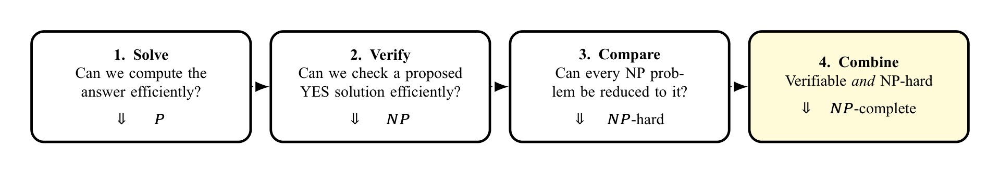{diagram="1" width="8.8in" height="1.45in"}

::: {.reveal from="2"}
**The central proof question**

How can we transfer the known hardness of one problem to a new problem?
:::

::: {.reveal from="3"}
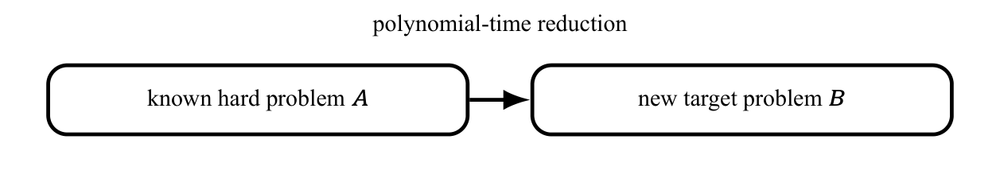{diagram="2" width="7.4in" height="1in"}

The dotted arrows show the learning sequence, not set containment.
:::

::: {.notes}
Frame 2/17. Distinguish solving, verifying and comparing. Preview the direction: a known hard problem reduces to the new target.
:::

## Start with P and NP {steps="3"}

:::: {.columns}
::: {.column width="48%"}
**P: solve efficiently**

Decision problems solvable by a deterministic algorithm in polynomial time.

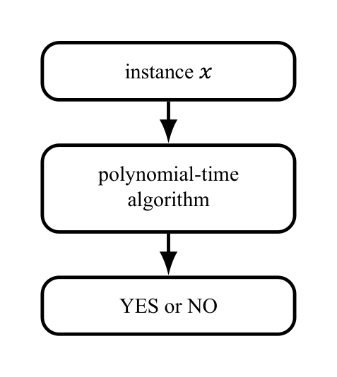{diagram="3" width="2.5in" height="1.5in"}

Example: reachability can be solved by BFS or DFS.

::: {.reveal from="3"}
$P\subseteq NP$: a polynomial-time solver can serve as a verifier and ignore the certificate.
:::
:::
::: {.column width="48%"}
::: {.reveal from="2"}
**NP: verify efficiently**

There are a polynomial-time verifier $V$ and polynomial $p$ such that

$$x\in L\iff\exists c:\quad\begin{array}{l}|c|\le p(|x|),\\V(x,c)=1.\end{array}$$

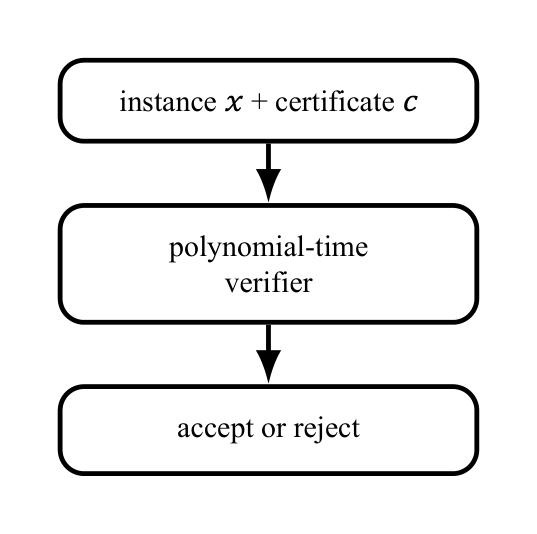{diagram="4" width="2.8in" height="1.5in"}

For 3-COLOR, $c$ assigns one of three colors to every vertex; check every edge.
:::
::: {.reveal from="3"}
NP means **nondeterministic polynomial time**, not “non-polynomial.” Whether $P=NP$ is open.
:::
:::
::::

::: {.notes}
Frame 3/17. Explain the formula verbally: a YES instance has a short accepting certificate, and a NO instance has none. A verifier checks the color domain as well as the edges. The solver can ignore a certificate, proving P is contained in NP.
:::

## From NP-Hard to NP-Complete {steps="2"}

:::: {.columns}
::: {.column width="48%"}
**NP-hard: hard for all of NP**

A problem $H$ is NP-hard if

$$\forall L\in NP,\qquad L\le_p H.$$

$L\le_p H$ means an efficient, answer-preserving translation from $L$ to $H$. An NP-hard problem need not itself belong to NP.

**NP-complete: both properties**

$$H\in NP\quad\text{and}\quad H\text{ is NP-hard}.$$

These are the hardest efficiently verifiable decision problems.
:::
::: {.column width="48%"}
::: {.reveal from="2"}
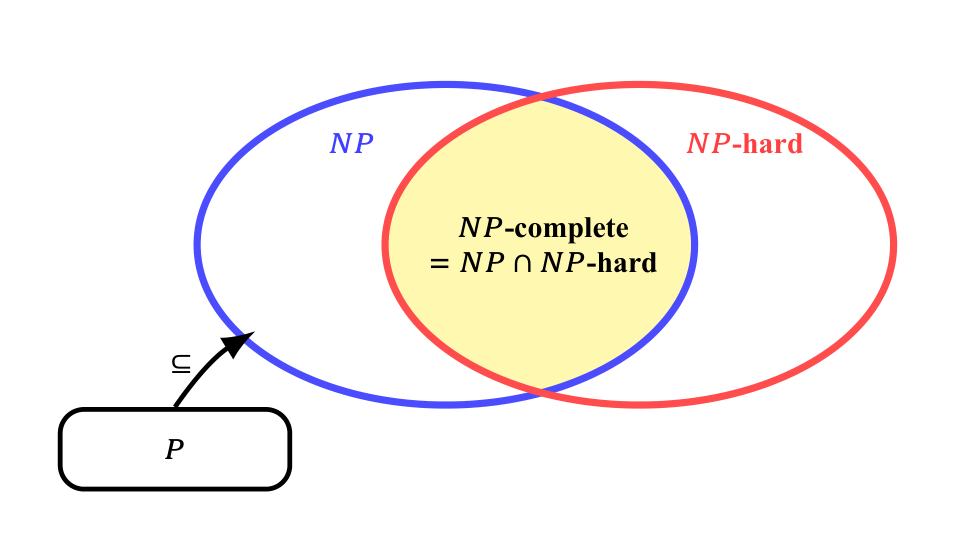{diagram="5" width="4.2in" height="2.8in"}

$P\subseteq NP$ is known. The exact boundary of $P$ is not drawn because whether $P=NP$ is open.

**If one NP-complete problem is in $P$, then $P=NP$.**
:::
:::
::::

::: {.notes}
Frame 4/17. Point at the intersection. NP-hardness does not imply membership in NP. NP-completeness does not prove that a polynomial algorithm is impossible; P versus NP remains open.
:::

## Polynomial-Time Reduction: an Answer-Preserving Translator {steps="3"}

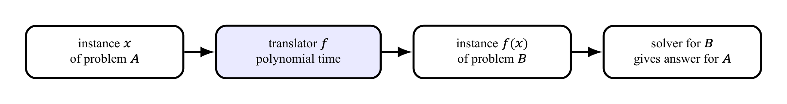{diagram="6" width="8.8in" height="0.8in"}

:::: {.columns}
::: {.column width="48%"}
::: {.reveal from="2"}
**Formal meaning**

$A\le_p B$: there exists a polynomial-time computable function $f$ such that

$$\forall x,\qquad x\in A\iff f(x)\in B.$$

A solver for $B$ would also solve $A$: $B$ is at least as hard as $A$.

**To prove $B$ hard:** known hard $A\longrightarrow$ target $B$.
:::
:::
::: {.column width="48%"}
::: {.reveal from="3"}
**Tiny example: EVEN reduces to MULTIPLE-OF-4**

Use $f(n)=2n$. Then

$$n\text{ is even}\iff 4\mid 2n.$$

| n | f(n) | Preserved? |
|:---|:---|:---|
| 6: YES | 12: YES | YES |
| 7: NO | 14: NO | YES |

This illustrates the mechanics; a hardness proof starts from a known hard problem.
:::
:::
::::

::: {.notes}
Frame 5/17. Demonstrate both a YES and a NO instance. Doubling a binary integer is linear in its bit length. The reduction transforms instances without solving the hard source instance.
:::

## Reusable Recipe: Proving a Problem NP-Complete {steps="3"}

:::: {.columns}
::: {.column width="48%"}
**1. Membership in NP**

- State a polynomial-size certificate.
- Give a polynomial-time verifier.

$$B\in NP.$$
:::
::: {.column width="48%"}
::: {.reveal from="2"}
**2. NP-hardness**

1. Choose a known NP-complete problem $A$.
2. Construct $f$ in polynomial time.
3. Prove $x\in A\iff f(x)\in B$.

If $A$ is NP-hard and $A\le_p B$, then $B$ is NP-hard.
:::
:::
::::

::: {.reveal from="3"}
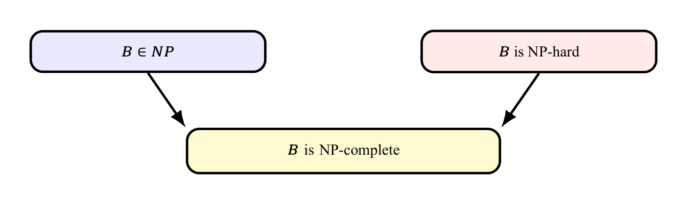{diagram="7" width="6.6in" height="1.55in"}

**Direction mnemonic:** the known hard problem goes *into* the target problem.
:::

::: {.notes}
Frame 6/17. Both obligations are necessary. Reducing an easy problem to B alone does not establish NP-hardness. The displayed implication requires A to be NP-hard.
:::

## Worked Reduction: 3-SAT reduces to 3-COLOR {steps="3"}

:::: {.columns}
::: {.column width="48%"}
**Source: 3-SAT**

A 3-CNF formula is an AND of clauses, each an OR of three literals:

$$\phi=C_1\land\cdots\land C_m.$$

Can a truth assignment satisfy every clause? A literal is a variable or its negation.
:::
::: {.column width="48%"}
**Target: 3-COLOR**

Can the graph’s vertices be colored with three colors so that adjacent vertices have different colors?
:::
::::

::: {.reveal from="2"}
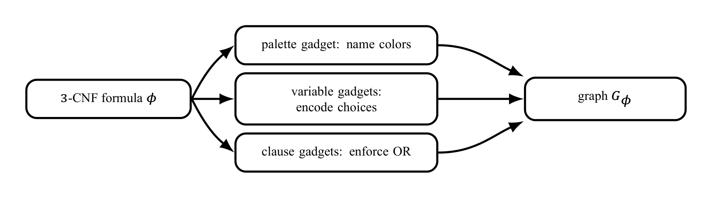{diagram="8" width="7.8in" height="1.55in"}
:::

::: {.reveal from="3"}
**Design invariant:** $\phi$ is satisfiable if and only if $G_\phi$ is 3-colorable.

This illustrates the general proof recipe; it is not the definition of reduction.
:::

::: {.notes}
Frame 7/17. State the two decision questions before showing the construction. The translator builds the graph without knowing a satisfying assignment.
:::

## Encoding Truth with Colors {steps="2"}

:::: {.columns}
::: {.column width="48%"}
**Palette gadget**

A triangle forces three distinct colors. Name them $T$, $F$ and $B$ (base/helper).

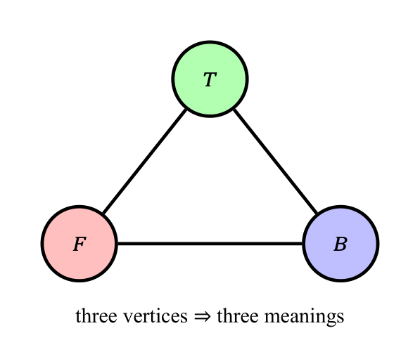{diagram="9" width="3.4in" height="2.7in"}
:::
::: {.column width="48%"}
::: {.reveal from="2"}
**Variable gadget**

Connect $x_i$ and $\neg x_i$ to each other and to $B$.

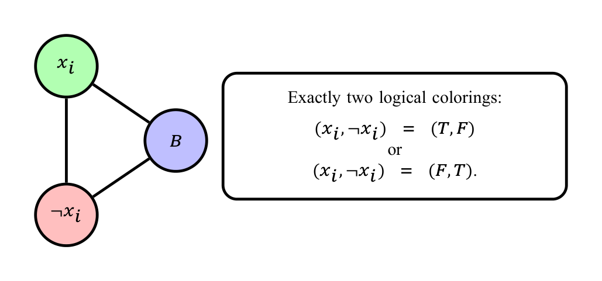{diagram="10" width="4.25in" height="2.1in"}

**Exactly one of $x_i$ and $\neg x_i$ receives color $T$.**
:::
:::
::::

::: {.notes}
Frame 8/17. Ask which color the negated variable must take once xi=T. The names T/F/B are relative to the palette; the physical paint colors can be permuted.
:::

## Constructing the Exact Clause Gadget {steps="4"}

:::: {.columns}
::: {.column width="48%"}
For $C=(\ell_1\vee\ell_2\vee\ell_3)$, add six fresh vertices $a_i,b_i$ and 13 edges:

$$\begin{aligned}
&(\ell_i,a_i),(a_i,b_i),(T,a_i)\\
&\qquad\text{for }i=1,2,3,\\
&(T,b_1),(b_1,b_2),\\
&(b_2,b_3),(b_3,F).
\end{aligned}$$

::: {.reveal from="4"}
**Result: can we complete the coloring?**

With inputs fixed in $\{T,F\}$, the internal coloring extends exactly when at least one input is $T$.

**There is no output vertex.**
:::
:::
::: {.column width="48%"}
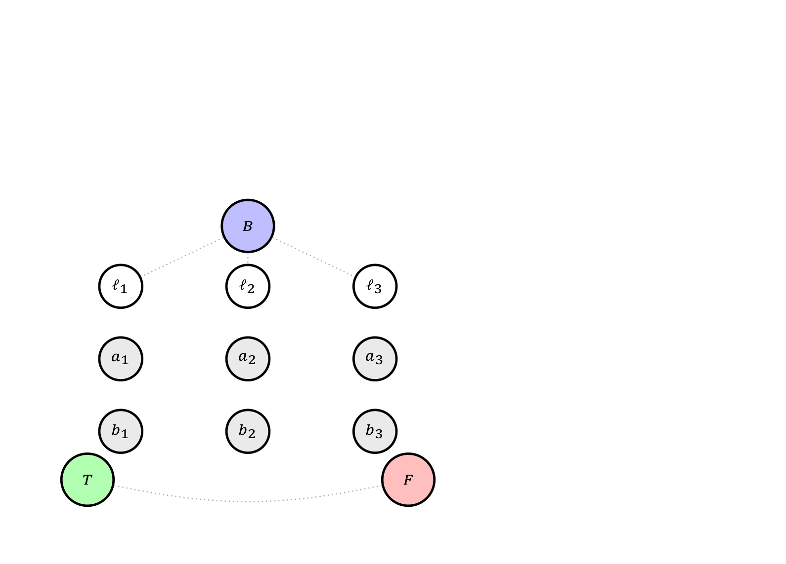{diagram="11" width="4.15in" height="3.5in"}

::: {.reveal from="4"}
Black: literal arms. Blue: $T$ links. Red: forcing path. Dotted gray: existing edges.

All lines are ordinary edges. White/gray vertices are unassigned, not extra colors.
:::
:::
::::

::: {.notes}
Frame 9/17. Show the vertices, literal arms, T links, and forcing path in order. Literal vertices already connect to B, so their fixed colors are T/F. Line crossings without a vertex circle are not junctions. The fixed palette edges still exist even when omitted here. The gadget's result is extendability, not an output vertex color.
:::

## Why the Clause Gadget Encodes OR: Impossible Case {steps="2"}

:::: {.columns}
::: {.column width="35%"}
**All inputs are $F$**

If every $\ell_i=F$, the edges $(\ell_i,a_i)$ and $(T,a_i)$ force every $a_i$ to color $B$.

::: {.reveal from="2"}
**Then the path breaks**

Each $b_i$ can use only $T$ or $F$. Along

$$T-b_1-b_2-b_3-F,$$

the colors must alternate $F,T,F$. The final edge joins two $F$ vertices. That is illegal.
:::
:::
::: {.column width="62%"}
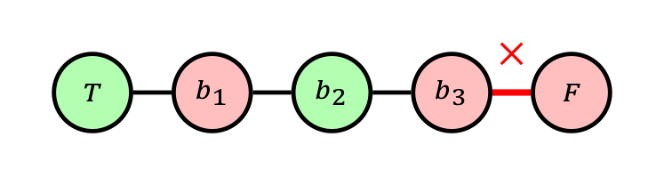{diagram="12"}

Full clause gadget plus palette.
:::
::::

::: {.notes}
Frame 10/17. The crossed white b3 means no legal color remains: its neighbors a3, b2, and F already use B, T, and F. White is unassigned, not a fourth color. Equivalently the forced path would demand b3=F and clash with the palette F. The drawing shows a failed partial coloring, not a valid coloring. Line crossings without vertex circles are not junctions.
:::

## Why the Clause Gadget Encodes OR: Possible Case {steps="2"}

:::: {.columns}
::: {.column width="35%"}
**At least one input is $T$**

Suppose $\ell_3=T$. Choose

$$a_3=F,\qquad b_3=B.$$

For the other two false inputs, keep $a_1=a_2=B$.

::: {.reveal from="2"}
**Legal completion exists**

$$b_1=F,\quad b_2=T,\quad b_3=B.$$

Every edge joins differently colored endpoints.
:::
:::
::: {.column width="62%"}
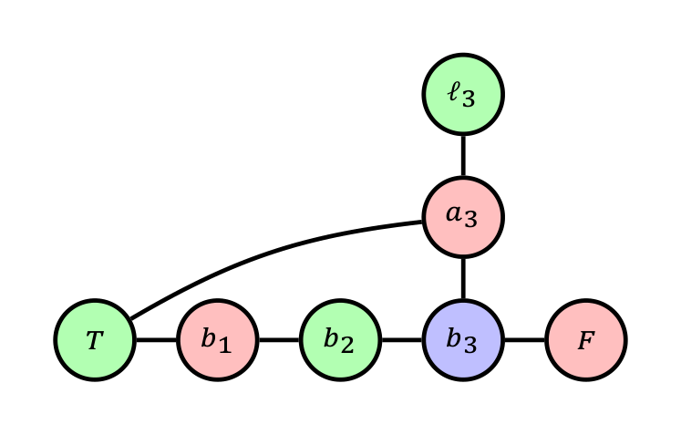{diagram="13"}

Full clause gadget plus palette.
:::
::::

::: {.reveal from="2"}
**$F,F,F$: no extension; any pattern with at least one $T$: some extension exists.**
:::

::: {.notes}
Frame 11/17. The picture is the FFT example. To justify all satisfying patterns, choose any true input i, set ai=F and bi=B, and every other aj=B (legal even when another literal is true). Complete (b1,b2,b3) as (B,F,T) for i=1, (F,B,T) for i=2, or (F,T,B) for i=3. Verify the literal arms, T-links and path edges. Thus the example supports a general construction, not merely an assertion based on one truth pattern.
:::

## Evaluating One Complete Formula {steps="2"}

$$\phi=(x_1\vee\neg x_2\vee x_3)\land(\neg x_1\vee x_2\vee\neg x_3).$$

:::: {.columns}
::: {.column width="45%"}
**Clause input ports**

$$C_1:(x_1,\neg x_2,x_3),$$
$$C_2:(\neg x_1,x_2,\neg x_3).$$

Each clause receives its own six fresh internal vertices.
:::
::: {.column width="50%"}
**One satisfying assignment**

$$x_1=T,\quad x_2=T,\quad x_3=F.$$

Thus

$$C_1=(T,F,F),\quad C_2=(F,T,T).$$

Both clause gadgets can be extended.

::: {.reveal from="2"}
**Why it works**

Each clause has at least one true input, so each clause gadget admits a legal 3-coloring extension.
:::
:::
::::

::: {.notes}
Frame 12/17. Evaluate both clauses under the displayed assignment. This assignment illustrates satisfiability after construction; the reduction need not discover it to build the graph.
:::

## Assembling the Formula Graph {steps="3"}

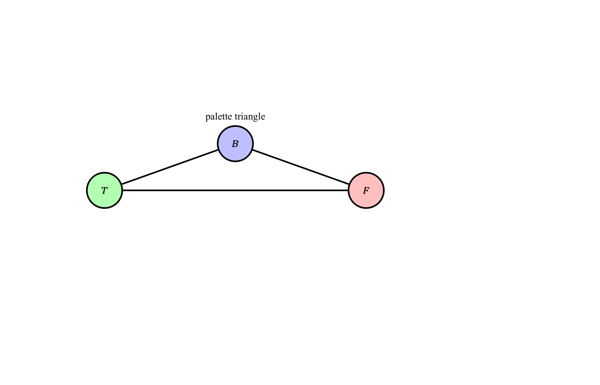{diagram="14" width="7.8in" height="4.9in"}

::: {.reveal from="3"}
The palette and literal vertices are shared; each clause has fresh internal vertices.
:::

::: {.notes}
Frame 13/17. This is an assembly schematic: the boxes represent copies of the exact gadget already proved. Shared literals enforce a consistent assignment across clauses. Each copy also uses palette T and F. No edges between distinct clauses' internal vertices are needed.
:::

## Full Construction for the Two Clauses {steps="1"}

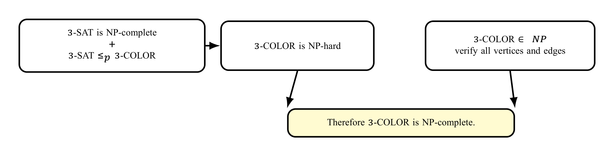{diagram="15"}

Existing literal vertices are reused directly. Only $a_i,b_i$ are new for each clause.

Blue edges are $T$-links; red edges are links to $F$.

::: {.notes}
Frame 14/17. Trace C1 ports x1, not-x2, x3 and C2 ports not-x1, x2, not-x3. Palette and variable vertices are shared, while each clause has six private internal vertices. There are 21 vertices and 38 edges for n=3,m=2. Crossings without circles are not vertices; repeated a/b labels are local to each dashed clause box. This full graph is uncolored at its variable/internal vertices, not a claim that gray is a fourth color.
:::

## Correctness and Complexity of the Reduction {steps="3"}

:::: {.columns}
::: {.column width="48%"}
**$\phi$ satisfiable $\Rightarrow G_\phi$ 3-colorable**

- Give each literal its truth color.
- Every clause has a true literal.
- Every clause gadget therefore extends to a legal coloring.
:::
::: {.column width="48%"}
::: {.reveal from="2"}
**$G_\phi$ 3-colorable $\Rightarrow\phi$ satisfiable**

- Read $x_i=true$ exactly when vertex $x_i$ has color $T$.
- Every colorable clause has a $T$ input.
- Every clause is therefore satisfied.
:::
:::
::::

::: {.reveal from="3"}
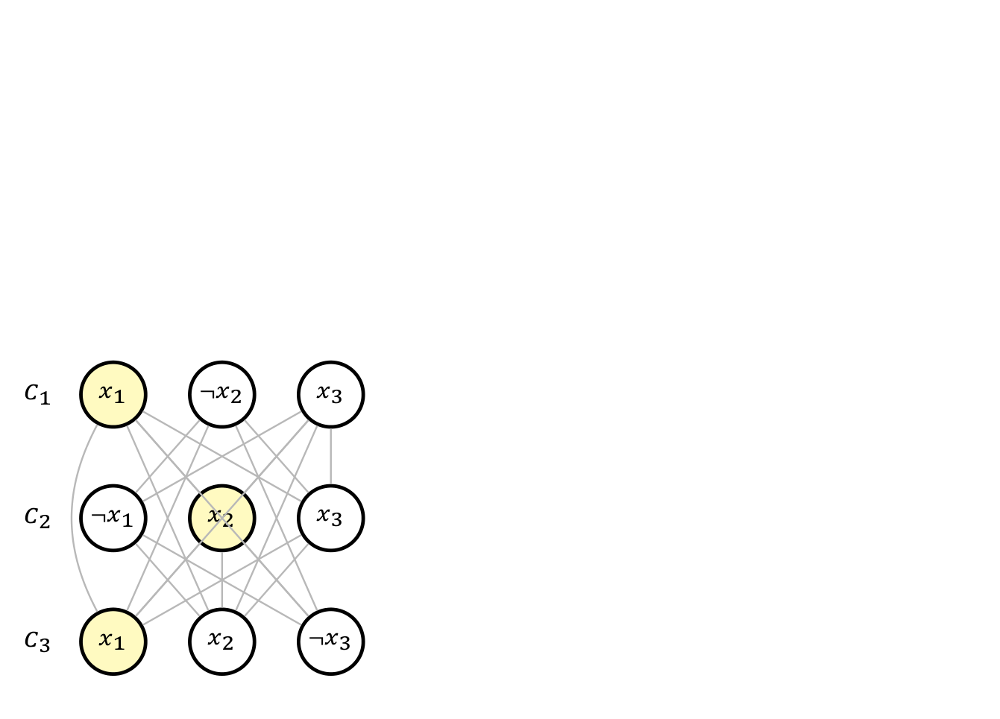{diagram="16" width="8.6in" height="1.7in"}

For $n$ variables and $m$ clauses:

$$|V|=3+2n+6m,\qquad |E|=3+3n+13m.$$

Enumerating the vertices and edges takes polynomial time.
:::

::: {.notes}
Frame 15/17. State both directions, then the counts. Palette: three vertices/edges. Each variable: two vertices and three edges. Each clause: six vertices and thirteen edges. Verification is O(V+E); with NP-hardness this proves 3-COLOR NP-complete. Linear many graph records can require logarithmic-size vertex indices in a bit encoding.
:::

## Takeaway {steps="4"}

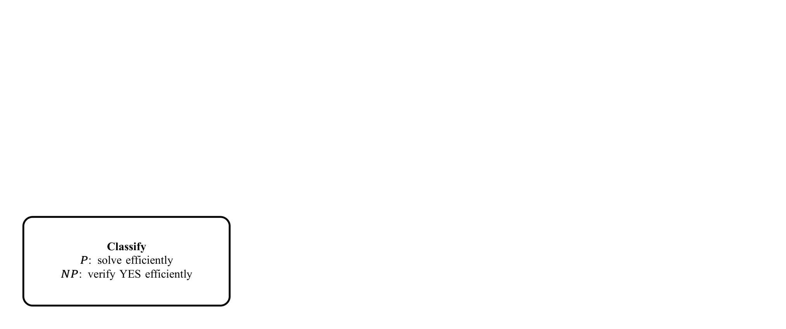{diagram="17" width="8.8in" height="1.5in"}

::: {.reveal from="4"}
**One reusable sentence**

To prove a target $B$ NP-complete, show $B\in NP$ and reduce a known NP-complete problem $A$ to $B$ in polynomial time while preserving YES/NO answers.

**Questions?**

Core references: Sipser; Cormen–Leiserson–Rivest–Stein; Princeton COS 423 reduction notes.
:::

::: {.notes}
Frame 16/17. End with the proof recipe. If time permits, ask students which reduction direction proves B hard: A to B or B to A? Answer: known-hard A to target B.
:::

## References {steps="1"}

**Primary references**

- Michael Sipser, *Introduction to the Theory of Computation*.
- Cormen, Leiserson, Rivest and Stein, *Introduction to Algorithms*.
- CMU 15-451/651 lecture notes on NP-completeness.
- Princeton COS 423 lecture notes, *Polynomial-Time Reductions*.

The exact six-vertex clause gadget and its 13-edge construction follow the [Princeton reduction notes](https://www.cs.princeton.edu/~wayne/cs423/lectures/reductions-poly-4up.pdf).

::: {.notes}
Frame 17/17. Acknowledge the sources; do not read the bibliography aloud. Timing is across all reveals within each frame and leaves no discussion time. Allow substantially longer for a full first lesson.
:::
